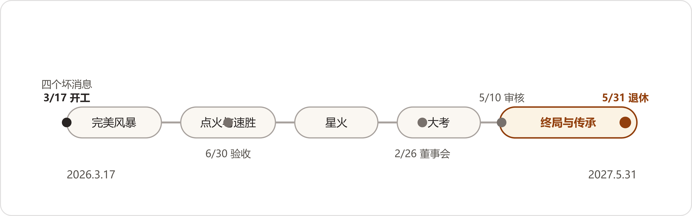

# 卷首 编者按
*Editor's Note*

这是一本用小说讲企业AI化落地的书，面向多个岗位——财务、销售、采购、售后、车间、IT、管理层。书里没有算法推导，也没有产品选型指南。它讲的是一家工厂怎么把 AI 一件一件用起来，用的时候卡在哪儿，卡住的地方是怎么过的。

故事是虚构的。华中一座三线城市，一家中型齿轮箱厂，叫青山传动，一千七百人，一年十二亿营收，客户是风电整机厂和矿山机械厂。厂名、人名都是编的。厂里发生的事——智能客服把作废文件发给客户、财务和销售对不上客户数、老师傅的手艺没人接得住——都有真实出处：全书二十四场战役的做法与量级，来自二十四个真实的行业案例；技术行为与效果口径，来自六份专题调研和一百多条检索信源，逐条对照表收在附录 C。书里守一条规矩：查得到出处的才写，查不到的不编；证明不了的效果，人物自己会说"证明不了"。

为什么用小说写？企业 AI 落地，难处其实不是技术，组织、流程、数据和人的习惯，这些才是AI化落地的真正阻力。这些要素单独讲会索然无味，老生常谈。所以，我们选择把这些真实的案例糅合起来，放一家虚构的企业，让这些问题和解决方案在具体场景中发生。你很有可能会在书里认出自己的公司，比如：数据都在系统里就是对不上，各部门各有一本账，老师傅快退了没人接班。

## 这本书怎么读

全书共计五幕二十二章，时间跨度从 2026 年 3 月 17 日到 2027 年 5 月末。第三幕中间另有两章间章：一章写八月省城的一场交流会，三家企业分享了自己企业的历程；一章写十月回访青山的一位顾问，讲了另外两家企业交过的学费。每章末尾附一页陈临的工作日志——主角自己的复盘，不是作者的总结；顺着日志读，一年下来正好攒一本"怎么干"的手记。
书末九个附录，分三截：A 到 D 是四件工具——一张图、一部辞典、一张对照表、一份书单；E、F、G 是三篇可以单独拿去读的长文；H、K 是两件查着用的家什——一套落地工作法、一个解决方案工具箱。各是什么、什么时候翻，"九个附录各是什么"一节单说。附录是给读完故事的人备的，不读故事直接翻附录也能看懂个大概，但先看人怎么干活、再看名词，顺序别倒。

另外，书里还有明暗两条线交织：明线是一场一场的 AI 战役，从文档治理、财务对账到供应商审核；暗线从第 3 章档案室的一套旧词卡起头，埋到第 17 章合拢。副标题里那两个词说的是什么，读到第 17 章就会明了。



## 二十二章各讲什么

### 第一幕·多事之春（第1—2章）

**1｜三月十七号，四个坏消息**——开篇日，四个坏消息一天进门：内蒙古矿场十一台减速机批量失效，AI客服把作废文件发给客户，财务和销售为"全公司到底多少家客户"吵了一下午，老唐递了退休申请。董事长给陈临的限期，到六月三十号。

**2｜试出来的难处**——限期头一个月，三条路各试了一遍：请厂商做试点，用老办法写SQL，自己搭一套检索增强的问答。每条路卡住的地方不一样——卡住的方式加在一起，就是这个厂的体检报告。

### 第二幕·点火与速胜（第3—7章）

**3｜档案馆里的老人**——陈临和郑敏下档案室，遇见退休的叶老。他能五分钟抽出别人找半天的存根，一句"你们的‘客户’到底指谁"问得人答不上来。叶老指方向、不给药方；他那套纸时代的本事救不了四个系统，但往后每一仗里，都有它的影子。

**4｜两万三千份文件**——第一场真仗，文档治理：清作废、标版本、建有效文件目录，两万三千份文件过一遍。小夏改良检索，立下"答案必须带出处"的规矩；第1章智能客服闯的那个祸，从这一章补起。

**5｜五百个节点的图**——赵峰用图数据库把十一台失效机器的档案串成一张图，SQL和图当场对决：同一个连环追问，一边一层层嵌套着查，一边一步走到。图搭起来了，隐忧也埋下了——五百个节点，是他一个一个手工喂进去的。

**6｜老唐的失眠夜**——九十年代一台进口减速机的齿轮参数成谜，原图纸遗失，外协两次打样失败。陈临把磨损的旧图喂给识图模型；老唐看完，那一夜没睡。

**7｜六月三十号**——限期到头，验收日：三场演示，问答、追溯、口径，一场一场当着董事长过。这一天把前七章的账一起算，也把后两幕的难处一起埋下。

### 第三幕·星火（第8—14章，中间有两章间章）

**8｜许曼的表**——财务对账。银行流水和应收账的差异掉在"容忍区间"里，多年没人管。许曼把这笔账搬进数字办：机器读单、规则匹配、差异留人——第一轮对下来，连她自己都吓了一跳。

**间一｜八月的会**——间章。八月，青山的人去省城参加机械行业协会的AI应用交流会，三位嘉宾各讲一个案例：物流的孟经理讲装车——老师傅装五个钟头，算法两个钟头，保本线之上每超一方多收一百美金；阮顾问讲一家基金公司怎么把个人提效变成组织能力；闻姐讲鞋服厂怎么把素材从员工手里收进公司库。台下听的人，各听出了各的心事。

**9｜段兴的背包**——售后。驻矿技术员段兴查一个故障，要翻手册、翻群聊、打电话问老师傅。他背着一只三十多斤的背包进了数字办；老唐脑子里那些没写下来的东西，从这一章开始学着变成字。

**10｜一张报价单**——非标报价。报价靠老师傅的经验规则把着关，人一忙单子就积压，客户等不起。第一版想做成端到端——图纸进去、报价直接出来；这版交没交学费、交了学费之后账怎么重算，是这一章的正题。

**间二｜来客**——间章。十月，阮顾问回访，讲两家交过的学费：一家消费品公司让机器人在业务群里潜伏三周，把真问题听出来；一家设计院的"一键成图"方案，技术上做成了，现场用死了。台下的人听着耳熟——报价单上交过的同款学费，别人也交过。

**11｜看不见的订单**——老板的看板。这一章换了问法：不问董事长想要什么功能，问他每天最担心什么。五千套常规件实到四千九百八十套——差的那二十套去哪了？数都在系统里躺着，老板为什么还是看不见？

**12｜数人头的**——人心的一章，没有新技术。十二月初，"AI要裁人"的话在厂里传开，越传越走样——传到夜班，已经长出了完整的模样。辟谣压不住的时候，还能靠什么？这一章的答案，和一场夜班有关。

**13｜墙**——数据的深水区。跨部门要数据，一句"这些网上都有，你们自己查"顶了回来；墙上撞出三道缝：接口、数据、人。墙后面还有墙——能跑起来的东西和能天天用的东西，中间隔着什么，这一章一层一层拆。

**14｜各自为战**——第三幕的收束。三个部门三套知识库、三套口径，重复建设的问题浮现；厂商回访推销"全场景中台"；同行搞知识图谱的项目做死了的消息传来。分散的账到了该合的时候——但怎么合，没人说得清。第四幕的火药，在这一章装满。

### 第四幕·大考（第15—17章）

**15｜审核通知**——整机厂的审核函到了：一级供应商准入，全链路追溯、知识体系化管理是硬指标，九十天准备期。全厂盘一遍家底——盘完，就知道这九十天有多难。

**16｜董事会的账**——年度董事会算总账。老蔡问"这三百四十万，买回什么了"；刘振邦摆出外采路线的账；陈临上桌汇报，能带上的还是那句老实话——能证明什么、还不能证明什么，分开讲。这一桌账怎么算平，这一章见。

**17｜叶老的图纸**——这是全书知识密度最高的一章，叶老摊开他的图纸讲往事，一个1998年的信封里夹着当年的英文讲义；他点破：过去一年打的每一仗，都是在给同一件事打地基。副标题里那两个词，谜底在这一章揭开。

### 第五幕·终局与传承（第18—22章）

**18｜开工**——委员会立章程，用"胜任问题"圈定范围，从质量域切小口；九人小组里各部门掰手腕，数据清理是苦役。一个词一个词地对——这一章磨的，就是这份笨功夫。

**19｜五个名字的供应商**——实体对齐总攻。同一家供应商，在公司几个系统里有五个名字——五个名字背后是几家？追下去的答案，比五个名字更麻烦。赵峰的图和郑敏的规则，在这一章同场使力。

**20｜灰区**——上线之后的治理：谁更新、怎么考核、词表怎么长，没有一题有现成答案。这一章里，一个新岗位立了起来，一个小工具自己冒了出来——它出自谁的手，留给读到的人。

**21｜审核日**——总集成的一战。审核员现场抽机器，抽哪台、抽几台，图谱得当场答出来；老唐也被问了——一问四十分钟。结论是什么，这一章的最后一页见。

**22｜老唐退休那天**——终章。故事从老唐递退休申请开始，在他退休这天收束，首尾相应。这一年攒下的东西，都带到这一天来。

## 九个附录各是什么

**附录A｜一张图看懂知识图谱与本体论**——全书的知识主线收拢成图的一节，四部分。第一部分讲主线：二十二章在知识上只走一条线，六个词一个长出一个——什么算数、口径、图思维、正本、总目（本体）、知识图谱，每个词配一句它在哪一幕落了地。第二部分讲概念：总目在上、卡点在中间、应用在下的三层总图，副标题里那两个词到底指什么，图上一眼。第三部分讲演进：第三幕结尾各部门撞车的那六本账，怎么一步一步变成第五幕的一张图。第四部分是小说叫法与学名的对照，书里人物嘴里的土话，对到书外的术语上。读完书想把这一年的知识线一次捋顺，翻它；第17章读完还觉得绕，也翻它。

**附录B｜本体论小辞典**——七十个词条的小辞典，按五幕的顺序排，正文读到哪一幕，辞典就翻到哪一段。每个词条给两样：一段人话，讲这个词在书里是怎么用的、哪一章哪个人提的——"容忍区间"是财务对账那章立的规矩，"隐性知识"说的是老唐脑子里那些没写下来的东西；一行教科书定义，读者出门撞见学界说法，对得上号。口径、主题词表、三元组、图数据库这些撑起全书的骨头词都在里面，RAG、GraphRAG、FDE这类书里点到名字的新词也收了。正文里撞见不认识的词，随手查它；读完想复盘知识线的，从头到尾翻一遍也行。

**附录C｜情节与真实案例对照表**——这本书"查得到出处的才写"的规矩，账就记在这儿，分三部分。第一部分按章对照：每章主要情节出自哪个真实案例、哪份调研——开篇智能客服把作废文件发给客户、财务和销售对不上客户数，原型各是哪个行业的案子，一行一行对着。第二部分是二十四案的去向：案例集里二十四个项目，各自进了哪一章；有五案没走正文，是两章间章里的厂外来客讲进书的，也标得清清楚楚，一案不落。第三部分是补强信源：成稿之后对着斯坦福大学一份五十一案手册核过的几条——最难的挑战七成七在人不在技术，做成的项目六成一之前失败过——书里第13章、第2章演的就是这两条。读到哪段觉得"编得不像真的"，翻这张表；想拿书里的做法回自家厂里试的，也先翻它，看看原案是什么行业、什么量级。

**附录D｜延伸阅读**——往外走的路标，四个书架。第一个书架是书。第二个是论文与标准，里面有讲"化"字要等多久的那篇经济史名文：电站建成之后约四十年，制造业的生产率才起来——附录B"通用目的技术"词条的出处就在这儿。第三个是开源与开放资源，比如微软2024年开源的GraphRAG，把语料先抽成图再做检索。第四个书架不放书，放一份说明：这本书的调研信源、虚构的边界画在哪儿，白纸黑字写着。想接着深挖知识图谱、本体论、企业AI落地的读者，从这一页起步。

**附录E｜把AI用起来——写给企业里的人**——三篇长文的第一篇，写给企业里想动手的人。材料是七十五个真实案例：二十四案的访谈集，加上斯坦福大学五十一案的手册。打法按企业做这件事的顺序写成八段路——从最疼的问题入手，现状梳理先行，盘点家底，机器与人的界线，落地的开始，最大的坎在人与组织，模型与安全的次序，最后是诚实记账、等待回报。每一段都有案例撑着，多数段里能认出书里的某一章。篇末附两样东西：一张对照表，八段里的每一条做法对应书里哪一章演过，读过的读者可以按图回翻；一个补记，收了一位一线实践者对这八段的回应，原句照录。读完故事想直接拿方法用的，翻它；不读故事、只想要一份带着真实案例的打法手册的，单独读它也行。

**附录F｜AI用起来之后——一个实践者的方法论笔记**——三篇长文的第二篇，讲用起来之后的事。材料换成一个人：一位做企业AI落地咨询的实践者，2026年5月到9月写的十四篇公开文章——书里小夏追着看的那位号主，写的就是他。文章拆出来，按方便使用的顺序重排成七节：四层结构与体系地图，流程是根，人机的分界，知识关，组织与评价权，做事的人（FDE），诚实的账。取材的规矩是原话照录、只删不增：他说过的话都在，删减和排序是我们做的，没有一个字是替他说的；他的文章亲历与转述混杂，这个边界篇末也照实说了。附录E讲做这件事的顺序，这一篇讲用起来之后的病理和家什，两篇对着读，路和坎就都在了。

**附录G｜二十四家，六个问题——一本案例集的横读**——三篇长文的第三篇，也是最厚的。材料是一本访谈集：二十四家企业AI落地的真实项目，每个项目回答同样的六个问题——场景、旧法、方案、效果、坎、经验。这一篇把集子横过来读：每一问把二十四家的答卷连着读一遍，读完写一篇，六篇的骨架各不相同，由各问的材料自己定——场景一篇写客户的第一句话怎么翻译成真问题，旧解法一篇写成替过去说话的辩护词，方案一篇抽出二十四家共用的六步骨架，效果一篇解剖价值的一层一层，坎一篇按人、组织、数据、技术的难度序排成倒金字塔，经验一篇收拢成一套检查清单。哪些做法二十四家走到了一处、哪家有独门，每篇收尾各有判断题和一张图，全篇配图二十四张，篇末附二十四案的标题目录，案号随时可对。想知道"别的厂在这件事上是怎么干的"，翻它；六篇里的每一篇都可以单独读。

**附录H｜AI应用落地工作法——二十四家案例的方法论提炼**——二十四家案例的第二种读法：把散在各案的做法提炼成一套能照着走的工作法。骨架是总分总：总起讲门怎么开；正文十一节分三篇——未动先谋四节（瞄准痛点、深入场景、试点先行、明确分工），谋而后动三节（嵌入流程、持续迭代、能力沉淀），贯穿全程四节（凝聚人心、夯实基础、守住底线、步步为营），每节配变招和自查；后面接一册变招手册，收二十四家的独有招法；再一篇FDE的账，算这门生意的另一面；总收给入口和用法。中间一张总图把十一个词连成口诀。读完故事想知道这一整套事该怎么排着做的，翻它；带团队做AI落地、要一套工作法的，直接用它。

**附录K｜解决方案工具箱——三十五个案例的解法速查**——九个附录里唯一按"查"设计的一件。材料还是案例：二十四案，加斯坦福手册里成篇写透的十一案，共三十五个，这次按"人家是怎么解决的"归成九类——把散的经验和资料变成可查的库；机器做第一遍的单据核对与条目分拣；AI起草、人工定案；系统串联，人不再当搬运工；从看不见到看得见；AI调度、工具算数；整段职能交给AI自主跑；合规上云与模型架构；组织与人的解法。开头一张速查表，拿自己的问题对号入座；每条写五样——背景、痛点（旧办法为何撑不住也写）、解法（思路、前置、链路、机制、落地）、效果、教训与边界，弯路照录，一案多招的在各招所属的类里分别落位。手上遇到具体问题不知道怎么下手时，先翻它，看同行那一仗是怎么打的。

## 主要人物

**陈临**，三十八岁，数字化转型办公室主任。设备工程师出身，在装配车间实习过一年，带他的师傅就是老唐，后来管了十来年信息化。厂里的旧系统他门儿清；AI 是个啥，三月十七号之前他也不知道——读者懂的，多半就是他懂的。这人接了活睡不踏实，汇报的时候有一说一。

**夏雨桐（小夏）**，二十四岁，算法工程师，NLP 硕士，入职半年。厂里那个智能问答系统就是她搭的，先出事的也是它。头一回挨批，她手指头绞着工牌绳站在那儿；后来下车间跟岗、跟人一场一场对词的，也是她。术语多，但会自己先笑。

**赵峰**，四十一岁，IT 架构师。一开始看不上这些新玩意儿，原话是"加两张表写好 SQL 就行了"。后来图数据库是他装的，五百多个节点，是他一个一个手工喂进去的。嘴上不服软，接活倒不含糊。

**唐守拙（老唐）**，五十八岁，装配车间首席技师，在这个厂干了三十八年。减速机空载一转，他能听出毛病在哪一级，年轻人背地里叫他"唐耳朵"。话少。要退了。他说过一句"图纸上没有"——什么意思，读到就知道了。

**叶栖梧（叶老）**，六十五岁，退休的机械设计院情报所所长。八十年代管过主题词表，搞过科技情报检索，专家系统的年代他是过来人。这老头有个毛病：只提问，不给答案，问得人半夜睡不着。平日就待在厂里负一层的档案室，修旧图纸。

**郑敏**，质量部部长，跟陈临搭档九年。平时说话像连珠炮，事情越大，说话越慢——记住这个，认人有用。开篇那十一台坏机器的档案，是她一个系统一个系统翻出来，一笔一笔抄在本子上对出来的。

**董鸿章**，五十五岁，董事长，"数字化战略"是他发起的。开会话不多，爱问，问了不自己答——"青山传动，到底有多少客户？"就是他问的。期限是他定的，钱也是他去董事会争的。

**刘振邦**，四十七岁，营销副总。厂里出事，他是最先上楼拍桌子的人，主张干脆外采大厂的平台。别把他当坏人——他自己说过，庙是董事会要拆的，不是他要拆，他总得给自己找个下台阶的辙。

**老蔡**，副董事长，分管审计。本子不离手，上面记着一串数，年底一笔一笔都要对。今年三月的那次董事会上，他问过一句话："这三百四十万，买回来什么了？"

**许曼**，财务总监，戴眼镜。开篇跟销售总监吵了一下午的就是她："我三百八十七家，每一家我都能给你一个税号。"

书是照着"查得到出处的才写"这条规矩做的，错处仍然难免。发现错处的读者，欢迎指出来，下一版改。

```html
<p style="text-align: right;">二〇二七年六月</p>
```

## 人物速查

以下人物表，读故事的时候随查即可，不必先读。

**领导与董事会**

<!--表宽:18%,--->
| 姓名 | 是谁 |
| --- | --- |
| 贺延龄 | 总经理办公室主任，五十八岁，车队、食堂、档案、接待都管过；"你去找谁，没用。你得让谁去找" |
| 徐伯勋 | 董事，二股东省机电控股委派；早年在江平矿机厂当过总工，厂里的老话他听得懂 |
| 罗雁 | 独立董事，会计师事务所合伙人；说话快，问账问得细 |
| 阎经理 | 人事经理，退休的手续从她手里过 |

**各部门**

<!--表宽:18%,--->
| 姓名 | 是谁 |
| --- | --- |
| 周建海 | 销售总监，嗓门大，小本子不离手；"四百六十二"是他说出去的数 |
| 潘永年 | 采购部部长，手机常往桌上一扣；供应商的旧账在他兜里 |
| 方致远 | 技术部部长，说话慢，一沓图纸码齐了才开口 |
| 齐连升 | 生产部部长，五十六岁，说话不紧不慢；他眼里看得见的是工单 |
| 段兴 | 售后服务站技术员，常驻内蒙古宏峰矿业；矿上半夜的电话是他打的 |
| 邵卫东 | 销售，跑线六七年；国庆值班接下那张询价单的，是他 |
| 贺春玲 | 销售内勤，台账在她手里 |

**车间与老师傅**

<!--表宽:18%,--->
| 姓名 | 是谁 |
| --- | --- |
| 纪长顺 | 装配老班长，明年退；系统里缺的那两行字，他脑子里记着 |
| 秦克俭（老秦） | 非标报价的老师傅，帆布包里两个活页本，六十七条经验规则 |
| 鲁向东 | 采购部老经办，五十三岁；那本缠着胶带的供应商册子，是他的 |
| 老祝（祝建平） | 发运科科长，五十三岁；发运台账二十七年，半截铅笔削得很短，一直攥在手里 |
| 冯广顺 | 仓储部主任，五十五岁；三十一本到货登记簿，全厂最准的一本实物账 |
| 老万 | 夜班师傅，给老唐倒过两缸子茶 |
| 魏来（小魏） | 老唐带出来的徒弟 |
| 小吕 | 段兴在矿上带的新人 |
| 高杏 | 行政科，二十七八；"每周一早上一条"的头一个用户 |

**厂外**

<!--表宽:18%,--->
| 姓名 | 是谁 |
| --- | --- |
| 佟总监 | 智知云（AI 厂商）的销售总监，"全场景知识中台"的推销人 |
| 翟工 | 瀚风整机厂的老熟人，评审细则他那边定的；"手别松"是他留的 |
| 岳工 | 审核组的组长，翻台账点号的那一位 |
| 老葛（葛有全） | 门房的师傅，登记簿在他窗口里头 |
