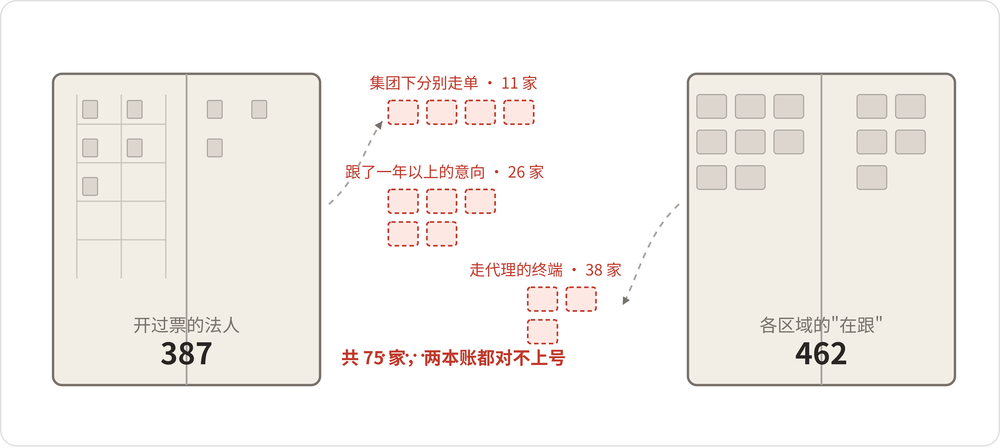
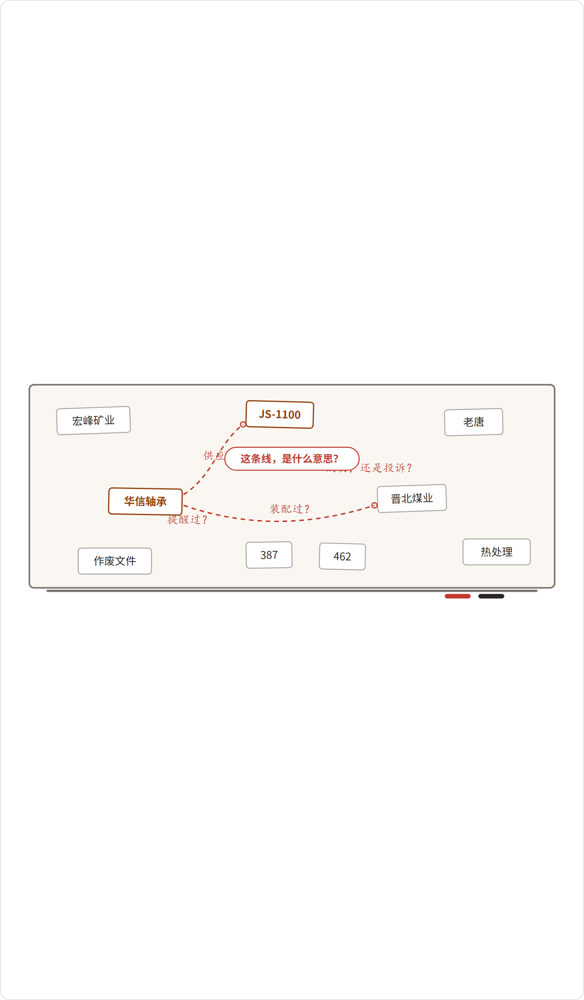
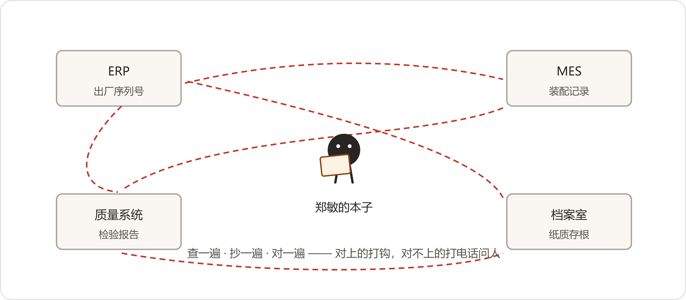

# 01 三月十七号，四个坏消息
*Four Pieces of Bad News*

:::题记
"矿上让明天给说法。"
——段兴，3月16日23:47，售后服务群
:::

青山传动的这一年，是从一个早上开始的。

2026年3月17日，星期二。

早上七点四十，陈临把车停进厂区第二排车位。装配车间的天车正吊着半台减速机往三号工位走，钢缆绷得笔直。他在车边站了一会儿，心想这个月的排产总算顺了。

八点十二分，手机响了，是质量部部长郑敏。

"陈主任，出事了。"她平时说话快，连珠炮似的，这回每个字都放得很慢，"宏峰矿业的十一台JS-1100，批量点蚀，客户全线停了。"

* * *

事情前一天夜里就有苗头。售后服务站的技术员段兴，常驻内蒙古，晚上十一点在售后群里发了三张照片，配了一句"矿上让明天给说法"。照片是手机拍的，光线差：拆开的输出轴轴承，滚道上一片麻点，剥落的金属屑粘在发黑的润滑脂里，像撒了一把细沙。

当时没人回复。群是售后群，人都是各守一个矿的，这事没出在大家各自守的矿上，没人接这个茬。

早上七点，段兴的电话直接打到了郑敏手机上。矿上态度很硬：十一条皮带线，去年才陆陆续续装上的JS-1100——这批货出厂后在矿上库房躺了一年多——四个月里坏了七台，还有两台异响越来越厉害。矿方设备科把账算了算——运行小时数全在四千小时上下，出问题的位置全在输出轴轴承位。设备科长在电话里说得很直接：一台带一条线，停一条线一天损失二十几万，十一台机器我们不敢再开了。你们青山的人今天必须到，给我们一个说法。

九点半，紧急质量分析会在三楼小会议室开了起来。到会的有质量部、技术部、采购部，陈临被叫去的原因是"数字办管系统，查数据要用你们"。他在门边找了个空位子坐下，本子翻开，笔帽拔了。这一早上，他还没在自己工位上坐热。

会开了不到十分钟，就吵起来了。

技术部先表态。部长方致远四十七八岁，说话慢，进门先把一沓图纸在桌上摊开，一张一张码齐了，才开口："JS-1100的输出轴轴承选型，2019年定型的，额定寿命按两万小时算。这个机型前后出厂三千四百多台，投产六年，从没有批量点蚀的记录。设计这块，我认为可以排除。"

"排除太早了吧。"郑敏把手里的会议记录本合上，"方部长，七台同时坏，同样的位置，同样的小时数。你设计没问题，那就是件的问题、工艺的问题，总得占一样。"

"所以我才要查来料和装配记录。"方致远不接她的话头，手指点着码好的图纸，"我坐这儿来，就是要把责任范围先划清楚。"

采购部部长潘永年把手机往桌上一扣："来料检验是你们质量部做的。七批轴承，七张检验报告，全写着合格。检验合格的东西装上去坏了，现在来问采购？"

"检验合格不代表东西没问题。"郑敏的声音一下起来了。她从文件夹里抽出七张检验报告，在桌上摊开，一张压着一张，"轴承的疲劳寿命，热处理工艺占大头。检验那几个项目——尺寸、游隙、外观、硬度抽检——哪一项能看出热处理的深层问题？要看工艺，得看供应商当时的工艺记录！"

"那你去要啊。"

"我要了。"郑敏从牙缝里挤出这三个字，缓了半拍才继续，"华信轴承二三年初换过热处理工艺线，这事采购这边收到过变更通知没有？变更确认走完流程没有？我调供应商档案，档案里那份《工艺更改通知单》是扫描件，看不出确认意见。采购经办人是谁，让他来解释。"

潘永年拿起手机翻了翻，眼睛没离开屏幕："经办人调去分厂了。这事，我回头问。"

这个会开到十一点，结论只有一条：根因方向定不下来，得先把这批机器的完整档案拼出来——哪台机器、哪个批次、哪家供应商、什么工艺、谁检的、怎么装的。而这个"拼档案"的活，落在了郑敏头上，因为四个系统都在她那边查得着。散会时她跟陈临走在最后，低声说了句："给我配个人都行。我要能在系统里把这些串起来，不用再一个本子一个本子地抄。"

中午十二点，宏峰矿业的正式函件到了——扫描件，盖着红章。

:::文书 宏峰矿业设备部函 · 2026年3月17日
我矿在用青山传动JS-1100减速机共11台（2023年3月至6月出厂），累计运行3800—4200小时，其中7台出现输出轴轴承位点蚀，2台异响加剧，已全部停机。因故障呈批量性、同期性，我矿对整机质量提出质疑。请贵司于72小时内提交初步原因分析及处理方案。在此之前，我矿保留索赔、退货及暂停后续订单的权利。
:::

72小时，从函件落款时间算。傍晚五点，郑敏把函打印出来，走到数字办，把纸放在陈临桌上，拉了把椅子坐下。

陈临跟郑敏搭档九年，摸出她一条规律：事情越大，她说话越慢。有一年一批出口件海运转陆运，单据错了，她在电话里一字一顿地交代，事后才说，那天她是守在质检台边上打的电话，手一直是抖的。今天早上那通电话，是她这几年说得最慢的一通。

"我不是来送材料的。"她说，"下午我照老法子干了一轮，先跟你交个底。你帮我听听，还有没有更好的路子。"

她的办法就是笨办法，一样一样翻。ERP里查这十一台机器的出厂序列号，对上装配批次；MES里用装配批次调出装配记录和试车数据，对上轴承批次；轴承批次回到ERP对采购订单，看供应商；然后去质量系统调这七批轴承的进厂检验报告。还剩最后一件事，华信热处理工艺变更，得去翻2022年底到2023年初采购员的往来邮件，还有档案室的纸质存根——这两样，她打算明天再啃。

"一下午，我就干了前头这些。"她说。说到这儿她停了一下，抬手揉了揉眼睛，"不瞒你说，我这活是怎么干的——ERP查一遍，抄在本子上；MES再查一遍，跟本子对；质量系统再查一遍，再对。对不上的，打电话问人。问班组长，问老师傅。光是对上'哪台机器用了哪个批次的轴承'，我翻了一个半小时，对上了四台。"

"剩下七台呢？"

"剩下七台里有两台，MES的工单里轴承批次那一栏是空的。装配那天的记录没填全。"郑敏说，"你猜我怎么知道的？我打电话问了装配线的班组长。老班长说他记着呢，可他明年也退。"

她看着陈临，声音低了下去："陈主任，全厂能把这些数对起来的，就这么一个本子，这个本子长在我脑子里。72小时，我拼得完这十一台。拼完这一回，下一回呢？等我退休了呢？"

陈临没接上话。他能说什么呢——数字办管着这四个系统里的三个，系统集成项目前年做过一期，打通了单据流转，没打通数据。

* * *

第二个坏消息是上午十一点二十分到的。准确地说，是发酵了一夜之后，找上门来的。陈临刚从质量会上下来，水还没接上。

营销副总刘振邦进数字办的门从来不敲。这天他推门进来，走到陈临桌前，手机横着举到陈临面前，屏幕上是一封客户邮件，收件人抄了一大串。

"你们那个机器人，出名了。"

鸡西的老客户，一家矿务局下属的机修厂，技术员吴师傅，昨晚九点多在青山传动上线的智能问答系统上提了个问题：JS-1100在冬季低温工况下，推荐用什么牌号的润滑脂？

系统两秒钟就答了。态度端正，条理清楚，分低温工况、常温工况、重载工况列了三档，末尾还附了文件出处——《润滑管理规范》，落款2019版。

现行版本是2024年发的。2019版作废两年了，低温那一档，两版差了两级牌号。按旧版选脂，在鸡西冬天的室外工况，脂会偏稠，供脂不畅，极端情况能导致润滑不良。

吴师傅干了三十年设备，一眼看出来了。他没按错的做——他要真按错的做了，今天就不是客诉，是事故。他的原话贴在邮件里：

:::文书
"贵司十年前的东西糊弄过我们一回，现在训练了个机器人，接着糊弄？这回它答得比你们客服还流畅，可惜是错的。请贵司自查：还有多少作废文件挂在这个系统里？"
:::

这封邮件抄送了对方的采购总监，转发给了刘振邦，然后，今天早上，出现在董事长董鸿章的邮箱里。

"上个月验收的时候不是挺好？"刘振邦环视数字办，一句是一句，"我陪你们站台的。发布会我讲的词，剪彩我剪的，客户那头我是怎么说的——青山有自己的AI了。现在人家问我：还有多少作废文件挂在里面。我怎么回？"

角落里，夏雨桐站了起来。大家叫她小夏，入职半年，算法工程师，硕士毕业，智能问答系统就是她搭的。

"刘总，验收的时候，测的是标准问题清单上的题……"她的脸涨红了，"文档库里有新旧两版规范，系统没做版本标记。客户问低温牌号，两版都被检索出来了，旧版写得细、条目多，跟问题的匹配度反而高，就排在前面被引用了。我可以回去查日志给您——"

"我不要听机理。"刘振邦抬手往下压了一下，像挡什么东西，"我就问一句：现在，立刻，能不能保证它不再发错文件？"

小夏张了张嘴。要说保证，她给不出来——文档库里两万三千份文件，作废的、旧版的、重复的，有多少，没人统计过。她低下头，手指绞着工牌的挂绳："我今晚先把2019版从库里下掉。其他的，我需要时间排查。"

"下掉一份，还有两万份呢？"刘振邦的手指在桌沿上点了两下，转头看陈临，"陈主任，这个系统上线到现在，后台多少条问答，你知道吗？六百多条。谁能告诉我，这里头有多少条，是把错的当对的发出去的？"

数字办四个人，此刻没一个人出声。

刘振邦等了几秒，没人接话。他把手机揣回兜里，从每个工位前走过去，走到门口，站住，没回头："我把话放这。这个系统，今天下线。什么时候能保证不再胡说，什么时候再上。下一封邮件要再发到董事长那去，你们自己看着办。"

他拉开门出去。门砰一声撞上门框，弹了一下，又合上。门上贴的值日表抖了两抖。办公室里没人说话，隔壁工位的两个开发同时抬起头，又同时低下去。

小夏在原地站了半分钟。然后她坐下，打开后台，手在键盘上敲，越敲越慢，最后停住。陈临走过去，看见她的屏幕上是那六百多条问答记录的列表，光标停在检索框里，没动。

"一条一条看吧。"陈临说，"你按你的顺序来，我跟你一起看。今天下线之前，先看前一百条，心里有个数。"

那天下午起，数字办的两个人断断续续看了三个小时问答记录。看到第四十七条的时候，小夏的手停在鼠标上，过了几秒才说话："陈主任，这条也是。2022年作废的《试车规程》，发给江西了。"她把那条记下来，写字的手有点抖。

* * *

下午两点，月度经营分析会在六楼大会议室开了起来。这个会每月一次，各系统负责人都到，董事长董鸿章主持。

前一个小时，会开得挺顺。翻到第四页的时候，出事了。

财务总监许曼念报告："截至二月末，客户数387家。"

销售总监周建海在底下翻自己的本子，翻到一页，抬头："不对。我们这边报的数是462。"

差了75家。

会议室安静了两秒。董鸿章抬了抬手："对一对。"

没想到，这一对竟然用了半个下午。财务的口径是开过票的法人主体：签合同、开发票、有回款记录的，387家。销售的口径是"在跟客户"：除了这387家，还有集团客户下面分别签约的子公司——比如晋北煤业集团，母公司签了框架，下面四个矿各自走单，财务按一个法人合并了，销售按五家算；还有周建海团队跟了一年以上的意向客户二十几家；走代理的终端厂，货是代理买的，用是终端用的，销售把这些终端算作"实际客户"，财务只认代理那一家。

"晋北那四个矿，我的人跑了两年，每个月都在矿上。"周建海把笔往本子上一拍，嗓门彻底起来了，"设备是青山的，服务是我们做的，到你账上成了一家。年底算客户增长率，我们部门年年垫底，凭什么？"

"周总，财务有财务的规矩。"许曼扶了扶眼镜，声音没跟着起来，"法人主体对法人主体，税务、审计、银行授信，全认这个。你要按'实际使用'算，租赁公司的设备也算你客户？二手转卖的呢？我387家，每一家我都能给你一个税号。你那462家，你给我指——多出来的75家，各是什么名目？"

周建海指不出来。他的462是各区域经理报上来的汇总，每个区域有自己的"在跟"标准。真要一家一家过，他自己也说不清边界在哪。

他梗着脖子，把本子往前一推："反正多的75家里头要是有一家是虚的，我把头摘下来。"

董鸿章一直没说话。这会儿他把笔帽拧上，咔的一声。会议室一下静了。

"我对数没兴趣。"他说，"387也好，462也好，我问一个事：青山传动，到底有多少客户。谁能现在回答我？"

许曼低头翻她的报告，翻了两页，又合上了。周建海盯着自己那个本子，喉咙动了动，没出声。又过了十几秒，董鸿章的目光转了一圈，落到坐在角落的陈临身上。

"数字办的人也在。"他说，"你们做了两年数字化。这个问题，你们回去也想想。"

话音刚落，刘振邦把身子往椅背上一靠，笑着接了一句，音量刚好全场都听得见："陈主任他们那个智能问答，昨天刚给客户发了个作废了两年的文件。我看数字化的当务之急，不是数客户，是先别再坑客户。"

有人低声笑了。陈临的脸上烧起来。他知道昨天的事全公司都要知道，但没想到会在这个场合、被这样一句话摆到桌面上。他想解释一句"系统今天已经下线排查了"，话到嘴边，发现解释只会更难看，就咽回去了。

散会的时候，人事老总在走廊里拍了拍陈临的肩膀，什么也没说，走了。

* * *

第四个坏消息，是快下班的时候来的。这回没有电话，也没有邮件。

五点半，陈临去装配车间。一是躲一躲楼上的空气，二是他想找找23年那批JS-1100的装配手签记录——MES里那两台轴承批次空缺的机器，纸质的记录也许能补上。

装配车间的档案柜在钳工区尽头，铁皮的，四组。陈临正翻着，背后有人说话："找哪年的？"

唐守拙。老唐五十八岁，装配车间首席技师，在这栋厂房里干了三十八年。陈临十四年前大学毕业进厂，第一年在装配车间实习，带他的就是老唐，三个月，打下手，认零件，学看图纸。全公司只有老唐能靠听减速机空载运转的声音，判断问题出在哪一级齿轮、大概哪个件上。

年轻工程师背地里叫他"唐耳朵"。机器过一遍老唐的耳朵，跟照了一回片子一样，病灶在哪儿，片子上写着。

"23年春天的JS-1100。"陈临说，"唐工，那批机器，您还有印象吗？"

老唐擦着锉刀的手停了停。他把锉刀放进抽屉，关好，才开口："华信的轴承，那批到货的时候，手感不对。"

"手感不对？怎么个不对法？"

"装进去，盘车，那个劲跟往常不一样。说不上来。就是不对。"老唐走到档案柜前，从柜子里抽出一本记录簿，吹了吹灰，"我让班组多测了两遍游隙，都在图样范围里，就放行了。跟当班的质检员口头说过一嘴，没落单子。"

"这事有记录吗？任何记录。"

"没有。"老唐摇头，"数没超标，落什么单子。落了单子，质检要开评审，采购要找供应商，人家大老远来对质，一查，数是合格的——最后落个没事找事。这种事，干了这么多年，谁没几回。"

陈临站在柜子边上，半天没说话。如果老唐当年那句"手感不对"跟今天的批量点蚀真有牵连，那这条线索存在过——在他手上，在那句口头的话里，然后没有了。系统里查不到，图纸里没有，连老唐自己，要不是今天被问起，也想不起来。

"要是我那时候多句嘴，写个单子……"老唐叹了口气，把记录簿递给陈临，"23年的在这几本里，你自己翻。"

23年的手签记录翻到了，两台批次空栏的机器都在里头。签名页上当班记录人写着"小贺"。老唐看了一眼："前年调走了，问他，他也未必记得起来。"

两人蹲在柜子边上翻记录。翻到一半，老唐忽然开口，语气跟平时交代活儿一样平：

"小陈，跟你说个事。我明年想退了。"

"退？"陈临抬起头，"厂里不是还在谈返聘吗，唐工，您这身体——"

"不是身体的事。"老唐摆了摆手。另一只手还按着记录本的页角，没停，"你师娘，类风湿，去年住了两回院。儿子在深圳，回不来。家里就我一个人顶事。厂里是好，返聘也谈了，可我天天在厂里，家里那边，护工再尽心，不顶用。"

陈临捏着手里那本记录簿，不知道该说什么。

"带徒弟的事，厂里别再安排了。"老唐继续翻他的记录，眼睛没离开纸面，"前年带的那两个大学生，一个考研走了，一个在车间坐了三个月，调去销售了。去年想再带一个，人事说招不来。就这样吧。"

他把最后一本记录抽出来，摞齐，放在陈临手边。做这些的时候，他一句话也没说。

末了他拍了拍自己的耳朵，笑了一下："我这三十八年，攒在耳朵里的那点东西，交给谁？交给图纸？图纸上没有。"

车间里天车还在响。陈临抱着那摞记录簿往回走，走到车间门口回头看了一眼——老唐蹲在柜子前，把翻乱的那几本，一本一本按年份插回去。

* * *

晚上八点十分，陈临接到董事长秘书的电话：董总请他上六楼。

六楼走廊，陈临在董事长办公室门口撞见了往外走的刘振邦。两个人都顿了一下。刘振邦先开口，声音比白天低了一截："我跟董总汇报了下外采的事。智知云那边我接触着，你别有压力。"他顿了顿，像是想说什么，最后只说了一句，"老陈，庙是董事会要拆的，不是我要拆。我总得想个下台阶的辙。"说完走了。

陈临在门口站了两秒，敲门。

董鸿章的办公桌上摆着三样东西：宏峰矿业的索赔函复印件，鸡西吴师傅那封邮件的打印件，还有下午经营分析会的纪要。三样东西，对应白天的三个坏消息——老唐的事，不在桌上。

"坐。"

陈临坐下了。董鸿章没看他，低头翻桌上那沓纸，翻得很慢，一页一页，翻完才抬起头。

"数字办成立两年。两年，预算三千四百万里你们占了三百四十万，去年那个智能问答，八十七万。上礼拜董事会，老蔡当着所有人问我：这三百四十万，买回来什么了？你猜我怎么答的？我说，买回来一个会发错文件的机器人。"

老蔡是副董事长，分管审计。

"我今天不跟你论这个。"董鸿章的手指在那沓纸上按了按，"刘振邦的外采方案，董事会里有人赞成，我不意外。出了事总要有人接盘，这是常情。我只问你一句话——你自己说，这三条里头，哪一条是外采能解决的？"

他指了指桌上那三样东西。

陈临看着那三样东西，在心里过了一遍。索赔函，根因查不清，是因为查的过程散在四个系统、两万份文件和几个人的脑子里——外采一个平台，平台进不来这些东西。客诉邮件，系统发错文件，是因为没有人告诉过系统哪份文件算数——外采的系统一样不知道。会议纪要，客户数对不上，是因为全公司对"客户"这两个字从来没有一个统一的说法——这不是买什么东西能买来的。这三样，有两样的根子扎在前年那期集成上——那份验收报告，是他签的字。

"哪一条都不是。"陈临说。

"那你的意思，是接着自己干？"董鸿章往椅背上一靠，"拿什么干？今天三个会的内容你都在场。郑敏拿脑子当检索用，你的机器人发废文件，财务和销售为一堆数字吵一下午。你拿什么干？"

陈临答不上来。办公室里安静了十几秒，墙上的挂钟走针的声音都听得见。

"我给你到六月三十号。"董鸿章说，"三个半月。两个条件：第一，智能问答重新上线，上了线就不能再出这种事，一次都不行；第二，郑敏的追溯，你要让她变成'随时能查'，不是这一次你派两个人帮她翻，下次还得翻。做到了，数字办接着干，要钱我给你争。做不到——"

"我不懂什么大模型。"过了会儿，他用两根手指按了按眉心，声音低下来，"我干了三十年厂子，就懂一条：花了钱的东西，要能交代。你出去吧。"

* * *

回到数字办，已经九点半。办公室空着，只有小夏工位上方亮着一盏台灯，人不在，屏幕上开着一个文档：《智能问答自查记录》，已经记到了六十三条，光标停在第六十四条的位置上。

陈临把白板笔的笔帽拔开。他想起段兴发的那些照片，想起在电视里看过的刑侦剧——墙上贴满名字，谁跟谁有关系，拉一根红线，案情就摆在眼前了。他想把这个白板也弄成那样，把这一天的事摆一摆。

他开始写：宏峰矿业。JS-1100。华信轴承。热处理。2023年3月。老唐。晋北煤业。387。462。作废文件。吴师傅。

写完，他退后一步看这些词。

他想把"华信轴承"和"JS-1100"连起来，但愣了一下——这两个词之间算什么关系？是"供应"？那"宏峰矿业"和"JS-1100"之间是"购买"，还是"投诉"？"老唐"和"华信轴承"之间要不要连线，那是一条什么线，"装配过"？"提醒过"？他发现每一条线他都得先回答"这是什么意思"，而这个问题他答不上来。他连该往白板上写哪些名字都不确定——写"晋北煤业"还是写"晋北煤业下属四个矿"？写"387"还是写"462"？"客户"这个词本身该不该写上去？

他在白板前站了二十分钟。最后什么线也没拉。白板上是一堆孤零零的词。

他想起郑敏傍晚说的，全厂就这么一个本子。又想起老唐说的，图纸上没有。

陈临回到工位，从抽屉里拿出自己那个蓝皮笔记本，翻到新的一页，写了个标题：3月17日，我到底卡在哪。列完一页，他合上本子，关了灯。

第二天早上七点二十，他到厂里的时候，装配车间的天车已经吊起了第一件活。

他在车边站了一会儿。头天早上他也这么站着，心想这个月的排产总算顺了；这回什么也没想。比昨天早到的二十分钟，他自己没觉出来。

:::日志 2026年3月17日夜
我到底卡在哪（睡前写的，想到哪条记哪条）：
- 郑敏的72小时，卡在查东西上。数据都在，就是串不起来，每查一步都要人去对口径、补空缺。她那本"账"，全厂就这一本。
- 智能问答下线了。小夏查到六十三条，起码一条同样的错。它不知道哪份文件作废——这个不知道，是我们没告诉它。
- 387和462，两个数都没错。可"青山传动有多少客户"这个问题没人能答。刘振邦那句话难听，但今天这个场合，我确实接不住。
- 老唐明年退。徒弟带不住，单子落不下，他那本账在耳朵里。这件事好像跟前三件是同一件，我说不清楚。
- 六月三十号。三个半月。今天为止，我不知道该干什么。先陪郑敏把72小时的关过了。
:::
