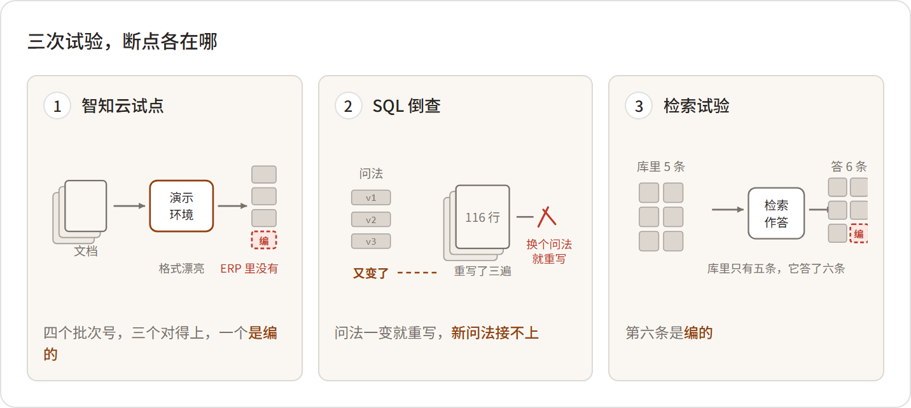

# 02 试出来的难处
*What Three Attempts Ran Into*

:::题记
"行不行，试了才算。"
——陈临，2026年3月18日，数字办自救会
:::

3月18日早上八点，数字办开会。白板上写着四个字：怎么自救。

到会的除了数字办自己人，还有郑敏和IT架构师赵峰。赵峰是被陈临电话里"请"来的，进门的时候脸色不太好，笔记本电脑往会议桌上一放，砸出一声响。屋里安静了。

他扫了一圈人："先说好，我是来帮忙的，不是来听差的。当初成立数字办，从我们IT抽了两个开发过去。我手上现在三个系统的运维，人手什么样，你们清楚。这回要是再扑空，别怪我说话难听。"他又补了一句："要说郑敏要的那个追溯——加两张表写好SQL的事，别的都是绕远。"

"这回扑不扑空，谁也不知道。"陈临说，"所以今天把能试的路都摆出来。行不行，试了才算。"

会开了一个钟头，分了三路。赵峰去啃追溯：他最熟数据库，试试用SQL把郑敏要的东西查出来。刘振邦那头联系了一家叫"智知云"的厂商，号称做"企业知识中台"，答应免费来做一轮演示加试点。小夏提了个方案——把公司全部文档喂给大模型做问答。她昨晚想了一夜，觉得能行。陈临本想按住这个方案，看她那股劲，又放行了。

还有一件火烧眉毛的事，不在这三路里：宏峰的72小时。复函后天中午前要交。郑敏牵头，陈临支援，方致远把关技术表述。

三路人马，各自去试。试的过程里，复函那一仗先打完了。

* * *

## 先说复函：七十二小时

3月19日和20日两天，质量部的小会议室没空过。郑敏把三天里拼出来的东西摊了一桌：十一台的序列号和出厂记录、能对上的四台的轴承批次、七批进厂检验报告的复印件、华信那份《工艺更改通知单》的扫描件，还有2022年底到2023年初采购员跟对方质量工程师的往来邮件打印稿。

复函第一稿方致远看不过："初步认定为热处理工艺变更导致"——他拿笔把"认定为"划了，改成"初步分析与该轴承供应商热处理工艺变更存在关联，完整证据链待补充核实"。"矿上拿着这封信去停机、去索赔，一个字都经不起含糊。"他说，"我们现在是怀疑，不是结论。怀疑就得写怀疑的样子。"

3月20日上午十一点，复函盖章扫描发出。正文四页，附了三页佐证材料清单。核心三条：一，故障呈批次性、同期性，初步分析与华信轴承2023年初热处理工艺变更存在关联，完整证据链预计两周内补充；二，先行处置：售后工程师驻矿跟机，备件先行发运，十一台分三批安排检修更换，第一批不影响矿方主生产线的两台先行；三，恳请给予两周时间提交最终分析报告。

当天下午五点，宏峰设备科回电。矿方的设备科长在电话里就说了两件事：报告，两周内交，我们等着；换下来的轴承和旧件，一台一台封存好，都留着——后面要当证据的。挂电话前他补了一句："我们矿长说了，青山这回要是把这事掰扯清楚，后面的框架协议照谈。"

郑敏放下电话，在小会议室坐了一会儿，才把这事转给陈临。七十二小时这一关过了，换回来的是十四天——十四天后要交的，就是真东西了。

当天夜里，售后群里跳出段兴发的一排照片：十一台换下来的旧轴承，逐台编了号，贴着标，缠着膜，一台一个角度。配的话照旧很短："一台一个号，锈成这样也得拍清楚。"群里还是没人回。陈临睡前刷到这排照片，往上翻了翻——最早那三张点蚀照片，还压在最上头。

* * *

## 一、SQL：跑通了，又没跑通

赵峰有他的底气。他干了十一年IT，公司里所有系统的账号权限一半在他手上，写SQL是他的看家本事。3月18日晚上开始，他连着两个晚上泡在办公室，把ERP（企业资源计划）、MES（制造执行系统）、质量系统三边的表结构理出来，画了一张A3的表关联图，贴在数字办的白板边上。

"这批减速机的序列号是主线。"陈临去看的时候，他指着图讲，"MES里的装配记录，序列号对工单，工单对装配批次；批次对轴承批次；轴承批次回到ERP，对采购订单；订单对供应商。四级关联，我一层一层JOIN下去，理论上，一台机器用什么轴承、哪家供的，能拉直。"

"理论上？"

"先跑通再说。"

第一次跑是3月20日夜里。查询语句写到五层嵌套，关联条件四十多行。跑下去，四十分钟没出结果，最后超时报错。赵峰盯着满屏红色报错看了一阵，起身出去抽了根烟，回来把袖子挽上，加索引，拆临时表，改写条件。凌晨一点多，查询出来了，八分钟。他把结果截图发到群里，附了三个字："先看下。"发完，靠在椅背上，揉了把脸。

3月21日上午，郑敏拿着打印出来的结果来对。对着对着，她的手指停在一列上："这几行，供应商写的是HX-ZC。这是哪家？我没听说过。"

赵峰凑过去看，眉头拧起来。他查物料主数据，查供应商档案，前前后后折腾了四十分钟，最后把鼠标往前一推，往椅背上一靠："嗨。HX-ZC，华信轴承。物料编码的前缀。同一家公司，在主数据里叫'华信轴承'，在一批早期订单里写的是'华信传动科技'，还有一批，只有编码没有中文名。三个名字，一家公司。"

"那2023年的采购，能不能确认都是华信供的？"郑敏问。

"能确认。我手工核的。"赵峰说，"ERP里按采购订单号查，订单附件里有送货单扫描件，送货单上盖的章是'洛阳华信轴承科技股份有限公司'。我一张一张对过来的，十九张订单，四十多分钟。"

"那你把它写进查询里，以后随时能查。"

"写不进。"赵峰用手背敲了敲屏幕上那三个名字，"SQL认编码和名称，它不认公章。要把这仨合成一家，得建一张对照表，然后得有人维护——供应商改名、新增、注销，都有人跟。这不是查询的事，这是管理的事。我们公司的主数据乱到什么程度，今天我算摸着底了。"

还有更远的——华信2022年底到2023年初那轮热处理工艺变更，确认过程在采购员和对方质量工程师的往来邮件里，附件是一份扫描的《工艺更改通知单》，PDF图片。赵峰说这句的时候没抬头，声音闷闷的："SQL连它的门朝哪开都不知道。"

真正让赵峰改口的，是3月21日傍晚郑敏的那个问题。她盯着拉出来的表看了一会儿，问："这批轴承，同期还发到了哪些出厂的机器上？除了这十一台，还有没有别的机器用了同期的批次？"

这个问题要倒着查——从轴承批次出发，找所有装配记录，再找整机序列号，再对发货去向，中间隔着销售订单和物流单，还有一部分机器走的是代理，发货目的地和最终用户对不上。赵峰没马上答话，走到白板边上，把这条链的每一环写在A3图的背面，写了一页纸。写完他盯着那页纸看，记号笔的笔帽咬开又扣上，扣上又咬开。

"能查。"他终于开口，"给我三天，我把这条链的查询也写出来。但是——"

他点着自己写的那一页："这条链，是我今天晚上才想清楚的。她明天要是再问一句'这些机器的用户里，谁在高原工况'，链条就又得改。查询得先把路修好。可郑敏的问题，是查着查着才冒出来的，我没法提前知道她明天问什么。除非把所有的路都提前修好——可什么叫'所有的路'？"他把笔往白板槽里一搁，"我不知道。"

那天赵峰走的时候快十一点了。他收拾电脑，电源线缠了两圈没缠好，也不缠了，塞进包里，跟陈临说了句话，语气跟当初完全两样："老陈，我收回开场那句话。这活是真难。难的不是写查询，是我头一回碰到'不知道该回答什么问题'的活。"

* * *

## 二、智知云：演示厅里没有宏峰矿业

刘振邦那头也在动。3月25日他跟陈临通了个电话，话说得很敞亮："老陈，董事会那边我给你挡着呢，但挡不了一百天。外采这条路必须摸一遍——摸通了，是青山的路；摸不通，我也好去跟董事长交代，这钱不是我不肯花。你就当帮我。"

4月2日，智知云来了四个人。销售总监姓佟，带一个售前顾问、两个实施工程师，投影仪自带。刘振邦全程作陪，把会议帘拉上，大屏放出来。

演示确实是好看的。某钢铁集团的知识中台，深蓝的界面，节点图缓缓展开：问"高炉大修周期"，答案带出处，出处是个可以点的链接；问某板材的工艺路线，答案旁边挂着关联设备清单，点设备，设备的维保记录跟着出来。售前顾问讲了一个钟头，术语一个接一个：知识中台、知识萃取、智能体、语义治理。最后一页PPT，一行大字：智能问答准确率95%。

佟总监顺口讲了那套中台的来历：起先是下游的主机厂要往上追，供应商拿不出手，被逼出来的。他说得平常，像在讲别人家的事。

"这是验收数据？"陈临问。

"第三方测的。"佟总监笑着说，"陈总，贵司的场景我们做过预研，典型得很——文档、系统、经验，三张皮。我们帮您把三张皮缝起来。三个月上线，半年见效。"

刘振邦在旁边点头。谈价之前，陈临坚持加一条：试点可以，不测标杆案例的数据，测青山自己的。佟总监答应得很痛快："本来就该这么测。"

试点做了两周。法务先跟对方签了保密协议，给出去的产品手册、检验规程、质检报告电子档，都脱了客户名——赵峰盯着对方当着他的面传完，才让删本地记录。4月16日演示日，数字办、质量部、IT都到了，刘振邦也来了，坐第一排。

标准问题全对。"JS-1100的额定功率是多少"，两秒，答案准确，出处标着手册第几页，页面干净漂亮。连着七八个问题，都对。佟总监端起茶杯喝了一口，整个人松下来，侧过头跟刘振邦低声说了句什么，两人都笑了。

演示放到提问环节，陈临开了口。这个问题他前一天晚上想到十二点——不能用演示的题目，要问一个只有青山自己的数据才能答的。

"2023年3月以后，华信轴承供过我们哪几个批次？"

系统思考了三秒。答案流出来，列了四个批次号，批次日期、数量、对应采购订单号都有，格式漂亮。

会议室里有人点头。赵峰没点头。他一言不发，拖过自己的笔记本，噼里啪啦连上VPN，进了ERP。会议室里安静下来，只有他的键盘声。五分钟后他抬起头，把两台电脑并排推到桌子中间。

"四个里头，两个是编的。"他用笔杆点着屏幕，一条一条过，"这个批次号，格式对，日期看着也合理——ERP里没有。这个，也没有。真正的批次是这三个，它还漏了一个。"

佟总监脸上的笑纹丝没动，但说话的节奏明显慢了下来，每个词都像是挑过的："陈总，这个情况很典型，不瞒您说——试点环境我们没接贵司的ERP，批次数据模型拿不到，它是基于文档语义在组织答案，它尽力了。这恰恰说明，贵司的数据需要先治理。治理好了，接入平台，这类问题是平台的主场。"

"治理怎么算？"陈临问。

"我们有专业的数据治理咨询，按人天计费。"佟总监报了个数，一天的价钱抵得上青山一个技术员半个月工资，"周期三到六个月，看数据情况。制造业客户我们做过好几家，平均下来，主数据这一块，四个月能到可接入标准。"

四个月。陈临在心里算了下：六月三十号，还有两个半月。

他又算了一遍，还是两个半月。

散了会，把厂商送出门。楼道里，刘振邦把陈临叫住了。他从兜里摸出烟点上，抽了两口，才开口，声音压着：

"老陈，你今天这一手，是摆我一道。"

"我摆你什么了？"

"那个问题，是你临时起的意？"刘振邦转过身正对着他，"你明知道它答不上来。当着我，当着质量部，当着人家厂商的面。行，你试出它不行了，你痛快了。然后呢？三个月以后董事会问起来，'试过了，不行'，这六个字谁去说？我去说——我成了推动外采失败的人。你去说——你正好把'自己干'的牌坊立起来。"

刘振邦要的是一条能交代的外采路线，今天这场面等于当众把这条路线砍了一道口子。

"振邦总，"他说，"那个问题不是我刁难它。郑敏的72小时，要查的就是这个。宏峰的索赔函还在董总桌上放着。这个东西答不上来，买它的意义在哪？"

"意义在于出了事有人担！"刘振邦的声音猛地起来，在楼道里撞出回音，他自己愣了一下，压回去，"有厂商兜着，合同里写着赔付条款。你们自己干，干错了谁担？你担得起吗？"

他把烟头摁灭在垃圾桶沿上，往楼下走。走了两步又停下，背对着陈临，肩膀绷着："老陈，我不是你的对头。我是怕你到时候收不了场。"

楼道里剩下陈临一个人。他在楼梯口站了一会儿，把刘振邦的话从头过了一遍，没过出个结果来，上楼了。

* * *

## 三、两万三千份文档

小夏的实验，跟智知云的试点几乎同步。她憋着一股劲，谁都看得出来。17号那天刘振邦走后，她一句话没说，把那六百多条问答记录一条一条翻到深夜。第二天她跟陈临提方案，说这话的时候眼睛还是红的，声音倒稳：

"陈主任，我想证一件事。不是我不行，是我们喂的东西不行。现在的大模型，喂的东西对，它什么都能答。让我把公司所有文档都喂给它试试。检索增强的做法，文献里验证过的。"

陈临按了三天，最后放了行，条件是只做内部测试，不接任何外部入口。

她真干出来了。两个星期，网盘加质量系统的两万三千份文档，解析、切片、向量化、建索引，问答界面是她拿开源框架搭的。要算力，她找赵峰批了机房那台GPU服务器——白天排不上号，她就把重活排在夜里跑。那两个星期她基本住在公司，工位底下放着睡袋。4月中旬，她在数字办内部发了试用链接，标题起得很克制：《试了一下，大家轻拍》。

头几天，效果好得让陈临意外。"JS-1100低温工况用什么润滑脂"——答得又快又对，这回引的是2024版规范，页码都对。小夏盯着这个答案看了很久，转过身跟陈临说："您看，库里的东西是够的。"谁也没多想一层：这回引对，多半是因为新规范那一段文字跟问题的字面重合度高，排在了前头——这和系统"知道"哪版现行，是两码事。

4月下旬的一个下午，陈临拿了个技术部上周问过的问题去试："KZ-220提升机减速器的密封件，有没有氟橡胶的选项？"

答案三秒出来："根据GB/T 3452.1标准，KZ-220减速器密封件可选用氟橡胶FKM材质，其耐温性与耐介质性优于丁腈橡胶，适用于高温工况……"

看着非常专业。小夏去查了GB/T 3452.1——那是液压气动O形圈的外形尺寸标准，跟密封件选什么材质没有关系。再查KZ-220的技术协议，密封件选项只有一个：丁腈橡胶NBR。氟橡胶选项，从头到尾不存在。标准号是真的，术语是真的，句子是通的。事情是编的。

小夏查证的时候很安静。查完她在工位上坐了十来分钟，然后把陈临叫过去，把两个网页并排打开，一条一条指给他看："这句，标准号是真的，但这个标准不管这个事。这句，FKM的性能描述是对的，但我们的产品没这个选项。这句，'适用于高温工况'，是它自己补的，什么依据都没有。"

真正把这条死路钉死的，是4月底最后一轮测试。赵峰把郑敏的追溯问题原样输了进去："2023年3月以后出厂的JS-1100，各自装了哪个批次的轴承？"

模型列了一张表。十一行，序列号、出厂日期、轴承批次，整整齐齐，每一行都没有犹豫。

赵峰拿着自己那张手工核对过的表，一行一行对。对完，他把两台电脑推到桌子中间，靠回椅背上，过了一会儿才说："五行的批次号是对的，六行是编的。对错掺一块儿，没有任何标记，语气一模一样。"

屋里安静了几秒。赵峰慢悠悠地又补了一句："这不就是更会说话的智知云吗。人家编批次好歹是想赚这单生意，它编批次图什么？"

"它不是编，它是在补全！"小夏猛地转过头，声音发颤，越说越快，"它的训练方式就是预测下一个最可能的词，表格缺一行它就补一行，补出来的东西它自己也分不出真假。这是机制问题——赵工，您要批评，麻烦批评到点子上。"

"我管它是想骗人还是机制骗人，反正结果是骗了。"

"那您SQL三天查出来了吗？四十分钟核十九张公章的时候怎么不说——"

"啪"。陈临一巴掌拍在桌上。屋里静了。

小夏的眼圈红了，扭头看窗外。赵峰把椅子往后一推，腿伸得老长，抄起手机看起来，不吭声了。谁也没再看谁。

过了几分钟，小夏小声说："对不起。赵工说得对，结果是骗了。"

赵峰从手机上抬起眼皮，看了她一眼："我那话也难听。你那个检索，确实比我SQL强——起码不用人教。"

说完他把手机揣回兜里，起身走了。这场架就算完了。

那天晚上，小夏把试用链接收了。她在复盘文档里写：检索能找到"长得像"的内容，但分不清"相关"和"正确"，更分不清"作废"和"现行"。两万三千份文档里，作废件、旧版本、重复件有多少，没人统计过。她给这个复盘起的标题很平实：《大力没有出奇迹》。

* * *

## 四、复盘：把三条路摆在一起

4月24日晚上，数字办凑齐了一次复盘。郑敏、赵峰、小夏、陈临，还有数字办另外两个开发。陈临在白板上画了三栏，一条路一栏。

开会前赵峰带进来一条花边：他在财务报销，听见隔壁窗口有人问起智能问答，顺嘴就叫成"那个发错文件的"。检验口那边传得更酸——厂里这是要花钱请外面的先生，教咱们管自己的单子。

第一栏，SQL。赵峰自己总结，写的是："查询要先把路修好。可追溯的问题，是查着查着才冒出来的。修不好'不知道会长什么样'的路。"

第二栏，智知云。陈临写："要接数据，先治数据。治理四个月起步，治什么、怎么算治好——厂商说'看数据情况'。"

第三栏，大模型。小夏写："认字，不认事。分不清对错和作废。文档里有的，它也只对一半。"

写完，四个人看着白板，谁也没先说话。过了一会儿，郑敏站起来，拿起笔，在三栏底下各画了一道，连起来。她的笔尖一下一下点着白板："你们看。SQL卡在哪？卡在东西之间的关系没人说清楚——名字对不上，路径得人先想。平台卡在哪？卡在咱们自己的数没个准头——什么算数、什么作废，没人说得清。大模型卡在哪？库里没有的它也张口就答——哪个批次是真有、哪个是它现编的，它自己分不清。"

她在白板底下写了一行字：名字对不上、数没个准、对错没人管——全公司没说清楚过。

"不光你们。"她把笔帽扣上，语气缓下来，"我为什么查得动？我在这个厂干了二十年，什么东西大概在哪、哪个数该信哪个数不该信，我心里有本账。你们要做的，说白了，就是把我这本账变成公司都能用的。可这本账，我自己都写不下来——太多了，还是散的。"

屋里安静了能有一分钟。这话说到根上了，可"把这本账写下来"往哪儿使劲，谁也写不出下一步。

散会前，郑敏收拾东西，忽然想起件事："对了。2023年那份《工艺更改通知单》的存根，档案室有，我调过。你们谁去过档案室？现在管档案的是个返聘的老先生，姓叶，设计院退下来的，原来是个所长。上回我去调件，跟他报了个年份一个件号，他站着想了想，走到第三排柜子，第二个抽屉，五分钟给我抽出来了。我当时就说，叶工您这比我们系统好使。他还挺不乐意听这话。"

"档案室？"小夏愣了一下，"咱们还有档案室？在哪儿？"

"行政楼负一层。"郑敏说，"你们天天从它门口过。"

第二天是周六。陈临在办公室坐了一上午，把3月17日以来这一个多月的事从头捋了一遍，在笔记本上把郑敏那行字抄了下来。抄完他合上本子，给郑敏发了条消息：周一上午，陪我去趟档案室。

:::日志 2026年4月24日
一个多月的账，记在月底：
- SQL：赵峰的查询跑通了，但只答得上"提前想清楚"的问题。三个名字一家供应商，机器合不了，得有人建对照表管着。追溯真正要的是"问题会变，路得现成"。
- 智知云：东西是好东西，在别人的数据上。自己家什么数都没有个"户口"，接什么进来都对不上。治理四个月起步，我们只有两个半月。
- 大模型：小夏的试验证明它认字不认事。作废的、编的，它都答得一样流利。文档库不收拾，喂什么都是白喂。
郑敏在白板上写的那行字我抄下来了：名字对不上、数没个准、对错没人管——全公司没说清楚过。
下周一去档案室。想不明白的事，去看看叶先生是怎么管那些纸的。
:::
