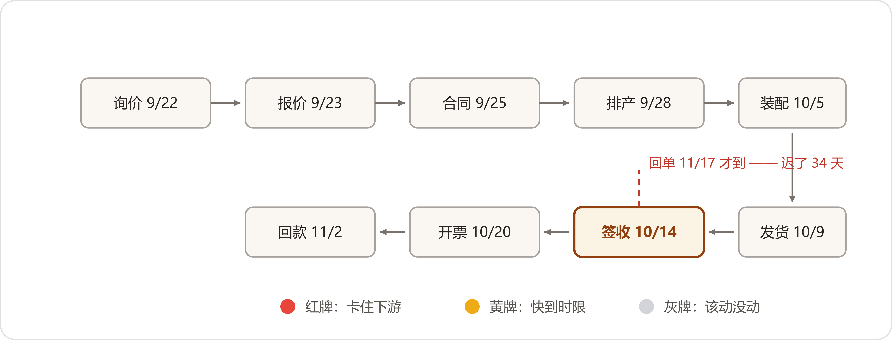
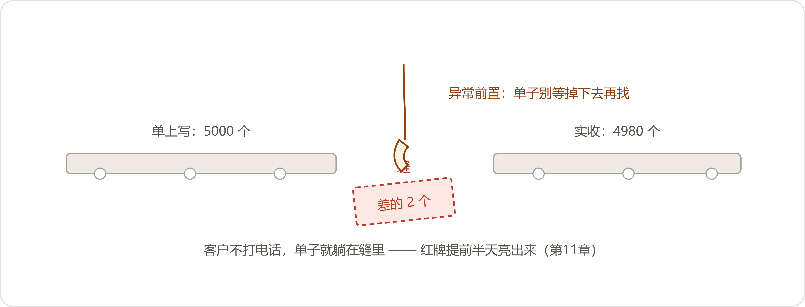

# 11 看不见的订单
*The Invisible Orders*

:::题记
"我不要你们再给我讲数，我要自己看。"
——董鸿章，2026年10月30日，月度经营分析会
:::

10月30日，月度经营分析会在六楼大会议室开。长桌两侧坐得满，各口的笔记本此起彼伏地翻，茶杯一个挨一个排过去。头四十分钟照旧：许曼报回款，周建海报订单，生产部部长齐连升报产量。翻到第五页，董鸿章把笔搁下了。

"我问个事。"他音量不高，长桌上却一下静了。"一张单子，从询价到回款，现在几天？卡在哪一环？谁看得见？"

半个月前，这两问他在电话里问过陈临一回；这回，他把这两问摆到了桌上。

周建海先接的。"询价到报价，常规单一天以内，急单当天，十月的账在这儿。"他翻了翻自己那页，"报价到合同，看客户，快的一礼拜，慢的俩月。合同往后，是生产口和财务口的事。货卡在哪儿，我们的人打电话问。"

齐连升五十六岁，说话不紧不慢："排产我们看得见，装配下线我们看得见——可我们眼里是工单。工单号后头是哪张合同、哪个客户、什么交期，得请销售内勤翻台账。合同号一进我们的系统，就成了工单号，中间隔一道，靠人。"

许曼扶了扶眼镜。"开票到回款，账龄我月月报。票前头那一段——货哪天发的、客户哪天签的收——我只有纸面。"

刘振邦把笔往本子上一横。"我补一问。十月发晋北的那六十箱备件，到矿上没有？库房说发了，物流说在集运站，矿上说车没到。仨礼拜，仨答案。这叫谁看得见？"

董鸿章没接任何人的话，端起茶，没喝，又放下了。

"上礼拜四，元宝山的机电矿长给我打电话，问他那两台备件到哪儿了。"他说，"我答不上来。让秘书去问，问到下班，拼回来三个数：库房说十月九号发的，物流说货压在集运站，矿上说没见着车。三个数，秘书抄在一张便签上。"他从手边那沓纸里抽出一张便签，念了一遍，又搁回那沓纸上，"今天我不问是谁的责任。我就问一句——这个厂里，一张单子从头走到尾，有没有一个人看得见全程？"

没人说话，挂钟在走，空调的风声一下变得很响。

"你们仨，一人看一截。"他看了看周建海，又看了看齐连升和许曼，"接缝的地方，谁都当没事。客户不打电话，单子就躺在缝里。"

他把那页纸翻过去，扣在桌上。

"我不要你们再给我讲数，我要自己看。"

站起来之前，他只补了一句："数字办。十一月三十号，还是这间屋。拿东西来。"

* * *

## 一、您最担心什么

11月2日，陈临空着手上了六楼，兜里揣个本子。六楼走廊比楼下静得多，地毯把脚步声都吃掉了，他在董事长办公室门口站了几秒，才敲门。

六月三十号验收散会那天起，各部门排队提需求，问的是"您想要什么功能"，登记回来十四行，从车间排班排到例会纪要，一行比一行大，一行比一行难办。那个教训他记着，这回，功能词一个都不准备问。

"董总，今天不谈做什么。我问您三件事。"他说，"头一件——您每天最担心厂里出什么事？第二件——哪些事您必须亲自盯？第三件——什么异常一旦发生，您想第一个知道？"

董鸿章没立刻答。他从抽屉里拿出一个本子——深蓝塑料皮，边角磨白了，里头夹一支铅笔——翻开，往桌中间推了推。十一月的这页，顶上四个词：库存、在制、回款、大单。底下四行名字和号码：仓储的，计划的，财务的，销售的。

"我一天三个电话，打了三十年。"他说，"早上七点半打库房，十点打计划，下午打财务。哪天没打，晚上睡不踏实。你们做的报表我月月看，数也对。可报表是死的，单子是活的。"

陈临问："您这三个电话，现在都问什么？"

董鸿章把本子往前翻，翻到十月那页，手指点着一处念："十月八号，问老冯，三号库那批轴承还够产几天。十五号，问齐连升，六台出口的走到哪道工序。二十二号，问许曼，晋北的款下来没有。"他合上本子，"一个电话问一个数。要看全一张单子，得打三回电话，三个人，三本账。我这三十年，就是你们的看板。老了一点，慢了一点，可我还看得见。你们做的东西，得比我看得全——不然要它做什么？"

"您担心什么？"

"四件。"他把铅笔捏在手里。

"头一件，大单躺在地上没人叫。销售以为排产排了，生产以为销售没交代完，单子在谁的待办里躺着，没人知道。等矿上打电话来骂，我才知道——晚了。第二件，采购多订。同一个轴承两个机型都用，各报各的，采购怕断料，宁多勿少。库房里压了多少钱、哪一笔是白压的，我说不清。第三件，该回的款没人追。票开了九十天、一百天，款挂在那儿。我不看账龄没人吭声，一看，追回一串。第四件，生产的和发货的两张皮。机器装配完在成品库躺着，客户在矿上天天等。发货计划谁对？没有人对。"说完，他把本子合上。

"别给我做大屏。前年有人给我做过一面墙的电视，我看了三天，第四天改放安全生产宣传片了。"他说，"我要的是——单子躺在地上的时候，有个东西，先于客户，叫一声。"

回到数字办，陈临把白板左边擦了——板擦的毛都用硬了，他擦得比平时用力——竖着写四行字：大单躺地上。采购多订。回款没人追。产发两张皮。右下角注一行小字：别提"功能"俩字。

小夏把这四行抄进自己本子。"这四行好使。"她说，"担心是活的。"

* * *

## 二、四千九百八十套

11月5日，赵峰在机房抽数——机房里服务器风扇的声音一茬压一茬，人在里头待久了脑仁发木。他把ERP的采购到货表拉出来，停在一行上，把屏幕转了过来。

采购订单FL-26-0892，华信，轴承，五千套，几款机型通用的常规型号。到货签收：10月14日。签收数量：四千九百八十。入库单：待核销。状态停了二十二天。

"五千套的料，账上一个没有。"赵峰说，"入库单卡在待核销。系统里写的原因——短溢装处理意见未附。我查了后台，不是ERP不能收，是流程没走完：短了二十套，得有处理意见，补发、扣款还是索赔，采购口跟华信谈定了，附上函，单子才能核销。差异函采购口十月十六号发过一回，华信回了八个字——磅单为证，请自查厂内。后头，就没人接了。ERP没错，仓库也没错，就是系统里没地方搁这四千九百八十套。"

当天下班前，陈临和赵峰去了三号库，院里叉车还在来回倒托盘。

库房办公室是间小屋，一张桌一个柜，柜里摞着一摞到货登记簿。仓储部主任冯广顺，五十五岁，管库三十一年，第三十一本登记簿摊在桌上，他正往里写。屋里一股叉车充电的酸味，墙上的温湿度表指着"干"。

"系统就这么规定的，少一个都入不了账。可货能退吗？"他把笔往本子上一放，"华信发的五千，我们点出来四千九百八，五十箱，一箱一箱点完的。电话打了，人家说出库五千，磅单装箱单都齐——意思是要么丢在路上，要么丢在我这儿。我上哪儿说理去？"

"那货呢？"陈临问。

"生产等料，装配二组来领，我给不给？给了。"他从抽屉里拿出一沓白条子，橡皮筋捆着，"领了三回，三百二十六套，条子都在。账上没有，货在架上，我这本子上有的。月底盘库，ERP的数差四千九百八十——差的哪四千九百八十，我这儿一笔一笔写着，盘库的老师傅都认。"

"登记簿能借我们拍一遍吗？"赵峰问。

冯广顺的手按在本子上。"拍这个干嘛？"

陈临把来意说了：董事长的看板，要把"货到了、账没走完"这种事摆出来。

手按得更实了。"摆出来？"他说，"这不等于说我账乱吗。厂里哪年不挂几笔？货到票没到的，短装的，多发的，年年在——都是这么办的，先收着，账上挂着，慢慢磨。你们把它搁到董总眼皮子底下，我这张老脸往哪儿搁？"

陈临指了指那沓白条子。"冯主任，挂的病根不在您这儿。单子卡的是采购跟华信的差异函，二十多天没人认领。看板要摆的是'卡在谁手里、卡了几天'，不是'谁账乱'。再说——"他把白条子拿起来数了数，撂回桌上，"您这本子，是全厂最准的一本实物账。把它收进看板：实物四千九百八十，账上零，借走三百二十六。往后这本子就是系统的凭据，不是抽屉里的私账。"

冯广顺盯着那沓条子看了半晌，把登记簿推了过来。"拍吧。拍清楚点，字小。"

临走他又把两人叫住："先说一句。哪天盘库对不上，头一个查的还是我这本子。你们那个板上，给我写一行——'凭据：仓储到货登记簿第三十一本'。写上这行，我认。"

* * *

## 三、只读，不动账

接下来十天，数字办全扑在这一个活上。白板上的格子画了擦、擦了画，马克笔写秃了一支。

赵峰先立的规矩。"ERP一根毛都不动。"他说，"每天夜里十二点半，ERP、MES、OA、财务的回款库，各抽一份只读副本，进机房那台机器。原来的系统照跑，一个数不许写，看板做在副本上。账是给审计看的——这话是许总说的，我抄来了。看板是给董总看的，少一个数也不行。两头都要，只有一条路：只读。"

许曼放的是两样：应付明细，回款流水——七八月对账那套机器读出来的库，现成的。条件三条：只读；返点不碰，承兑不进；看板上财务的数，凡对不上的，一律标"差异"，不许自动改。"机器提数，人定对错——八月定的规矩，板上照旧。"

抽数两天就完了，对号用了八天。询价单、报价库的项目号、OA的合同、MES的工单、ERP的出库单、发票、回款——七八种号，没有一个全厂统一的编号：合同号进了ERP叫外部单号，还少个前缀；客户的发货名和开票名对不上，走代理的隔着一层。小夏的分工法："对得上的，按单据号走死规则。对不上的，让模型读合同抬头、客户名、型号、数量，给个建议——建议全带黄边，人点过头，才算挂上。"她顿了一下，"案例里管这个叫数据关系处理器。说洋气了，就是个对缝儿的。两头牵线，成不成，家长说了算。"

白板上写出订单的九个环节：询价、报价、合同、排产、装配、发货、签收、开票、回款。一单一行，九个格子，格子里是日期和停留天数。写到签收那格，赵峰拿笔杆敲了敲："这格先空着。物流回单是照片，躺在跟单员手机里，没进任何系统。空着就空着，虚线框，我不拿别的数顶上。"

看板顶上一行，"在手订单客户数"：六十三家（开票法人），八十八家（用货主体），两个数并排，各挂各的名，角上一行小字：口径见《客户口径管理办法》。周建海来看进度那天，盯着这行看了半天："两个数都在，好。省得吵。"走的时候他又想起一句："风电那两家的框架合同，明年签不签还没定——听说人家在等个什么说法。"什么说法，他没细说。

异常规则照着白板左边那四行担心长，起了四个土名："单子躺地上"——合同额五十万以上，任一环节停留超三个工作日；"压库"——同一物料，库存可用天数加在途超六十天又下单；"赖账"——开票超合同账期未回款，账期读不出的按九十天；"两张皮"——装配下线入库超二十天未发货。谁的环节谁收，二十四小时没人接，升一级。

上线定在11月16日。前一夜最后一遍数跑完，赵峰把推送对象从头核了一遍，自己加了一条：红牌直送董鸿章。"董事长的手机，得第一个知道。"没人拦他。

* * *

## 四、凌晨一点四十七分

凌晨一点四十七分，看板跑完头一夜的全量核对，异常规则头一回上岗。七条红牌，按赵峰定的规矩，直送董鸿章的飞书——去年行政部推的办公软件，他平时只拿它批文件。

:::文书 异常提醒 · 11月16日 01:47 · 推送：董鸿章
【红】排产环节停留超3天：HT-26-1037（晋北备件两台）、HT-26-1041（晋北备件四台）、HT-26-1043（赤峰备件两台）\

【红】开票超账期未回款：晋北煤业集团（逾期31天）、鸡西矿务局机修厂（逾期46天）\

【红】发货后无签收记录超10天：元宝山矿备件两台（10月9日发货）\

【红】装配下线入库超20天未发货：JS-1100两台（10月21日下线）
:::

天亮后不久，陈临就被叫上了六楼；走廊还没什么人，秘书把他直接让了进去。董鸿章的手机在桌上，屏幕停在那七条上，手边那杯茶满着，没动。

"你自己看。"

陈临看完了。董鸿章开口，音量比平时还低。

"头三条。十一月的排产，我礼拜五在生产会上刚催过。你半夜叫，是想让我再催一遍？第四条，晋北的票，人家腊月并一块儿付，二十年的老规矩——你提醒我，还是我提醒你？第五条，鸡西，十月底财务跟我报过，矿上验收单没回来，挂的账龄，不是人家赖。第六条，元宝山——货到了，上礼拜矿长告诉我，安装都完了。你这系统说它没到。第七条，"他停了停，"这两台交期十二月十号，礼拜四我问过齐连升，他给我看的排产，我认了。"

七条对完，他把手机扣在桌上。

"头一晚上，喊了七回。"他说，"五回，狼是我见过的。一回，狼根本不存在。还有一回，狼真来了——可我上礼拜自己撞见的。陈临，下回它再喊，我信不信？"

陈临没解释阈值，也没提磨合期。"今天改三样。"他说，"第一，红牌不直送您——先送责任环节的人，二十四小时没人接，才升到您。第二，夜里不推，攒到早上七点半一并送，安全和客诉除外。第三，拿十月在手的两百一十七张单回放一遍，新规则会推几条、推到您手机几条，白纸黑字报您。"

"还有那条说货没到的。"董鸿章说。

"改成'回单未传'。灰牌，推跟单员，不进任何人的手机。"陈临说，"货到没到，系统现在确实不知道——它只知道自己没收到回单。往后它就照实说这句。"

这一天，数字办一路改到半夜——归口重划了，静默时段立了，阈值动真格：五十万这档撤了，红牌只认合同额一百万以上、单环节停满五个工作日；五十万到一百万的，黄牌进看板不响。回测跑完：十月的两百一十七张单，新规则下红牌两条、黄牌十四条——董鸿章的手机，整个十月只会响两回。报表送上去，他没批注。

转天一早，新规则头一回跑，红牌零条。赵峰盯着屏幕看了大半天，说了一句："零条我不踏实。零条有两种，一种是没狼，一种是狼不叫。"

八天后，狼来了。

* * *

## 五、鼠标给我

11月25日，一张红牌弹了出来。

:::文书 异常提醒 · 11月25日 16:10 · 推送：计划科、生产部、销售部
【红】排产环节停留满5个工作日：合同HT-26-1049（鄂尔多斯某煤矿集运站，非标减速机六台加两年备件包，合同额121万）。合同签订11月18日，11月19日转生产计划，至本日无排产记录。当前卡点：技术协议OA里有，计划科的盖章回传没有，销售部的归档件也没有。
:::

这正是国庆假期里邵卫东值班接的那张询价，谈了一个多月才签下来的合同。计划科等的盖章版技术协议，躺在销售部项目经理的邮箱里没归档；销售以为排上了，计划以为销售没交齐。两头都没错，单子在地上躺着。

红牌弹出不到半个钟头，齐连升的电话就打到了销售部。邵卫东翻邮箱，把那份盖章版调了出来，传了OA。傍晚，齐连升又给陈临打了个电话，就一句："往后技术协议的归档，我让计划科进OA自己盯。你们那个红的，给我也抄送一份——别回回让销售先看见。"该核的当晚就核完了；转天一早，六台排进十二月第一批，交期一月十号，保住了。周建海在小本子上划掉一行——他原打算下礼拜跑一趟鄂尔多斯，当面给人家赔交期。

上楼开会的当口，陈临在电梯口被老蔡截了一句。老蔡问："板上的数，跟账上的数，哪个改哪个？"陈临说板上只读，数还是四家的。老蔡"嗯"了一声，又问："人放上去的呢？"没等答，电梯到了，他先进去了。

电梯里，陈临碰见了董鸿章，里头只有他们两个。"昨天下午那条红的，谁的？"董鸿章问。"计划口和销售口一家一半。附件当晚补齐了，今早排进十二月第一批。"他"嗯"了一声，电梯到了，他先出去。自打上线第二个礼拜起，赵峰把每日汇总压成一页，天天一早送一回：红的几条，黄的几条，灰牌挂几条。董鸿章没让关。

11月30日，还是六楼那间会议室。长桌头上多了一台演示机，连线一直拖到桌子中间。

陈临先讲，先交代三件事。"第一，看板上线连头带尾十五天。第二，它一个数都不生产，底下的数还是ERP、MES、OA、财务四家的，我们只做搬运和对号。第三，利润、成本这些经营指标有没有明确的提升——十五天，证明不了，我不编。"

"能说的三件。第一件，四千九百八十套轴承。十一月十三号，许总排十一月付款计划，华信那笔款后头挂着四张采购单，点开一张，货到整三十天没入库。许总的规矩，货没入库，款不排——电话打给潘部长。二十号，华信回函认了短装，二十套下批补发，入库单核销。这批货在系统里第一次有了户口。往后这种货到了、流程没走完的，板上当天就有，不用等三十天。要问变化——系统比过去更接近真实业务了。就这一句，多的我不说。第二件，钱追得上了。华信到期应付一百九十三万，后头四张采购单、九批到货，哪批货装进了哪几张合同，一格一格点得开——这条请许总补。第三件，救了一回急，就是上礼拜三那单，鄂尔多斯，一百二十一万，排产躺了五个工作日，红牌弹出，当晚补齐，第二天排产。搁在十月，这单要躺到客户打电话骂人。"

许曼接第二条，说得不快："以前回答这笔钱为什么付，我的会计要打五个电话。现在板上点三下。丑话也有：承兑和返点照旧不进，财务的数只读，标'差异'的一个不许自动改。规矩没变，变的是查得着。"

陈临合上本子。"改完规则到今天，红牌推了三条，黄牌十一条，里头误报一条，我们认了，规则补了一刀。就这些。"

董鸿章没评价，站起来，径直走到演示机跟前。

"鼠标给我。"

投影上是在手订单的列表。他没点红的，也没点大的，下拉拉到一半，停在一行上——元宝山，备件两台——点开。九个格子从头亮到尾：询价9月22日，报价9月23日，合同9月25日，排产9月28日，装配下线10月5日，发货10月9日，签收10月14日，开票10月20日，回款11月2日。他的手指在触摸板上走得不快，但没停过。光标挪到签收那格，格子边上浮出一行小字：回单归档，11月17日。

"货十月十四号签的收。"他说，"回单哪天进的系统？"

"十一月十七号。"小夏说，"跟单员补传的。"

"在手机里躺了三十四天。"董鸿章把光标移开，"这样的回单，还有几张？"

"挂着十一条灰牌。都推给跟单员了，推的不是矿上。"

董鸿章没再问回单，把那张单关了，退回列表，手在触摸板上停了停，问了句跟哪一行都无关的话：

"这些格子底下的数——谁跟谁，是怎么对上的？"

陈临答："大半按单据号，系统自己对。对不上的，模型给建议，人点头才挂。还有一小撮，模型也对不上——赵峰手工挂的。"

赵峰从包里拿出一个黑皮硬壳本，摊开推到演示机边上。一百二十九行：物料新旧编码五十八行，客户、代理和终端七十一行。"机器对的占九成多。剩下这些，我手工挂的。哪天我休假，新来的对不上的，还是得攒到我桌上。"

董鸿章看着他。"六月那二百八十五台，也是你手工喂的。"

"是。"赵峰说，"这回的本子，比那回厚。"

屋里静了一下，静得听见投影机风扇的声；董鸿章把鼠标搁回演示机边上，看了一圈会场。

"各口的数，下个月，都进来看。先碰三样：物流的回单，销售的在途，华信以外的供应商。"他端起茶，这回喝了一口，"碰得动，接着碰。碰不动——我来碰。"

散会时刘振邦绕到演示机前，看了两分钟，没碰鼠标。"行，这回不是挂墙上的电视。"他冲陈临抬了抬下巴，"哪天大区经理一人一份，拿它跟客户交底，你再来找我，我给你站台。"

周建海在走廊里追上陈临，小本子已经翻开："下月加一格——矿上谁在等，名字，电话。单子躺了五天，总得有人给人家去个电话。"

"记下了。"

楼梯口，冯广顺等着——后半个会他列席的，安全帽拎在手里。"陈主任。"他把安全帽从左手换到右手，"我那行，在不在？"

陈临把手机掏出来，翻到FL-26-0892那一行，才递过去。末尾一行小字：实物凭据，仓储到货登记簿第三十一本，借条三张，涉及三百二十六套。

冯广顺盯着看了半天，把手机还回来。"在就行。"他把安全帽扣到头上，往楼下走，走了两级台阶又站住，回头，"下礼拜盘库，账上要是不差了，你们别抢功——那是三十一本本子的功劳。"

:::日志 2026年11月30日夜
看板上线十五天，记账：
- 不问功能，问担心。四行担心顶过去十四行需求——担心是活的。四家的数各自在库里躺着，董总还是看不清：数在系统里，不在他的经营里。这回学到的进门口诀：您每天最担心什么，什么必须亲自盯，什么异常想第一个知道。
- 只读，不动账。原系统一根毛不碰，夜里抽数、二次组织，看板做在副本上。账给审计，板给经营，两本账一个来源。许总那句"账是给审计看的"，赵峰抄走了——这厂里好话都是这么传的。
- "货到了，流程没走完"——四千九百八十套。系统没错，仓库没错，流程没走完，这种事以前存在于冯主任的本子里、盘库老师的默契里。现在它有一个格子，当天看得见。凭据写的是他第三十一本本子：这本账，系统得认。
- 狼来了的账：头一夜七条，五回旧狼，一回狼不存在，一回我们自己撞见。提醒的命在准，不在多。红牌进手机，黄牌进看板，先送责任人，二十四小时没人接才升级；十月的两百一十七张单回放，整月两条红。这个数比七条值钱。零条也不踏实——零条有两种，赵峰说的，记着。
- 十五天，证明不了的不说：利润、成本，证明不了。能说的三件：悬账落了户，钱追得上了，一单没躺死。
- 债又厚了一层：赵峰的映射本，一百二十九行，手工的，比六月的图厚。十二月去碰各口的数——物流回单还躺在跟单员手机里，十一条灰牌；在途、华信以外，一样一样碰。第一块砖已经摸着了，墙还没摸着。碰不动，董总说他来碰——先记下这句。孟经理那笔出口柜的方数账，也排进了十二月的单子——还没打。
:::
