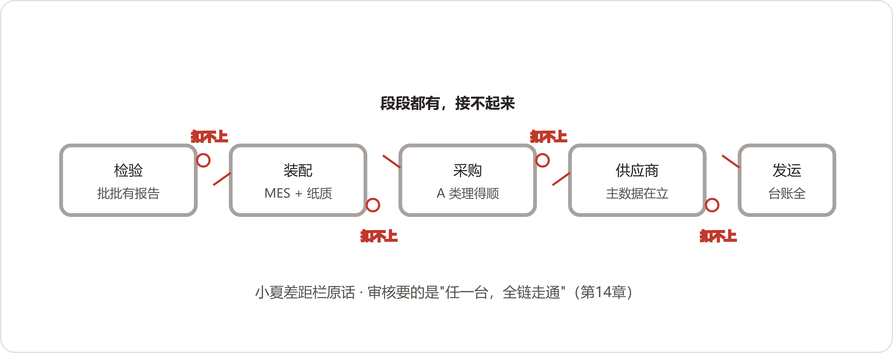
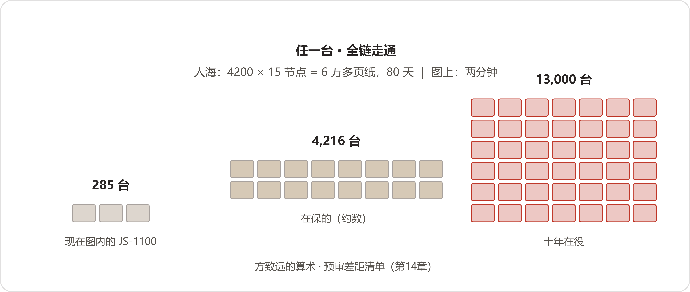

# 15 审核通知
*The Audit Notice*

:::题记
"补是把忘了的想起来。没记过的，想起来也变不出来。"
——方致远，2027年2月19日，三楼小会议室
:::

正月十二，节后上班头一天。厂里的假放得足，从腊月廿九一直放到正月十一，外省的工人是初十、十一两拨回来的，长途车把人卸在厂门口，行李箱的轮子碾过冻硬的鞭炮纸屑，一路响到宿舍楼下。2027年2月17日，星期三，早上八点，装配车间吊起了年后的头一件活，天车的动静传到行政楼，三楼的窗玻璃都跟着颤了颤。

数字办比车间先醒。白板上，年前钉上去的两份通知还并排挂着，左边是瀚风的函，右边是董事会红头的打印件，底下一行小字没人动过：二月廿六，董事会。三月卅一，瀚风预审。五月十，现场。小夏到得最早，把各工位的椅子一张一张从桌上放下来。暖气片上年前搁的橘子皮干得只剩一层壳，她捏起来扔了，末了在白板跟前站了一会儿，谁也没叫她，她自己把打印机打开，添了一包纸。

九点，董鸿章召集的会开在六楼大会议室，人到得齐——郑敏、方致远、齐连升、潘永年、周建海、刘振邦，邵卫东跟着周建海来的，数字办去了陈临、赵峰、小夏三个。这间屋年前散了最后一个会就锁了门，长桌上落了薄薄一层灰，秘书提前来开过窗，冷空气还没散尽，好些人进了屋也没脱大衣。

* * *

## 一、全厂的考

董鸿章进来的时候，胳膊底下夹着两样东西：瀚风那封函的原件，一摞复印的细则。他把原件搁在自己位子跟前，复印件交给秘书，只说了一句："一人一份，先看十分钟。"

纸页翻动的声音响了一阵，一阵一阵地停。停了之后满屋子安静，只听得见暖气片里水走过的声音——都停在第四页了。刘振邦从口袋里摸出笔，在两行字底下各画了一道横线，画完把笔搁下了，没说话。

"郑敏。"董鸿章开口了，音量不高，"第四页，你念。"

郑敏站起来念。她平时说话快，连珠炮似的，这回一个字一个字放得很慢——事情越大她说话越慢，这条规律陈临早就摸到了，今天是她这几年念得最慢的一回。

"4.3，全链路可追溯能力：任一出厂产品，自原材料批次、制造过程记录、检验记录至发运环节，可完整追溯，现场随机抽取型号核验。4.4，知识体系化管理：设计与工艺变更管理记录、典型质量问题的归档与经验管理、故障案例库及关键岗位知识传承制度。"

念完最后一条，她坐下了。屋里没人接话。

"我讲三件事，讲完散会。"董鸿章把茶杯往边上挪了挪，腾出桌面，"第一件，瀚风是什么分量。去年全公司开票十二个亿，瀚风一家，三亿六——三成。周建海，新平台的事，你讲。"

周建海翻开自己的本子。"瀚风明年要上十兆瓦的新平台，后年批量。配套定点明年上半年定，规矩是新出的：一级供应商，才有资格进定点评审。我们现在的资格，就是这次审核定的。过不了，降二级。二级什么待遇——订单走他们的采购代理，价格压一成，量砍三成，协议一年一签。"

这风其实刮了一年了。六月周建海递过来那沓厚条款，八月省城圆桌上的"名录往后排"，十月碰头会上的"年审要动大科目"——如今白纸黑字，落到自己头上了。

"都听见了。"董鸿章看了一圈，"三亿六，先压一成，再砍三成。齐连升，你的排产怎么办？"

齐连升把手里那页纸翻过来，又翻回去。"……我回去重排。"他没说排得成排不成，把那页纸折起来，压在了本子底下。

"第二件，这考的是谁。"董鸿章的手指在细则封面上按了按，"有人说，这是数字办的事。函走的是客户口，细则讲的是质量的话，跟自己没关系——我把这话搁这儿：瀚风盖的是它供应商管理部的章，答卷的是青山一千七百人。哪个口的人觉得这事跟自己没关系，现在说。"

没人说话。暖气片咔的响了一声。

"第三件，人。应审组，今天立。陈临牵头；质量郑敏，主责；生产齐连升、销售周建海、采购潘永年，各出口子的人，名单明天报。技术部方致远，变更那一摊是你的。星期五，差距清单放我桌上——有什么，写什么，一条也别替我挑着写。"

他站起来，扣上西装扣子，走到门口又站住了。

"二十六号董事会，照开。陈临，你的年度汇报照预备。应审的差距，一个字别往汇报里藏；也别让差距把做成了的事盖住。一根线上的事，到会上别说成两套话。"

散会以后，秘书把剩下的复印件抱去了文控室。当天下午，复印的细则发到了各车间、各科室，一人一份。

* * *

## 二、"任一"两个字

节后第二天，销售部的小会议室，免提电话摆在桌子中间，邵卫东拨的号——瀚风供应商管理部，姓翟的工程师，周建海他们打了七八年交道的老熟人。在场的有周建海、邵卫东、郑敏、陈临。

电话响了两声就通了。那头的声音不高，语速平，句尾总带着点客气。

"周总，年过得好。材料的事我知道您要问什么，咱们一条一条来。"

"翟工，老朋友了，我也不绕。"周建海把身子凑近免提，"这个'任一'——能不能有个商量？比如我们重点机型先备，几个大的稳住了，再往外推。"

"周总，跟您交个底。"翟工说，"细则第4.3条，'任一'两个字，不是我拟的，是评审委员会定的，各家供应商拿到的是同一份。我这边能做的，是把要求提前给您讲明白。您把打听范围的力气省下来，搁到预备上去，比什么都强。"

郑敏接过话头："翟工，请教个技术口径。原材料批次，追溯起点算到哪一级？轴承，我们追到进货批次。齿轮锻件呢？"

"锻件要材料证明书，炉批号对得上。您做体系审核出来的，这条不陌生——新鲜的在哪呢？这回要落到产品上，不是落到文件上。"翟工说，"体系审核，我抽您的程序文件；产品评审，我抽您的机器。两码事。"

"现场抽取，怎么个抽法？"陈临问。

"型号，从我们在役清单里抽；序列号，从贵司出货台账里抽，当场定。"翟工停了一拍，"跟您说句实在的——抽着哪台，我们审核组提前也不知道。"

免提跟前静了一下。郑敏看了陈临一眼，陈临没动。

"那……预审材料呢？"周建海还想往回找补一句，"我们把做得实的写足一点，面上的——"

"预审材料清单，今天下午发正式邮件，五项。"翟工的声音还是那么平，"该写的写；没有的，写'暂缺'，写'在建'，都行。别写没有的。评审最忌讳这一条，查出来，直接终止。周总，这话我只能说这一回。"

末了他又添了一句："陈主任，再啰嗦半句。风机在野外一跑二十年，出了事追溯不清，罚单先开给我们，再开给贵司。细则写这一条，不是为难过谁，是我们自己的饭碗。您预备扎实了，我们审核的时候也踏实。"

电话挂了，免提的小灯灭了。屋里一时没人说话。周建海把本子合上，说了句："这位老翟，客气起来，比不客气的还难说话。"

当天下午，翟工的邮件到了。五项：按细则逐条的自评表；追溯能力说明——覆盖机型清单、各环节记录的存放说明、一例全链路记录；变更管理程序及近两年记录清单；质量问题归档与故障案例库说明；关键岗位清单及知识传承安排。陈临把清单打印出来，钉在白板上，两份通知的正中间。

这个下午，各口的数都动了。郑敏回质量部拉在保台账；齐连升给计划科派了活，抽去年的工单；赵峰把六月那张图打开看了一眼，没动，合上了。

批次栏的消息，当天就下到了班组。夜班会上有老记录工嘀咕：一栏变两栏，当班又多一道要填的。带班的把话压下去了，转头碰见齐连升，还是说了。齐连升站在车间门口想了一下："堵口子的账，从来记在干活人手上。先记着——别让它断在纸上。"

* * *

## 三、一人一截

2月19日，星期五，三楼小会议室，应审组头一回对家底。到的人围了一桌：陈临、郑敏、齐连升、潘永年、周建海、方致远、赵峰、小夏。桌上摊得开开的——郑敏一沓打印件，齐连升两本工单复印件，潘永年抱来一个档案盒，方致远把他的绿皮本压在最底下。小夏把投影打开，一张五栏的表：条目，要求，家底，差距，怎么办。

库房冯广顺没上来。头天听说要过家底，他让徒弟把三十一本登记簿抱到三楼，码在会议室门口的条凳上，捎了一句话："要看哪本，自己拿。别折角。"

"细则都看熟了，不从头念。"陈临说，"咱们拿一台机器，正着走一遍：序列号，装配批次，工序和试车，检验，关键件批次，供应商，变更，发运。一人一截，有什么报什么。小夏记表。"

郑敏先报。"检验这一截，我有底。出厂检验加随机文件，一台一份，近三十年没断过。在保的四千二百一十六台，报告全在QMS里，点得开，打印得出来。进厂检验也有——关键件每批一份报告。只是报告上落的是批次结论，要往供应商的工艺那头去，就出我的门了。"

齐连升翻开自己的硬壳本。"装配这一截，分两段。工序、试车、工时，MES里是全的——二〇二〇年上线往后。往前的，在车间记录本上，老纪他们记的，纸都在，得一页一页翻。还有一条，我不藏着：工单上关键件的批次栏，当班的漏填，系统不拦。昨天我让计划科抽了一百张去年的工单——"他把本子转过来，让大家看那一页，"十一张，批次栏空着。一成。审核员抽着这十一张里的任何一张，链到这儿就断。"

"关键件再往上一截，归我。"潘永年把档案盒往桌上一放，"华信，去年从头到尾理过一遍——那是拿十一台点蚀换来的。华信以外呢？ERP里供应商编码九百一十二个，复评年年理，理得顺的，是A类那一百来家。老户、注销户，负一层死档里躺着。审核员抽一台一九年的机器，追到一家歇业的老户，档案在死档里睡十年了，批次对不对得上，得先把档案刨出来才知道。恒鼎的事，一月各位都在场。"

赵峰最后报，报得最短。"六月那张图，五百一十九个圆，两千来条线。覆盖面：一个机型，二〇二三年上半年，二百八十五台，一家轴承。全厂近十年出厂一万三千台——二百八十五，零头的零头。图停在六月二十四号，快照，打那儿起没添过一个节点。添节点的手，是我的；映射本一百三十七行，也是我的手。审核员现场抽序列号——抽在图里，两分钟；抽在图外，一台，一个下午起步，还得那台的批次栏当年填了。"他把年前说过的话又说了一遍，"抽到供应商那一步，一屏三个恒鼎，我给审核员看哪个？"

小夏在4.3那行的差距栏里敲了八个字：段段都有，接不起来。敲完把手从键盘上收回来。

"再记一条。"郑敏说，"预审自评表，4.3按实际情况填。MES批次栏，抽检一成空缺；追溯覆盖，如实写一个机型。"

周建海把笔往本子上一拍。"郑部长，这两条白纸黑字报上去，瀚风的评审桌上咱们先矮半头！同场应审的又不是我们一家，别家把烂账捂着，咱们摊开——定点的时候人家拿这个压价。这不是递刀子吗？"

"周总，我问你一句。"郑敏没跟着起来，等他说完了才开口，一字一字的，"三月宏峰的函来之前，那个窟窿已经躺了三年。要是头一年有人把'两台批次栏空着'报出来，三月的函还那么难看吗？瞒，是瞒不过抽查的——六月三十号，老蔡当着全场抽签，抽的就是断线那台。翟工昨天说得更明白：序列号从咱们自己的ERP里现场抽。你要赌他手气？"

周建海的嗓门降下来半格。"我不是要瞒。"他把笔捡起来，捏在手里没落纸，"我是说先补一补，补多少算多少，再报。给我个缓冲。"

"报什么、怎么报，预审三月底才交，今天先不动这一栏。"陈临把话接过来，"齐部长，你像有话。"

"我有个老办法，不一定对。"齐连升把本子合上，"前年外审，审核前一个礼拜，技术部连加三个晚上，补录三张联系单，也过了。这回——各口凑人，加几个晚上，能不能把在保这几千台的链，突击补一轮？"

屋里静了几秒。方致远从座位上起来，把压在最底下的绿皮本抽出来，走到桌子中间，翻开，一页一页把卷角码平了，才开口。他说话前总要把手底下的东西码齐，这个习惯全厂都知道。

"前年那三个晚上，是我安排的。三张联系单，补的是'忘'——单子有，流程没走，补走一遍，三个晚上，够。"他指着桌上那份细则，"这回对着细则数：在保四千二百台，十年出厂一万三。一台的全链，往少了算，十五个节点。四千二百乘十五，六万多个节点——八十天。"他把绿皮本搁在细则边上，"还有更要紧的一条。补，是把忘了的想起来。没记过的，想起来也变不出来。缺失卡那台，批次号让油渍糊了半边，经手的人退了，谁也想不起来。那样的窟窿，一万三千台里有多少个，没人数过——从来没人从头查过。"

赵峰把算盘接了过去。"再算一笔。二百八十五台，我喂了两个月——那还是郑部长三月把底子趟过一遍的。四千二百台，十五倍。八十天，我一天不歇也干不完；就是给我十个我，断了的源头也补不出来。"

齐连升听完，自己把话收了。"行，这办法算我白提。"他把本子重新翻开，"那生产口先干能干的。批次栏，系统里加一道必填，三月把新口子堵上。"

"这条记上。"陈临说。小夏把它敲进"怎么办"那一栏——那一栏里头一行字。

4.4对得快。变更那一项，方致远自己报的："记录有，流程的口子没闭。内审那句'临时更改补录不及时'，写了三年，去年才把存量清完。"故障案例库，小夏报的："售后有一个，段兴他们的，双签，带叫法栏——六本账里最像样的一本。可它只装矿上的售后。"轮到知识传承，陈临把细则那行念了一遍，念完说："制度栏，空白。首席技师今年退休，装配的老班长今年退休。老唐的口述攒了三十来回录音，离'制度'两个字，还远。"

小夏在差距栏里敲了六个字：有账，没有制度。

"我再补一条现成的。"周建海的声音低着，"自评表要是问'知识资产谁管'——一月，我们自己出的两份表，差一百二十万。这个怎么答？"

"答'各管各的'。"潘永年说，"这还是实话。"

这话说得一点也不可笑，桌上还是有人笑了一声，笑完自己也收住了。

:::文书 应审差距清单（摘） · 2027年2月19日
4.3-1 全链路追溯｜任一出厂产品｜检验：QMS全覆盖；装配：MES（2020年后）＋纸质记录；供应商：A类百余家理得顺；在用未数、死档未清；图：1机型285台（快照）｜段段都有，接不起来；MES批次栏抽检一成空缺｜批次栏加必填，3月上线\

4.3-2 现场随机抽取｜型号、序列号现场定｜——｜图内285台可两分钟重演；图外为零｜（空）\

4.4-1 变更管理｜程序＋记录｜联系单137张，存量已清｜有记录，流程口未闭｜（空）\

4.4-2 质量归档与案例库｜归档＋经验管理｜售后故障库一本（双签）｜只覆盖售后｜（空）\

4.4-3 知识传承｜关键岗位制度｜——｜制度空白；首席技师、老班长今年退休｜（空）
:::

散会前，陈临看着投影说了两句。"董总要的清单，今天下班前送上去。差距照实写。'怎么办'——想不清楚的，空着；想清楚一条，填一条。"

"一条都没有，那边过得去吗？"小夏问。

"空着交，挨顿说。"陈临说，"编满了交，查出来，挨的就不是说了。"

傍晚，陈临把四页清单送上了六楼。董鸿章从头翻到尾，翻得很慢——他翻纸一向慢。翻完，把四页纸摞齐，推回陈临面前："放着。二十六号，连你那份汇报，一起说。"

陈临下楼，在楼梯口让邵卫东拦住了。"陈主任，有个话带给您。我们片区经理昨天听来的——刘总前天在大区坐了一下午，临走撂了句话：二十六号董事会，路线之争他正式提。还说，海力达的账，加上瀚风这封函，材料齐了。"邵卫东把大衣搭在胳膊上，"话我带到了，您心里有个数。"

"还听见过别的没有？"

"就这些。"邵卫东先下楼走了。

* * *

## 四、老规矩

元宵节，办公楼里冷清，走廊尽头的窗台上还搁着年前发的福字，褪了半边色。审计小会议室的门开着，老蔡的大衣搭在椅背上，保温杯拧开搁在手边，桌上摊着一摞底稿。陈临是被电话叫上来的，进门的时候老蔡头也没抬。

"坐。二十分钟。"

"两样，老规矩。"老蔡把老花镜架上，"第一样，钱。去年的账我过了一遍——现金，摊销完的八十七万是前年那套问答；去年新花的现金，三万六千多，零星服务。别的呢？"

"工时。"陈临说，"数字办四个人搭进去大头，质量、技术、销售、仓储零星搭的，按厂里核算价折下来，四百人天上下。"

老蔡在本子上记了一笔。"工时也是钱。二十六号汇报，这笔别漏——漏了，人家说你糊弄；报了，人家说你贵。怎么说，你自己掂量。"

"第二样，数。"他从硬壳本里抽出一张裁好的纸签，搁在桌上，"六月那手抽签，我没撂下。二十六号的报告，我要引你们的追溯——规矩还是那条：要我认的数，得能重演。你现在，经得起抽的，有多少台？"

"图里的二百八十五台，任抽，当场重演。"陈临说，"图外的——现在，零。"

老蔡把那张纸签收回本子里，夹好，才说话。"二百八十五，和零。这两个数，我都写。"他用笔杆点了点桌上那摞底稿，"瀚风那条4.3，跟我这条规矩是一个理，他们抽得比我狠。我把话搁这儿——能重演的，写进报告；重演不了的，我一个字不替你圆。"

"应当的。"陈临说。

老蔡把底稿摞齐，末了抬了抬下巴："去吧，过你的十五。"

* * *

## 五、空着的一栏

正月十六，夜里，厂区静下来了。装配车间晚上没排班，只有门房的灯和两排路灯亮着，雪没有下，风把锅炉房顶上那股白汽压得很低，贴着管子往南飘。数字办就剩陈临一个人，桌上并排摆着两样东西：差距清单的四页打印稿，年度汇报的第三稿。

差距清单的"怎么办"那一栏，从头到尾一行字：批次栏加必填，三月上线。底下，空着。他把每一行差距又读了一遍，读一行，想一个晚上——老路，方致远否了；人海，赵峰的乘法算死了；问外头买，四月那道题的教训还热着，纸和死档，平台搬不进来。读到最后一行，"知识传承：制度空白"，他把清单放下，去改汇报稿。

汇报稿更难。做成的事数得出来，串不成一个说法。他写到第三稿，三稿停在同一个地方——哪一本是正本？谁立的？谁认？这三问答不上来，汇报立不住。他把笔搁下。

键盘旁边，叶老那张词卡还压着，朝水杯那面的边角，浅印又深了些。出了十五——昨天才是十五。合卡的课，从腊月二十八约到今天，整下午的课，一天还没兑现。蓝皮本翻开在桌角，那一页上两行字：哪本是正本；出了十五，档案室。

他把两份稿子摞在一起，拿词卡压住，关了显示器。掏出手机，在日历里建了一条：周一，档案室。想了想，在"档案室"前头添了四个字——整下午的。

:::日志 2027年2月21日夜
应审头一周，记账：
- 瀚风的分量，这回掂实了：十二亿里三亿六，还有新平台定点的门票。函除夕就到了，考的是全厂，答卷的笔这周发到了各口手里。数日子，到五月十号现场，还剩七十八天。
- 演示和抽查，两码事。六月那场，机器是我们自己挑的，题是我们自己出的；五月十号，题和机器都归人家抽——型号从他们在役清单抽，序列号从我们ERP抽，审核组自己也不知道抽着哪台。"任一"两个字，把运气这条路堵死了。老蔡那条"能重演"，跟4.3一个理，他抽得比瀚风还早。
- 各口亮了底：郑敏的检验在QMS，齐连升的工单在MES（批次栏还有一成空着），潘永年的档案一半在死档，赵峰的图停在六月二十四。一人一截，谁都没错；接起来，够不着"任一产品全链路"。这堵墙去年是碍事，今年五月起是要命。差距清单那栏"怎么办"，全线空白，只有生产口自己长出来一条：批次栏加必填。能堵的口子先堵，这条不赖。
- 老路堵死了。方致远那两句记牢：补是把忘了的想起来；没记过的，想起来也变不出来。人海的账更简单——285台两个月，4200台八十天，乘法一做，梦就醒了。
- 报，还是捂：周建海的"递刀子"，郑敏的"赌手气"，两边都有各自的理。预审材料三月底交，这一架还没吵完。老蔡把规矩又立了一遍：能重演的写，重演不了的不圆。听谁的——听抽签的。
- 两份稿子一根线：做成的不少，串不成一个说法。病根还是那三问：哪本是正本，谁立，谁认。明天下午，下档案室。整下午的课，年前约下的，不能再欠。
:::
