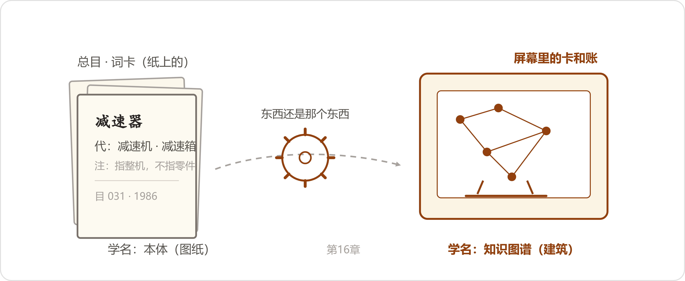
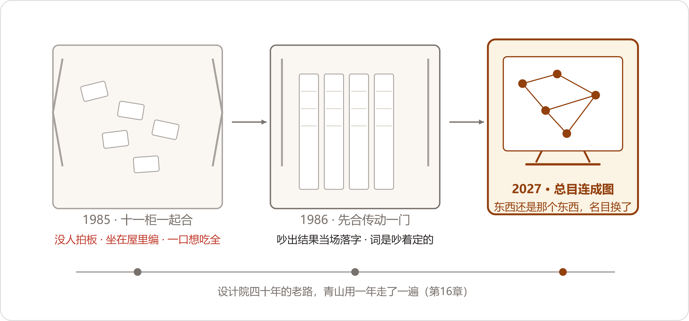

# 17 叶老的图纸
*Mr. Ye's Blueprint*

:::题记
"先对词，后合卡。词对不上，合了也白合。"
——贺所长，一九八六年十二月二十日，合卡会议记录本
:::

2027年3月1日，星期一，董事会开完第三天。礼拜五那场会开了大半天，路线之争吵到散会也没有个结果，末了董事长把话压在五月十号上——瀚风审完，再论。陈临手里经得起再翻的，就两样：四页差距清单，和蓝皮本上那三问。哪本是正本，谁立的，谁认。这课从腊月二十八约起，出了十五，又拖过一个董事会，拖到今天，总算兑现了。

中午他在食堂门口截住小夏："下午跟我下档案室，带上本子。"小夏端着饭盒想了想，把下午排给自动回归的活挪到了晚上，应了。

下午一点半，两个人一前一后下行政楼的楼梯。楼梯走到头，再往下半层，就是负一层。拐角的感应灯还是那盏，人走到跟前，啪一声亮。纸味，潮气，一点樟脑，越往下越重。

门虚掩着。推开之后，陈临在门口站住了——长案变了样。往年那张案子上，永远是揭了一半的老图纸、镊子、浆糊碗。今天案面擦得干干净净，靠墙一头摞着待揭的图，剩下的地方，东西摆成了一溜：铁皮饼干盒，盒盖开着；一摞发黄的稿纸，铁夹子夹着，纸边卷了；几页油印件，一方镇尺压着；最外头，一个深蓝布面的硬壳本，本子的脊磨得发白。

叶老坐在长案后头，蓝布套袖，老花镜推在脑门上。他面前摊着的，就是这一溜东西。见人进来，他把老花镜扒下来，挂在衬衫第二颗扣子上。

"来了。"他说，"先登记。"

门边小桌上，登记簿摊着。陈临接过笔，先看了一眼——一月质量部一行，二月初他自己那行，往下，接连又排下来十几行：质量部五拨，采购口三拨，技术部两拨，生产口一回，事由栏里写着调死档、调变更单、调老检验记录。最密的一天排过三行。他在最末一行上签了名字、部门、时间，把笔递给小夏，小夏紧挨着签了一行。

"这一个月，下来的比去年一年都多。"叶老看着他们落座，"都是叫那封信催的。考到我这屋里来了。"

叶老先把暖壶往两人跟前推了推，自己坐回案后："说好的规矩——你先讲。半个钟头，从三月十七号讲起。"

陈临讲了二十七八分钟。拣要紧的讲：四月的什么算数，六月的二百八十五台，下半年各口长出来的六本账；一月的两份表差出一百二十万；董事会上被问住的那三问；还有那个同行——海力达，两年四百八十万，名目定了三百多种，文档四百多页，年前项目组散了伙。叶老听着，手底下没有活，眼睛半闭着，听到"三百多种"的时候，眼皮抬了一下。

"行了。"等他讲完，叶老把老花镜摘下来，"你这一年，没白干。比我头一年强——我头一年，连你这点账都没有。"他朝案上那一溜东西抬了抬下巴，"你们的账，讲过了，收着。下半晌我讲我的。你们只管听——对得上你们的事，你们自己对；对不上，搁着。"

他把那只铁皮盒往自己跟前挪了挪，手在盒沿上放了一下，才开口。

"盒里的卡，你们见过。减速机、减速器那笔账，去年讲过，那是我自己柜上的。今天讲的是各室的柜——十一个室，一柜一套卡，一套叫法。去年腊月讲了个头：院里下决心合卡，头一年，黄了。今天把这笔回账讲全。"

* * *

## 一、头一回

起因是一桩查新。八五年开春，院里申报一个部级的项目，评审查新查重，任务落到情报所。查了两个月，同一份东西，三个室三个说法，清单对不拢，总工程师在院务会上拍了桌子。散会就把事定了：合卡。十一柜卡，合成一套总目。

合卡的活，落回情报所，贺所长点的将，是叶栖梧自己。

"全所科班学情报的，就我一个。"叶老说这话的时候没什么表情，"我进所第三年。所长说，小叶，这活名义上归你。我说好。说好的时候，不知道这个字有多沉。"

第一版的做法，是院里发文的办法：各室限期一个月，把卡片目录交情报所，汇总统编。交上来的东西，他把那摞发黄稿纸翻开给两人看——稿纸上画着竖线分栏，一栏一室，字有钢笔的，有圆珠笔的。

"工艺室客气，誊了一本簿子，按他们自己的类目排的。矿山室干脆拆了一抽屉卡，麻绳一捆，抱来了。标准化室交的是一叠标准号清单——压根没有词，人家按号走。翻译室交来一本簿子，俄文一个序，中文一个序，附一句话：中文的请你们自己排。"

小夏没忍住，笑出了声，又赶紧收住。

"当时我笑不出来。"叶老说，"格式还是小事。大件是第二步——对词。"

"对词那场阵仗，"陈临接了一句，"腊月里您讲了个头——借的空屋，黑板列了三天。"叶老点点头："嗯，今天讲全。"

借了间放仪器的空屋，每室出一个人，各室的卡一摞一摞抱过去，同一份东西各家写的名，先抄出来列在一起。列了三天，列满一块黑板，又搬来一块大的。黑板前头，架就吵起来了。

"头一个吵的，是个小件。减速器顶上通大气的那个东西——图面上写'通气器'，标准化室翻出部标准，说标准叫'通气塞'，矿山室的穆工说，到矿上人人叫'透气帽'，你定哪个名，现场的人查哪个名都查不着。一样东西，三个名，各不相让。"

叶老的手指在案面上点了一下。

"这种还好办。难办的是骨架。总目得有类目，类目挂在谁家的架上？矿山室说，提升设备是他们室的大类，凡矿上提升用的，都该挂提升机底下。工艺室说，减速器是传动件，提升机是整机，整机怎么能在零件头上当爹。两家各搬各的理由，从晌午吵到掌灯。我去劝，把我想好的折中办法说了——矿山室来的那位老同志把手往背后来一背：小叶，你们所里定的，你们所里用。我们室，还按我们的卡。"

屋里静了一阵。日光灯管里有细细的电流声。

"我去找各室主任。主任们都客气，茶也倒，烟也递，事情一句'回头研究'。研究到年底，空屋的钥匙收回去了——仪器要进来。卡各回各柜，人各回各室。院里总结会上，这事一句话带过：条件不成熟。"叶老把稿纸合上，铁夹子咔的一声压下去，"条件成熟不成熟，没人说。黄了就黄了。"

"黄在哪，我当时没想明白。"他看了陈临一眼，"后来想了二十年。这个待会儿讲。先把成的那个回账讲完——不然你们今天下来，就听半截丧气话回去了。"

* * *

## 二、对词

转过年开春，贺所长把这事又捡了起来。捡起来的做法跟头一回不一样，改了三条。叶老伸出手指，一条一条地比。

"头一条，不十一柜一起合了。先合'传动'一门——工艺、矿山两室的卡先对，标准化室的人到场。对出一册，给其余九个室看样子。第二条，对词会，他亲自坐。每礼拜两回，一回两个钟头，就在那间空屋，吵出结果的，当场落字。第三条——"

他把那个深蓝布面的硬壳本拿过来，放在案中间，翻开。纸黄了，字是钢笔的，一场会一页。

"吵一条，记一条。谁提的词，谁签字。定了的，白纸黑字；没定的，记着下回再吵。这个本，我记的。"

合卡的第二回，从头一回黄掉的那个小件吵起。

"还是通气器。老宋——标准化室的，五十多岁，带着标准汇编来的，翻开搁在桌上：'部标准写得明白，通气塞。标准是法。'工艺室的年轻人不吃这个：'图面打五几年就写通气器，几百套底图都这么写，改图？改到哪年去？'穆工坐在边上不翻书，就说现场：'矿上老师傅只认透气帽。你们定的名再对，他查不着，就是没有。'"

"僵了半晌。贺所长一直在窗边坐着，听。这会儿他过来，就问了一句：'描图员誊图的时候，誊哪个？'"

"工艺室的答：誊图面的，通气器。"

"贺所长说：'那不用吵了。图面为准，总目定通气器。通气塞、透气帽，挂代。标准号写进注里。'"

叶老把本子翻到三月那一页，指给两人看。陈临凑过去，那页上的字密密的一层，末尾一行字大些，是另换的粗笔尖写的。

:::文书 合卡会议记录（节录） · 1986年，记录人：叶栖梧
三月十二日　传动门对词第三天。通气器一案：图面作"通气器"，部标准作"通气塞"，现场作"透气帽"，一物三名，僵持半晌。\

三月十三日　贺所长裁定：图面为准，总目定"通气器"；"通气塞""透气帽"挂代，标准号入注。另定一条：类目认学科，用途入注；卡片一格，上位只认一个，第二个上位，注里见。\

六月十四日　"易损件"定注：指随机备件清单列明之件；清单外购入之标准件，另立"通用件"。一行注，议半日。\

十二月二十日　总目第一分册（传动门）油印四十份，发十一室及院办。散会时贺所长留一句：先对词，后合卡。词对不上，合了也白合。
:::

穆工当场还犟了半句，说现场的人不认字面上这个账。贺所长给他解释了一句：不改他的嘴，给他一张引见卡——他查"透气帽"，卡片把他送到"通气器"跟前来，路替他修好。穆工这才点头。老宋的标准也没白带，标准号写进注里，查的人两头都够得着。

"叶工，我插一句。"小夏的笔停在半空，"两块黑板列三天——搁现在，机器一晚上就把长得像的词全堆出来了。三个名，机器一眼就看出是一家。"

"堆出来，谁点头？"叶老问。

小夏张了张嘴："……还得人点头。"

"那就没省掉要紧的那一步。"叶老说，"省下的是抄词的工。当年我们连抄词都得自己来——记录、誊清、刻蜡纸，全是手。往后你们有机器替你们抄，抄得比我们快一百倍。点头这一步，机器替不了。这不是我说的，是四十年验证下来的。"

骨架那场架，第二回也没躲过去，只是这回有了落处。还是提升机减速器，矿山室和工艺室把去年的话原样又说了一遍，就在三月十三那天下午，从两点吵到四点，记录本上记了三页。末了贺所长定：类目认学科，不认用途——减速器，属传动装置；矿山提升用，写进注。卡片一格，上位只认一个；认第二个爹的，注里见——就是本子上"另定一条"那行，往后成了总目的规矩。

真正让叶老记了四十年的，是第三场。词都定得差不多了，往总目上誊的时候，两室挂的卡对不拢："易损件"这个词，两室都认，可工艺室把轴承挂在底下，矿山室不挂——轴承是外购的标准件，不算易损。词一样，范围两样，卡挂上去就是两个意思。

"那天下午才明白，光定词不够。每个词底下，得跟一行注：指什么，不指什么。'易损件'的注，最后是这么落的——指随机备件清单列明之件；清单外购入的标准件，另立'通用件'。"叶老说，"一行注，吵了一个下午。写注的时候你就得回答：这个字，在我们院，算谁，不算谁。这一问答下去，各室的底牌全得摊开。"

* * *

## 三、总目

八六年年底，传动门的总目定稿，三百来个词。誊清，刻蜡纸，油印四十份，十一室各一份，院办一份。各室照着改自己的卡——不用重抄。词头不对的旧卡，从抽屉里抽出来，换插一张"用"字引见卡，原卡背后加一行小字：八六年十二月，改依总目。往后新进的资料，标引一律用总目的词。

手写的定稿母本，装订成册，锁在情报所的铁皮柜里，钥匙一把。改词、添词，只改母本；各室手里的油印件，一律照抄，不得私改。私改的，年度会上对出来，当场改回，记一笔。

"这个办法不是我们发明的，是跟图书馆学的。"叶老说，"北京的馆，统一编目，印好的卡片发给各家，各家照抄，不自己另编。全国多少馆，一个底本。我们一所小庙，好学。"

叶老从镇尺底下抽出那几页油印件，推到两人跟前。纸薄，墨色深一块浅一块，字是仿宋体，刻蜡纸的人手艺好，横平竖直。

:::文书 总目·第一分册（传动门）样张 · 1986年12月油印
通气器\

D　代：通气塞　透气帽\

S　属：减速器附件\

C　参：油标　放油塞\

注：指减速器箱体上部连通大气之通气元件。部标准作"通气塞"，现场口语作"透气帽"，均引见本词。
:::

小夏把样张捧起来，对着灯看了很久，翻过来，背面右下角有一个铅笔写的编号，跟去年那张词卡一个位置。

总目立起来，靠的是往后几年养。每年腊月，添词会开一回：各室报词，得带凭据——这一年查档没查着的词、新标准里的新名、新机型上新件的叫法。会上吵，吵过的进母本，开春油印增页，发各室。九零年前后，"数控"那一串词进目；九二年，"变频""软启动"进目——软启动那年还吵了半晌，矿山室要按现场叫"软起"，最后定"软启动"，"软起"挂代。也有并词的，"联轴器""联轴节"，并成一个，另一个挂代。

"凭据这一条，是贺所长立的。空口报词，不上会。没凭据的词进了总目，总目就开始掺水。"叶老说，"词在吵里头定，也在凭据里头喂。"

陈临把那行字接住了："叶工，五月十号，审核员要真问一句——这个词，谁定的？定的时候谁认的？——这本记录，算不算数？"

叶老把深蓝本子拿过来，翻到三月十二那页，指节在纸面上按了按："算。谁提的，谁驳的，哪天定的，白纸黑字。他要是再问一句凭什么信——"他把本子转过来，朝着陈临，"你把这页给他看。四十年前的凭据，跟你们五月的，一个成色。"

再往后的事，去年讲过：九几年微机进所，目录先进了机器，抄卡的活停了，添词会也停开——机器快，会就懒了。词表的电子版搁在机器里，二十来年没大动。再后来院里改制，情报所并进资料室，又并进综合办，人一个一个走了。卡片论斤处理，他抢下来几盒。

"第一分册的母本，还有这本记录，散伙清屋子那天，我揣回来了。"叶老把油印样张放回镇尺底下，压平，"别的，没抢过手。"

他把会议记录本合上，手掌在深蓝布面上放了一会儿。楼上走廊里有人走动，脚步声隔着楼板传下来，闷闷的。

* * *

## 四、对账

陈临把蓝皮本翻开，翻到"哪本是正本"那一页。页上有年初添的两行字，字底下的空白，今天来的时候还是空的。

"叶工，我讲讲我们的账。"他说得慢，拣要紧的，"您对着看。"

"先说对词。华信轴承，一个供应商，我们仨名，三月里为它查了半个月。恒鼎，ERP里仨编码，一个老编码是死档里的老户，一月里我们自己的两份表打了一架，差出来一百二十万，挂在'查无对照'上。洛轴，一张报价单上出来俩写法，客户打电话问我们轴承是一家供的还是两家供的。晋北集团年底换户名，三笔款匹配不上，全转人工。矿上报小烟囱，我们ERP里印呼吸器，段兴他们在中间当翻译。"他把本子往叶老那边转了转，"这些架，跟您黑板上那些，一个架。"

"再说注。郑敏那页口径，'指什么，不指什么'，现在就是照这七个字写的——她那页管着全厂的客户叫法。许曼有张回款核销口径表，财务全认。您去年说的'工程'那两个字，如今在他们两页纸里活着。"他停了停，"词，我们吵了一年。注，也吵了一年。就是各吹各的号。"

"至于总目——"陈临把四页差距清单在案上摊开，"我们没有的就是这本。在保四千二百一十六台，审核员抽到六月那张图里，两分钟；抽到图外，一个下午起步。图里是二百八十五台，一个机型，停在六月二十四号，大半年没添过一个节点。照您方才的话对——那二百八十五台，就是我们的第一分册。它后头没人添词，也没人开添词会。赵峰那个映射本，一百三十七行，全凭他一只手，各口的'私改'没人对。"

他一条一条说，叶老一条一条听，手底下没活，就搭在盒盖上。听完，屋里静了几秒。

"六本账，本本都对。"陈临说，"卡都没错。错在六本账上头，没有一本总目。三问的答案，我想就在您这本会议记录里——正本是总目；立它的是对词会，得有个够分量的人当场拍板；认它的是各口照抄、改走会、凭据上会。"

他把话说到这儿，停了一下。下一句出口的时候，声音低了半格。

"我们要是有当年那本总目——"

叶老抬起手，往下压了压。人已经从凳子上起来了，往案子那头走。

* * *

## 五、名目

案子最底下那格抽屉，叶老平时放补纸和浆糊碗。他拉开，从最里头取出一个牛皮纸信封。信封毛了边，封面上两行钢笔字，墨色发青：一九九八年十月，北京。

信封里是一沓讲义，油印的，首页一行标题：叙词表机编与自动标引研讨班，讲义。他把讲义翻到中腰，抽出一页，摊在两人面前。那页讲的是国外动向，密密的小字，其中一段的头一个词，后头跟着括号里的一行洋文。页边上有铅笔写的一个问号，问号旁边两个字：存疑。

"九十年代末，微机进了所，行里张罗着把词表搬进机器——机读词表，自动标引，那年月都是热词。所里派我去北京听了三天课。"叶老的手指按在那行洋文底下，"头两天讲怎么录、怎么排。第三天，外头请来一位教授，讲国外的动向。教授说，国外管我们这一套，起了个新名，就是这个词。洋文我不认得，认得旁边的三个译字——本体论。"

小夏探过头去，对着那行洋文看了一眼，把它念了出来："Ontology。"

叶老朝她点了点头，接着往下讲。他说得很慢，一句是一句。

"借的哲学的词。教授讲，哲学里有一门老学问，研究'存在'——什么东西算有，东西分几类，两千年前希腊一位老先生就把'东西分十类'想过一遍，叫十范畴。"叶老摆了摆手，"哲学那几段，我没听懂。这个我不懂。我就记住了一件事——教授说，词表进了机器，光有词不够，得把'什么算什么、谁跟谁什么关系'写成机器认的规矩。规矩写全的那一本，他们叫本体。词表是没画完的图纸，本体是画全的那张。"

散会那天，他在礼堂门口追着教授问了一句：我们那本词表，算不算。

"教授想了想，说：算张没画完的图。"叶老自己笑了，"我们那本，刻了词，刻了代，注是半生不熟的——'工程'那行注算刻得深的一刀。差的活，他一口就说到了：词跟词的关系没定死，定得不全，违反了规矩，机器不收——机器根本不知道有规矩。"

他把讲义往边上挪了挪，从信封里又抽出一样东西：一张对折的打印纸，纸已经脆了，是从杂志上复印下来的一页，中文的，讲搜索引擎的。

"又过了些年，院里出去的一个学生来看我，带了台笔记本电脑。他在IT行里做事。他给我看一样东西——搜索框里打个词，右边出来一张卡片：这东西是什么，哪年的，跟谁有关系，底下缀一串相关的人地名目。学生说，这后头是一张图，全世界的名目连成的，报上讲，五亿个'东西'，三十五亿条'事实'。管这个的，谷歌起名叫知识图谱。"

"我让他给我搜了个'减速器'。"叶老说，"右边真出来一张卡。我盯着看了半天——那张卡，不就是我们总目的词卡，印到全世界的网页上去了。"

屋里静了一下。小夏捏着笔的手停在半空，好一会儿没动。

叶老把总目样张从镇尺底下抽出来，推到两个人跟前。他的手在样张上按了按。

"东西还是那个东西，名目换了。"

他说得很慢。

"你们要编的那本总目，如今的学名，叫本体。词、代、属、参、注，这一套装进机器，写成机器认的规矩，叫本体。各口的卡、各家的账，照着这一套连成一张图——就叫知识图谱。总目是图纸，卡是砖。砖，你们有的是；缺的，是那张图。"

陈临膝上摊着的蓝皮本，不知什么时候合上了——那一页，他记了两个月。

小夏把笔搁下了。

"叶工，这个词我熟。"她说得快起来，"研究生有门课，期末作业就是建一个葡萄酒本体——酒庄、酒、葡萄品种，谁产谁，谁酿成谁，关系定死，拿软件画成一张图交上去。我得了九十二分。"她的手指头在案沿上点了两下，"词我认识，东西没认出来。郑部长的口径页，赵工的映射本，段兴他们的叫法栏——那就是没长齐的……"她把后半句咽回去，重新说，"原来我们缺的那本总目，课本上有名字，还有分数。"

"你早知道这个词？"陈临问。

"我以为它是章节名。"小夏说。

陈临把蓝皮本往回翻。前头一页，顶头四个字：什么算数。再后头一页：哪本是正本。他从铅笔筒里抽了支笔，在"哪本是正本"底下写了一行：总目。学名，本体。

叶老等他们记完了，才又开口。

"还有个故事，带回去，给你们赵工他们讲。"他把讲义装回信封，绳扣绕上，"前几年，那个学生又来看我，闲话里讲的一件事。生物、制药那一行，九八年，有三个库——研究果蝇的，研究小鼠的，研究酵母的。各建各的库，各说各的话。同一个基因管什么用，三家三套词，数据搁到一块儿，对不上——跟你那个恒鼎，一个病。后来三家坐下来，跟我们第二回对词一个对法，吵出一套词，分三大类：细胞里的部位，分子能干的活，生物从头到尾的事。二十来年，四万多个词，几百万条注释，四千多种生物，全挂在这套词底下。如今全世界做药的，谁也绕不开它。"

"数我记得不真，你们别拿我嘴里那个数当数。"他朝小夏抬了抬下巴，"回头查查，查准了记下来。"

* * *

## 六、图纸与规矩

陈临把四页差距清单往叶老跟前推了推。"叶工，那我们——从哪起？"

话问出口他才觉出来，这话问的是要一张图纸。

叶老看了那四页纸一眼，没有接。他把老花镜摘下来，捏在手里。

"图纸，我没有。"他说，"我有几条规矩，都是黄过一回才攒下的。你们拿去，对你们的事。"

"头一条，从一门起。八五年黄，就黄在十一柜一起合，一口想吃全。你们一个口子、一个机型地来。质量域起头，就对质量这一门的词。你们那张图，二百八十五台，一个机型——那就是活的第一分册。分册活着，总目才长得出第二册。"

"第二条，吵着定，别坐着编。词在吵里头定，不在屋里编。编出来的总目，各口不认。你方才讲的那个同行，黄得贵，贵就贵在关起门编名目——三百多种，四百多页，一个真用处没落地。名目这东西，不落在查的人手上，就落在纸上。"

"第三条，总目得有看门的。当年母本锁在情报所——情报所不是十一家里的一家，谁的卡它都不偏，这个门才看得住。添词会一年一回，凭据上会。你们厂里谁来当这个情报所，我不管，也管不着——这话得你们自己吵。只提醒一句：看门的要是十一家里头的一家，总目就成了那一家的账，别家不认。"

"第四条，记死了。"叶老的手指在差距清单上点了点，"卡合了，各室的卡不废。总目是头，各室还是各室的手脚。账，照旧归各口记——记的时候，用总目的词。想买平台、统一纳管的那一路话，平台我不懂，柜子我懂——平台是柜子。词对不上，十一柜换个新柜子，还是十一柜。"

陈临想起礼拜五会议室里没吵完的那个题。一边怕散，一边怕收。总目不收卡，只认词——这句话两边都接得住。他把它记在蓝皮本上，记完在底下画了一道横线。

"五月十号，人家现场抽。"他说，"还有七十天。一门，立得住吗？"

"我们黄了一回，第二回，传动一门，前后十个月。"叶老说，"你们比我们条件好——卡是电子的，机器替你们抄，抄得比我们快一百倍。吵，省不掉，一步都省不掉。七十天，立一门，立得住；立十一门，立不住。立得住的一门，比立不住的十一门强。这话，你们带会上去。"

小夏一直在记，这会儿抬起头："叶工，总目写到头，得多少词？我们厂。"

叶老想了想。

"我们立齐那年，一千九百多。到停办那年，两千八。"他说，"你们一个厂，我估摸——起头几百个词，够使了。别贪。词这东西，养出来的才活，编出来的都死。"

楼上走廊里下班的动静密起来。陈临把差距清单收进包里，起身。叶老没送，坐在长案后头摆了摆手。

"我不送。"他说，"吵出头一批词，拿来我看看。糊弄不过我——我这辈子抄的卡，比你俩见过的人口还多。"

走到门边，他又说了一句，像是想起来补的："正本出来，纸留一套。机器丢东西，比纸快。"

* * *

## 七、最末一行

登记簿还摊在小桌上。陈临把笔搁回原处的时候，又看了一眼自己那一行——下午一点半进来，这会儿出去，五个钟头，档案室没有窗户，灯一直亮着，长案那头的茶，续过三回。小夏的那行挨着，名字签得很小。

两个人上楼。拐角的感应灯啪一声亮，照出墙皮上那片返潮的印子，又在他们身后灭了。

回到数字办，办公室走空了，暖气片还温着。键盘旁边，叶老那张词卡还压着，朝水杯那面的边角压出一道浅印。陈临把它拿起来，看了两眼，又放回原处，只把它往离水杯的那一头挪了挪。

他把四页差距清单摊在桌上。"怎么办"那一栏，从二月中旬起就只有一行字——批次栏加必填，三月上线。他抽出笔，在4.3-2那一行的空栏里，写下第二行：

先立总目：质量域起头，一个机型试，词吵着定。总目只认词，不收账。

写完他把笔搁下，没再看，转身去烧水。小夏已经把笔记本电脑打开了，屏幕的光照在她脸上。

"查着了。"她说，"九三年，斯坦福，一个叫格鲁伯的，给本体下了个定义，就一句话——"她把屏幕转过来，念了一遍原文，"An ontology is an explicit specification of a conceptualization."念完自己翻译过来，"把一个行当在人脑子里那套想法定下来，写成字，不含糊，大家共拿。九八年又有人给这句话添了两个词：形式化的，共享的。机器读得懂，大家共认。"她把电脑转回去，"叶老那本总目，图是画了一半的——'写成字'，他们做到了；'大家共拿'，全院照抄，也做到了。差的是'机器读得懂'那一口，得咱们这代人补。"

"基因那个呢？"

"Gene Ontology，一九九八年发起的，果蝇、小鼠、酵母三个数据库。"她敲了几个键，停了一下，"叶老说四万多个词——查着了，四万四千九百多条。他记的跟真的，差着不到一千。"她接着往下念，"六百四十万条注释，四千四百六十七种生物。"她把几个数抄在一张便签上，贴到显示器边框上，"四千多种生物，一套词。咱们全厂，十一个口。"她说到这儿停了一下——叶老那院里，也是十一个室。这个数，她记下了。

"还有一个，远的。"她敲了两下键盘，又合上了电脑，"美国有家公司，Palantir，把这件事做成了生意。他们产品的正中间就是本体，宣传的话叫'组织的数字孪生'，给电厂、银行、军队都干过。这样的公司，同样的收入，市场给它的价，是同类软件公司的快十倍。卖的不是图谱，是总目。"她顿了一下，"咱不学它。知道山外头有这座山，就行。"

那天夜里她还多翻出来一篇，写的人有句自白："我已经涉及到了本体相关知识，只是我不知道。"陈临端着水杯没动。这话，跟叶老下午那句，隔着四十年，说的是一回事。

水开了。陈临冲了两杯茶，把一杯放到小夏手边，自己端着一杯走到白板跟前。白板右下角那几行小字还留着，没人擦：二月廿六，董事会。三月卅一，瀚风预审。五月十，现场。他拿起笔，在底下又添了一行：

三月二日起，对词。质量域，一个机型。

写完，他掏出手机，把郑敏、赵峰、小夏拉了个小群，群名想了想，就叫"对词"。发出去一句话：明早碰头，带各口的词来——这一年来吵过的名，都带上。

消息发出去不到一分钟，赵峰回了一个问号，又跟了一句：带映射本？

陈临回：带。你是记录员。

过了一会儿，赵峰又回了一条：那本子，原先只我自己看。往后得当着一屋子人记了。——行。

小夏在旁边收拾包，看着白板上那行新字，问："明早头一句，说什么？"

"说八五年。"陈临把白板笔搁回槽里，"有回黄了，有回成了。"

"哪回像我们？"

"哪回都像。"他说，"所以，先对词。"

那天夜里，数字办的灯多亮了两个钟头。小夏把挪到晚上的自动回归跑完，又把质量域这一年吵过的名从头到尾捋了一遍，捋出满满四页。她把四页纸码齐、夹好，搁在包最上头的时候，已经十点半了。

:::日志 2027年3月1日夜
档案室一个下午，记账：
- 合卡头一回黄，黄在三条根上：想一口吃全；没人拍板；坐在屋里编。这三条我们全碰过——海力达占了头一条，厂商的方案占第三条，我自己在董事会那几天，差点占第二条。第二回成，成在反过来：先合一门；贺所长坐镇，吵出结果当场落字；词吵着定。规矩不新鲜，新鲜的是都得黄过一回才信。
- 四个词，四样药，对上了：对词——华信仨名、恒鼎仨码、洛轴一行俩名、小烟囱透气帽，全是黑板上的旧架；定注——郑敏的口径页、许曼的核销表，写的就是"指什么，不指什么"；总目——三问的答案：正本是总目，对词会立，够分量的人拍板，各口照抄，改词走会；添词会——映射本一百三十七行的病根，会没人开，私改没人对。
- 名字有了。总目的学名，叫本体；装进机器，连成图，叫知识图谱。叶老八五年干的就是这个，他不知道名字；小夏课上建过葡萄酒本体，拿了九十二分，她不认得东西。名字和东西，今天下午在档案室对上了。格鲁伯那句定义，人话就是：脑子里那套想法定下来，写成字，大家共拿。
- 叶老没给图纸，给了四条规矩：从一门起；吵着定，别坐着编；总目要有看门人，看门的不能是十一家里的一家；总目只认词，不收账。末一条带回去，董事会用得上——统一的是名目，不是账。一边怕散，一边怕收，这句话两头都接得住。
- 离五月十号，整七十天。人家传动一门前后十个月，我们有电子的卡，机器替我们抄，吵省不掉。质量域起头，一个机型试，起头几百个词，够使，别贪。明早对词会，赵峰当记录——八六年那个本子，就是记录员一笔一笔记下来的。头一批词吵出来，下档案室，给老头过目。他说糊弄不过他，我信。
:::
