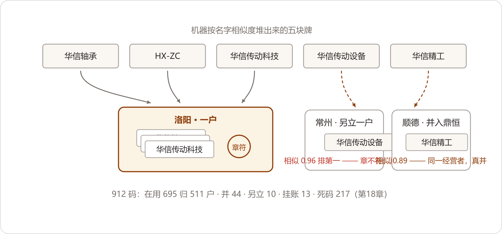

# 19 五个名字的供应商
*The Supplier of Five Names*

:::题记
"四月，啃这个。"
——陈临，2027年3月31日夜，数字办
:::

四月一号，星期四。负一层小库房的门一开，鲁向东还是他那个次序：先开灯，再把窗户支开一条缝，最后才去搬箱子。穿堂风把灰味搅起来一阵，搅不动了，那味就停在屋子中间。

长条案上的家什，头一天摆成了三摞。左手是死档的牛皮纸袋，一户一袋，袋侧的标签年前换写过新纸；中间是历年的老合同，复印件在上，原件压底；右手一函一函，是供应商的名称变更函，曲别针上别着回执。案角上单独放着他的章样簿——本脊前几天缠了一道白布胶带，缠得很平，胶带边口用指甲刮过。那本书翻毛了边，再不缠，四月撑不过去。

小夏把笔记本支在案头，赵峰拿来那摞打印纸，六十七组、一百八十八个编码，一组夹一种颜色的夹子。头一天就把走法定下了：小夏投一组上屏，几行名字，末尾缀着机器给的分；鲁向东翻章样簿看章，对得上的，他说一个"过"字，小夏记一笔，下一组；看不对的，挑出去单放；看不准的，合同、变更函、执照，三摞家什轮着上，还不准的，装袋，上会。

头一天下来，过了十四组。多数组就是换过名的老户，章一样，函上写着哪年改的，三两分钟一组。真正费工夫的是"疑"的：章换了模样，函又寻不见，得往老合同里刨。

晌午歇着，鲁向东问小夏，机器那个"堆"，是怎么个堆法。

"它不认字，认长得像不像。"小夏把屏幕转过去，"技术圈有个老段子——微博统计热搜，把王宝强和王宝宝分开算，因为在它眼里是两个字串。机器不知道王宝宝是王宝强的小名，就按俩人报数。"

鲁向东接过电脑，对着那个相似度的数字看了一阵，把电脑还回去，把章样簿推到她跟前，翻开一页——三枚红章并排盖着，深浅不一。

"我不看字，我看这个。"他说，"字会重，章不重。一个厂一枚章，章换了，函上写着为什么换——换名、换东家、合并，函的措辞不一样。三十年，攒了一册子。"

小夏拿手机把那页拍下来，拍完忽然说："鲁师傅，您这一册子，就是我们的王宝强名单。"

"它管堆，你管并。"赵峰在边上把话收拢了，"谁也替不了谁——这条上个月立过，这个月照办。"

* * *

## 一、骨架

供应商册的对词会，头一回开在清明前一个礼拜五。潘永年进门带了一袋新茶，给每只杯子抓了一撮，冲上水，才落座——第一册吵出来的四条规矩原样挂在白板上，一条没改，吵的架倒是新的。到得齐：潘永年、鲁向东、郑敏、许曼、赵峰、小夏，陈临主持，赵峰照旧记录。头一桩议的不是词，是这本册子的骨架——几百户供应商，词卡按什么章程摆。

小夏先说她的方案，说得快：按物料立，轴承一类，密封一类，紧固一类，锻件一类，树建起来规整，机器挂卡也顺。

鲁向东摇头。他在这摊上坐了快三十年，心里的账不是这么码的："我那柜子，在用一摞，暂停一摞，死档一摞。复评年年按状态走。你按物料立册，我们翻着费劲。"

一个说机器顺，一个说人翻着顺，各说各的理。许曼在边上只认一条："我认户，不认类。票开给谁我管谁。你们把一户立成一张卡，别拆散。"

眼看要僵，郑敏把问题单拿出来，念第三问："那家供应商当时的工艺变没变过？变更单谁签的？"她念得很慢，念完停了停，"审的是'当时'。审核员抽的是出厂三年五年的机器——供件那会儿活着的户，如今死了的，多了去了。死档的死，是采购的死。机器身上，件还活着。"

屋里静了一拍。鲁向东把章样簿往回收了收，想了想，先转的向："……在保机器身上，装着死档户的件。这话对。那死档户也得立卡——不立，链走到那儿，断头。"

陈临落字：一户一卡；物料大类不进树，进"供"栏，一户供几样，栏里写几样；合作状态进注。郑敏添的那句，后来写在册子的凡例上：树上的字，落笔就不动；会变的，注里待着。死档二百一十七码，凡在保机器身上有件的，立卡；一个没有的，登记，不立。

散会前誊样张，誊的恒鼎那张——五名一户，上个月裁过的，这回照新骨架重誊：

:::文书 总目·第二分册 词卡样张 · 4月2日
恒鼎\

D　代：恒鼎橡塑　恒鼎密封科技　恒鼎橡塑制品厂　恒鼎密封件\

S　供：密封件　橡塑件\

注：指宁波恒鼎密封科技有限公司及其前身同一制造主体。名称沿革：一九九六年注册"恒鼎橡塑制品厂"（圆章）；二〇一四年更"恒鼎橡塑"（合同存档）；二〇二三年更今名（方章，变更函存档）。ERP三个编码照旧，结算随账。状态：在用。凭据：供货登记、章样三枚、变更函两份。
:::

* * *

## 二、看章

华信组那一袋，鲁向东放在案头最顺手的地方。机器把五个名字堆作一团——华信轴承、HX-ZC、华信传动科技，加上俩生名："华信传动设备"，ERP里的老编码，八年没动过；"华信精工"，死档里的。这五个名字，哪几家真是一家、哪几家不是，得看章。凭据前后抠了好几天。

先抠"华信传动设备"。挂这个编码的老订单调出来一共十一张，2017年到2019年，供的是弹性柱销联轴器。章样簿翻到华信那页：洛阳华信的章是"洛阳华信轴承科技股份有限公司"，老订单上的章是另一枚——"常州华信传动设备有限公司"。常州。洛阳华信的变更函一函一函过完——早年叫华信传动科技，后来改的今名——没有一函提过常州。潘永年在电话里也认："常州那家做联轴器的，后来人家不做了。跟洛阳华信八竿子打不着——起名的时候都相中了'华信'俩字罢了。"

难的是"华信精工"。死档袋里两份合同、一沓送货单，冲压垫圈，供过三年，2015年就没了流水。章样簿上有它的章，早年间盖的："顺德华信精工模具厂"。照说这又是一户顺德的、带"华信"字的，跟洛阳两不相干，照常州的路数另立一户就是了。

坏在鲁向东多看了一眼送货单。

单子角上有签收回单的字，圆珠笔，写得快，尾字带钩。他盯着那行字看了一阵，起身从在用那摞里抽出鼎恒的袋子，翻出鼎恒的送货单，两张并排摆在灯底下。

"一个手。"他说，"鼎恒的回单，也是这只手写的。这个字我认得——这些年顺德的回单一到，不用看章，我先认字。"

小夏把两份档案里的营业执照复印件寻出来，并排扫进电脑。华信精工模具厂是个体户，名字写在经营者一栏；鼎恒橡塑是法人企业，名字写在法定代表人一栏。两个名字，一个字不差。

清明歇了三天。第二回会，开在清明后头一个礼拜二，头一项就议华信组。小夏把机器那一堆投上屏：五个名字抱成一团，相似度标在名下——华信传动设备，零点九六；华信精工，零点八九。

鲁向东把凭据一样一样摆开：常州的章，洛阳的函，顺德的两份执照。裁决落字：华信仍旧三名一户；"华信传动设备"另立一户，注里写常州、联轴器、供货三年、今无流水；"华信精工"并入鼎恒，死码挂到鼎恒的代底下，来路写进注。潘永年会签，签完把"并入鼎恒"那行又看了一遍："机器把顺德的名，堆到洛阳那堆里——隔着一千五百公里，就为俩字。"

"堆是它的事。"鲁向东说，"是不是一家，章说了算，执照说了算。这一堆，我一个都不挑。"

小夏把屏幕上那个零点九六看了又看："相似度没说谎，它就是只管像。我论文里管这叫实体对齐，鲁师傅管这叫看章——各管一半，谁也替不了谁。这堆五个名字，三家人。"

赵峰在记录本上落这条的时候，末尾添了半行：华信组，真分一户，真并一户——并的，还不是机器说的那家。

:::文书 总目·第二分册 词卡（节录） · 4月6日补页
鼎恒\

D　代：华信精工（死档）\

S　供：橡塑件\

注：指顺德鼎恒橡塑厂。"华信精工模具厂"系同一经营者另立之个体户，二〇一二至二〇一五年供冲压垫圈，后歇业。并入凭据：营业执照二份，经营者同一；送货单笔迹同一。死码随本户立卡。
:::

* * *

## 三、中段

往后的日子长出了一个模样。小夏头天傍晚把第二天要过的组按分从高到低排好；鲁向东坐灯底下，一组一组地翻。堆得对的快过，"过"字出口，一组就算清；错的挑出去；疑的，三摞家什轮着上。案上的牛皮纸袋一垛一垛矮下去，过了章的挪到墙根，码成一排，又码一排。越往后越快——单名独户的，机器起好卡坯，向东抽着看章，一天能过上百。到四月十号，四百出头个编码有了归宿。

鲁向东这个人，这个月让数字办重新认了一遍。他的章样簿越翻越毛，胶带缠上了第二道；他记得每家的脾气——洛轴的货不迟到，迟到必是铁路的事；晋南的章印泥淡，得看三遍；恒鼎的老板娘押车，回回亲自来；常州华信的老板自己开车送货，回回晚三天，货款却从不拖过月底。这些脾气不在任何一张表里，全在他身上。有一组，"红星标准件"和"晋南标准件"，名字隔着十万八千里，机器压根没堆——他翻着翻着停住，说这俩是一家，乡镇企业改的制，老户没销。一查变更函，果然。这样的对儿，他前后抠出十一组。

"机器堆的是长得像的。"赵峰把这类记进本子，"长得不像、睡在两处的，还得人来想。"

祸是在议程最满的一回会上出的。散会前剩最后一组：豫东锻压、豫东锻压件厂。两行名字差一个字，机器给的分，九成六。到会的还剩四口人，走了急通道。鲁向东那天看了六十几枚章，眼里红印子还没退，翻到那一页，两枚圆章并排盖着，红的一深一浅。他看了两眼。

"一个章。过。"

五天头上，郑敏的复评对账把这一组翻了回来。她那阵子每并一户，就从质量系统抽几张进厂检验台账核对。豫东这组抽的五张锻件材质证明书，炉批号前头的厂名出来了两个：一个郑州，一个新乡。

她拿着复印件下到负一层，在灯底下摆开，说话放得很慢："豫东这组，废。两家的厂名。你们点的头，我得拆。"

规矩头一回从头走到尾。先查堆——机器堆的，它没说谎，两行名字就差一个字；再查凭据——两枚章摆在一页上，弧底那圈字小，"件"字挤在最下头，红印又深，看漏了；最后才问人。鲁向东把那页翻来覆去看了两遍，才开口。

"那天擦黑，眼花了。"他说，"三十年，头一回。"

第二天他把自己的章样簿抱到数字办，搁在小夏桌上，站在边上看她一页一页扫。扫完，"豫东"那页投上屏，放大到半个屏幕——"件"字从弧底浮出来，清清楚楚。鲁向东盯着看了半天，说了一句："早有这个，能少花二十年眼力。"

下一回会，豫东拆回两户，勘误页进了册，记录本上他那行名字后头跟着记了一笔：看章有误，复评对账收回。潘永年在会上把这笔账算圆了："洛轴那回，货一家，钱三户；豫东这回，人一家，厂两家——爷俩分了厂。词认厂，不认血缘。这个我也认。"

打这儿起，看章添了一道工序：凭据一律扫描，放大了比。

* * *

## 四、会长的库

分册二的词卡一张一张长着，赵峰在楼上干他的活。

那台旧主机还蹲在机房角落，风扇响了一年了。四月里它换了活法：每天夜里，ERP和MES的新数自己往里走——新开的工单、新到的批次，先过总目的词表认名字；认得的，自己挂上；认不得的，进一个待核的队列，一个节点也不许悄悄生。齐连升那边捎过话来，四月头一个礼拜新开的工单，批次栏又是全满——三月堵上的口子，如今夜夜往图里灌数。

"六月那阵，我管它叫会表演的库。"赵峰把队列调出来给陈临看，"这回我想让它会长。长得动，才叫活。"

待核队列头一个礼拜逮着七个生名。五个是老户换了写法，看章认了；一个是广东一家新户，走复评的通道，霍岩那边起了档，进了图；还有一个，新到发票上打了"华信传动配件"，机器又想堆给华信——待核挂着，等章。鲁向东听了直摆手："华信俩字，还能再来仨。"

词卡将齐的时候，方致远把JS系列的型号序列表送了来。赵峰拿它当字典，把ERP里JS-1100出厂的机器从头一台往后灌。三千八百多台，一台一个圆。链全的，三千二百上下；缺一环两环的，六百三十多台，一台一张缺失卡，缺什么、查过哪儿，一行一行在补。头年六月那二百八十五台，如今是这三千八百多里头的二百八十五。

分册二定稿在四月十六。在用的六百九十五个编码，归成五百一十一户——机器堆的、向东抠的、过章时顺手并的俩码一户，都在里头；死档在保户六十七，共五百七十八词。OA里会签走了一圈，礼拜一早上走完，六个名字一个一个亮起来。装订机咔哒了一下午，册子码齐的时候，郑敏把那页"另页一行小字"念了一遍：挂账十三组四十九码，凭据齐一组，收一组。映射本那十九行待核，收了十三，余六。

册子装订出来那天，刘振邦下了趟楼。他站在数字办门口，手里是三月底让人送去的第一分册，边角已经翻毛了。"第二本几号给我？"他问。听说挂账的几组还得十天半月，他点点头，又问："九百多个编码，半个月清了大半——你们几个人？""连机器，仨。"陈临说。他没再问，走之前留了一句话："我原估的半年。别在最后二十天掉链子。"

纸本下档案室那天，登记簿上四月排满了两页。叶老把分册二接过去，先看词数那页，再翻恒鼎的卡，五名一卡，他看了有一阵。

"我们那年并词，'联轴器''联轴节'，两张并一张，旧卡收走销了。"他把册子合上，"你们留着当代——对。死名字是路，引道用的。"

他问第三册做谁。陈临说，审完这一场再说。叶老点点头，把册子放进第三排柜子腾出的那格，挨着第一分册，受控编号档〇三二，钥匙拧了半圈，把册子摆正，才让开身子。

* * *

## 五、合龙

老蔡的季账排在四月二十上午，审计小会议室，到的人比冬至那回多——陈临、郑敏、赵峰、小夏、鲁向东，潘永年后半段才到。

账从编码起头。陈临照实报：九百一十二个编码，死码二百一十七，在用六百九十五；机器标的六十七组一百八十八码，并了四十四组，另立十组，凭据不齐挂账十三组，各组的章、函、执照拍照进档；鲁向东另抠出十一组机器没堆着的；分册二，五百七十八词，四月十六定稿。老蔡一行一行记，记到"挂账十三组"，抬了下头："五一前清得完？""清得完。凭据齐一组收一组。"

错案那一笔，也照实报：并错一组，五天，复评对账收回，勘误一页，记录在案。老蔡问怎么错的。鲁向东答的："眼花，看漏一个字。"老蔡的笔停了停，没批，只问："往后怎么看？""扫描，放大了看。"

晋南那桩险的也报了。四月里晋南换了开票名称，郑敏当天改了词卡，财务的代付对照表三天后才跟上，中间一笔款转了人工。赵峰把账摊开："一个词，后头六处要跟。这回跟上了三处，漏了一处，撞上一处，还有一处，到今天没人说得清改没改。正本是立了——照抄，还是靠腿。"

老蔡把这行记下来，记完说了半句："链能重演，抄送重演不了。"他把本子合上，"下午，链，我自己走一遍。"

下午的机房，椅子不够，鲁向东站着看。小夏把JS-1100的出货台账打印出来摊在桌上，三千八百多个序列号，抽签的规矩照彩排——她闭着眼从中间抽了一张，展开念："2110376。"

赵峰敲下序列号，回车。头一个亮起来的是整机：出厂二〇二一年十月，机型卡上挂着第一分册的词。往下走，装配批次；批次底下两样关重件——轴承批次，油封批次。点到轴承批次，供应商那格亮出来的是华信，一个节点，三行代名收在名下；名下挂着变更：热处理，GG-23-002，二〇二三年一月签发，注里标着——本批在前。点到油封批次，供应商亮出来的是恒鼎。一个节点，不是三个。名称沿革挂在名下：供本批时，名"恒鼎橡塑"。

:::文书 演示机·全链读数 · 4月20日
序列号2110376｜JS-1100｜出厂2021年10月\

装配批次ZP-2110-34｜轴承批次HX-2109（华信）｜油封批次HD-2108（恒鼎，供批时名"恒鼎橡塑"）\

变更：华信热处理GG-23-002（2023年1月），本批在前｜恒鼎名称沿革三见，工艺变更：无\

发货：直销｜客户：鸡西一家矿务局机修厂，最终用户同一｜售后：透气帽备件两单\

试车记录末行：试车员　唐守拙
:::

"头年六月，"郑敏开口，说得很慢，"这一屏，站着仨恒鼎。"

赵峰没接话。他的手从键盘上拿下来了，搁在桌沿上。

屋里静了一阵，静得听见那台旧主机的风扇。郑敏的台账搁在膝盖上，从头到尾没翻开。她看着链上最后一格亮定了，才说话："头年三月，这一趟，我一个下午。"停了停，"这回，六分钟。"陈临没看链，看的是她膝盖上那本没翻开的台账。

她又问了一句："四月新到的批次呢？"赵峰点开华信名下最末一个节点——四月十四到货的一批，十五号夜里自己挂上的，挂的时候连装配工单一起带了出来。郑敏看了一眼，点头。

"老唐的手续批了。"她接着说，声音没变，"五月三十一号。"

陈临看着屏幕上试车员那一行字，没接话。

老蔡从椅子上起来，把赵峰从键盘前挤开，坐下，一个指头照着纸上的号敲那串序列号，敲错了一回，退格重敲。回车。链从头又走了一遍，一格不差。他看完，在硬壳本上记了一行，然后自己从那摞台账里抽了一张，抽在很靠底下：2205418，二〇二二年的机器。

链走到轴承批次，停住了。屏幕上亮出来的是一张缺失卡：批次栏当年未填；查过MES，查过装配纸档，经手人已退——缺。

机房里没人说话。老蔡盯着那张卡看了半晌。

"缺，答得出缺在哪儿。"他把本子合上，"这个，也写。"

散的时候，老蔡在机房门口站住，回头说："能重演的，写进报告——如今是全链。二十天，链别断。"

楼上，陈临把白板右下角那行旧字擦了，另写一行：四月二十，链合龙。距五月十号，二十天。写完他把笔帽扣上，下楼锁机房。夜里的增量要跑，机器不能关。锁门前他在门口站了一会儿——里头那台风扇，一声一声地转着。

:::日志 2027年4月20日夜
供应商这一柜清完，合龙那天，记账：
- 总攻的账：912码，死码217，在用695；机器堆的67组188码——并44组、另立10组、挂账13组（五一前收完）；向东另抠11组，机器压根没堆的。分册二578词（在用户511＋死档在保户67）。映射本19行待核，收13余6。词认厂，不认血缘——洛轴是货一家钱三户，豫东是人一家厂两家，一个词只认一样东西：制造主体。
- 华信组，给"机器认字不认章"又上了一课：五个名字，相似度最高的俩——一个常州，真分，另立一户；一个顺德，真并，并进鼎恒，跟机器说的那家不沾边。王宝宝是王宝强的小名，机器不知道；顺德的回单是哪个老板娘的字，机器也不知道——向东知道。对齐这活儿，一半长在相似度上，一半长在人身上，向东那本缠了胶带的册子，就是后一半。
- 错案一例，照实记：并错一组，五天，复评对账收回。规矩头一回走到底——先查堆（没错，它只管像），再查凭据（"件"字挤在弧底），最后才问人（眼花，三十年头一回）。章样簿进了扫描仪，往后再错，就赖不到眼力了。这一回证明的是：错能被对账逮住，能收回来，记录在案。
- 库会长了：夜夜增量，批次栏必填的数往里灌；认不得的进待核，一个节点不许悄悄生；新户走复评通道进图。JS-1100三千八百多台入图，链全的三千二百上下，缺环六百三十多，缺失卡一张一张补。其他机型，入图为零——照实，这是剩下二十天里明处的窟窿。
- 合龙：2110376，六分钟，从序列号走到鸡西那家机修厂，中间五个名字的恒鼎，一屏一个。郑敏的台账搁在膝盖上，没翻开——头年她问我，等她退休这本账怎么办。老蔡自己敲的序列号，走了一遍，又抽了一台缺的：缺，答得出缺在哪儿。能重演的，如今是全链。
- 欠的账：词改正本一处，后头六处跟着改，如今靠腿——晋南那回，三天，转了一笔人工。机制没建，审核完的头一件就是它。老唐的手续批了，五月三十一。离五月十号，二十天。
:::
