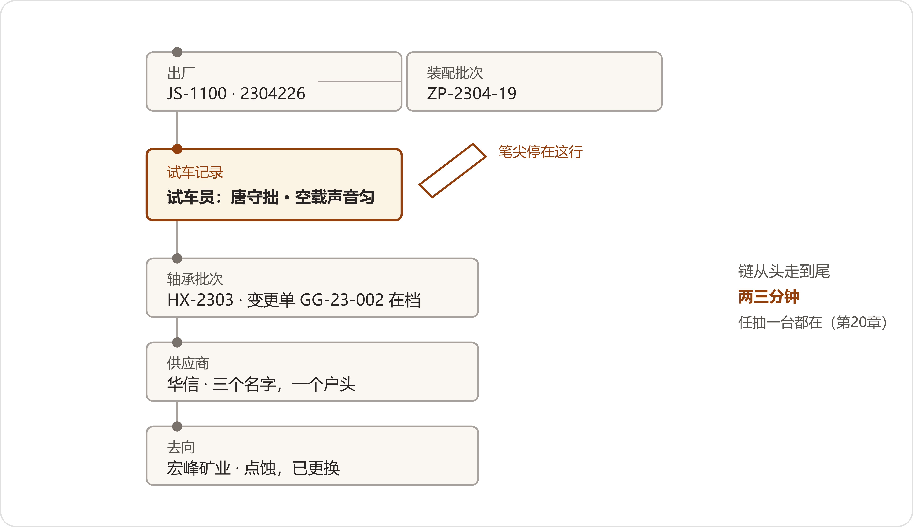

# 21 审核日
*The Audit*

:::题记
"我七点半到。"
——唐守拙，2027年5月8日夜，电话里
:::

五月九号，过四点，一辆灰色商务车开进厂区，在招待所门口停下。招待所在厂区西南角，两层小楼，原先住外协的师傅，前年粉刷过一回，墙根还留着爬墙虎的旧架子。门房把桌上那沓新办的出入证拆出四张，一张一张登记，夹进塑料皮的证夹里。

车上下来四个人。翟工在前头，手里一只旧公文包；为首的那位五十上下，深色夹克，递了名片过来，姓岳，瀚风供应商管理部，评审组组长；跟着一位女的，四十多岁，姓单，管体系；最年轻的抱着笔记本电脑，姓蒋，一路没大说话。周建海和陈临在台阶底下接着，握手，说了两句路况。

"四位先歇着，晚上食堂便饭。"周建海说。

"工作餐，行。"岳工说，"老翟路上都讲过了，不喝酒。明儿早上的会，按信里写的走，就这么定？"

"就这么定。"

没再多话，四个人上了楼，脚步声在楼道里响了一阵，停了。陈临出来的时候回头看了一眼，二楼东头两间亮着灯，窗帘拉着。

那天夜里，数字办的灯九点就熄了。该做的都做了：快照锁着，凭据排着，页签贴着。陈临把那页日程的打印件又看了一遍，看完没动它，夹回蓝皮本里。下楼的时候他绕到机房门口站了站——里头那台风扇，还是那么一声一声地转，夜里的增量照旧要跑。走出厂门他回头望了望，招待所那排窗户，十点不到就黑了。

* * *

## 一、七点半

第二天一早，陈临进厂。装配车间的门开着，夜班刚交，地坪冲过还带着湿气，试车台那头有一台机器空载转着，声音匀匀的。他在三号工位门口碰见老唐，工帽推在后脑勺上，手里捏着一团棉纱，正低头擦手。

"您几点来的？"

"七点半。"老唐把棉纱团起来塞进工装兜，"转了一圈。四号台的皮带轮罩子，螺丝松了两颗，我叫小魏紧了。别的没毛病。"

他先上楼去了。过了八点，应审的人陆续到了会议室：郑敏提着两个文件盒，盒盖上的标签一栏一栏写着；赵峰把笔记本接上投影，把图谱快照的目录点开，又合上；潘永年和鲁向东一前一后，凭据盒抱在怀里；方致远把那册联系单索引码齐了压在手底下；周建海来得最晚，进门在裤袋上按了按，那页答词折起来装在里头。刘振邦跟在后头，在后排靠墙的椅子上坐下，谁也没招呼。

八点四十，四位审核员从招待所走过来，脚程五分钟，进厂门的时候出示了出入证。九点整，首次会议开始。董鸿章坐在长桌尽头，等秘书把材料发完才开口。他一共说了三句话。

"欢迎四位来青山。"

"题是你们出的，答卷的人今天都在这屋里——照实答；答不上的，也说答不上。"

"我讲完了。"

他就真讲完了，往椅背上靠了靠，端起茶，再没出声。岳工把四位分工作了个介绍，跟着讲了两条：一条，今天看的是抽出来的样本，抽着什么验什么，样本之外的风险，得靠厂里的体系自己兜着，他们只看兜的法子；另一条，要调什么、要叫什么人，随时开口，别的不麻烦。首次会十五分钟散了。

* * *

## 二、抽签

现场核验设在数字办。长条会议桌上摆着两样东西：左边，翟工带来的在役清单，打印的，两页；右边，郑敏一早从文控提来的出货台账，牛皮纸封面，翻毛了边，JS-1100出厂的三千八百多个序列号，一行一行，从二〇二〇年排到今年。赵峰的电脑接着投影，幕布上投着图谱快照的封面页，右下角一行小字：受控，快照月存。屋里那台立式空调嗡嗡地吹，谁也没去关它。

岳工不坐，站在桌边。他把在役清单翻开，手指头顺着页边往下走，走到第二页中段停住了。

"在役清单上，JS-1100占了八成。有一行JS-800，一八年那批。"他抬眼看周建海，"这个型号，什么说法？"

周建海往前凑了半步。"链在图外。记录都在——档案室、文控、老台账，抽它我们走纸档，一台，半天。预审表上写的是'在建'，建到哪一步，表上都有数。"

岳工"嗯"了一声，笔帽在JS-1100那一行点了点。"先抽量大的。"他回头叫翟工，"型号你定不了，序列号你也别沾——回头台账上抽。"翟工笑了一下，往后退半步，两只手背到了身后。

岳工把出货台账拿起来，也不看人，往前翻，翻过一指厚，又翻过一指厚，停住，倒回来几页，睁眼，拿笔杆点在一行上。

"2408213。"

赵峰坐到键盘前，序列号敲进去，回车。头一个亮起来的是整机：JS-1100，出厂二〇二四年八月，机型卡上挂着第一分册的词。往下走，装配批次，试车记录，出厂检验；批次底下两样关重件——轴承批次HX-2407，供应商一格亮出来，华信，一个节点，三行代名收在名下；油封批次HD-2406，恒鼎。岳工伸手往下压了压："停。华信名下的变更，调出来。"

赵峰点开。变更：热处理，GG-23-002，二〇二三年一月签发，本批在后。变更确认单跟着亮出来，单子上两行日期并排——签发一行，确认一行。

"确认单原件。"岳工说。

单工起身跟郑敏到文件盒跟前，盒里凭据按序排着，隔几秒，郑敏把那两页原件抽了出来，放到桌上。单工把原件跟屏幕并排看了一遍，点头，把纸放回去。

"确认是后补的？"岳工问。

"宏峰之后头一件补的。"郑敏说，"经办调走了，流程重新走了一遍。两行日期都留着，没抹。"

链接着往下走：发运，直销瀚风一处风场；售后记录，空。从头到尾，郑敏掐着表，两分五十秒。屋里只剩投影仪风扇的声音。

岳工在单子上记了一行，抬起头来。

"再抽一台。"他把台账又拿到手里，这回不翻了，直接说，"二〇二三年春天的。三、四、五月，哪页是哪页，我自己找。"

陈临看了翟工一眼。翟工没接这个眼色，低头往本子上记着什么。台账翻到二〇二三年四月，岳工的笔杆落下去。

"2304226。"

赵峰敲进去。整机亮出来：JS-1100，出厂二〇二三年四月，装配批次ZP-2304-19。试车记录点开，末行一行字——试车员，唐守拙。岳工把这行念出声来，回过头。老唐站在窗根底下，工帽拿在手里。

"我。"老唐说，"这台我试的车。"

链往下走。轴承批次HX-2303，华信；变更GG-23-002，本批出在签发之后，确认单齐。岳工的笔停在这批轴承上。

"这批轴承，除了这台，还装在哪些机器上？"

赵峰敲了个回车。图谱上那批轴承的节点向外张开，六条线，连着六台机器，本台是其中一条。另外五条：两条连着同一风场的另两台；一条连着选矿厂；剩下两条归成一行，那一行尾巴上挂着一行小字。赵峰把它放大——宏峰矿业，皮带线，二〇二六年三月，点蚀，已更换。

屋里静了一拍。

"这台出过事。"岳工说。

"宏峰那十一台里的一台。"郑敏开口了，说得很慢，"根因是华信热处理，二三年初换的工艺线。机器都换了轴承，根因报告、处理记录，在案例库挂着。"

"同一批轴承，也装在风场那两台上。"岳工的笔点了点屏幕，"矿上的蚀了，风场上的呢？"

"宏峰的函来那礼拜，这张单子我拉过。"郑敏说，"同批六台，两台在你们那边。我请售后跑了一趟，风电工况轻，没蚀。跟踪记录一回一季度，记到今天。"

岳工看了她几秒，在本子上记了两行。"进厂检验。这批轴承，当时怎么放的行？"

郑敏点开检验节点。进厂检验报告亮出来：尺寸、游隙、外观、硬度抽检，栏栏合格。报告底下另起一行，缀着一条注，字体跟正文不一样，深一号。郑敏没念，把屏幕往岳工那边偏了偏。岳工凑近，一个字一个字地看。看完他直起身。

"这一条，念一遍。"

单工站起来，念得很平。

:::文书 进厂检验台账 · HX-2303批 存档注（2026年11月补记）
到货当日，装配车间首席技师唐守拙于盘车工序反映"手感不对"，嘱班组复测游隙两遍，均在图样范围；硬度抽检合格，放行。口头告知当班检验员，未落单——当时无此单据，亦无此惯例。\

本注依据：2026年3月根因分析报告；唐守拙口述录音第二十回（2026年11月5日）。记录：夏雨桐。审核：郑敏。
:::

岳工转向窗根底下。"唐师傅，注里的反映，是您。"

"是我。"

"当年为什么没落单子？"

"数没超标。落了单子，开评审，采购找供应商对质，数又是合格的——末了落个没事找事。"老唐说，"那会儿就这规矩。"

"现在呢？同样的事，现在怎么落？"岳工问的是全屋。

"现在不看数超不超标。"郑敏接的，"质量异常单，口头反映也开，两联，一联质检一联归档。手感那种说不清的劲儿，进条目，原声挂着。"

岳工点了下头，往本子上记。链上回到华信节点的时候，他的目光在侧栏停住了。

"华信传动配件——这个怎么挂着？"

"四月新到发票上冒出来的生名。"赵峰说，"机器看长得像，堆到华信那堆里了，标了待核。章没回来，采购没点头，一个节点不许悄悄生。"

岳工看翟工。翟工说："该等的，等着。"

试车记录的纸档，岳工也要看。齐连升打发人回车间档案柜去取，等的那几分钟，岳工问潘永年："关重件的户里，歇业的有没有？"

"有。死档二百一十七码，凡在保机器身上有件的，一户一卡。"

"抽一张。"

赵峰敲进去：华信精工。屏上亮出来的是鼎恒的卡，死码挂在"代"底下，注里写着来路：顺德，个体户，经营者同一，二〇一五年歇业。鲁向东把那只牛皮纸袋从凭据盒里抽出来，隔着桌子递过去。岳工倒出老合同看了一眼，连袋递了回来。鲁向东把纸袋收回凭据盒，动作放得很轻。小夏在他身后压低了声："王宝强名单，又递出去一回。"

"在。"他说。

试车纸档到了。单工把纸上的签名跟屏幕上的"唐守拙"对了对，一个字一个字地对，对上了，才合上手里的本子。末了，岳工把台账合上，拿手拍了拍封面。

"三千八百多个号，链全的有多少？"

"三千二百上下。"赵峰说，"缺环六百三十多，一台一张缺失卡，缺什么、查过哪儿，一行一行记着，正在补。"他把打印好的缺环清单一沓推到桌子中间，"缺的一台一行，都在这儿，您点。"

岳工把那沓清单拿过去，翻了半页，笔杆点在其中一行上。"那就抽台缺的。"

赵峰敲进去。屏上没有链，亮的是一张卡：批次栏当年未填；查过MES，查过装配纸档，经手人已退。缺。底下两行小字，写着查的日期和查的人。岳工盯着那张卡看了半晌。

"缺，答得出缺在哪儿。"岳工没合本子。他把在役清单又拿了起来，翻到第二页中段，笔杆点在头里跳过的那一行上。

"JS-800，一八年那批。"他说，"补一签。"

周建海往前凑了半步："链在图外，走纸档——"

"我知道你走纸档。"岳工说，"上午两台，链上都是顺的。我就想看看，链外头那台，是个什么走法。"

陈临看了郑敏一眼。郑敏把出货台账翻到二〇一八年那一段，指尖顺着序列号往下滑，停住了："二一〇七〇四六。鲁师傅，文控那半边你熟，麻烦陪我走一趟。"鲁向东把凭据盒往怀里拢了拢，起身跟她出了门。单工跟在后头，蒋工抱着电脑小跑了两步。

走纸档跟链上不是一个走法。装配纸档在车间档案柜，老台账在文控，试车单在技术部底档，三家各存各的。郑敏在文控翻到出厂检验那页，签名栏一个名字她认得，拿起内线电话打到装配车间："纪班长，二一〇七〇四六，试车单在你们三柜，劳驾抽出来。"等纸的工夫，单工把进厂检验报告原件从头翻了一遍，尺寸、游隙、硬度，一栏一栏对。

电话是老唐接的。二一〇七〇四六，这台他试的车。试车单从车间送上来，他跟着一块儿来的，纸搁在桌上，他站在桌边没走。单工把纸上的签名跟台账对了对，又把老唐叫住了："这台车试完到出厂，中间隔了几天？"

"四天。"老唐说，"有记载，单子背面有日期。"

单工把单子翻过来，看了一眼，点了个头。

最慢的一环在华信。二〇一八年的变更单，档案室调档号在图谱上挂着，纸本在负一层。电话打下去，叶老在架子跟前站着，十来分钟，把存根抽了出来，让小夏拿上来。签发一行，确认一行，两行日期并排。岳工拿在手里看了看，又看了看调档号，把它跟屏幕上挂着的那一栏对上了。

前后四十来分钟。岳工把纸档一页一页码齐，推回桌子中间。

"链外这台，纸档齐。"他在本子上记了一行，笔尖顿了顿，"就是慢。四十分钟，一台。链上那台，两分五十秒。"

屋里没人接话。这话不用接——六百三十多台缺环，一台一张缺失卡，那张卡上写的，就是这个差。

"该人记的，机器记不了。"岳工把本子合上，"这一签不算不符合——算我看见了。"

他把那沓清单搁回台账上头，朝翟工抬了抬下巴，"这边的，完了。"

翟工看了眼腕表："各位，二十分钟后，访谈。"

* * *

## 三、四十分钟

访谈挪回会议室。四位坐定，蒋工的电脑摊开，指尖在键盘上搭着。青山这边，方致远、郑敏、潘永年、赵峰、小夏都在，老唐坐在长桌末尾——进门先把工帽摘下来挂在门后，他从六月里养下的这个规矩，一天没改过。幕布的光打在桌面上，白晃晃的一片。

变更管理在前头。单工主问，翻本子慢，一句是一句：程序文件、近两年的记录清单、联系单一百三十七张、存量清完的台账。问到半截她抬起头。

"临时更改，补录，有时限吗？"

方致远把那册索引码齐了，才开口。"没有。前年外审就写过'补录不及时'，存量去年清完了。联系单七日补录，纪要里有这么一条——纪要不是程序，写进受控的程序文件，还差这一道。"他把索引往桌中间推了推，"哪天补、补多长，该有个数。这条我们认。"

单工记下了，没再追问。GG-23-002的确认流程，岳工补了半句"上午看过了"，这一节就过去了。

变更管理问完，岳工把笔搁下。

"4.4的后一半。"他说，"翟工邮件里写了，我们想看传承的——进行时，不拘形式。唐师傅，您讲。"

老唐没起身。他坐在那儿，朝小夏那头偏了偏头。小夏把条目表投上幕布，四栏：症状、部位、原因、方案。他没看幕布，看着自己面前那块桌面。

"讲个响吧。"他说，"JS-1100，有一种响，闷的。隔着一级传出来，中间裹着油，听着发浑。条目上写：症状，闷响；部位，行星轮；原因，经一级齿轮传出，油膜裹声；方案，判法五步，拆检从高速级起。"

他停了停。

"字都对。那个劲儿，字里搁不下。"

小夏把鼠标移过去，条目底下挂着的那截原声点开了。会议室的音箱里先出来一阵很轻的沙沙，跟着一声闷的"嗡"，过去了，又回来了一遍。十几秒。放完，音箱静下来，楼道里有脚步声走过去，远了。屋里没人说话。

"就这一段？"岳工说。

"学这个的，先听熟。"老唐说，"听几十遍，再看书。"

赵峰接过鼠标，从条目点进图谱：症状连着部位，部位挂着第一分册的词，词底下缀着原声和拆检顺序，一路点得下去。"条目一百一十六条，挂着的录音四十四回，一礼拜核一回。"他说，"还有十三条，草的，没誊清。"

"这十三条，谁誊？"单工问。

"我记，唐工核。"小夏说，"礼拜四。"

岳工记了一笔，又问郑敏："条目里的词，跟总目怎么对？"

"部位栏，一回一对茬口。"郑敏说，"挂的是正词，代名引见。注主笔的份内事，我管着。"

"有人在用吗？这套东西。"

小夏换了屏。矿上的回传记录投出来，四月末的：二号皮带线，空载有沙沙声，匀的；当班的按条目列了观察，记了两班，声没加重，油温没爬，没拆。落款，吕向阳。

"这个字，他用对了。"老唐的手指头在桌沿上点了一下，"匀。"

"您带的？"岳工问。

"没见过面。"老唐说，"他师父，听过我的录音。"

岳工把这句原样记了下来。记完，他把笔搁在桌上，看着老唐。屋里静了几秒，空调的风声都听出来了。

"唐师傅，材料我看过了，手续批的月底。"他说，"您走了，这套东西，往后怎么转？"

老唐没马上答。他朝幕布上看了一眼，那屏上还停着小吕的回传，落款两个小字。他把眼光收回来，落在桌面上。

"条目在，声儿在。"他说，"学的，先听声儿，再看字。"

隔了一阵，他又添一句："礼拜四我照来。十三条没清。"

"到什么时候？"

"到清完。"

岳工点了下头，翻过一页。"关键岗位，不止唐师傅一位。"

"纪班长，装配的，十一月退。"齐连升说，"他三十年记的排产本，扫描进档了；带的人，小魏他们那一批，今年顶上来俩。"

"下午我看看。"岳工说。

蒋工的键盘响了一阵，停了。翟工那本子摊着，页上只落了一个日期。访谈到点，岳工合上本子，收尾就一句："四个人都听见了。"

* * *

## 四、午后

午饭在招待所食堂，四菜一汤，没人劝酒。饭后审核组回招待所整理上午的记录；再开工的时候，人分成了两路：岳工和翟工下车间，单工带着蒋工在文控和数字办看受控文件、记录、案例库。

装配车间午后比早上闷，天车的活排得满，机油味里混着切削液的味道。岳工走到工位边上，从齐连升手里抽了张当班的工单——批次栏是满的。再抽一张，还是满的。

"以前呢？"

"去年抽一百张，空十一张。"齐连升说，"如今新单必填，系统拦着；旧的缺，进缺失卡。"

在四号工位，岳工叫住一个年轻人，让他离开班组长几步，单独问。年轻人叫小魏，二十二，今年头一年独立当班，工牌带子上有道油渍。

"装配里碰上说不清的事，你怎么办？"

"记异常单。"小魏说，"听不准的响，库里有唐工的声儿——先听，再拆。"

"上回使，是什么时候？"

小魏想了想："上个月。三号那台，油泵的音儿不对，我先查的库，对着声儿听的，没拆错地方。"

齐连升在边上补了一句："纪班长带的，就这批。"岳工在本子上记了，朝翟工那边看了一眼。翟工冲小魏点了点头，没说话。

试车台上正跑着一台新装机的。老唐跟着这一路走到台边站住，听。听了十几秒，他扭头对齐连升说："三速那一下，有点紧。新装的，跑半小时再听。"齐连升应了，安排人守着。半小时后复听，声匀了；复测的单子，齐连升亲自贴在工单后头。岳工全程看着，末了问老唐："要是没匀呢？"

"拆。"

"依据呢？"

"耳朵。"老唐说，"条目上有拆的次序。"

文控室里，单工看受控文件看得慢。总目第一分册、第二分册，受控编号档〇三一、〇三二，改版记录、发放记录、月存的快照目录，她一页一页对。对到第二分册的勘误页，她停下来："并错过？"

"豫东，一组。"潘永年说，"人一家，厂两家，爷俩分了厂。并错了，五天，复评对账收回来，勘误一页在册，记录本上有名有姓。"

单工把那页看了两遍，放回去，又翻开委员会的记录本——深蓝布面，竖着翻的那本。翻到四月三十日，她放慢了。第一笔错词，金岭。她从头念到尾，念到"点头：潘永年。善后：潘永年"，抬起头来。

"这一笔，怎么起的头？"

潘永年把金岭那套凭据从文件盒里抽出来：更名函，新旧执照，两串对不上的代码。"函上写更名，码对不上，是换户。我们当更名改了词，四天，收了回来。追回的合同重签了四张，台账更正三页。"他把东西一样一样码回去，"我点的头，我去善后。"

"要是审核这两天，正赶上你们改错了词呢？"

"赶上了，就这么答。"陈临在边上接的，"本子在这儿，错在明处。"

单工把记录本合上，拿手压了压封皮。"这条，我们记正面观察。"

案例库的抽查，单工点了两样。头一样透气帽：矿上改过防尘罩的，库里有没有说法——三号线那一案调出来，双签，带回传标签。处理人不在厂里，电话打到矿上，免提摆在桌上，那头的风声一阵一阵灌进来。段兴在那边讲了三分钟，从罩子讲到滤网，末了说："记录都在库里。我讲的要是跟库里不一样，以库里的为准。"单工听完，把电话挂了，朝蒋工那边抬了抬下巴。

第二样是问答。单工出题："JS-1100，冬季低温工况，推荐什么牌号润滑脂？"小夏当场敲进去，回车按得比平时轻。答案带出处——《润滑管理规范》，2024版，条目编号跟在后头。单工叫文控把规范原件调出来，版本号对上了，才合上文件夹。后排的刘振邦把椅子往前拉了拉，把那行出处又看了两遍。

客户口径也问到了。单工翻着预审的自评表："客户数，你们报过两个数。现在呢？"

周建海站起来，口袋里那页答词一下也没摸。"两行注。票给谁，谁是客户；货谁用，谁是最终用户。三百八十七，四百六十二，各是各的账。意向客户，挂了账，销售域的册子往后立。"单工在那张表上记了一笔，跟记别的行没什么两样。

"挂多久了？"

"三月挂的。"周建海的手指头在本子上点了两下，"审完这关就动。"

单工又问营销口的知识归谁管。刘振邦开了口，声音不高："报价，有家什，天天在使。口径，两行注定了。意向——在建，挂了账的。"说完他把身子靠回椅背上去。末了，单工看见登记簿——测试口的，一页一行，头一行：高杏，劳保台账，答库存问。她问："这是谁？"

"行政科的。"陈临说，"自己长出来的。口子开着，登记，用总目的词——委员会裁的三条。"

单工在这一行底下画了道线。

* * *

## 五、末次会

四点半，末次会议，人到得齐。董鸿章回了长桌尽头，老蔡坐在后排靠墙，硬壳本摊在膝盖上。日头偏西，光从西边一排玻璃斜进来，照在长桌中段，把那沓材料的边照出一道亮。

岳工没拿稿子，就着自己那个本子讲。先报过程，讲得像过账：机型一台，序列号三台，纸档调了四回，电话问了一个矿上；受控文件对到第二分册的勘误页；访谈一场，四十分钟。报完过程，他翻开下一页。

"两项轻微不符合。第一条，4.3——追溯体系现覆盖JS-1100，在役清单所列JS-800未入图（现场核验一台，纸档齐备）；历史工单批次栏空缺，涉及六百三十余台，缺失卡机制我们认可，但缺环整改没有带时限的受控计划。第二条，4.4——变更管理程序未规定临时更改补录时限。两条，三十日内提交纠正措施计划：原因、措施、验证、关闭，一样不能少，完成后书面报我们验证。"

他朝满桌看了一圈。

"这两条，你们的预审表上写着。申报在先的，我们按整改项跟；瞒着被查出来的，才往重里算——你们没有后一类。"

:::文书 瀚风供应商现场审核 · 审核结论（末次会议宣读件，摘）· 5月10日
审核准则：一级供应商准入评审细则（4.3全链路可追溯／4.4知识体系化管理）。\

现场核验：机型JS-1100（在役清单抽取）；序列号2408213、2304226（出货台账现场抽取），全链读数与纸档、QMS记录核对一致；2107046（JS-800，纸档核验）；2301109缺环一台，缺失卡在案；待核项处置合规。\

不符合项：轻微两项（4.3追溯覆盖与缺环整改计划；4.4变更补录时限），限期三十日提交纠正措施计划。\

正面观察：错词记录与善后处置（4月30日）；关键岗位知识传承之进行时（条目116、原声44回、回传在用）。\

审核组意见：一致推荐通过一级供应商准入评审，报公司供应商管理委员会审定，公示无异议后颁发证书。
:::

"审核组的意见，一致推荐。"岳工合上本子，"回去报委员会，公示走完，证发过来。三十天，两条，别松。"

陈临手里那页自评表，边角让他折过来折过去，折软了。

董鸿章站起来。"两条不符合，三十天，方致远、赵峰牵头，一周一报我。"他跟四位一一握了手，"谢四位。剩下的，我们接着办。"

散会的时候，老蔡从后排出来，走到陈临跟前，把硬壳本合上了。"季报，"他说，"今天这一页，我全认。"说完回身走了，保温杯的带子挎在腕子上，一晃一晃的。

审核组回招待所收拾东西，明早一早走。陈临和周建海送岳工三位到楼门口，翟工落在后头，跟陈临并排走了一段。到台阶跟前，他站住了。

"陈主任，两句不上记录的。"他说，声音还是那么个平法，"头一句——你们预审那页的'在建'，今天挣的分，比链多。评审桌上敢把没建完的照实写、写清楚差在哪的，我一年见不着一家。"

"第二句呢？"

"公示期三十天，证没到手，手别松。链是好链，喂链的手，别换人。"他上了两级台阶，又回过头来，"替我问唐师傅个好。就这么个意思。"

* * *

## 六、傍晚

当天晚上，数字办难得坐齐了人，谁也没说话，各干各的。赵峰把白板上那行"五月十"擦了，板擦拍了两下，写上一行新的：六月九，纠正措施。小夏把登记簿摊开，把今天这一笔一笔记上。陈临把蓝皮本翻到"哪本是正本"那一页，"总目。学名，本体"底下，前头添过一行，底下空了两个月没再记。他添了一行：二〇二七年五月十日，推荐一级。写完把本子合上，压在手底下。

六点多，陈临刚出数字办的门，被楼梯间的烟味拦住了。刘振邦站在窗台边上，烟点了，没抽两口。

"动议我明早自己收回来，跟老董当面说。"他说，"那四页清单不还你们了，搁我办公室——'暂缺'俩字，我让大区又学了一遍。"

陈临说："好。"

刘振邦看着窗户外头，把烟又夹了一会儿，才开口，声音压下来半格："还有一句，就当没说。海力达那块碑，一月那一百二，七十三天的账——我这三笔，一笔没错。错的到底是结论，还是时机，我不认。"他把烟摁灭在窗台上，"三亿六还在营销口账上压着，夜里我还得跟它一块儿睡。"

他先下的楼，脚步声一层一层矮下去。陈临在楼梯间站了一会儿，回屋把手机往桌上一扣。过了一阵，董鸿章那头的电话到了，就一句：先前挂着的两案，收了档；智知云那边，秘书处回了致谢的函。七点来钟，小夏抱着那本三十一页的册子下了负一层。档案室的灯还亮着，叶老在长案后头。登记簿上签了行，他翻了翻册子的目录，把它放进第三排柜子，挨着两本分册，钥匙拧了半圈。

"也进受控？"小夏问。

"进。"叶老说，"搁一排。往后翻这一年的账，一处找齐。"

天擦黑，陈临往厂门口走。装配车间夜班的灯亮着一排，试车台那台跑了一下午，停了，复测的单子贴在工单后头；天车没动，钢缆上落了五月里的槐花，一小撮，风过的时候颤一颤。门房的灯底下，老唐推着自行车，车把上挂着帆布包，正掏出入厂证来交。

"回去吧，唐工。"

"嗯。"他把证搁进窗口，忽然回头，"礼拜四。"

"礼拜四。"陈临说。

老唐跨上车走了，车铃在坡下响了一声。门房把登记簿往回拉了拉，拿块玻璃压上。厂门口的路灯一盏一盏亮起来，把柏油路面上的槐花照得发白。

:::日志 2027年5月10日夜
审核日过完，把总账记了：
- 审核的账：机型抽的JS-1100；序列号四台——2408213链全，两分五十秒；2304226落在华信变更链上，GG-23-002、宏峰、存档注，一气验到了底；2107046走的纸档，四十来分钟，叶老抽存根那十来分钟也在里头；缺环一台，缺失卡答上了。待核一节，章没到就等着。结论：两项轻微不符合，全是二月清单上自己写过的——图外机型与缺环整改计划、变更补录时限；三十日交纠正措施，六月九。推荐一级，报委员会，公示后发证。翟工说"在建"那页挣的分比链多——二月里这页纸挨的说，今天都找补回来了。
- 老唐的账：四十分钟，没讲一页片子。一条闷响，四栏字，十四秒原声，小吕那个"匀"字。组长问退休以后，他说：条目在，声儿在；礼拜四照来，到清完。他今儿七点半到，比谁都早，车间先转了一圈，松了的螺丝都紧过了。三十一号，还有二十一天。翟工让替他问好。
- 这一年多的总账：宏峰的函，逼出追溯；吴师傅那封邮件，逼出什么算数；387和462，逼出两行注；老唐的耳朵，逼出四十四回录音。今天审核员抽的每一签，都落在这几笔账上。这场审核不是这四十天备出来的，是这十四个月一天一天攒出来的——能重演的，如今是全链；答不上的，本子上写着答不上。
- 人的账：周建海的答词背了三遍，今天一字没用错；高杏的登记簿头一行，单工画了道线；小魏那句"先听库，再拆"，是岳工今天记下的头一笔；郑敏两个文件盒，凭据按序，抽什么是什么。刘振邦晚上来消息，动议明早自己收，四页清单他要留着。佟总监的册子致谢归档，跟分册搁一排。
- 欠的账照旧：六百三十缺环一张一张补；词改正本一处、六处跟着改的机制还没建——晋南那笔"腿债"，审核完的头一件；第三册做谁，段兴那十一本本子等着。两项不符合，一周一报董总。
- 明早审核组走，证在公示那头。这边，礼拜四，老唐来，十三条。
:::
