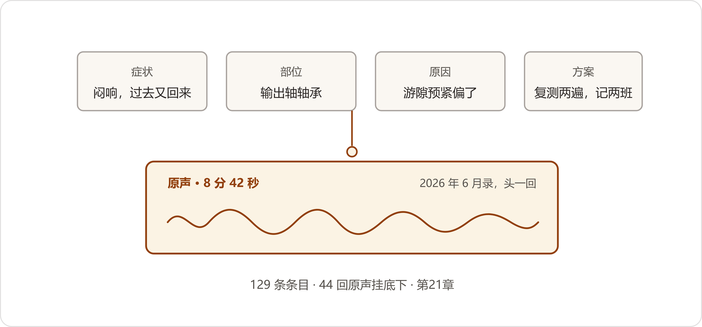
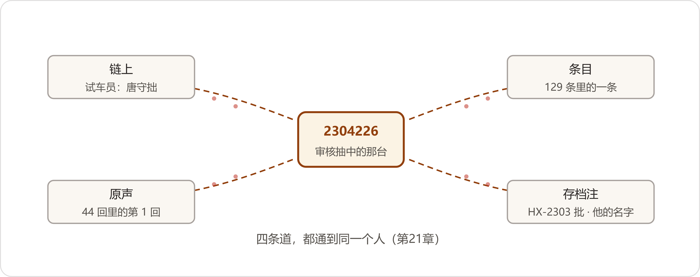

# 22 老唐退休那天
*The Day Tang Retired*

:::题记
"搁这儿。谁听，谁使。"
——唐守拙，2027年5月28日，试车台边
:::

审核组走后的头一个礼拜，数字办过的还是老日子。赵峰把白板上那行"六月九，纠正措施"底下添了四个小字：一周一报。头一份周报是方致远和赵峰一起报上去的，两页纸：4.4的补录时限写进了程序文件——往后临时更改，七日内落字；4.3的缺环整改排了带时限的受控计划，缺失卡补一台销一台，季度汇总报一回。董鸿章看了，回过来一句话：照此办理。

翟工的电话是隔两天来的，声音还是平的。委员会审定过了，公示期三十天，走完，证六月初寄到厂里。跟着他照旧添了半句："手别松。链是好链，喂链的手，别换人。"

第三册的事也起了头。小夏把段兴那十一本笔记本的扫描件从档案室档上调了出来，一页一页排在六月的对词会议程上。段兴在矿上，微信里回得快：本子都在档上，标着页呢；站上五月里回了三笔，一笔是小吕判的，那个字他又用对了——匀。她把这条念给陈临听，念完自己先笑了："传承的进行时，人家矿上先进行上了。"

登记簿还在长。高杏那行底下，五月里又添了三行：化验室的，设备科的，都是自己找上门来的。口子开着，谁用谁记，一行一笔。周建海把JS-800那几年的纸档台账也借了出来——JS-800那几年的追溯链在图谱外头，得走纸档，一台要翻上半天，这活儿排进了六月的计划。白板左下角添了一行新字：六月，第三册起头。

条目还剩十三条。老唐一个礼拜来一回，进门先把工帽摘下来挂在门后，四栏的表摊在小夏电脑上，核完两条三条，天黑前走。五月里核了两回，两回都是五条。郑敏每回来对一回茬口，部位栏的词，一回不落。到末一回，表上还剩最后三条。

* * *

## 一、最后一条

那回他来得早。陈临到的时候，他已经坐在小夏工位边上了，工帽挂在门后，小本和铅笔头搁在桌角，还是他那个老次序。桌上多了一样东西：条目表的终版清样，小夏提前打出来的，一沓，用夹子夹着。

三条核得比往常慢。头一条就磨了半晌——第一百二十七条，症状栏写的是"尖啸"。老唐把耳机摘下来："不是啸。啸带哨，这个没有哨，是'嘶'。"小夏把原声重放了一遍，两个人隔着屏幕听，改了。往后每核完一条，原声的链接点开对一遍，他点头，下一条。轮到末一条，是小夏先停住的。

第一百二十九条。前头一百二十八条，条条底下挂着原声；这一条没有——它不是声音的事。

:::文书 听音条目 · 第一百二十九条（终版）· 核讫
症状：盘车手感不对（发涩）。\

部位：输出轴轴承。\

原因：游隙、预紧偏离手感基准；数未必超标，手感无表可查。\

方案：复测游隙两遍；数在图样范围内的，开质量异常单（口头反映同开）；存疑挂观察，记两班。\

原声：无（非声音性状）。注：参进厂检验台账存档注，HX-2303批。记录：夏雨桐。审核：唐守拙。
:::

老唐把那页纸看了两遍。看第二遍的时候，他把老花镜从脑门上扒下来，捏在手里，又戴上。末了他拿铅笔头在"发滞"两个字上画了个圈。

"改'发涩'。"他说，"滞是停，涩是蹭。那批的手感，是蹭。"

小夏改了字，重新打了那一页。他把三页清样在桌面上磕齐了，才拿起笔，在审核那一栏签上名字。签完，笔搁下，他在椅子上坐了一阵，看着屏幕上那张表从头滚到尾——一百二十九行，一行一行地过，滚到头，白底。

"清了。"他说。

郑敏那天也在。茬口对的末一回，部位栏的词她逐条过，第一百二十九条的部位栏写着"输出轴轴承"，总目里有，她画了个钩。她凑过来看落款：条目一百二十九，原声四十四回，核讫的日期落在末页上。看了一遍，她把清样放回原处，手指头在那沓纸上按了按："三十九年，一百二十九条。一条不欠。"

老唐没接这句。他从工装兜里摸出那个巴掌大的小本，铅笔头别在封皮上，搁在小夏桌上。

"这个，也归档去。"他说，"上头的问号，都清了。"

小夏把本子接过来，翻开。里头一页一页，都是问号和日子，铅笔写的，深深浅浅。头一个问号边上有个日子：去年六月四号。那天他一口气问了四十多个问题，答不上的，都记在这儿。最后一页空着。她把本子合上，抱在怀里。

"唐工，"她说，"这本儿比条目值钱。条目是答案，这本儿是您哪儿不会。"

"会了的都进了表，不会的，"老唐把工帽从门后摘下来，戴正，"就没有了。"

他走到门口，又站了一下，回头看了一眼那张还亮着的表。他看的时间不长，也就点一根烟的工夫。然后他拉开门走了，楼道的声控灯一格一格亮过去。

* * *

## 二、家伙什

第二天是他的末一班岗。

这一班跟往常哪个早班都没什么两样：五点四十醒的，比闹钟早十分钟；楼下买的两根油条，吃了一根，一根留到晌午。骑车进厂门的时候天刚亮透，门房老葛在里头扫台阶，冲他扬了扬扫帚。

一早的计量间比车间静，检定完的量具在案上排开，标签是新换的，白得晃眼。老唐的个人量具上礼拜就送去检定了，单子头天回来，两把千分尺、一把卡尺、一盒块规，栏栏合格。他把东西一样一样从盒里取出来，摆进车间量具柜的格子里，格是格，位是位。齐连升拿着登记本在边上记，编号一格一格抄，抄到保管人那一栏，填了"魏来"三个字。

"给库房还是给小魏，您说一声就完了。"齐连升说，"走这道手续，多费半天。"

"量具是公家的规矩，不是我的人情。"老唐把柜门关上，"入了柜，谁使谁借，本上有数。人情不落本。"

末了剩一样，没入柜：一把长杆的螺丝刀，木柄上缠着旧胶布，杆身让手磨得发亮。他掂了掂——这分量，手比脑子记得熟。他走到试车台跟前，拉开台边的抽屉，把它搁进去，搁在老地方——三十来年，它一直睡在那儿。

"搁这儿。"他说，"谁听，谁使。"

下午有一台新装机的出厂试车，JS-1100，序列号2705186。齐连升把单子排给这一班的时候没说什么，只是排在了试车台那格。陈临也下了车间，站在三号工位门口——老唐知道他站在那儿，没回头。

小魏上的台。开机之前，老唐把他叫到跟前，就说了两个字："你听。"

机器空载转起来。小魏贴着台子站着，听了一阵，眉头动了动。三档速度一段一段跑上去，跑到三速，他抬起手。

"三速那一下，有点紧。"

"紧在哪儿？"

"说不清。就是紧。"

"说不清，就对了。"老唐说。心里他点了个头——说不清，是耳朵还没跟上；能听出紧，这耳朵已经开了个头。"坐下。"

他自己没坐。他站在机器边上，声音跟平常交代领料一样，一句是一句，把那套判法从头说了一遍。这些话他从前都是拆开了一句一句教的，今天一口气说了个全。

"听音这活，五步。一步，盘车——空载，手盘，听匀不匀，匀的，底子就是好的。二步，跑速——低速一段，中速一段，高速一段，哪一速上冒头，病就在那一档的件上。三步，数点儿——一转一个点儿的，齿轮；沙沙的、匀的，轴承；嗡一声过去又回来的，隔着一级，行星轮。四步，定头——杆子贴着箱体，一头一头地听，高速级那头，还是输出那头，隔着油，闷的轻重的分别就在这儿。五步，拿不准——别拆。列观察，记两班，声不加重、油温不爬，就让它转着。这五步，你听三年，耳朵才有数。库里那四十四回声儿，是你这三年里的拐棍——先听库，再拆。"

小魏没插一句话，听完了才应了一声"哎"。机器跑够半个钟头，他自己复听，又把手背贴了贴箱体，末了说："匀了。"复测的单子他自己填的，贴在工单后头。老唐站在边上看着，从头到尾没再出声，直到单子贴上了，才"嗯"了一声。

贴完单子，小魏回身问了一句："唐工，往后我听不准的，给您打电话？"

"先打库里的电话，听。库要也拿不准——记下来，攒着。"

"攒给谁？"

"礼拜四。"

四点半往后，车间里的人陆陆续续往试车台这边凑。交班的，领料的，看复测单的，借口各是各的，到了跟前，站一站，也不多话，又散了回去。有个年轻钳工把复测单揭起来看了两遍，又照原样贴好。钳工区那头的锉刀声停了一下，又响起来。

夜班来交接的时候，老万比往常早了一截。他拎着两只搪瓷缸子，把其中一只搁在试车台边那张高凳上，没说话，转身回他的夜班去了。去年夏天那一晚，他也给老唐倒过一缸子茶，一口没动，人走的时候茶都凉透了。

这一回，老唐听完了最后一遍复听，端起那缸子，喝了两口。茶还温着。他把缸子放回高凳上，朝夜班那头扬了扬下巴——老万在灯光底下回了他一下手。

天擦黑，他换了工装出来。更衣柜里的东西少：一身换洗工装，一条毛巾，一副旧线手套；柜门里侧贴着张老安全标语，纸黄得发脆。他把东西卷进包里，柜子里外擦了一遍，钥匙交回班组。齐连升送他到车间门口，两句话交接完："四号台下礼拜的活，我排给魏来了。"

"排吧。"老唐说，"他听不准的，库里有声儿。他听得准的，让他自己落单子。"

骑上车之前，他在车间门口站了一站，朝里头看了一眼。夜班的灯亮着一排，天车歇着，钢缆上落了五月里的槐花，一小撮。他跨上车走了。

* * *

## 三、三十一号

五月三十一号，星期一。

老唐来得不早不晚，穿了件深灰的夹克，不是工装，肩上挎着那个帆布包。陈临在人事办公室门口等着他，两个人一前一后进去。

手续办得顺。人事的阎经理把单子一张一张过：离职交接单，工具、更衣柜、图书借阅，三栏都盖了章；公积金和年假的折算单，末了老唐自己把数核了一遍——折算单上的数他一行一行看，看到工龄那一栏，停了停，三十九年零两个月，折成了小数点后头的一位。退休证是个红皮的小本，他翻开看了一眼照片，合上了。工牌交回去的时候，阎经理接过来，看了一眼带子上那道旧油渍，没擦，收进了抽屉。办完最后一栏，阎经理送他到楼梯口，站住，说了句"常回来看看"。老唐应了一声，没多说。

"还有这个。"阎经理从桌上拿过一个信封，双手递过来，"厂里的返聘函，董总签的。技术顾问，一个月来几回就行，不坐班。您带回去想想，不急。"

老唐把信封拆了，抽出函，从头到尾看了两遍，又装回去，折了口。他没说接，也没说不接，把信封揣进了帆布包外袋。信封不厚，隔着帆布，却坠手。

晌午他得回家——师娘头天刚做完复查，家里得有人。走之前他把包里另一样东西先交了：条目表终版的装订册，小夏核讫那天装订好的，打了封条，一册。他说这本后半晌还要用，让陈临先收着。

* * *

## 四、链上

他从家里回来，先上了数字办。陈临他们都在，办公室里人齐。小夏把条目表的终版投在幕布上：一百二十九条，四十四回原声，末页的落款一行一行排着——记录：夏雨桐；审核：唐守拙；核讫的日期，就是上礼拜四。老唐在幕布跟前站了一会儿，没坐。

小夏把第一百一十六条调了出来——闷响那条。还是那段原声，十几秒，放完了。

"这段是去年六月录的。"老唐说，"头一回。"

"头一回，八分四十二秒。"小夏说，"中间卡了两回。回放里您说'这段掐了'——没掐，郑部长说的，卡住也录着。"

老唐"嗯"了一声，没再说什么。

赵峰从自己那台机器跟前回过头来："唐工，还有个东西，您看看。"

他把图谱调出来，敲进去三个字：唐守拙。屏幕上先跳出来的不是哪一条目，是一串机器——按试车员查的，JS-1100，两千九百多台，序列号一行一行往下淌，淌了三屏还没完。

"名下头一条是哪台？"陈临问。

赵峰把检索倒到头。"二〇二〇年二月，头一批JS-1100，七台，试车员全是您。"

老唐看了一眼那一行。"那批的跑合声偏大。磨合半个月，才匀。"

"这句，"小夏把条目表翻到第七条，"第七条上写着。"

"二十八号夜里，增量把您末一台挂上了。"赵峰说，"2705186，试车员那一栏，是您的名字——名下最后一条新记录。往后这个栏里亮的新名字，就是魏来他们的了。老名字不删，查哪年的机器，出哪年的名字。"

老唐盯着那串序列号看。看着看着，他伸出手，手指头在屏幕跟前停住了，离着玻璃一指远，虚虚地点了一下，点在其中一个上头。没碰着屏幕。

"这台。"他说，"十号那天，他们抽的就是它。"

2304226。小夏把那一台点开，链从头走：出厂，装配批次，试车记录——末行一行字，试车员，唐守拙；轴承批次，华信，变更GG-23-002挂着；检验报告底下，那条存档注，注里也是他的名字。链走到头，宏峰矿业，点蚀，已更换。

"任抽一台您试的车，"小夏说，"链上有您，条目里有您，原声是您的。这台机器身上，四条道儿，都通到您。"

老唐把那台机器的链从头看到尾，看到宏峰那一格，停住了。屋里没人说话，立式空调的风声都听得出来。

陈临想起去年三月，装配车间那排铁皮柜跟前，老唐拍的自己的耳朵，说的那句"图纸上没有"。这句话这会儿就在他嘴边上。他没说。

"往后娃娃们查机器，"老唐开口了，问的是小夏，"能翻着我这行字？"

"任抽一台，两三分钟。"

"嗯。"他把伸出去的那只手收回来，在裤腿上蹭了蹭，"这个，家里能看不？"

"能。"小夏说，"给您开个账号，手机上就能看。"

"那敢情好。"

他就说了这一句。小夏转身去开账号，开好，把登录的步骤写在一张便签上，贴在条目册的封底。赵峰把图谱退回总览——那张图如今三千八百多个圆，一天一天还在长。老唐站在幕布跟前又看了看——那一串序列号还淌在屏上，他的手再没伸出去过。

* * *

## 五、负一层

下档案室之前，他把帆布包在肩上正了正。包沉，他不让陈临搭手："这点分量，还行。"十三本加一册，六斤多。三十九年，头一回觉出它沉。

负一层的台阶走到头，拐角的感应灯啪一声亮。纸味，潮气，一点樟脑，还是那个味。门虚掩着，推开，长案后头，叶老戴着老花镜在揭一张老图纸，镊子夹着补纸，正走到半截。他把手底下那条缝走完，压上镇尺，才直起腰。

"来了。"他说，"先登记。"

门边小桌上，登记簿摊着。老唐接过笔，一笔一划签了名。叶老看着他把包放上长案，把东西一样一样往外码：条目表的装订册一册，牛皮纸面的笔记本一摞。笔记本侧边都用记号笔写着年份，码齐了，一共十三本。

叶老一本一本数过去，数完，手在摞顶上放了放。

"十三本。"

"赶巧了。"老唐说，"跟上回那十三条，一个数。"

叶老没接这个话，拿起最上头一本，翻开。里头不是流水，是判断：某年某月，某台，什么声，什么劲儿，查了几日，末了是哪个件。字有钢笔有铅笔，一年压着一年的字，密密地挤着；最底下那本的侧标，写着一九九四。他翻得慢，翻到中间一页停住了，把老花镜往上推了推。

"〇三年四月，三号台，嗡，查三日，油位。"他念了一遍，"这条，对得上条目哪条？"

"一百零九。"

"条目里部位的词，往后谁守？"

"郑部长。"陈临接的，"一回一对茬口，注是她的份内事。"

叶老点点头，把那页抚平了："本子上的，条目上的，声音的——一张事，三处活着。"

他把十三本重新码齐，和那册条目表摞在一处，从案头拿过一张移交单，边写边念：存工作笔记十三册，听音条目终版一册，问号记录本一册，唐守拙移交。写完，两人在末尾各自签了名。移交单一式两联，一联夹进登记簿，一联折好，塞进条目册的封皮里。他起身，抱着那一摞往第三排柜子走，放进腾出来的那格——挨着总目第一分册、第二分册，和那本三十一页的册子，一排。钥匙拧了半圈，他把格子里那摞摆正了，才让开身子。

"搁这儿。"他说，"跟楼上那些声儿，上下楼。"

老唐往柜子那头看了一眼，点了下头。

"扫描一套，原本进柜。"叶老坐回长案后头，"进柜之前，给你复印一套。"

"不用。"

"要。"叶老说，"你的字，往后认得的人，一年比一年少。复印那套，你家里搁着——不是给你看的，是给来串门的学生娃看的。"

老唐没再推。他站在案子边上，看着那一格柜子，回身从贴身的兜里把那个信封拿出来，隔着长案递过去："叶工，这个，您给掌掌眼。"

叶老接过来，抽出函，看得比看本子还慢。看完，他把函装回信封，往回递。

"函是厂里的意思，字是你的意思。"他说，"我掌不了这个眼。我只说一样——你这十三本进来，我这屋里的东西，往后查的人一多，就得排班。你要是应了礼拜四，楼上楼下，就都有人走动。"

老唐把信封收回去，揣好。叶老从镇尺底下抽出那几页油印件，推到案子这边："八六年的总目，你瞧瞧。"老唐拿起来，对着灯看了半晌——纸薄得透光，仿宋体的字，横平竖直。看完他放回去，把纸摆正了，压回镇尺底下。

"你们这行，也是一笔一笔抄出来的。"他说。

"一笔一笔，抄了三年，才算入门。"叶老说。两个人隔着长案站着，谁也没再开口。末了还是叶老先说的，问的是句家常："家里那位，好些没？"

"五月里复查了一回，还行。往后每月跑一趟医院，我陪着。"

"该陪。"叶老点点头，不再问。他重新戴上老花镜，捏起镊子，俯回那张老图上去了。"我不送。"

两个人上楼。台阶走到一半，老唐开了口，语气跟交代领料一样平："函，明儿退给人事。家里离不开人，顾问坐不了。"他顿了一下，"条目清完了。矿上的回传一个月一回，拿不准的，叫小夏攒着——礼拜四，我来看一回。不算上班，不算钱。"

"车马费总得——"

"不算。"他说，"算钱，我就得算清楚来了几回。这个不算账。"

感应灯在两人身后灭了。

* * *

## 六、出厂门

傍晚，老唐推着自行车，和陈临并排在厂区里走。招待所那排窗户黑着，审核组走后，又住进了几家来外协的师傅。装配车间夜班的灯亮着一排，试车台歇着，四号台的罩子让小魏擦过了，亮得晃眼。走过食堂后头，老唐抬手朝那排杨树指了指。

"这排树，我进厂那年栽的。那年苗子细，怕活不成。"他说，"如今得两个人合抱。"

陈临没接话，跟着他在树荫底下走了一段。树叶让风吹得哗哗响，絮早就落完了。

门房的灯亮着。老葛在窗口里头看报，见人过来，把报纸放下。老唐把出入证掏出来，搁进窗口。平常的傍晚，这一下天天有；这一回，是末一回。老葛拿起那张证，翻过来，看了看背面的编号，放进"退证"那一格里，压上玻璃。

"唐师傅，"他说，"明儿起再进门，走这边登个记。一回一行，跟别人一样。"

"一样好。"老唐说。

他把车铃捏了一下——不响，锈了。他低头看了看，用拇指把铃盖上的锈蹭了蹭，又捏一下，响了，脆的。他跨上车，出了门，下了坡。车铃在坡下响了一声，人没回头。

行政楼一半的窗户黑了，六楼那扇还亮着。陈临在门房灯底下站着。厂门口的路灯一盏一盏亮起来，把柏油路面上的槐花照得发白。他站了站，转身往回走，走到行政楼跟前，手机响了。

董鸿章。

"老唐的手续，今天走完了？"

"走完了。函他退了，礼拜四应了。"

电话那头静了两秒。"退了，好。"董鸿章说，"条目清完那回，他在审核桌上应过的——到清完。如今清完了，他还来，来的是情分，不是欠账。门房该咋走咋走，谁也不许给他把道儿铺得跟别人不一样。"

"下午在档案室，叶老也留了他一句——楼上楼下，都有人走动。"

"嗯。"那头又静了一阵，"证六月初到。六月九号的纠正措施，盯着。年底我要看三样东西：证挂上墙，第三册立起来，缺环的账短下去。"他顿了顿："就这样。你们这些人，明儿照常上班。"

电话挂了。八点十分。去年三月十七号，秘书那通上六楼的电话，也是这个钟点。

:::日志 2027年5月31日夜
老唐退了。睡前把电脑里那个"老唐"文件夹点开看了一眼，最上头一行还是：6月11日，第一回。这回没放。把蓝皮本从头翻了一遍，这一年多拿事换来的话，一条一条记下——都是有过出处的，不是想出来的：
- 喂机器之前，先问什么算数。两万三千份文件里挑不出"现行"两个字，再好的机器也只会发废文件。这条八十七万买的，记头一条。
- 答不上，就说答不上。库里没有的数，它说没有；三月那间会议室没人敢说的三个字，机器先说了。敢说不知道，比答对一百道题值钱——董总认的就是这条。
- 一个词装不下两桩事，拆开，各写一行注。票给谁是客户，货谁用是最终用户；"指什么，不指什么"七个字，写注的人绕不得，绕了吵架的时候这行字不管用。
- 机器管像不像，人管是不是。相似度零点九六的，常州，真分；零点八九的，顺德，真并——并进鼎恒，跟机器说的那家不沾边。章、函、执照，凭据点头；谁点头，记谁的名。
- 记性比答案金贵。金岭那一笔错词记在本子上，潘永年善后两天，追回四张合同。敢记错的本子才算数——贺主任一句，老蔡一句，都抄在这儿。
- 从一门起，别一口吃全。十一柜一起合，黄了；传动一门，十个月，成了。我们从二百八十五台起头，如今三千八百多台在图上。立得住的一门，比立不住的十一门强。
- 缺，答得出缺在哪儿。六百三十多台缺环，一张缺失卡一行字：缺什么、查过哪儿、谁查的。账不遮——遮了的账，后来连本带利地贵。
- 劲儿在声儿里。一百二十九条，四十四回原声挂着——有些东西翻不成字，就原样挂上，别硬翻。老唐那句"纸上那个劲儿，学不来"，往后就靠这条规矩守着。
- 先攒着，攒的东西得有柜子。"先攒着"说了一年，攒下的要编号、进柜、有人对账，不然攒着就是欠着。今天十三本笔记进了档案室，排次写在移交单上——攒了三十九年的，今儿都有了去处。
- 活长在老岗位上，比立新招牌管用。向东认章，段兴回传，郑敏写注，高杏那张小抄——知识萃取师的活，他们干的就是，只是不叫这个名。
老唐的账单独记一笔：函没应，礼拜四应了。三十九年，两千九百多台试车，末一台2705186，二十八号夜里自己进的图。往后的账：六月九，纠正措施；证，六月初；第三册，六月起对词；词改正本那笔腿债——机制，六月排上；缺环，一台一台补。高杏底下新添的那三行，下回对词会，一个一个请来讲。礼拜四，他头一回走访客的道儿进来——门房的登记簿上，新一行。
:::

* * *

礼拜四。

早上七点四十，陈临把车停进厂区第二排车位，装配车间的天车正吊着半台减速机往三号工位走，钢缆绷得笔直。他在车边站了一会儿——门房窗口跟前站着个人，深灰夹克，肩上挎着帆布包，正跟窗里头的人说话。

老葛从窗口递出一本新塑料皮的临时出入证。老唐接了，别在夹克襟上，推着自行车进了门。老葛把登记簿往回拉了拉，拿块玻璃压上。

:::文书 门房出入登记簿 · 新一行
姓名：唐守拙。单位：退休。事由：核条目（数字办）。\

发放：临时出入证〇七。经手：葛有全。
:::

陈临上楼的时候，数字办的门开着。赵峰在白板跟前，笔帽拔了，要写六月的排期。板面上"六月九，纠正措施"那行字还钉在右下角；左边，去年三月写上去的那两个字还留着——老唐。

"板面不够了。"赵峰的板擦停在那两个字跟前，"这个，也擦？"

键盘旁边，叶老那张词卡还压着，朝水杯那一面的边角压着一道浅印。陈临看了那两个字一眼——一年多了，谁也没动过它。

"擦吧。"

赵峰擦了，写他的排期去了。楼道里有脚步声上来，不紧不慢。陈临走到门口，正看见老唐从车间那头过来。

"礼拜四。"老唐说。

"礼拜四。"

"七点半。"老唐说，"转了一圈。四号台的皮带轮罩子，螺丝松了两颗，我叫小魏紧了。"

两个人一前一后往楼里走。路过装配车间，门开着，夜班刚交，地坪冲过还带着湿气，试车台那头一台机器空载转着，声音匀匀的。头顶上，天车吊起了下一件活，往三号工位去，钢缆绷得笔直。
