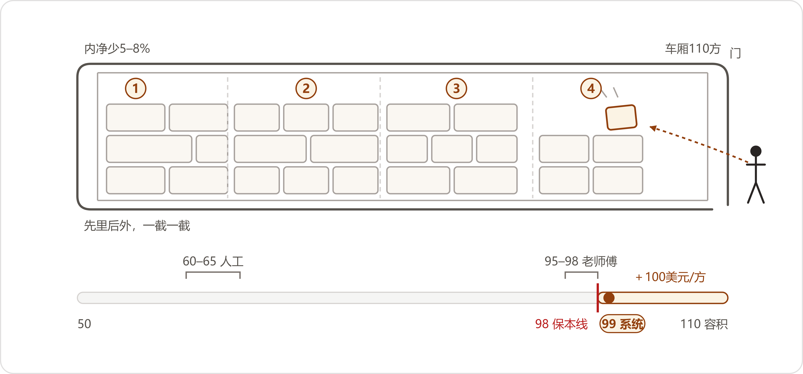

# 间一 八月的会
*A Conference in August*

:::题记
"大家都会用，可企业很难让大家一起用。"
——阮顾问，2026年8月3日，省城，茶歇
:::

八月三日，礼拜一。陈临和小夏坐头一班高铁出的门。

通知是上礼拜三到的。省机械行业协会的红头文件，寄到厂办，贺延龄批了个条子转下来：AI 应用专题交流会，省城，单日，会员单位八百块一个人，含午饭。条子上就一句话："去不去？"陈临回了两个字："我去。"又添了三个字："带小夏。"

高铁坐了一个多钟头。小夏靠窗坐，笔记本电脑开了又合，合了又开。她头一回出门开会，头天晚上把协会通知上的讲者简介翻了个遍——一个做鞋服电商的，一个做咨询的，一个做跨境物流的，行当跟齿轮箱一个都不挨着。"都是外行来讲。"她说完自己先笑了，"不对，咱们在 AI 这事上才是外行。"

陈临说，就该外行讲。"内行讲，一开口就是选型、就是架构，咱们听着热闹，回厂干不了。外行讲不了那些，只能讲他厂里那点事——事才是咱们听得懂的。"小夏说那咱们今天算什么，陈临想了想："当外行的外行。把问题带够，把耳朵带够。"

陈临没接话，看着窗外。玉米地一块接一块往后退，退到头，是连成片的厂房。他兜里揣着一张纸，是从白板右边那十四行需求上抄下来的，抄的时候又添了三个问题：部门的人怎么才会真用起来；用到一个什么份上才算用起来了；别人的厂，这种事归谁管。纸折成四折，隔着布料贴在腿上。

对账那一仗，礼拜五刚收工。调节表从四天压到半天，许曼的口径表装订成册，老康的章还是老康的章——这一仗打得干净。可陈临心里那点没底的东西，打完仗反倒更清楚了：从头到尾，真上手用过那套东西的，还是数字办这几个人。老康也用了，可老康用的是他站在边上按着用的；于倩的回单那摊，他不在场，回单还是一捆一捆地对。赢一仗，和厂子会打仗，好像不是一件事。这话他没跟人说过——跟赵峰说，赵峰会说他想得多；跟小夏说，怕她泄气。攒到今天，攒在兜里这张纸上。

省城站出来，热浪从脚底下往上蒸。会开在火车站边上的一家酒店，二楼会议厅，电梯口立着易拉宝，红色的底子，印着会名和三家赞助商的标志。签到台上摆着一摞胸牌、两盒名片、一沓议程表，两位姑娘核名单核得飞快。递上来两杯速溶咖啡，杯子烫手，小夏捧着换了三次拿法，最后搁在了窗台上。

开场前二十分钟，走廊里的人在展板前挪。陈临和邻座换了名片——江城一家泵厂的信息科长，姓宫，五十出头，名片递过来先自嘲："我们那 AI，目前的主要成果是周报。"陈临说你们的成果算好的，我们那个去年把作废文件发给过客户。宫科长乐了，说那咱们今天都得认真听。

厅里坐了百十来人，圆桌拼成排，多数人衬衫口袋里别着笔。陈临扫了一眼胸牌，认识的行当多：泵阀的、轴承的、电缆的、机床的，也有隔壁省赶过来的。前排几个厂的信息科长凑在一起说话，说的是各自家的服务器又坏了哪台、机房空调几月换的氟。邢秘书长开场，十分钟，说了三件事：今年第三回办，上两回讲的是机器视觉和排产，这回讲 AI；上午一位下午两位，讲完留提问；中午圆桌，自助，管够。底下有人笑，鼓了掌。

头一个上台的是闻姐。

闻姐叫闻亚楠，四十五岁，做鞋服电商，自家有工厂有设计师，年流水十来个亿。她个子不高，上台先把话筒线从讲台上解下来，捏在手里，站到幕布边上讲，不上台中央。"我讲快点儿，"她说，"我们这行，时间按分钟算。先说好，我讲的事不高级，就是出图——给网店出图。你们做齿轮箱的别走，听完了再走，出图这点破事，跟你们厂里画图的一个道理。"

她的生意，她用了三分钟交代。鞋子和帽子，主做淘宝天猫，一年往店铺上几百个新款。听着一百多个款不算多，可每一个款上一次架，后头跟着一串东西：主图、详情页的长图、短视频的封面；这两年视频电商起来了，光有图不够，每个款还得配挂车的短视频——拍模特穿着走两步、转个身，把卖点字幕挂上去。图是画的，视频得拍，拍完还得剪，剪完的封面又是一张图。旺季搞活动，一天要出几十张图、十几条视频。这些图原先靠一支设计和运营的队伍出——设计师懂货也懂品牌的调子，队伍不小，一年的人力是笔大钱。

旺季什么样，闻姐给了个数。双十一前那半个月，店铺要上的新款挤着上，一天几十张图是常态，多的日子上百。设计们加班，运营们催，会议室的白板上写着倒计时。有一年最紧的一回，一个款的详情页，从拍板到上线给了四十八个钟头——设计两个人轮班，出来什么样算什么样。"那四十八个钟头里出的图，"闻姐说，"你们今天在座各位的厂里要是有产品册、有样本、有展会的物料，赶上急活，也是这么出的——赶出来什么样，认什么样。没人复核，没工夫复核。所以我们后来说，快不是本事，快了还不乱，才是。这事靠人熬，熬不出来。"

"毛病是前年起来的。"闻姐说，"AI 生图火了，我们老板开会说，咱们也得用。怎么用？发了通知，鼓励大家学。你们猜各家学成什么样？"

她伸出一根手指。"设计师小周，自己开了账号，提示词写得漂亮，出图快了一倍——出来的图，跟隔壁工位小李的图，不是一个牌子。一个款的详情页，三个人做出来三个风格，客户在页面上翻着翻着翻出两张色不对的，客服接投诉接到手软。这是第一桩。"

第二根手指。"运营的姑娘也学。学完了干吗？拿 AI 改图、抠图、换底色——干得还是原先那些活，一步没少。她原先一天处理八十张图，现在一天处理八十张，中间多了个 AI。人没省，事没少，这就是我们内部后来定的名目：假性 AI 化。听着都会用，实际上就是拿个新工具塞进旧流程里——原来是人做图，后来是人盯着 AI 做图，人还是那个人，还多了一道盯着。"

台下有人点头。陈临看见邻座一位科长把"假性"两个字记在了议程表背面，记完还画了个圈。

"真正把我们打醒的，不是效率，是走了个人。"闻姐把话筒换了只手。"我们的设计主管，干了三年，做事实稳，图出得也漂亮。去年他离职——个人原因，没闹任何不愉快，按流程交工牌、交电脑，我们还吃了顿送行饭。过了俩月，运营要调一张老款的图，改个背景。找源文件，公司电脑里没有；问接手的设计师，人家说源文件从来都在主管自己的移动硬盘里，公司的服务器上一个都没有。"

她停了一下。"三年。三千多个款的源文件，跟着一块移动硬盘出的门。人家没偷——合同里没写图必须归公司、存在哪儿，人家拷自己经手的文件，讲得通。怪谁？怪不着谁。要怪，怪我们从来没想过这件事：图做完了，散在每个人的电脑里，公司的家当，记在个人的账上。那三个月，我们把三年里拍过的东西重拍了一遍。多少钱我就不说了，说了你们以为我们管理多乱——确实乱。"

底下笑了一阵。闻姐没笑，等笑声落了，才往下讲。

重搭这件事，不是老板一句话就顺顺当当下来的。闻姐说了实话：会开了三回，吵了三回。运营总监反对得最凶，理由是慢——重新搭流程，等于旺季之前自己给自己找事；设计这边不吭声，不吭声最麻烦，闻姐后来才弄明白，他们是怕。"怕什么？怕学着学着，把自己学没了。你想想那个处境：让一个设计师天天教 AI 出图，教会一分，他自己就悬一分——换成你，你教吗？我们有个小姑娘，访谈的时候什么都说好，问什么都'可以''没问题'，做出来的需求清单一看，全是含糊的。后来我才懂，那种时候你拿到手的需求，可能是假的——人家不是不会说，是不敢说。

小夏往陈临这边偏了偏，压低声音："老唐这算不算也在教它？"

"算。他一回事一件事往录音里说，就是在教。"

"我看他不像害怕的样子。"

"他是怕的，只是不说。"陈临说，"你去听他录音，卡住的那两回，就是怕。"

小夏没再问，在本子上记了一笔。台上，闻姐已经开始讲破局的那两件事了。"

破这个局，闻姐说她没讲任何大道理，就干了两件事。第一件，把"公司不会裁设计师"写进了制度里，白纸黑字，人事盖了章。"空口说的不算数，人家凭什么信你？"第二件，就是下面要讲的——先把设计们自己的小麻烦解决了。

重搭这件事，得先把账倒过来想。AI 没进来的时候，图散着，一年也就那么些张，乱是乱，还在能忍的份上；AI 一进来，出图快了十倍，散的速度也快了十倍——窟窿放大了。所以重新搭工作流，头一件事不是挑模型、不是选工具，是立一条规矩：每生成一张图，先进公司的库，编上号，挂上款号，然后再谈别的。图从公司库里出，不从个人电脑里出。

第二件事，闻姐说是她们"求"来的。"我们先给设计们干了件小事。原先出一张图，提示词要自己敲小半屏，敲完了生成出来还带水印，得再修一道。我们进了两个技术，蹲在设计师边上看了三天，第四天给做了个模板——常用的款型、常用的场景，提示词拼好了存在那儿，点一下就出，水印自动去。就这么件事，没提任何'转型'两个字。你猜怎么着？原先我们开会讲 AI 战略，底下没人吭声；模板上线第三天，小李自己跑来问，说抠图那一步能不能也给我弄一下。"

闻姐说到这儿，看了台下两秒。"人心是这么收的。你别跟小伙子小姑娘讲战略，你把他每天最烦的那一步给他去掉，他第二天就来找你。"

再往下，她讲到了验收——这是她今天真正要讲的东西。"图快了，量大了，新问题跟着来：图对不对？我们的图是卖货的，卖出去的东西必须就是图上那件东西。我们吃过一回亏——"她举了个例子，一张详情页的主图，模特身上那件外套，口袋比实物高了半寸。图修得漂亮，光线、构图、模特的精气神，全是顶好的。客户照着图下了单，收到的货一比，口袋矮了半寸，退货，投诉，赔了钱不说，评论区挂了半个月。

"从那以后我们立了死规矩，叫三层一致性。"她在幕布上打出来：人物一致，服饰一致，场景一致。模特的脸不能这图一张那图一张；衣服的版型、颜色、扣子口袋，每一处都得跟实物对得上；场景不能乱串。"三层全过，图才算能用。这一条进了验收标准，达标才算过——不是看着顺眼就算过。所以如果衣服的版型、颜色或者细节变了，这张图越漂亮，商业风险反而越大。图是拿出去卖货的，不是拿出去参展的。"

审图的规矩也立了：AI 先过第一道，把对不上的地方标出来；人终审，设计师签字，图才出库。"AI 负责规模化，最后那一下判断，还是人。"闻姐说，"我们没裁设计师。设计师的活换了——原先一天画十张，现在一天从 AI 出的两百张里挑十张、修十张。挑比画快，可挑的人得是懂行的人。"

这套东西怎么验证的，闻姐也交代了。她说她们没搞那种"汇报演示"——搭好了，请老板来看，大屏一投，图刷刷地出。"那种演示我们内部叫表演，演完该怎么样还怎么样。我们土办法：挑了两个款，让设计们拿新流程真干两周，出活、上架、卖钱，客户投诉单摆在那儿对。两周下来，图快了，投诉没多，这才敢往下推。演示再好看，回答不了一个问题——能不能进每天的日子。进了日子，才算数。

意见怎么收的，她也说了：不开会。设计们谁有意见，写在共享文档里指定的地方，一条一行，什么时候写的、谁写的，都在。头一个月没人写，第二个月开始有人写，写到第三个月，那页文档成了他们流程里翻得最多的一页。"开会收意见，收上来的是客气话，"闻姐说，"落在文档里，落的才是真话——写下来要负责任的，人就想清楚了再写。"

提问的时候，后排一位科长举手，问的是全场最实惠的问题："闻总，上了这套，您省了几个人？"

闻姐把话筒换到另一只手，想了一下。"我没裁人，一个都没裁。效率提升百分比，我今天也给不出来——我们到现在，也只敢说还在内部试用。试用，懂吧？没到对外说数的份上，我回去跟老板也是这么报的。"她顿了顿，"我就说一句实的：干了三年，头一回，素材都在公司服务器上。美工再走一回，图，走不了了。"

宫科长接着问了一句："闻总，那个素材库，现在归谁管？"闻姐说运营中心一个姑娘兼着，一天十分钟。"跟浇花似的，不费什么事，不浇就死。所以得是个天天在跟前的人兼，不能设个专职——专职的岗位，三个月就没人浇了。"

那科长坐下去了，边上有人接着问了个狠的："您那设计主管走的窟窿，补上了？"

闻姐摇头："重拍的。所以我说这钱该花——学费。你们今天谁家没这个窟窿？回去查查看，查完睡不着觉的，别怪我。"

小夏在笔记本上写了一行字，写完往陈临这边推了推：资产归公司。陈临看了一眼，点头，把笔记本推回去。他想起的是郑敏那页口径——在质量部的服务器上；许曼的表，礼拜五刚装订，在财务的柜子里。各是各的好，各归各的家。这念头一闪就过去了，他把这个词记在笔记本的页脚：回来对。记完，凑到小夏耳边低声说了句："咱们厂那几本账，也各记各的。"小夏点头，把本子收了。

晌午的圆桌，十个人一桌，自助，菜是会议餐的菜，鸡和鱼各管各的一盆。闻姐坐主位，被围着问，嗓子很快哑了，端着餐盘的人排到了第三轮。陈临挨着小夏坐，对面是位五十来岁的男人，黑红脸膛，短袖衬衫，胸牌上印着一家物流公司的名字：孟宪启，运营负责人。他吃饭快，先吃完了，坐着听别人问闻姐，听到"三层一致性"，扭头跟陈临说话。

"齿轮箱厂？"他看了陈临的胸牌，"出口不出口？"

"出口，看单子，大件走整柜。"陈临说。

"那你这个会没白来。"孟经理指了指自己，"我下半场讲，讲的就是柜——车厢。先记一条：运费按方算，装不满，白跑。"他说完这句就不肯再多说了，"下午讲，讲了你们再问，省得讲两遍。"

桌上接着聊起了协会的前两回课。一家轴承厂的科长说，去年机器视觉那期他来听过，回去上了质检视觉，判伤那一步卡的误报太多，如今还跑着，"半个人盯着"；另一家机床厂的更干脆，前年排产那期听完，方案做了四十万，上了三个月，调度还是用老 Excel，系统里排的给领导看，Excel 里排的给车间用。桌上安静了一阵，没人总结，各自扒了口饭。

轴承厂科长把筷子搁下了："别光笑人家，说个我们今年的新事——主机厂续约，先发一张表过来，比往年厚，添的名目往年没有：批次怎么追溯、记录存几年、老师傅的手艺拿什么接。填不齐的，人家也不点破，就是名录往后排。我们销售处长问我怎么办，我说，填呗。"

陈临把"批次怎么追溯"几个字记在议程表边上，笔顿了顿——那两台断线的机器，在他脑子里过了一遍。

桌上有泵厂的信息科长接话，说他家去年让供应商上门装了套"智能物流看板"，用了一个月成了摆设，"数据都是手填的，越填越懒"。旁边的电缆厂科长说他家更实在，全公司就文员用 AI 最勤——写周报。"周报写得好看了，活儿还是那些活儿。"他说这话的时候没人笑，一桌人都点头，像是各自家里都有一个这样的文员。

孟经理对面，坐了一位没怎么动筷子的。四十出头，深色衬衫，天热也不见汗，名片摆在桌牌边上：阮正涛，咨询服务，头衔印得长，陈临只记住了"顾问"两个字。阮顾问听着桌上说话，偶尔记一笔，不插话。直到闻姐那轮问话散了，他才隔着桌子问闻姐："您那三层一致性，谁定的？设计师定的，还是您定的？"闻姐说是拉着一线定的——规矩是干活的人吵出来的，章是层层过的。阮顾问点点头，说了句"这就对了"，把这句记在了本子上。

记完，他看陈临："你们厂那个对账，打完了？"

陈临愣了一下。他这一桌坐下到现在，没跟人说过对账。"您怎么——"

"上午闻总讲到源文件散在人电脑里，您跟这位对了一句——'咱们的账，也各记各的'。这话头，是管账的人的话。"阮顾问笑笑，"干我们这行的，耳朵贱，别见怪。"

饭后没有休息，直接开下半场。头一个上台的，是阮顾问。

他上去不站着讲，从工作人员那儿搬了把高脚凳，坐下。第一页投出来只有一行字：一家没做成的客户。底下起了一点小小的骚动——会开到这会儿，头一回有人把"没做成"三个字当题目打在幕布上。

"先说清楚，最后做成了。"他补充，"但按我们进场时的方案，没做成。方案当场毙了，重来的。我今天讲的就是毙掉的那一版，讲它怎么死的。"

客户是一家金融公司，做投研的，研发团队百十号人。这个团队有个背景：他们服务的是公司自己的业务部门，业务部门提需求快，一天能提好几个，今天要个数据接口，明天改个页面。研发的人早就自己用上 AI 编程工具了——有人用这家，有人用那家，还有人两三个轮着用，用得都不浅。阮顾问去看过，说句实在话，吓一跳：有人一天里大半的代码是工具写的，人做的是看、改、把关。

"找我们的是他们老板。"阮顾问说，"老板要什么？要统一。工具统一，规范统一，最好再上一层平台，全公司一个入口。这个需求听起来顺理成章——遍地开花，那就收到一个盆里。我们接了单，按这个方向进场。第一周就知道要坏事。"

坏在哪儿。他去跟研发聊，聊一个一个人。有个小伙子，工位上贴着两张工具的快捷键表，跟阮顾问说了一句他记到今天的话："我用这个工具效率高，你让我换另一个，我反而不会干活。"——不是不会用，是不会干活。工具跟他的手长在一块了，换工具等于掰手指头。还有更深的：每个人不光有自己顺手的工具，还有自己攒的一套用法——提示词、模板、常用片段，全在个人账号里、个人网盘里。统一工具，这些东西全作废。"诸位，这一步我们叫个人提效。"阮顾问说，"个人提效不是坏事，一个人对自己的效率负责，天经地义，人家用下班时间学会的本事，你凭什么没收？可企业要的不是这个。企业要的是一群人一起快——研发快没用，需求到开发、开发到测试、测试到上线，一环慢，全链慢。从'各自都会用'，到'公司一起快'，中间隔着一条沟。我们进场时的方案，就掉在这条沟里——它解决的是一个不存在的问题：人家不是不会用。"

进场头一个礼拜的一个晚上，研发组长把阮顾问单独留了一程，开了自己电脑上一个文件夹给他看——三年攒下来的提示词和模板，按项目分的类，几百条。"你要统一工具，"组长说，"这些东西怎么办？我带的新人，头一件事就是拷这个文件夹。这玩意儿，怎么统一？"阮顾问说那天晚上他就认定，原先那个方案不是执行的问题，是方向错了。

方案毙了，钱不能白花，客户把需求收回去重谈，谈出来一个新东西：培训。五天半，线下，全员轮训。点的是阮顾问的团队来执行。

"接了单，我们回头干的第一件事，不是备课件。"他说，"是把'客户'这两个字拆开。这家公司里，要这五天半的人，不是一个，是一堆，一堆人要的东西不一样。老板要的是转型这件事真的发生——不是几堂课，是公司从此不一样。研发要的是工具真提效，别折腾，别把顺手的没收了换不顺手的。产品经理要的是流程别乱——原先他写需求文档、开发照着做，各管一段，安安稳稳，他怕学完五天半，规矩全改了。人事要的是什么？人事要的是这五天半里，每一天，员工到底带走了什么——培训要能在工资单以外留下点东西。四拨人，四个方向，我们做了一沓问卷发下去，收回来自评，研发的水平，中上偏上。

陈临在议程表背面把这话接了过去。他写了四行：董事长要的是这件事真的发生；郑敏要追溯，许曼要账；周建海要他的单子别再丢。写到车间那一行，笔停住了——车间的人要什么，他答不上来，好像也没有人问过。他把表推给小夏看。小夏从头看到尾，在车间那一行底下添了半行小字：老唐要什么，问过吗？"

他停下来，喝了口水。"这是我们埋的第一颗雷。"

第一期开班。教室借的是客户自己的培训室，平时用来开周会，那几天把长条桌拼成了课桌的样子，一人一张工位牌，报到表打印的，签到的字歪歪扭扭——研发的人多少年没签过到了。头一天上午还算顺，讲背景、讲方向，底下听得点头，茶歇的饼干没人动，咖啡倒是见了底。到了下午，进入正课——阮顾问的团队备的是高阶内容：多人协作的文档怎么拆分、同时改一份文档怎么避免冲突、变更怎么记录。这些内容备了小半个月，案例全是拿客户自己的流程改的。讲到第二个钟头，后排一个研发举手："老师，打断一下。那个文档，是存本地还是存云上？存云上的话，公司那个网盘，权限怎么开？"

阮顾问说他当时站在台上，心里咯噔了一下。他把这个问题抛回全班："存云上的，举手？"百十号人的班，举起来二十来只手。他又问："自己写过文档模板的，举手？"这回稀稀拉拉，十几只。"会建共享目录、管权限的？"十只不到。

讲到这里，阮顾问把头从话筒前抬起来，朝台下的会议厅也问了一句："在座各位厂里，文件存在云上的，举手看看？"一百来号人，举起来稀稀拉拉十几只。他也不点评，就笑了一下，接着往下讲。

"自评中上偏上的一个班。"阮顾问说，"每个人都拿自己最强的那一块自评——有人代码写得好，有人工具玩得溜，可协同这件事，是全班的短板，没人自评这一项。企业自己描述的能力水平，经常不等于现场真实的水平。调研问卷上那个'中上'，是每个部门推出来说得出口的那个人填的；坐在班里的，是普普通通的大多数。"

当天晚上，他把课件推翻了。备了半个月的课，十分钟发现白备。第二天从"保存"讲起——文件存哪儿、命名怎么统一、共享目录怎么建。"我跟你们讲讲那个场面，"阮顾问说，"第二天讲保存，讲目录，底下记笔记记得比头一天认真。下课有个研发来跟我说：老师，昨天那些协同，听着也对，就是回去用不上——今天这个，我回去就用得上。这句话我记到现在。后来成了我们公司的规矩：调研只信三成，剩下七成，进了场再说。你问一百个人，一百个人都把自己最好的一面给你看；你蹲在他工位边上看一天，看的才是真的。

小夏低声说："陈主任，这个我干过一回。四月份在文控室，我在小何边上坐了两天。"

"我记得。你回来讲，协调会上问不出来的东西，坐在边上全看见了。"

小夏点点头，没再说话。台上，阮顾问接着往下讲，讲他第二天怎么搬着椅子，坐到研发区后排去的。"

这个"蹲"，不是个比方。阮顾问进场那阵，头一礼拜做的最多的事，是搬把椅子坐在研发区后排。头一天他约访谈，一间小会议室，一个一个聊，聊得都挺好——每个人都能把自己那套用法讲得头头是道，讲了什么需求、解决了什么，井井有条。第二天他不访谈了，就坐在工位边上看着。看下来是另一回事：一个上午，那个人跟隔壁位子来回探了四回头，问的是"你那份改了没有"；他自己讲到的那套漂亮用法，一上午用了两回，剩下的时间在两个窗口之间来回复制粘贴。"访谈是人家给你表演，"阮顾问说，"表演也是真心的——人家真觉得自己是那么干的。可你要看的是他的手，不是他的嘴。后来我们做培训、做方案，凡是自己没蹲够一天的岗位，出的方案一律作废。"

五天半的课是怎么排的，阮顾问也交代了。半天一块，一共十一块：头一块讲"为什么"——不讲技术，讲这个团队这一年各自怎么用工具的，拿他们自己的事当引子；中间七块，从文件、目录讲到协作、冲突，一块一个动手的活，当堂做完当堂过；第九块往后，留了两天半给他们自己——自己拿真项目进课堂，顾问在边上守着，卡住了才伸手。"课表上最大的那块空，是我们最得意的一笔。"阮顾问说，"留白比填满难——填满是讲给老板听的，留白才是留给干活的。"

五天半讲完，客户自己说不够。评估下来，追加两期，一期一变。第二期，产品经理进了班——文档从"怎么写"讲到"怎么拆"：一个需求，产品经理写哪份，前端写哪份，后端写哪份，测试的用例挂在哪儿。十几份文档摆在团队面前，谁写哪段、同时改怎么不打架、改完了算谁的，原先全没有章法，这一期一条一条吵。吵出来的东西落了纸，一套协作的规范——什么角色写什么文件，什么文件归谁管，改动怎么记，版本怎么走。

"搭到一半，出过一个笑话。"阮顾问说，"客户的负责人找我，很郑重地问：阮老师，这套规范，是不是你们从大厂内部拿出来的成熟模板？是不是阿里提炼好的，拿出来卖的？我说不是，是给你们现搭的。他不信。行业里就没有现成的——这东西长在每家自己的流程上，你家的需求单长什么样、谁签字、几个环节，跟我那家客户一个字都对不上，搬过去就是废纸。你们要是哪天听谁说'我有一套放之四海皆准的规范，卖你'——扭头就走。"

第三期，人事进了场。这一期不讲技术，讲的是学完之后，这些人的岗位说明、考核口径要不要动。"这一期是客户人事总监自己要加的。"阮顾问说，"加得对。工具换了、流程换了，岗位的账不跟着换，学的东西三个月就还回去了——人按考核干活，天经地义。到这一期，这事就不再是 IT 一个部门的项目了，是全公司的事。我们进场那天以为是来统一工具的，出场的时候明白，统一的是章法；工具到最后也没统一死，留了两三种，各用各的顺手的，章法是全公司一套。"

考核那头，他说了一个小例子。第三期结束以后，客户人事自己动了一处：原先有个研发的考核项，写的是"代码产出量"——一个月写多少行。用了新章法以后，这个项改成了"文档齐套率"——他名下的文件，该有的有没有、该记的记没记。"就改了这一个项，"阮顾问说，"那个组的行为当月就变了。人按考核干活，这不丢人，这是正经道理。你考核什么，他就给你长什么。"

项目收尾那天，他去看最后一眼。培训教室里，客户自己的组长在给新入职的人讲那套规范——讲得比他们这些外来的顺，因为例子里全是自家的事。"我们在后排坐着听了一节课，没插嘴，走了。"他说，"这就是我们这行当最像样的一刻：交付的时候，客户不再需要你。要是他离了你转不动，那不叫交付，叫依赖。依赖是要按月收钱的——那么收，我们自己都臊。"

最后他讲了账。台下等着听数字——一天几十张图的省法都听了，谁不想听个总数。阮顾问先泼了盆冷水。

"这家金融公司，没有向我们开放可以对外披露的完整投入产出数据。所以我们不讲总数，讲了就是编的。"他说，"讲个零头的。后来我们拿同一套方法，做了家制造企业——在座各位的同行，具体哪家不点名。三个小组，用了几天，客户自己做内部统计：写代码的时间，省了大约三分之一；写文档的时间，省了一半还多；测试的时间，基本持平，一分没省。"

三行数字投在幕布上，底下好些人举起手机拍。阮顾问等他们拍完，接着说："拍归拍，我把话说在前头。这是客户在几天之内做的内部统计。我认为它是真实的反馈——但它是短口径的，几天，三个组。它不能被当成长期的、完整的结论。谁要是把这个数原样写进年终汇报里当成绩，出了事，别找我。省下的时间去了哪儿、有没有变成产出，那要看半年一年。我们讲诚实的数，讲得出就说，讲不出就说讲不出。"

台下有人鼓了掌，稀稀拉拉的，但是有。阮顾问摆摆手，把最后一页投出来，还是那行字：一家没做成的客户。"方案毙了，方案里的人没毙。研发还是那批研发，工具还是那些工具，多出来的，是一套他们自己吵出来的章法，和一个进了场头一天就承认课备错了的乙方。"他从高脚凳上下来，把话筒放回讲台。"我讲完了，留十分钟提问。"

头一个提问的是刚才那位泵厂科长："阮老师，那到底该统一哪家的工具？我们厂想统一，吵了半年没吵出来。"

"这个问题本身要重新问。"阮顾问说，"统一工具是最后一件事，不是第一件事。你们吵半年没吵出来，是因为吵错了地方——该吵的是章法：文件归谁、改动怎么记、谁对结果负责。章法吵清楚了，两三种工具并存，天塌不下来；章法不清楚，统到一种上，就是把这个人的不顺手，换成了全厂的不顺手。"

又有人问，不是研发型的厂，一没有研发二没有文档，这套东西怎么办。阮顾问说那就更简单，研发只是他的例子，"你们厂里一定有那种几个人各干各的、交接靠嗓子的活——对账、报价、售后、采购，全算。方法一样：先看谁最累，再看活摊不摊得开，最后把吵出来的规矩落在纸上。工具的事，放在最后，轻着来——能租就不买，能试就不建。我见过客户一上来要买一体机的，机器钱够把刚才那套培训做三轮，买回来跑的还是原来那点活。投入要由轻到重，价值没看见之前，一分钱都别压上去。"

茶歇设在走廊，摆着两台咖啡机，一台是坏的。排队的工夫，阮顾问端着杯子站到了陈临旁边——是自己凑过来的。

"上午那个对账，"他说，"打完了？"

"收工了。"陈临说。他把杯子接满，侧过身，从兜里把那张纸掏出来，展开。四折的印子压在字上。他没念那十四行需求，念的是自己添上去的三个问题：部门的人怎么才会真用起来；用到一个什么份上才算用起来了；别人的厂，这种事归谁管。

阮顾问听完，没接纸，也没答题。他问了三个问题。

"你们厂现在谁最累？"

陈临想了想。郑敏，老蔡的本子，许曼的调节表——他一个个名字在心里过，过到一个，停了一下：段兴。矿上那个技术员，一年到头驻在站上，微信一个月三百多条，上礼拜五寄回来两只纸箱，三十多斤，人还没到。他把这个名字说了。

"他愿意把手里的活，摊开来给你看吗？"

"看本事。"陈临说，"看人，也看活。箱子里是什么，明天他人到了，自己开。"

"他教你的手艺的时候——"阮顾问指了指陈临手里的纸，"你记吗？记下来，落在纸上吗？"

陈临没答上来。这一问正戳在他没底的地方：老唐的录音攒了三段，二十七八分钟，一个字还没变成字；郑敏的口径页写是写了，人还是那个人。阮顾问看着他，也不催，端着杯子呷了一口，把话接了下去，说得很慢。

"大家都会用，可企业很难让大家一起用。我那家客户，工具满屋子，个个是高手——公司还是老样子。差的那块，不在工具上，在组织上。你们会用的那几个人，就是我那家客户的几个高手。你们现在赢的每一仗，都在等这句话兑现——什么时候不靠你们按着，老康那种人自己伸手了，那一仗才算真的赢完。"

等回答的空当，陈临问了他一句闲的：怎么干上这行的。阮顾问说他原先在大厂做交付，带团队给客户上线系统，系统上线就撤。"有一年撤完走人，半年后路过那座城市，去看了一眼——系统还在跑，跑得规规矩矩，用的还是头一天的配置，一个人都没换过姿势。我站在人家楼下，觉得这活儿干得没意思。"他后来换到小公司，专做这种"泡进去"的活。"钱少，睡得着。"他说。

茶歇收尾，台下也有人追进走廊来问，问的还是那个实在问题：员工学成这样，跳槽了怎么办？阮顾问说这问题客户老板也问过，问得很疼——"后来他自己想通了：人留不留得住，是待遇和前途的事，跟学不学，没关系。不学，他留下来，也只是一个不会的。"

陈临捏着那张纸，站在咖啡机边上没动。走廊里人来人往，坏的咖啡机滴滴答答响。过了一会儿他说："这三问，我抄走。"

"抄。"阮顾问把名片递过来。陈临双手接了，也把自己的递过去。阮顾问看了一眼，收进兜里，说："华中我常跑。你们哪天想清楚了要做什么，言语一声——不收茶钱。"

下半场最后一个上台的，是孟经理。他上台先道歉，说课件是夜里在服务区赶的，图多字少，"我讲账，不讲理论，理论我讲不来"。

头一张图是照片：一辆大货车停在口岸的货场上，车厢开着门，里面码着纸箱，天上是灰的。孟经理说，他们在黑河做对俄出口，机电产品为主，这两年电动车多。货从这边过去，运费按方算——车厢一百一十个方上下的车，装多少方，货主付多少方的钱。"这门生意的本质，"他说，"就是抢车厢里那点容积。"

第二张图是一行粉笔字，写在车库的黑板上，照片放大了有些糊：九十八，保本。

"这台车，不管你装八十方还是装一百方，油钱、过境费、司机工资，一个子儿不少。"孟经理说，"所以装载率不是个技术指标，是个利润开关——我们那条线，九十八方是保本线，装不满九十八，这一趟白跑；过了九十八，多装一个方，多收一百美金。一个方一百美金。诸位，货场上的一个方，比你们车间一台减速机金贵。"

装车，原先全凭老师傅。老师傅看一眼货，看一眼车，说先装什么、后装什么、哪件立着、哪件躺着，五六个钟头装完，能装到九十五到九十八方。全凭一双手一双眼一副脑子。孟经理试过让徒弟跟班学，跟了仨月，徒弟能装九十方——离保本线还差着八个方，差的那八个方，一个月下来就是小两万美金。"老师傅一退，这门手艺跟着人走。我们那时候算过一笔账——跟你们厂老师傅的账，应该是一个账。"

台下很静。这话在一个坐满制造厂的屋子里，不用解释。

邻座宫科长侧过头来，压着嗓子问："你们厂老师傅多不多？"

"多。光装配车间就一百多个。"

"那这话搁你们厂，比我疼多了。我们厂老师傅本来就没剩几个，听着还像别人家的事；你们一百多个，是跑不掉的。"

陈临没接话。台上，孟经理已经讲到了装车班子里那位老调度。

系统还没进场的时候，先闹的是人。孟经理的装车班子里有位老调度，五十多，排车排了半辈子，听说要上"智能系统"，先放出了话：上那个，要我这把老骨头干什么？底下的装车工跟着观望——机器一算，装得又快又满，装车工吃什么？孟经理说那阵子他睡不好，后来把话说透了："我请系统来，不是来抢你们饭碗的，是来把饭碗里的饭盛满的。"他给装车工算了一笔账，一笔一笔算到工资条上——这个下面细说。"人这一关过不去，"他说，"什么系统都是给仓库添了个铁疙瘩。"

还有一笔冤枉钱，藏在车厢本身。俄方给的车厢尺寸，是外头的尺寸；厢壁有厚有薄，里头有保温层，内净比外尺寸少百分之五到八。方案按外尺寸算，装到九十八方，实际车厢里塞不下，装到一半倒腾重来，反而压效率。再加上货类杂、车型杂，几台车一起排的时候，人工就找不着最优——孟经理说，他们统计过，纯人工那一阵，车厢利用率也就是六成出头，剩下四成，全在路上颠散了。

他说了最乱的一天。三台车，十一种货，两家货主的货拼着走，装车班长拿粉笔在黑板上排，排到夜里十一点，两家货主的货谁上哪台车还在吵——A 家的货方数大重量轻，B 家的货压秤，排不好就是一台装不满、一台超重。第二天一早还得推翻重来。现在这种日子，系统几分钟出三张指导图，哪台车装谁家的几件，图上钉得死死的，货场照单执行。"多车混排这一块，"孟经理说，"是老师傅自己也认输的一块——不是手艺不行，是脑子装不下那么多组合。"

做系统的这帮人，来路也偶然。口岸上的一个小饭局，经人介绍，来了几个做算法的年轻人，想找落地的活。孟经理没急着谈，请他们上货场蹲了一个礼拜——零下二十度，几个年轻人裹着军大衣，看装车工干活，看老师傅指挥，看回来的空车。一个礼拜蹲完，领头的找他：孟总，我们先不做。没想清楚做什么之前做了，是骗您的钱。孟经理说，就冲这句话，他当场拍板。"诸位，挑乙方的法子我今天白送一句："他说，"张嘴就答应的，赶紧送客；跟你说先不做的，留下谈。"

后来找人做了系统。孟经理不懂算法，他的讲法糙："大模型管张嘴，算法管干活。张嘴的那个听得懂人话——你说这一批货、这三台车，它把活派下去；干活的那些是老算法，管装箱的，什么三维、什么遗传，我不懂，反正算得又快又抠，一个方一个方跟你抠。"

第一版系统出来，在办公室里演示过一场，孟经理的形容是"漂亮得很"：三维的图，车厢转着看，每件货一个色，放哪儿、怎么摆，动画一段一段放。领导看了点头，第二天拉到货场——没人用。

那天孟经理全程跟着。平板冻得自动关了一回机，捂在怀里缓过来，接着演；一个上了岁数的装车工接过平板，两只手指头悬在屏上，不敢落——怕按坏。孟经理说，那个悬着的手势，他后来看过好多回，一想起来就臊。

"冬天，零下二十几度，工人棉手套，爬在车上。"孟经理说，"你让他看平板上的三维图？他看不懂，也不想看，手也点不动那玩意儿。现场这东西，你给他一个能转的三维，不如给他一张纸。这一版等于白做——做的人不服，说工人素质低。我说不对，是我们素质低：咱是给装车工做家伙什的，做出来的东西装车工使不上，是咱的错。"

投出来一张纸的照片：A4 大小，打印的，密密匝匝——货物的编号，朝向的箭头，车厢一节一节的截面示意，边上是一二三四的顺序号。"装车指导图。哪个箱，哪面朝外，放第几层，先里后外，全在纸上，跟发货单钉在一起，工人揣兜里，爬上车照着装。"孟经理说，"这玩意儿做出来，老师傅头一个服气。他说他干了二十年，脑子里就是这么一张图——就是从来没画出来过。

小夏在笔记本上把"一张纸"三个字圈了出来，凑近了些，低声问："陈主任，咱们矿上站里的人，手边上使的是什么东西？"

"这个明天就知道了。"陈临说，"段兴的箱子明天到厂，开了箱就清楚。"

连装载顺序都改了。原先的算法追求空间塞得满，方案里常有"工人踩着货进车厢、到深处再挪三回"的路数；老师傅提了一条——人不能踩着货进车厢，踩坏一件货，三个方的运费就没了，人还要担风险。算法改了规矩：按车厢的横截面，一截一截从最里头往外装，工人站在车门那儿，件件够得着。"这条规矩写进算法那天，"孟经理说，"我心里就踏实了——算得出最优解，不代表现场能够执行；现场执行不了的道理，老师傅一句话就说完，我们烧了多少个钟头的机器才学会。所以后来定死：算法负责算，现场负责改，改一条，算法记一条，越改越聪明。"

车厢内净尺寸，也是个坎。专业扫描设备报价单递过来，孟经理把单子压下了——太贵，一台的价钱顶半台车。最后的办法土：一台带激光测距的平板，八千五，配给现场的业务员，接车的时候顺着车厢走一遍，长宽高、鼓包、凹陷，量完数据直接进系统。"八千五。"他又说了一遍，"我在这上头省下的钱，够买四十台。解决问题的东西不在贵，在对路。"

账他报得很仔细。模拟装载，拿他们十一种规格的电动车做验证，系统出的方案稳定九十九方，过了保本线，而且不靠老师傅——同一批货，老师傅装是这个数，徒弟照纸装，也是这个数。装车时间，原先五个钟头，现在系统给方案、工人照纸装，他们内部测的，两个钟头。说到"两个钟头"，他自己把话拦下了。

"丑话搁前头——这只是原型验证过的数。九十九方是模拟装载稳定出来的，两个钟头是内部测的、预计的。车队真刀真枪跑满一个季度，再来看这个数作不作数。今天哪个写稿的同志要把'两小时'写死喽，我回头没法跟货主交代，货主拿着报纸找我兑现，我拿什么兑现？"

最后一张图是人：几个装车工围在车门口分那张指导图，一人一张，有人在图上用铅笔自己做记号。"装车工按车次拿计件。多装一个方，货主多挣一百美金，我们运费里分成，装车工当月工资就见着。所以这系统下来，货场没一个人闹——原先我们最怕的就是工人觉得机器抢活。现在老师傅带徒弟，徒弟照着纸，俩礼拜出徒。货主挣钱、我们挣钱、装车工挣钱，三方都挣钱的事，才立得住；只我们一方挣钱的系统，我看长不了。"

这套图还有个去处，孟经理没料到。货主那边的驻场代表，俄方请的翻译小哥，看见装车工揣着纸，凑过去看了一张，第二天拿来手机翻拍，问这个图能不能给他们一份——他们反向也发俄罗斯内段的货，一样按方算钱。"现在我们的指导图，货主那头也照着用。你说这算什么？算法是咱们的，纸是人家的。"孟经理摆摆手，"能挣钱的纸，不分国界。"

徒弟出徒那天的事，他多说了一句。那孩子照着纸，独立装了一台车，九十九方，四个多钟头。老师傅没上车，站在边上抽了一根烟，从头看到尾，没挑出一处毛病。"老师傅后来跟我说，"孟经理把话收住了，"他说，这下我走了，也能走了。就这一句。你们做制造的，这句话不用我翻译。"

提问的头一个是小夏。她问了个技术问题：算法排好的方案，大模型在里头干什么——是不是它把工人的话翻译给算法听？孟经理点头："差不多。张嘴的那个管把人话听明白——这一车什么货、哪台车、有什么忌讳；听明白了，派给算的；算的出完数，它再把数讲成人话。它不碰数。有一回它多嘴，自己估了个方数，跟算法对不上，第二天我们就把它那条嘴缝上了——出数的位置，只许算法出。"小夏把这段记得飞快，末了补了半句："我们赵峰听了这话得请您吃饭。"底下笑了一片。

后排有人接着问了个远的：往后大模型越来越强，会不会把您那些算法也吃了？孟经理摇头："吃不吃我不知道，反正眼下它算数我不敢用。它那嘴张口就是'大概'——我这边'大概'两个字值一百美金一个方，货主跟我拼命。能算死的东西，就得用算得死的办法。"

提问的时候，陈临举了手。他问的就是自己那一摊：出口的货走集装箱，拼柜和整柜都有，这套思路用不用得上。

孟经理没直接答，先反问他："你们一台减速机，多重，包装件多大？"陈临报了个大概：中型的，连木箱四五百公斤，箱子一米见方上下。"一个四十尺柜，内净六十七八个方，限重看船公司，二三十吨。"孟经理扳着指头，"你这个货，按重量算，装到限重就装不动了；按方算，柜还空着一截——你们这个货型，吃的是重，不吃方。真正该你算的是另一头：重货压方，柜里的方是买断的，空着的那十几个方，你们替船公司白养着。拼柜按方计费，人家给你排的位置，是人家算法算出来的——那算法里，你们是分子还是分母，你清楚吗？"

陈临答不上来。这个问题他从来没想过：出口的柜，走货代的，柜怎么装、装多少，从来是货代那边说了算，厂里只管把箱子送到仓。"不清楚。"他说。"那你回去先干一件事，"孟经理说，"把上半年的出口单子翻出来，一票一票对：报的是几个方，实际装了几个方，重的还是泡的。对完你就知道，这门账，你们厂有没有得算。我猜有——齿轮箱这种铁疙瘩货，十有八九在替人家填方。填方的活，最吃亏。"

散会四点半。邢秘书长说了些感谢的话，百十来人在电梯口排成两条队。陈临和小夏赶五点的高铁，上车的时候，站台的日光已经斜了。

小夏在车上把笔记从头翻了一遍。闻姐那段翻得快，阮顾问那段停下来，回上去又看了一遍。"备了半个月的课，十分钟发现白备。"她翻到最后一页给陈临看，上头就两行字：一行是"调研只信三成"，底下一行是"规矩挂在墙上"——闻姐说素材库那句时她记的，这会儿又描了一遍。她合上本子，"陈主任，我礼拜四给咱们内部做分享那次，是不是也这样？"

"你没备半个月。"陈临说，"你备了三天。"

"三天也白备了呀。"小夏抱着膝盖看窗外，看了一会儿，自己接上，"不过我记下来一句——调研只信三成。回头我再进哪个场子，先把自己当外人，蹲边上看着，别发问卷。"

她歇了口气，又开口："陈主任，我问个事。咱们数字办，算会用的吗？"

陈临想了想。问答是他们在答，对账是他们在跑，报价那条流水线，小夏自己搭的——按说算。"按阮顾问那个说法，"他说，"咱们几个算。咱们厂，不算。"

"那差在哪儿？"

"他那个词，组织。"陈临说，"具体是什么，我也没摸着。先记着这个事。"

小夏点点头，没再问，把笔记本收进了包里。

陈临把那张四折的纸又掏出来，摊在小桌板上。三个问题还在，问题底下多了一行铅笔字，是茶歇之后记的：谁最累；他给不给你看；记不记得下来。他看了一会儿，把纸重新折好，收回兜里。车过了两个隧道，他在手机的记事本上敲了三行字，敲完没发，存着。

到家八点。他给赵峰打了个电话，把会上的事拣着说了。赵峰在那头听着，家里电视的声音在背后响，听到孟经理那句"张嘴的管张嘴，干活的管干活"，把电视摁了静音。"这话对。"赵峰说，"模型那点本事，就该拿来听人话、派活、讲结果，别让它自己算数——它算数我不放心，它一本正经算错的样儿你没见过。装箱那种活，老算法稳。"又听了一段闻姐的，他哼了一声："素材归公司，说到底是个存哪儿的问题。存个人电脑里的就不算公司的东西——这话糙，是这个理。"末了他问："发票开了吗？八百块，回来找许曼报。"

陈临说开了，两人把电话挂了。

挂了电话，陈临把兜里那张纸最后掏出来一回，就着台灯看了一遍。三个问题，一行铅笔字，边上今天又添了几个词，挤挤挨挨。他翻开蓝皮本，把纸夹进本子里，压平，合上。胸牌摘下来，搁在本子边上——协会的蓝绳子，明天放抽屉，兴许下回还用得着。

睡前他给段兴发了条微信："明天到了来数字办一趟，箱子先别拆，等你到齐了再开。"那头隔了几分钟回了个"好"，又跟了一个戴安全帽的表情。陈临看了两眼，把手机扣在桌上。

:::日志 2026年8月3日夜
省城一天，账记三条：
- 会用的，还是我们几个。阮顾问那家金融客户，工具满屋子，个个是高手，公司还是老样子——会用的人和公司会用，中间隔着组织这道坎。他留了三问：谁最累；他给不给你看；你记不记得下来。这三问抄回来了，回头一条一条过咱们那十四行需求。老康是按着用的，不算数；什么时候他自己伸手，那一仗才算真的赢完。
- 闻姐的图，是公司的图，不在美工的移动硬盘里。她那句话我记下了：干了三年，头一回素材都在公司服务器上。咱们的账各记各的，图各存各的——郑部长的口径页在质量部，许总的表在财务，都是好表，各归各的家。这一条先记着。
- 老孟的柜：装不满就是白跑，算法给方案，工人只认一张纸。咱们的货走柜，这笔账没人算过——出口柜的装载率是多少、该谁管，回厂问一发运科。
:::
