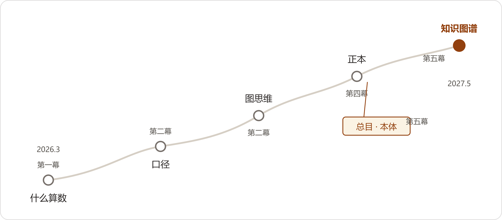
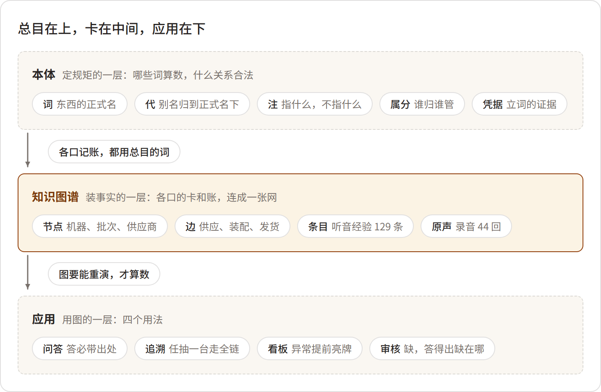

# 附录A 一张图看懂知识图谱与本体论
*Appendix A: The Whole Map*

> 这一部分把全书的知识线收拢成三张图：一条主线（这一年怎么走过来）、一组概念（总目和图到底是什么关系）、一段演进（六本账怎么变成一张图）。小说里的叫法和课本上的学名并排放在最后的对照表里。读完全书再回来看这一页，能把散在各章的说法对齐；没读过书直接翻到这页，也能看懂这家工厂最后立起来的东西是什么。

## 一、主线：一年，六个词

全书二十二章，知识上只走了一条线。第一幕发问，第二幕摸到旧办法，第三幕各口长账，第四幕问出正本，第五幕立总目、连成图。

:::流程
什么算数
→
口径
→
图思维
→
正本
→
总目（本体）
→
知识图谱
:::

<!--表宽:16%,14%,--->
| 幕（章） | 这一步 | 一句话 |
| --- | --- | --- |
| 第一幕·多事之春<br/>（第1-2章） | 什么算数（发问） | 四个坏消息同日到：根因埋在三年前的旧报告和一封邮件里，四个系统连不起来。先要弄清哪份文件现行、哪个数是真的。 |
| 第二幕·点火与速胜<br/>（第3-7章） | 口径、图思维 | 档案室的词表给出老办法：一个词一行注，指什么、不指什么。两万三千份文件清出有效目录；五百个节点连出第一张图；老唐开始口述。 |
| 第三幕·星火<br/>（第8-14章） | 各口长账 | 财务、售后、报价、看板各自长出知识资产；三堵墙碰过之后，六本账各在各家，第一次撞了车——本本都对，凑到一起没有一本是对的。 |
| 第四幕·大考<br/>（第15-17章） | 正本三问 | 审核要"任一产品全链路可追溯"，董事会问"哪本是正本，谁立的，谁认"。档案室一个下午，总目得到学名：本体。 |
| 第五幕·终局与传承<br/>（第18-22章） | 立总目、连成图 | 对词开工，供应商收户，治理立规矩。审核日抽签抽到哪台都答得上；老唐退休，一百二十九条条目和四十四回原声留下。 |

* * *



## 二、概念：总目在上，卡在中间，应用在下

第17章档案室那一下午，叶老把四十年的旧物和两个新名字对上了。这段话是全书概念结构的出处：

:::文书 叶栖梧，2027年3月1日，档案室（第17章）
"你们要编的那本总目，如今的学名，叫本体。词、代、属、分、参、注，这一套装进机器，写成机器认的规矩，叫本体。各口的卡、各家的账，照着这一套连成一张图——就叫知识图谱。总目是图纸，卡是砖。砖，你们有的是；缺的，是那张图。"
:::

按这段话画下来，是上下三层：最上层是本体，定规矩；中间层是图谱，装事实；最下层是应用，出答案。三层各自的内容如下。



```html
<div style="border:2px solid var(--accent); border-radius:8px; padding:12px 16px; margin:12px 0; page-break-inside:avoid;">
<div style="font-weight:700; margin-bottom:4px;">上层：本体（小说里叫：总目）——图纸</div>
<p style="margin:4px 0 8px;">"把一个行当在人脑子里那套想法定下来，写成字，不含糊，大家共拿。"（第17章·小夏译格鲁伯1993年定义）它管的是规矩，不是数据：哪些词算数、什么关系合法、违反了机器不收。</p>
<div style="display:flex; gap:8px; flex-wrap:wrap;">
<div class="flow-item" style="font-size:9pt; padding:5px 12px;">词（正式名）</div>
<div class="flow-item" style="font-size:9pt; padding:5px 12px;">代（别名挂底下）</div>
<div class="flow-item" style="font-size:9pt; padding:5px 12px;">注（指什么，不指什么）</div>
<div class="flow-item" style="font-size:9pt; padding:5px 12px;">属／分（一格一个爹）</div>
<div class="flow-item" style="font-size:9pt; padding:5px 12px;">凭据（空口报词不上会）</div>
</div>
</div>

<p style="text-align:center; color:#A8A29E; margin:2px 0;">↓ 卡合了，各口的账照旧记——记的时候，用总目的词（第17章第四条规矩）</p>

<div style="border:1.5px solid var(--accent-medium); border-radius:8px; padding:12px 16px; margin:12px 0; page-break-inside:avoid;">
<div style="font-weight:700; margin-bottom:4px;">中层：知识图谱（小说里叫：连成图的卡和账）——建筑</div>
<p style="margin:4px 0 8px;">照着总目把各口的事实挂上去：机器、批次、供应商、变更单、客户连成一张网。赵峰第5章手工喂出来的五百个节点是它的雏形，第19章合龙后的三千八百多台是它的完成态。</p>
<div style="display:flex; gap:8px; flex-wrap:wrap;">
<div class="flow-item" style="font-size:9pt; padding:5px 12px; border-color:var(--accent-medium); color:var(--accent-medium);">节点（机器、批次、供应商）</div>
<div class="flow-item" style="font-size:9pt; padding:5px 12px; border-color:var(--accent-medium); color:var(--accent-medium);">边（单据动词：供应、装配、发货）</div>
<div class="flow-item" style="font-size:9pt; padding:5px 12px; border-color:var(--accent-medium); color:var(--accent-medium);">条目（症状-部位-原因-方案）</div>
<div class="flow-item" style="font-size:9pt; padding:5px 12px; border-color:var(--accent-medium); color:var(--accent-medium);">原声（劲儿在声儿里）</div>
</div>
</div>

<p style="text-align:center; color:#A8A29E; margin:2px 0;">↓ 图要能重演，才有下一层（第13章·老蔡："凡是要我认的数，得能重演"）</p>

<div style="border:1px solid var(--border); background:var(--accent-light); border-radius:8px; padding:12px 16px; margin:12px 0; page-break-inside:avoid;">
<div style="font-weight:700; margin-bottom:4px;">下层：应用——这张图的用途</div>
<div style="display:flex; gap:8px; flex-wrap:wrap; margin-top:6px;">
<div class="flow-item" style="font-size:9pt; padding:5px 12px; border:1px solid var(--border); color:var(--text); background:white;">问答（带出处，没有就说没有）</div>
<div class="flow-item" style="font-size:9pt; padding:5px 12px; border:1px solid var(--border); color:var(--text); background:white;">追溯（任抽一台，链上走通）</div>
<div class="flow-item" style="font-size:9pt; padding:5px 12px; border:1px solid var(--border); color:var(--text); background:white;">看板（异常前置，红黄牌）</div>
<div class="flow-item" style="font-size:9pt; padding:5px 12px; border:1px solid var(--border); color:var(--text); background:white;">审核（缺，答得出缺在哪儿）</div>
</div>
</div>
```

:::提示
图纸类比有三条边界，书里各给了一个实例：一，图纸不必画完再施工——本体只需领先数据一步，从一门起（第17章："质量域起头，一个机型试"）；二，没有图纸也能盖，但那是孤立的事实仓库——六本账时期，各自都对，凑不成一张图；三，只有图纸没有楼——海力达四百八十万买了四百多页名目文档，没有一个真场景落地（第14章）。
:::

* * *

## 三、演进：六本账怎么变成一张图

```html
<div class="flow">
  <div class="flow-item" style="font-size:9pt;">六本账<br/><span style="font-weight:400; font-size:8pt; color:var(--text-secondary);">各在各家</span></div>
  <div class="flow-arrow">→</div>
  <div class="flow-item" style="font-size:9pt;">对词会<br/><span style="font-weight:400; font-size:8pt; color:var(--text-secondary);">吵着定，当场落字</span></div>
  <div class="flow-arrow">→</div>
  <div class="flow-item" style="font-size:9pt;">总目第一分册<br/><span style="font-weight:400; font-size:8pt; color:var(--text-secondary);">词、代、注、凭据</span></div>
  <div class="flow-arrow">→</div>
  <div class="flow-item" style="font-size:9pt;">各口照抄<br/><span style="font-weight:400; font-size:8pt; color:var(--text-secondary);">改走会，腊月添词</span></div>
  <div class="flow-arrow">→</div>
  <div class="flow-item" style="font-size:9pt;">图谱挂载<br/><span style="font-weight:400; font-size:8pt; color:var(--text-secondary);">节点、边按规矩连</span></div>
  <div class="flow-arrow">→</div>
  <div class="flow-item" style="font-size:9pt;">应用应答<br/><span style="font-weight:400; font-size:8pt; color:var(--text-secondary);">能重演</span></div>
</div>
```

这条路有正反两种走法，书里都演过：

:::对照
好：从一门起。质量域、一个机型、三十七个词起头，词吵着定，八回会立住第一分册（第17-18章）。海力达的老闵在电话里承认："你们比我强。我们从头到尾没有一个真用起来的地方"（第14章）。
坏：一次性吃全。海力达"全厂统一知识工程"：先建全厂名目，三百多种、四百多页文档，业务科室坐不进评审会，两年后项目组散伙（第14章）。八五年设计院合卡第一次失败，也是同一种失败方式：十一柜一起合，没人拍板，坐在屋里编（第16-17章）。
:::

## 四、小说叫法与学名对照

小说里的人物不知道学名，或者知道了也不常用。这张表把两边的词对齐，回正文查术语、出门看资料，两头都用得上。

<!--表宽:22%,36%,--->
| 小说里 | 学名 | 出处章 |
| --- | --- | --- |
| 总目 | 本体（Ontology，模式层） | 13、16、17 |
| 对词 | 术语对齐、共识构建 | 13、16、17 |
| 正本 | 权威数据源、黄金记录 | 13、15 |
| 注（指什么，不指什么） | 范围注释、形式化定义 | 3、16、17 |
| 挂代／引见卡 | 同义词映射／同义路由 | 16、17 |
| 添词会 | 本体演化治理 | 16、19 |
| 看门的／总目委员会 | 治理委员会 | 16、17 |
| 卡、账 | 实例、数据层三元组 | 16、18 |
| 图（赵峰的图） | 知识图谱 | 5、16、20 |
| 条目／原声 | 知识条目／原始多模态证据 | 9、21 |
| 叫法栏 | 别名字段 | 9、18 |
| 缺失卡／待核 | 缺失数据标注／人工审核队列 | 12、17、18 |
| 快照／手工喂图 | 数据快照／人工数据管道 | 5、7、14 |
| 能重演 | 可复现性 | 12、18、20 |

术语的完整解释见附录B，情节的真实出处见附录C。
