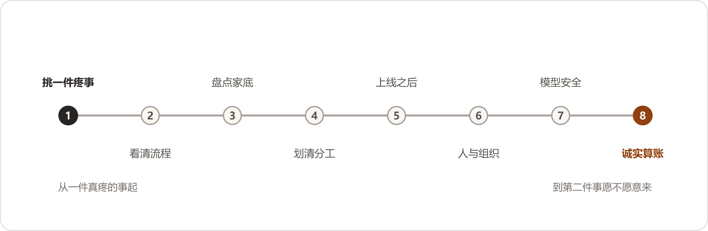

# 附录E 把AI用起来——写给企业里的人
*Appendix E: Putting AI to Work*



> 本篇按做事本身的顺序讲述"企业如何把AI用起来"，共八段。其中的说法均有真实出处，来历与边界在篇末交代；这里先把立场说明白——今天没有放之四海的标准答案，只有一批实际做过的企业走出来的路。路有八段：选事、看流程、盘家底、定分工、上线、过人关、置工具、算账。

## 一、选事：从最疼的问题入手

第一件事选什么，比后面所有的技术决定都重要。常见的错误是顺序颠倒：先问"AI能干什么"，再到全厂寻找可以套用的地方——拿着锤子找钉子，找回来的多半不是最该敲的那一颗。正确的问法是：我们哪里最疼。疼有具体的表现——那件事反复发生，有人天天在承受，耽误的东西看得见摸得着：一笔一笔对不上、要人工核对的账，一张一张看不过来的单据，一项只有老师傅会做、而老师傅明年要退休的活。

挑第一件事，有三条标准。第一条，最疼：不解决它，有人天天在消耗。第二条，最快：几个星期、至多一两个月能见分晓的，不选要做半年的。第三条，账最好算：省下的东西数得出来——省几个小时、追回多少钱、少加几个人，年底能写成一行数。三条标准全占的工作不多见，占住两条，就值得排第一。

选定之后，把开头定性为试验，不定性为工程。一项针对五十一个成功部署的调研显示：七成三的企业刻意从小的做起，六成三直接把项目定性为实验——出了问题便于回头，成了再放大。这项调研还有一条更令人宽慰的数字：六成一做成的项目，此前失败过一回。第一回不成不是谁的责任事故，而是这件事的常规工序。头一回交学费的企业，和头一回就成的企业，相差不大；交了学费就收手的，则和没做过的一样。

最后一条：第一件事不选最炫的。全面转型、智能中枢、行业大模型——这些词写进汇报里好听，放在第一件事上致命。第一件事越不起眼越好，越贴近具体的活越好。成了，第二件事的门就开了；败在一个大词上，往后两年没人再提这件事。

## 二、看流程：现状梳理先行

事情选定了，不要急着谈工具，先看这件事现在是怎么做的。有一家做翻译的公司，第一次上AI，流程没动，直接把工具塞进原来的工序，结果原有的毛病被放得更快，项目当年就死了。第二次换了一种做法：先停三个月，把流程里积年的毛病一条一条修掉，再让AI进入修好的流程——三小时的活变成三分钟。同一件事，同一个工具，前后差着一整个流程。这件事有个直白的说法：流程本身是坏的，AI只会让它坏得更快。

看流程的办法是现场观察，不是开会询问。开会问不出真话——一线的人在会议室里，领导在座，能说出来的都是"可以""没问题""挺顺利"。要派人坐在干活的人旁边，看几天：他一个上午跟隔壁位子回头探了几回，哪个步骤曾经卡壳，哪句话问过三遍，什么东西他宁可记在自己本子上也不录进系统。自述的水平与真实的水平相差很远：有一家企业给团队做培训，前期问卷收回来，自评中上偏上；开讲两个小时，发现一半人连最基础的操作都没过关，讲师当场把备了半个月的课件扔了，从零讲起。从那以后这家培训公司的规矩是：问卷只信三成，剩下七成进了场再说。

看完带三个问题回来。第一，这件事里现在谁最累；第二，他愿意把手里的活摊开来给你看吗；第三，他教别人的手艺，有没有落在纸上。三个都答得上，这件事可以动。有一个含糊，先去补那个含糊——它多半就是这件事真正的病根。

## 三、盘点家底

家底有两种：一种在系统里存放，一种在人脑子里装着。多数企业两头都缺，又两头都有存货——只是没有盘过。

先说系统里的。数据散在各处是常态，不是毛病。那项调研里，数据散在多个系统、由不同团队各管一段的，占五成九；把数据完全清理干净了才开始上AI的，只占百分之六。这两个数放在一起，结论就出来了：等数据齐了再干，等于永远不干。做成的企业走的是另一条路——不搬家，修路。数据留在原来的系统里，把访问的路修通：能查到、能取出来、能对上。散着的数据，用得起来；用不起来的集中，也没有用。

而且数据是边用边修的。系统运行起来之后，错的单子被纠正，纠正的结果回流进库，库越用越干净。反过来，为了"先把数据治好"停着不动的企业，库只会越放越旧——治理不是一次性大扫除，而是日常的打扫。

旧账不要小看。调研里七成五的做成企业，把多年积累的专有数据当作AI战略的关键；将近一半直接说，这些数据就是自家的护城河——哪怕当年积累的时候，谁也说不清积累它干什么。旧图纸、旧工单、旧台账，先存下来，比先想清楚有什么用更要紧。跟这一条配套的还有一个反面循环要警惕：库里找不到，照流程重新录一条，库里多出一条重复的，越重复越找不到，采购照着错的买。这个循环一旦转起来，病根往往不在录数据的人操作不稳，而在那条找东西的路太差。先把找得到修好，再谈别的账。

人脑子里的那半个家底更要紧，也更容易漏：判断、原委、例外。哪个客户其实是一家、这道工序什么情况下要偏离标准、这批料为什么放行了——这些都在人脑子里，人一走，跟着走。留下来的办法不神秘，只是麻烦：口述录音、把判断写成规程、给岗位写说明书，一条一条来。麻烦是这类家底唯一的取用成本，绕不开。

## 四、定分工：机器与人的界线

总的分工一句话能说完：认字、比对、搬运、初筛这类活，交给机器；判断、签字、担责，留给人。不是机器做不了判断——而是判断连着责任，责任必须有个落处，落到人身上才有人认。

第一个要避开的坑是端到端：指望东西从这头进去、答案从那头直接出来，中间全交给机器。这么干的几乎都交过学费。有一家做非标件的厂，第一版系统就是图纸进去、报价直接出来，数字看着漂亮，底稿对不上账，一单交了几十万的学费；后来改成两段——机器管前半段，把图纸拆成结构化的表；后半段接在厂里自己的物料库和规则上，每一单有人校准、签字。改完才立得住。

机器内部也有分工。有一家做物流装载的企业说得直白：能听懂人话的模型管听话、派活、把结果讲成人话；真算数的活交给更老的算法——出数的口子，模型不许碰。他们真封过一次口：模型自己额外估了一个数，与算法对不上，第二天出数的位置就只留给算法了。模型善于理解，算法善于计算，各守各的口。

验收的线，要与用的人一起画。先把这件事里最常出的问题收集起来当考题，让系统跑一遍，看看真实水平在哪里；合格线画在两边都认得了的地方，不画在厂商的宣传册上。线画高了，系统天天挨骂；画低了，废品放行。两边一起画的线，出了问题两边都认账。

能演示和能生产，是两回事。演示是问一个问题答一个问题；生产是同一个问题问八百遍、答案都得是同一个，业务才敢把章盖上去。稳定性不是模型自带的，而是做出来的：加校验、加规则、同一问题反复测，测到答案不再漂移为止。前面那项调研给过一个口径：做成的项目，全部是一小步一小步迭代出来的；按大计划一次成形交付的，一个都没有。

凡是对外见客户的东西——图、单、文——加一道一致性检查。有一家鞋服企业把一致性直接写进了验收：模特的模样要前后一致，衣服的版型颜色要与实物一致，场景不能乱串，三层全对才放行；机器先查一遍，人终审签字。这类检查的道理很朴素：对外的东西错一处就是事故，越是漂亮，客户越是当真。

也有可以让机器自己决定的活，有一个四条的框子：规则写不出来的复杂，人熬不住的重复，判据清楚，错了能退。四条占全，可以放手——有一家连锁超市让系统自己决定买什么、什么时候补、补多少，损耗降了四成，缺货降了八成。四条占不全，人守门。守门守的不是机器的面子，而是"错了退不回去"的那类后果：报价报错了、图纸签错了、钱付出去了——这些没有退货一说。

最后留一条退路：哪个环节机器老是出错，就把那个环节还给人，不要为了全自动的体面硬撑。段段有人把关的流水线，跑得比全自动的黑箱稳。

## 五、上线：落地的开始

系统上线不是项目结束。真正的落地发生在上线之后的头几个月，工具与活互相磨：页面难用、答案离谱、流程卡壳，都是这几个月冒出来、也是这几个月能改掉的。有一家培训公司的说法记在这里：系统上线那天，项目才刚开始。

工具进流程，不开新门。给员工一个新入口，发个通知让大家"自己去用"，多半用不起来——多一个入口，多一道登录，多一分"这跟我有什么关系"。长在原来的流程里才有人用：培训照旧打卡，答案长在单据里，机器人拉进已经在用的群。员工在哪里干活，工具就往哪里长。

先让用的人得好处，再谈推广。先把他每天最烦的那一步解决掉——要敲半屏的提示词、自带水印的图、要翻三个系统对的一笔账。这一步解决掉，他第二天自己来找你，问下一步能不能也办了。动员会上讲的道理，不如这一步有用。

头一两个月有人陪。答案不对，当场有人调；页面别扭，当场有人改。这个阶段的陪伴价值在两处：一是把工具磨贴合，二是让用的人知道出了事有人管——这份底气，比工具本身更决定他肯不肯把真活交给它。

用法要留下来。规程、模板、操作说明，写成企业自己的册子，放在新人够得着的地方。不要让活法长在某个能人身上——他休假一星期，系统跟着停一星期。留册子的意思，就是把能人脑子里那部分，趁热倒出来。

真正的验收在半年之后：对方愿不愿意做第二件事。验收会上都好说，锦旗也是那年送的；第二件事愿不愿意接着交给这套人马，才是这一年干得怎么样的实底。

## 六、过人关：最大的坎在人与组织

那项调研的第一个数字值得抄在这里：七成七的项目，最难的挑战不在技术，而在人、流程和治理。这篇文章前五段讲的都是活，到这一段讲人——十条难处里，七条在这。

阻力在哪里，与多数人想的不一样。不是一线：一线只占两成三。最硬的在中层和参谋口——法务、人事、风控这类把关的部门，占三成五。道理不复杂：一线怕的是多学一个新东西，中层和把关的怕的是担责任、动地盘。看不清这一层，推行的人会把力气花错地方——天天给一线办培训，真正该谈的人在会议室另一头。

更深的一层是怕被替代。让老师傅把经验教给系统，他的第一反应是"教会了，还要我吗"。这一问不过分，是人之常情。化解没有取巧的办法，就三样：把定位说清楚——替的是活，不是人；把承诺落在纸上——有一家企业把"不因AI裁人"写进制度、盖了章，设计团队这才开口把真话说全；把好处先给——先用起来的人，先得利。空口的保证，在这一关上一文不值。

一把手要真牵头。真牵头不是批预算、不是剪彩，而是出了问题顶在前面，路线吵起来时拍板，败了不换牵头的人。败了之后做成的项目，牵头人一个没换过；反过来，牵头人一换，前面积累的制度记忆跟着人就走了。还有一条配套：让技术部门单方牵头，很少能成；做成的跨部门项目，全是业务和技术两家一起牵头——一家出题，一家答题，谁也推卸不了责任。

每个部门要长出自己会用的人。有一家做半导体的，第一回各建各的库，散了；第二回每个部门指定一个人牵头，把用项写进部门目标，每个季度演示一回，做得好的发奖。数据收集从四十个小时降到一小时。两回用的工具，没有换过。换掉的不是工具，是用法和管法。

考核要跟着改。工具换了、流程换了，考核还按老账算，学的东西三个月就还回去了。有一家企业把研发的考核项从"一个月写多少"改成了"名下的文件齐不齐套"，就改了这一个项，那个组当月的行为就变了。人在哪里使劲，跟着考核走，不跟着号召走。

要AI接哪一摊活，先给它写一份岗位说明——与招人一样：干什么，输入是什么，输出是什么，哪一类自己定，哪一类必须报人。写的人最好是干这摊活的人自己，规矩自己定的，才认账、才肯盯。AI进门的手续办得越像招一个人，落地越顺。

败了不罚人。那五十一个做成项目里，没有一家因为AI项目失败处罚过谁。出了错，第一件事是把流程的窟窿补上、写进规程，然后才谈人的事。这不是心软，而是算账：罚一回，往后所有的错都藏起来了——藏起来的错，比暴露的错贵十倍。

省下的人往哪里去，要在动手之前想好，不要等省下来再想。路子就三条：加速——省下的时间多接活；转岗——有一家企业的安全团队，AI接了警报分诊之后，六个人的活一个半人就干了，一个没裁，腾出来的四个半人转到只有人能干的活上；裁员——这条路摆在那里，但做成的企业多数没走。这些企业的口径值得记下：AI替掉的，是企业本来要新招的人，不是已经在岗的人。也有一笔要如实照录的冷账：有研究基于千万级工资单数据发现，AI暴露高的岗位上，二十二到二十五岁年轻人的招工在下降。门确实在变窄。企业能做的，是把人往判断的位置上挪——这比假装没这回事，对人对厂都负责。

## 七、置工具：模型与安全的次序

模型不是第一个要做的决定，也不必为它站队。模型圈三个月一翻篇，今天吵得天翻地覆的胜负，年底就没有踪影了。但有几条实在的办法，值得在置办的时候用上。

第一条，按活派模型。粗活、量大的活，派便宜快当的；要紧的活，派强的。那项调研问过"模型是不是可以随便换"，答案分两层：说常规任务里模型随便换的，占七成一；说关键任务里也随便换的，一家都没有。所以不要在"选哪家"上赌身家，要在"怎么派"上花心思。第二条，要紧的事双保险：让两个模型各自独立答一遍，对上了才放行，对不上转人工——多花一份调用费，买一道对账。第三条，应用和模型中间加一层网关，往后换模型的时候，应用一行不用改。这三条都不贵；贵的是当初没留这层余地。

投入由轻到重。先租、先调接口、先小规模验证；价值没有看见之前，不置办一体机，不定制微调。有一家企业差点被推销着买了台一体机，那个价钱够把整个试验做三轮，买回来跑的还是原来那些活。家底也是同理：已有的系统、账号、平台、群，能挂上去就不推翻重来——员工在哪里办公，工具就往哪里长。

安全的账要前置。数据出不出域、敏感字段怎么脱敏、存在谁的机器上——这些在动手之前说清楚、写进方案；做完了再补，返工的是整个项目。有一家银行被合规禁用了公有云，没有被难住：敏感字段出境先清洗掉、换成合成的替代、回来再拼上，把安全的账提前算了，路就通了。安全这道题不挡路，挡路的是没提前算。

## 八、算账：诚实记账，等待回报

上线之前，先给人工记录一次耗时。这件事现在用几个人、几天、几个小时，白纸黑字记下来——这本底账，就是往后所有新东西的对照面。有一家企业项目做完才发现这笔账没法算：系统交付完，对方把访问权限一收，后面的数再也拿不到了；省了多少，谁也说不清，两边都只能含糊。底账要在动手之前记，这是吃过亏的人回头补的课。

口径要诚实。几天的统计，不能当全年的结论；试运行的数据，要说明是试运行；说得出什么、说不出什么，分开讲。做得长久的乙方都自己先泼冷水——几天的数据，如实标注是几天的数据。这不是实诚过头，而是让账立得住：吹出去的数字，早晚要有人对质。

省下的钱，要干这活的人自己认。报表上算出来的节省是一回事；经手的人一句"对，这钱确实就是这么省下来的"，这笔账才算立住。前一个数在财务那里，后一句话在车间里——两样都有，才敢往外说。

回报常常迟到。经济学里有一条老曲线，讲的就是这个脾气：新技术的红利，要等配套设施和用法一样一样长齐了才来，头几年账面难看——电气化走了四十年才走进千家万户。AI摊进企业，一样的脾气：先是一段看不见产出的投入期，然后好处才一段一段浮上来。第一年难看，是这条路的正常天气，不是走错了路。

好处有两种，第二种常常在启动时想不出来。第一种是省下来的：时间、钱、人手，这类好处上线几个月就能对账。第二种是以前根本做不到的：有一家保险公司把出合同从四天压到四小时，靠这个赢回了本来会丢的单子；有一家金融公司把一百万行没人敢动的老代码，几个星期迁移完了；有一家呼叫中心被AI原生的新对手逼到墙角，掉头把AI装进自己的服务里，一年赢回二十几个新项目，行业排名进了前四。第二种好处不写在立项书里——它长在用的过程里，用得越深，长得越多。

最后是失败的原因，也有一本账可对：三成五败在组织没准备好，两成七败在关键知识从来没沉淀过——都在人脑子里，人一走就带走了；一成八卡在法务合规。前两条，恰恰是这篇文章第一段和第六段讲的事。绕了一圈：最难的还是开头挑的那件事，和中间过的那一关人。

## 尾声：这些话的来历

这篇文章的说法，来自两份公开材料。一份是 Datawhale 的访谈集《FDE案例100》：二十四个真实项目的对话实录，做项目的和用项目的一起复盘，从进场怎么谈、中间怎么卡壳，到上线怎么翻车、怎么救回来。另一份是斯坦福大学 Digital Economy Lab 的《The Enterprise AI Playbook》：五十一个成功部署的访谈调研，十二个问题上各有一组数字。合计七十五个真实案例。这篇文章把两边的说法拆开、合并在一起，按企业做这件事本身的顺序重排——原文里没有这个结构，结构是为读者服务的。

边界也照实说：两份材料都是做成了一方的讲述，失败的项目没有访谈录，这是幸存者视角；斯坦福那份是征求意见稿，数字以正式版为准；文中所有百分比和金额，按原口径照录，没有外推。所以这一篇是路标，不是保证书——七十五家企业走过来的是这些坎，过坎的顺序和办法如此；走到自家厂里，路还得自己走。

下面这张表，给读过前面二十二卷的读者：这八段里的每一条做法，书里哪一章演过。没读过的读者不需要它；读过的读者拿它对照——哪条对哪章，翻回去就能对上。

<!--表宽:22%,--->
| 段落 | 书里的落点 |
| --- | --- |
| 一、选事：从最疼的问题入手 | 第7章（需求单先挑最疼、最快、账最好算的）；第2章（三条路都败过一回） |
| 二、看流程：现状梳理先行 | 第4章（先清文件、立"什么算数"再放开问答）；第9章（小夏下矿跟岗）；间一（调研只信三成） |
| 三、盘点家底 | 第6章、第22章（人脑子里的家底，口述成册）；第8、11章（数据散在各口，先修访问的路） |
| 四、定分工：机器与人的界线 | 第8章（机器提差异，人定对错）；第10章（端到端之死，改为结构化＋校准）；第20章（错了退得回去才放手）；间二（AI出初稿，字是人签的） |
| 五、上线：落地的开始 | 第9章（培训进流程、照旧打卡）；第14章（各管各的债） |
| 六、过人关：最大的坎在人与组织 | 第13章（执行一号位）；第20章（金岭记了账、没罚人）；第16章（路线之争，两家共同牵头）；第20章（岗位说明、谁能用）；间一（闻姐把不裁人写进制度） |
| 七、置工具：模型与安全的次序 | 第2章（法务脱敏）；间二（"别急着买"、由轻到重） |
| 八、算账：诚实记账，等待回报 | 第7章、第16章（"还不能证明利润提升"）；第11章（企业负责人自己看数）；后记（七仗之二：先记录效果基线） |

## 补记：八段的外部回声（2026）

上面这张表对的是书里的章节。补记对的是书外。正文里小夏追的那位号主，实有其人：署名叶小钗，做企业AI落地的一线实践者，2026年5月到9月写了一组公开文章（他的方法论笔记整编为附录F）。八段是七十五个案例走出来的路，这位公众号作者和他笔下的企业，在同一年把其中几段又走了一遍。选几处对得上的，原句照录，段名对齐：

```html
<table>
<tbody>
<tr><td>一、选事：从最疼的问题入手</td><td>"每个完整的业务蓝图都有十几个值得解决的问题，但一期也只能选择帮助最大的一个点做穿。"（企业培训现场，学员得出的结论）</td></tr>
<tr><td>二、看流程：现状梳理先行</td><td>"其实，对于工作流AI项目，比起选择运行载体更加重要的是SOP是否梳理清楚。"（选型长文的第一性原则）</td></tr>
<tr><td>三、盘点家底</td><td>"他们实际上会选个10万级别预算的业务开始"；数据清洗的成本"偶尔会超过50%"。（本体项目的账）</td></tr>
<tr><td>四、定分工：机器与人的界线</td><td>"AI不会补位，他只认上下文。""宁愿让业务人员手动复制粘贴，也要先证明智能体给出的答案真的有用。"</td></tr>
<tr><td>五、上线：落地的开始</td><td>"AI覆盖了对话，并不等于接管了工作。"（两年电商客服复盘）</td></tr>
<tr><td>六、过人关：最大的坎在人与组织</td><td>"我为什么要花额外的时间，去帮公司学习AI？"（一线员工的心声，作者注：不好听，但很真实）"AI暴露的不是AI的问题，而是组织原本就存在的问题。"</td></tr>
<tr><td>七、置工具：模型与安全的次序</td><td>"能写成规则的，不要交给大模型。能固化成Workflow的，不要让Agent每次重新规划。"（分工判词）</td></tr>
<tr><td>八、算账：诚实记账，等待回报</td><td>"结果正确只是及格线，过程正确才是准入线。"（医疗开方系统的判断链）</td></tr>
</tbody>
</table>
```

边界照录：以上句子出自公众号文章，亲历与转述混杂，句后括号注了来历；其中六处进了正文（第17、18、20章与后记），其余收在这张表里。八段是路标，这一块是路标旁多立的一块——仅供参考。
