# 附录G 二十四家，六个问题——一本案例集的横读
*Appendix G: Twenty-Four Teams, Six Questions*

> 这一节读的是一本书：Datawhale 的访谈集《FDE案例100》。二十四家企业AI落地的真实项目，每个项目回答同样的六个问题。我们把二十四份答卷按问题横着读——每一问读一遍，读完在那一问下写一篇；六篇的骨架各不相同，长成什么样，由那一问的材料自己决定。

### 先认六个问题

1. **场景**——作为FDE，你应用AI的具体场景是什么？在这个场景下遇到的具体问题长什么样？
2. **旧解法**——在你参与之前，这个问题过去是怎么解决的？
3. **方案**——后来你使用AI解决这个问题的整体思路和关键步骤是什么？
4. **效果**——相比传统方式，使用AI后的实际效果如何？
5. **坎**——在部署AI过程中，是否遇到了新问题或挑战？你是怎么解决的？
6. **经验**——根据你的经验，我们怎么才能更好地把AI部署到实际业务中？

六个问题连起来，正好是一个项目的全程：发现场景，还原旧法，设计方案，对账效果，暴露新坎，沉淀经验。读的时候不必按顺序，每一篇都可以单独读。

三句话交代材料。引号里的话都是答卷原话，照录未改；归派、计数和排序是编辑的手，原书里没有这些结构。二十四家都是做成了的一方，失败的访谈录不存在——这是材料的边界，读的时候记着。案号是案例集的编号，本节末尾附有二十四案的标题目录，随时可对。

## 第一问｜场景是翻译出来的——进门那句话、现场的活、五个真问题 {#appG-q1}

### 先说结论

读这一问之前，我们以为会看到二十四份场景说明书：每家报上行业和业务，问题列上三条。读完发现对不上。二十四份答案几乎没有一份把场景当成现成的东西来报——七家把客户当初说的第一句话原样写进了答案，一家明说客户从头到尾没提过AI，剩下的几家从进现场写起。这些答案合起来讲的是同一件事：

:::文书

**客户说出口的第一句话，没有一句能直接当需求用；场景是FDE进到现场之后，一句一句翻译出来的。**

:::

问法预设FDE带着场景进场，答法显示场景是进场之后才长出来的。这个错位本身就有信息量：对一线做落地的人来说，场景从来和找它的过程绑在一起，过程才是本事所在。

顺着材料自己的叙事，我们把这条线叫翻译线，分三段：

1. **听来的话**：客户进门那天说了什么——方向词、愿望、抱怨，或者一句都没说；

1. **现场的活**：FDE进现场做了什么——坐在业务员旁边看、让客户录屏演示、往下追问；

1. **真问题**：翻译出来的东西长什么样——二十四家拆出的真问题收拢之后一共五类。

五类之后单说五手独门活，收尾把找场景编成一套能带走的做法。

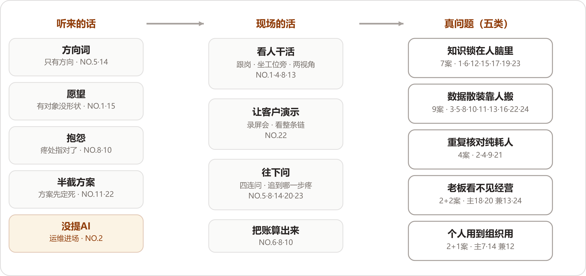

*翻译线：进门听到的话分四档，另有一家连话都没说；现场的活全是土办法；真问题收拢成五类。*

### 一、进门那天听到的话

先把七家留下的客户原话摆在一起。这个摆法本身就值得看一眼——愿意把客户当初那句话原样写进答案的FDE，等于承认整个项目是从那句话起步的：

- **TikTok达人建联（NO.5）**：客户问的那句话宽得没有边——

:::文书 —— 客户原话，NO.5 案记录

"我们团队怎么用AI赋能？"

:::

- **国企电商子公司（NO.14）**：管理层的要求同样含糊——"既然公司的数字化建设在国企中已经领先，能不能再往AI走一步？"

- **制造业师徒带教（NO.1）**：企业最开始说的是"我们想把老师傅的经验沉淀下来"。

- **本地生活短视频（NO.15）**：提的问题很朴素——"有没有可能用AI，把这件事情接起来？"

- **线下零售对账（NO.10）**：客户提出来的也是一个非常朴素的问题，"对账太费人工了"。

- **工业物料采购（NO.8）**：记下的那句话出自访谈中间——几乎每个部门都在抱怨同一件事，"ERP不好用"。

- **跨境电商库存补货（NO.22）**：说得最简单，"能不能把这个SaaS和飞书打通"。

清单外还有两句要记。**城市规划研判（NO.4）**留下的那条，是领导派活时的口头禅："帮我看看识别下xx区域的潜力用地有哪些？"一句话下去，下面的人要查资料、调数据、做空间分析、跑工具、开会讨论，最后才能形成报告。**车管所审材料（NO.2）**则连一句与AI有关的话都没有，这家放在下一节单独说。

九句话放在一起，形态当场就能分辨出来：

- **方向词**（NO.5、NO.14）：往哪里走说了，走过去干什么没说，句子里连一个业务名词都找不到；
- **愿望**（NO.1、NO.15）：想要的东西说了，它长什么样、从哪里下手没说；
- **抱怨**（NO.8、NO.10）：疼处指对了，说法用不了——"ERP不好用"还不能算一个可以直接交给工程师解决的问题，这个判断是NO.8自己下的；
- **半截方案**（NO.11、NO.22）：看着最像需求，其实客户已经把方案替你想了半截。**外贸资料整理（NO.11）**的企业负责人把交互都设计好了——能不能跟AI说一句话，"帮我找一下某个客户之前用过的某个模板"，东西就找出来；NO.22那句"打通"，定死的还只是最小的那半截。

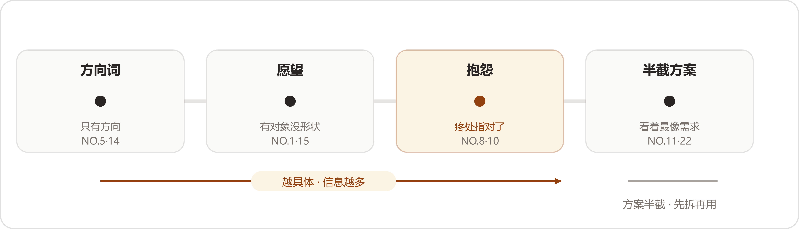

*客户第一句话的谱系：从方向词到半截方案，话越具体含的信息越多；看着最像需求的那两家的方案，要先拆掉再用。*

为什么客户说不出需求？材料里给了三层原因，各有一家作证。

第一层，企业负责人自己看不见。**消防维保数字化（NO.13）**里的企业负责人"无法实时掌握一线情况"，"汇报和现场之间，永远隔着一层信息差"。NO.14说得更直白：

:::文书 —— NO.14 原话

"高层不会直接告诉你：'我希望法务少招一个人'，'我希望员工的重复劳动减少'。他只会说：'我们要拥抱AI。'"

:::

第二层，一线习惯了。NO.2里那条人工审核的流程"一直这么运行，所以大家甚至已经习惯了"。习惯了的东西不会被人当成问题说出来，它只是每天发生。

第三层，会议室里问不出来。NO.8的体会是"很多问题，如果只在会议室里问，是问不出来的"，有时候要"直接坐在业务人员旁边，看他实际怎么工作"。

把九句话再读一遍，还有一个反复出现、但我们不敢把它说得太满的次序：越接近抱怨的句子，含的信息越多，顺着挖就有东西；越接近方案的句子，越要先把它里面那半截方案拆掉才用得上。"对账太费人工了"至少指对了疼的地方；NO.5那句话连疼的地方都没指，要从头找起。NO.4给这层意思钉了一颗钉子："如果这些条件都不存在，只是为了'AI First'硬找一个场景，我觉得没有必要。"

所以第一句话的正确用法是当门票：它告诉你门开在哪、谁放你进去。进门之后的地图，要自己画。

### 二、翻译发生在哪里：全是土办法

进门之后到真问题浮出来之前，二十四家做的事拆开看，工具箱里没有一件高级的工具。看人、开会、录屏、追问，全是土办法；算账的那一路是独门手艺，留到第四节单说。按动作分三种。

**看人干活。****工业物料采购（NO.8）**的做法最有代表性："有时候我会直接坐在业务人员旁边，看他实际怎么工作。"**制造业师徒带教（NO.1）**连先后顺序都排好了："我进场之后，没有先问'要用什么模型'，先去看他们到底怎么培养新人"。**消防维保数字化（NO.13）**看的是两层人："我进入现场后，从两个完全不同的视角看到了问题的全貌"——企业负责人看见的是"看不见"，一线维保人员面对的是填表、整理、打印、归档这些纯消耗。**城市规划研判（NO.4）**看的面最宽：要打交道的大约有10个部门，每个部门有自己的专业工具、业务语义和工作流，他把难点总结成"把业务、数据、空间、工具这四件事情连起来"，外加第五件事——人；不然"AI生成出来的东西看起来很专业，真正的规划师一看就知道不对"。

**让客户演示。****跨境电商库存补货（NO.22）**最典型。客户要的是把SaaS和飞书打通，FDE没有把它当成一个API集成项目接下来：

:::文书 —— NO.22 原话

"我们没有急着开发，连续开了几次会，让客户录屏演示他们实际怎么工作。"

:::

就是在录屏里看到的：物流环节靠拍照识图，员工看照片、填数据；库存靠Excel算补货，数据从聚合SaaS里提取出来，算完填进另一个模板，再生成PDF发给供应商。一句"打通"背后是整条链，"库存只是整条链路上的一个环节"。

**往下问。**问也有问法。**TikTok达人建联（NO.5）**没有正面接那个问题，反过来先问了四件事：

:::文书 —— NO.5 原话

"你们现在的业务到底怎么跑？哪个环节最慢？谁每天最累？哪里最容易出错？"

:::

**工业物料采购（NO.8）**追问的是三件事：到底哪里不好用，平时是怎么操作的，问题发生在哪一步。**国企电商子公司（NO.14）**把追问列成了纪律——进入业务现场以后继续往下问："做什么？为什么现在要做？哪个环节最痛？这个痛点究竟是人不够、流程不清、数据没有沉淀，还是组织机制的问题？"**汽配供应链经营（NO.20）**和**工程租赁获客报价（NO.23）**问的对象最清楚，都先找企业负责人：NO.20"最开始先跟老板聊他到底想解决什么问题"，NO.23的说法是"第一件事其实是先把老板真正想解决的问题搞清楚，再判断这里能不能用AI"。

翻译的产出，是一家一句重新说过的话。NO.8最后把问题定义成"能不能通过改善数据质量和物料查找能力，减少那些原本不应该发生的错误采购和重复采购"——从一句抱怨，到一句业务方和工程师都能接住的话。NO.14的收束更短："先把客户真正的问题找出来，再决定做什么。"

这里要记一个我们的保留："翻译"这个词把过程说得太优雅了。它听着像一次安静的转换，实际做起来是时间和人力的堆积——NO.8围绕ERP及其上下游团队"进行了持续数月的深入访谈"；NO.13的一线维保人员，"有些时候，一个表格的填写和整理就能占用半天时间"。案例集里写得轻，真金白银的是驻场的人天。找场景这份工作，自己就先是一个没有合同金额的项目。

这一节收尾要补一个特殊的进门方式。**车管所审材料（NO.2）**"一开始客户并没有提出一个'AI需求'"——FDE进车管所，原本接的是一个系统运维项目：原来的承建商倒闭了，源代码不完整，文档缺失，系统横跨.NET客户端、安卓端、Web管理多种技术，"很多公司评估以后都不愿意接"。他把这个项目接了下来，回头看，"运维只是我进入业务现场的入口"。驻场期间他注意到一件事：浙江的政务服务数字化程度已经比较高，群众在线上就能办事，但"前台已经数字化了，后台却还有大量工作依赖人工"——群众上传的身份证、营业执照、合同、发票，全是质量五花八门的图片，工作人员一张一张点开，用肉眼判断对不对、全不全。它给翻译线补了一个入口：门未必由客户来开，脏活也能把门打开。接下没人敢接的烂摊子，换来了驻场的位置和看业务的时间。它还提醒了一件事：客户没开口，未必等于没有问题，可能只是习惯把痛感磨掉了，磨到谁都不再当成问题。

### 三、真问题的五种长相

把二十四家拆出的真问题按主要病根归位，一案一个主位，收成五类；一案跨两类的，兼症记一笔，不影响主位。先给全图：

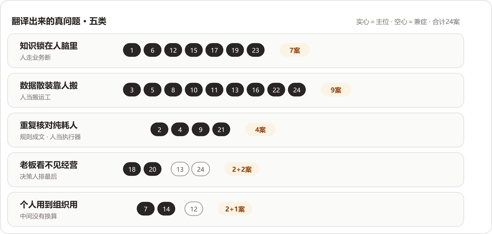

*五类真问题与案号分布：实心为主位，空心为兼症；手艺七案、数据九案、规则四案、看不见两案带两兼、组织两案带一兼，合计二十四。*

#### 第一类：知识锁在人脑里，人走业务断（主位七案）

**制造业师徒带教（NO.1）、跨境物流装载（NO.6）、鞋服电商素材（NO.12）、本地生活短视频（NO.15）、非标制造报价（NO.17）、消费品包装审核（NO.19）、工程租赁获客报价（NO.23）**的主病根都在这里；**生物科技上市公司（NO.18）**的客户线索问题同源，主位归第四类，这里带一笔。

这一类的开场白出奇地一致，都是同一种假设：某个关键的人不在了，业务会怎样。NO.1的企业"最担心的是，如果人走了，经验会不会也跟着人一起走了"。NO.23的企业负责人"自己有客户，却没有能力把所有客户都接住"。NO.17里"如果某个技术骨干正好在忙，报价卡在那里几天，这个售前节点就可能直接卡死，最后订单流失"。NO.12的素材跟着人走，"一个人离职、换岗，素材也可能跟着断掉"。再往细看，NO.15说的是同一件事的规模化版本："好的内容靠人，规模化生产又离不开人，但人本身就是瓶颈"——他们最高峰的时候，一天要出两三百条文案，会写的人写不了那么多。NO.12补了一句最狠的："企业不可能把整个内容生产体系建立在几个高手身上。"

为什么手艺进不了文档？NO.1的答案是这些经验"很难简单靠一份操作手册完整记录下来"。**消费品包装审核（NO.19）**说得更细：为什么选这种配方，"可能是过去做了很多次实验之后积累下来的经验"，这些如果没被记录下来，系统里"留下的往往只是一个结果，缺少'为什么这么做'的过程"。系统里存的是结论，值钱的判断理由跟着人走。

这类病还有个不好报价的特点：损失都挂在将来时上。NO.1是"最担心"，NO.23是"原来觉得无所谓的500万，可能明天就真的没有了"——都没有真的发生。带走的判断题只有一道：把关键那个人抽走三个月，业务哪里先停？答得出来的，就是这一类。

#### 第二类：数据散装，人当搬运工（主位九案）

**律所案件工作台（NO.3）、TikTok达人建联（NO.5）、工业物料采购（NO.8）、线下零售对账（NO.10）、外贸资料整理（NO.11）、消防维保数字化（NO.13）、电信数据分析（NO.16）、跨境电商库存补货（NO.22）、澳洲乳企动销（NO.24）**——最大的一类。

这一类最容易被人误解成企业数字化基础差，恰恰对不上。NO.22的客户有现成的多平台聚合SaaS，各平台的库存自动汇总进去；NO.16的客户手里有大量网络数据，还配着数据分析师；NO.8的客户有ERP，十五个团队围着它转。数据都在，散着。NO.22给这类病留了最准的一句话："数据已经产生了，人还在充当那个'数据搬运工'。"

散的位置各有各的。NO.13散在介质之间：检查记录在纸质表格里，维修记录在Excel里，客户信息在某个人的微信聊天记录里，设备档案散落在不同文件夹。NO.5散在系统之间：TikTok上有一部分，Excel里有一部分，财务系统里还有一部分，企业负责人想弄清一个达人从建联到最终产生交易额经历了什么，并不容易。NO.3散在案卷里：一个商事案件动辄数十种材料、总页数上千页，全靠律师逐一阅读、标注、归类，而且诉讼周期一长，"每次重新进入案件都要花费大量时间恢复记忆"。NO.24散在两家公司之间：总部和经销商靠Excel、邮件来回传数据，中间还要过语言转换，"看似只是传递数据，但实际上每一步都会产生损耗"——滞后、失真、人工成本，三样全占。NO.16散得最隐蔽：数据都在，分析师也在，但每个新问题都要人重新写一遍SQL去接一次线。

机理是同一个：系统按部门、按用途、按年份分期建成，没有人负责把它们连起来，连接的活落在具体的人身上。NO.8还给这类病装了一个加速器：员工找不到物料，以为库里没有，重新录一条，数据多一份重复，下一个人更难找——找不到、重录、更脏、更找不到，一路通到买错买重。NO.8留给这一类的那句原话值得记下来：

:::文书 —— NO.8 原话

"我明明知道这个部件数据库里有，我上次还用过，但现在就是找不到。"

:::

现场只要问一句：这个数从哪来？要问过三个人才落到出处的，就是这一类。

#### 第三类：重复核对，纯耗人（主位四案）

**车管所审材料（NO.2）、城市规划研判（NO.4）、央国企财务流程（NO.9）、建筑消防施工图（NO.21）**。

这一类的活有个共同点：规则成文，对错可判，人在里面出的主要是体力和眼力。NO.2的三个特征说得最完整——慢、累、量上不去：单件业务从头到尾审核下来大概要15分钟；这种工作"谈不上复杂，只是高度重复"，有工作人员直接反馈"眼睛都受不了"；快递企业驻点承接寄递，业务量上不去，这项服务本身就面临经营压力。**建筑消防施工图（NO.21）**是绘制和核对的对比：同一栋楼里几十个功能相似的空间，每个都要重复类似的布置流程，"设计人员的大量精力消耗在执行重复规则上"，而且"这个核对过程往往比绘制本身更耗时"。**央国企财务流程（NO.9）**是判断和录入的循环：一笔报销要判断费用性质、项目归属，还要去找出差申请、审批记录、所属部门，这些信息"分散在不同的业务流程里"，业务量上来以后，财务人员大量时间花在重复判断和录入上。

NO.4是这类里最容易被忽视的一家，因为它的活顶着"专业"的名义。领导一句"帮我看看识别下xx区域的潜力用地有哪些？"，最值得先接过来的，是规划师每天反复做、规则相对明确、数据能够追溯的那部分工作。专业的外壳下面，大部分是规则执行。

NO.9还有一层独有的东西：被浪费的是谁。他们服务的科研央企里有大量科研人员，甚至是博士，"真正应该投入的是科研工作，但大量时间被消耗在一个报销流程里"；NO.9的原话是"让高价值的人去做低价值、重复性的流程工作，本身就是一种浪费"。同样的病，落在博士身上和落在普通职员身上，代价差着一个量级。

判断题：这个环节的规则，写不写得成一本手册？写得成、又天天靠人执行的，就是它。这一类也是二十四家里最早被机器接走的一类，接的过程放在第三问里细说。

#### 第四类：企业负责人看不见经营（主位两案，兼症两案）

主位是**汽配供应链经营（NO.20）**和**生物科技上市公司（NO.18）**；**消防维保数字化（NO.13）**和**澳洲乳企动销（NO.24）**的主病根在第二类，"看不见"是数据病长出来的并发症。

共同形状：必须做决定的那个人，结构性地排在信息链的最后一节。NO.20最典型——ERP里订单、生产任务、采购、库存、发货的数据都有，"但并没有真正形成老板需要的'经营视角'"，企业负责人每天要处理的事情太多，不可能逐条核对，"很多时候只能问下面的人"。NO.18是时间上的断：客户、订单、绩效的数据没有统一基础，提成靠Excel人工统计，"数据延迟1个月以上是常态"。NO.13是层级上的断：企业负责人只能靠周期性的汇报了解业务。NO.24断得最彻底："货发出去，过了国境就断了"——总部看得见发货，看不见动销，而"Sell Through更能反映真实市场需求、营销投入效果和消费者反馈，但在跨境场景下，这类数据往往最难获得"。

值得多看一眼的是，这四家的数据多数都在场。NO.20明说ERP里什么都有，缺的是把它们对到一起的那道工序；NO.24的数据在经销商手里，缺的是按时按口径送回来的那条路。NO.24还点出了口径这一层：总部问"销售情况怎么样"，"有人理解为卖给经销商多少，有人理解为消费者购买多少"——数据送到了，意思还可能对不上。

这类病最隐蔽的地方在于，疼的人没有流程里的痛感。企业负责人的疼是忙、是心里没底，报表上显不出来，所以也很少有人拿它立项。判断题：企业负责人最想知道的那个数，多久能到他桌上？答案是下个月、或者得去问人的，就是它。

#### 第五类：个人会用，公司用不上（主位两案，兼症一案）

主位是**基金公司研发转型（NO.7）**和**国企电商子公司（NO.14）**；**鞋服电商素材（NO.12）**的兼症记在这里。

先说一个读的时候没料到的观察：这是五类里唯一没有"过去"的一类。前面四类的病，二十年前就在；这一类的病，是工具进步本身造出来的——个人先用上了AI，公司层面反而多出一截够不着的东西。

NO.7是标准样本。这家基金公司的研发团队，在FDE接触之前"其实已经在用AI了，而且有些人用得还挺深"，有人用Codex，有人用Claude Code，问题被一句总结点破：

:::文书 —— NO.7 原话

"大家都会用，但企业很难让大家一起用。"

:::

个人的理由也很硬："我用这个工具效率高，你让我换另一个，我反而不会干活。"而管理层要的，是AI"能够成为一种组织能力，而不再只是散落在员工电脑里的个人工具"。NO.12的兼症是同一个走向：每个人自己开AI账号、自己写提示词，"看起来大家都'用上AI了'，实际上只是把一个新工具塞进了旧流程里"。

NO.14在这条线的更远处。它的员工还没怎么用上AI，管理层就直接要组织能力："既然公司的数字化建设在国企中已经领先，能不能再往AI走一步？"拆出来的真问题两句话说完：业务在增长，国企有编制限制，人员不能跟着业务无限增加，真正懂电商的人才又不一定愿意进国企；合规要求严，法务团队只有两个人，却要面对不同业务线、不同合作伙伴的大量合同。

三家摆成一条坡度：NO.12个人都在用、各用各的；NO.7个人用得深、统一反而遇到阻力；NO.14个人还没怎么用，管理层直接要能力。坡的尽头是同一句问话：忙了半天，公司手里落下了什么？机理也清楚：个人效率和组织能力之间没有自动换算，工具越好用，个人越有理由守住自己那套习惯，公司的流程反而越插不进手。判断题：让团队各自报一下在用的工具。答案五花八门、谁也不肯换的，是NO.7那种；答案整齐的，接着往下查编制和内控，是NO.14那种。

### 四、五手独门活

五类收纳归位了二十四家，但还有五件事情，分类装不下。它们是五家各自多走的半步，值得一家一句单说。

**跨境物流装载（NO.6）把场景定义成了一本经济账。**很多人看这个项目，会以为它只是一个装箱问题，算算怎么摆能多装就行。NO.6进场后先算的却是钱：跨境运输的运费按"方"计算，一辆约110方的货车，老师傅靠经验通常能装到95～98方，而98方是保本线，每超过保本线一方，能多收100美元运费。这本账算完，场景自己站住了：

:::文书 —— NO.6 原话

"装载率不是技术指标，是利润开关：装不满98方就亏，装得越满、越过保本线越多，赚得越多。"

:::

别的家还在找疼处，这家直接把疼换算成了单价：问题从空间利用率不高，挪到了每一方没装满的空间都是钱，评审的时候谁都驳不倒。

**线下零售对账（NO.10）把价值的方向翻了个面。**这个案子进场时听上去最不值得做：对账太费人工了，一个周期一两个人天，省也省不出多少。往下翻却翻出了收入：

:::文书 —— NO.10 原话

"过去总部甚至会给门店设一个'容忍区间'，因为大家都知道人工对账太麻烦，如果差异在一定比例以内，就干脆不再追了。"

:::

机器接管核对之后，容忍区间里的差异重新变成能追的钱，NO.10的原话是"真正让我觉得这个问题值得做的，是我们后来发现：它除了省人工，还可能直接影响收入"。同一个场景，从成本项翻成了收入项，值不值得做，答案完全两样。

**外贸资料整理（NO.11）把信任列成了问题。**这家企业负责人的需求单看着具体：一句话找模板、看阿里国际站数据、给网站发文章、产品图自动进海报模板。FDE拆下去，前两个真问题是数字资产没组织起来、企业缺AI能跑起来的环境，第三个反而被点成了最重要的：

:::文书 —— NO.11 原话

"第三个问题反而最重要，就是信任。"

:::

企业负责人听过AI概念，甚至知道Agent是什么，但不知道这些东西跟自己每天遇到的问题有什么关系。把信不信这件事当成问题来管理，二十四家里只此一家——别家的问题清单里全是业务，这一家把开场的第一道关也算了进去："你不能说今天买一个大模型账号，明天企业就AI化了。"

**电信数据分析（NO.16）要的东西都有，缺的是组合。**客户有数据、有分析师、也有AI工具，三样全在场。NO.16的判断把这些家底一语概括：

:::文书 —— NO.16 原话

"客户已经有数据、有分析师，也有很多AI工具，但这些东西还没有真正组合成一个可靠的业务流程。"

:::

它说明第二类的病根查起来，不能停在问数据有没有，要问下一环节拿不拿得到；再往深一层，还要问已有的东西串没串成流程。真问题有时候一件东西都不用添，全靠重排。

**生物科技上市公司（NO.18）是反向案例：场景筛出来了，家底没准备好。**这一家的前半程走得又快又标准——"通过4维模型帮他们筛选出了价值最高的几个场景做先行试点，销售部门是第一个选中的"，理由也现成，"销售离收入最近、痛点也最集中"。按翻译线的说法，这一步走得很漂亮。但拆下去，问题挪了地方："管理层想看清销售大盘，但当时客户、订单、绩效这些数据，并没有形成一个统一的基础"，结论摆得很清楚：

:::文书 —— NO.18 原话

"企业已经产生了AI转型的需求，但销售的数据、系统、人才和认知还没有准备好。"

:::

它给这一问的结论补了后半句：场景为真、地基为虚，照样开不了工。翻译的产出除了真问题，还附一张地基的体检单，NO.11说的环境、NO.18说的数据和认知，都在这张单子上。

### 收口｜方法论：把找场景编成五步

把二十四家的进场动作合起来，找场景可以被编成五步。前三步走翻译线，第四步对号，第五步上保险：

1. **收下第一句话，当门票用。**它告诉你门开在哪、谁放你进去；照它直接开工，做出来的东西客户多半自己都没痛处（NO.5、NO.14、NO.22）。

1. **进现场看活。**眼睛、录屏、追问三样轮着上：能坐在业务员旁边看，就别只在会议室里问（NO.8）；客户嘴上说不清的，让他演示一遍（NO.22）；问就问最慢、最累、最容易出错的地方（NO.5）。

1. **把账算出来。**抱怨要往钱上翻，翻到损失可以计算为止：NO.6翻到98方保本线和每超一方100美元，NO.8从"找不到"一路翻到错误采购和重复采购，NO.10从人工翻到容忍区间里漏收的钱。翻不到钱的，先放一放。

1. **拿五类清单对号。**一案一主位，兼症记一笔。

1. **上两道保险。**问痛感——这件事痛到要改了吗，还是大家都习惯了（NO.2）？问地基——数据、系统、人才、认知准备好了吗（NO.18）？

五类自查清单，每类一道现场判断题：

| 真问题 | 现场判断题 | 案号 |
| --- | --- | --- |
| 知识锁在人脑里 | 把关键那个人抽走三个月，业务哪里先停？ | NO.1／6／12／15／17／19／23 |
| 数据散装靠人搬 | 这个数从哪来，要问过几个人才问得清？ | NO.3／5／8／10／11／13／16／22／24 |
| 重复核对纯耗人 | 这套规则写不写得成手册？是不是天天靠人执行？ | NO.2／4／9／21 |
| 企业负责人看不见经营 | 企业负责人最想要的那个数，多久能到他桌上？ | NO.18／20（兼：NO.13／24） |
| 个人会用，公司用不上 | 让各人报一下在用的工具，谁肯换？ | NO.7／14（兼：NO.12） |

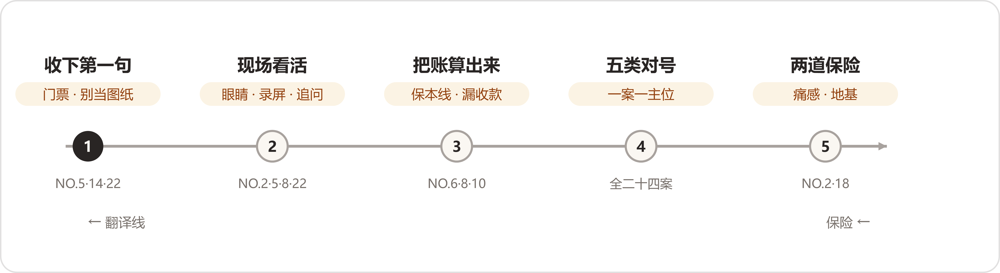

*找场景五步：前三步走翻译线，第四步对号，第五步上两道保险。*

读这一问下来，我们最大的收获是把找场景从一件靠灵感的事，看成了一件有动作、有判断题、有清单的手艺活。二十四家里进场动作最扎实的那几家——NO.8的数月访谈、NO.22的录屏会、NO.6的经济账——拆出的问题也最立得住。反过来看，客户第一句话里最像需求的那几句，恰恰要先拆掉再用。

:::文书 —— NO.2 原话，抄来收尾

"很多时候，真正的需求并不会自己跳出来。你得先进入现场，看业务是怎么跑的，看人在做什么，看哪个环节每天重复发生，再去判断这里有没有值得被AI重新改造的地方。"

:::

## 第二问｜旧解法没有错：一份替过去说话的辩护词 {#appG-q2}

### 先说结论

这一问读下来，最先站出来的是一个姿态问题。问的是“过去是怎么解决的”，二十四份答案本可以把它答成一场对旧世界的控诉——FDE进场之前的烂摊子，正好拿来抬高现在的东西。没有一家这么写。逐家数过去，二十四份里有二十二份，把“能够运行”“有它的合理性”“并没有错”这类话直接写进了答案，连给得最勉强的那家也给了“勉强可以维持”；剩下两份在平静地记录过去的做法，没有一句贬低。这一问是六问里姿态最齐的一问，齐在替过去说话。

替过去说话，因为过去经得起替它说话。把二十二句好话连起来读，一个总判断自己站了出来：

:::文书

**旧解法没有错。它们在原来的规模里是合身的；撑破它们的是规模和复杂度；AI接手的，是从合身解法里溢出来的那一部分。**

:::

师徒制带得动两三个月一批的新人，只要老师傅还在、还有时间；企业负责人亲自报价谈得下大客户，只要订单还集中在少数几个身上。旧解法跑不动的那一天，压垮它的东西几乎全部落在业务侧——量涨了，材料变样了，懂行的人要退了。这些“过去”可以按企业为这件事走到过的地步分成四层：

1. **纯人扛**：几乎没有系统，事情全压在人身上（十家）；

1. **买过软件没接住**：ERP、SaaS、外包、BI，钱花过，现场没接上（七家）；

1. **自试AI停在半途**：自己动手上过AI，停在半成品（四家）；

1. **专业工具强、人当串联件**：工具最专业的三家，卡在人身上（三家）。

阶梯从下往上，旧解法里“系统”的分量一层比一层重。走到第四层的顶上，“再买一套工具”这条路也就走到了头——顶上溢出来的部分，就是AI接下来要接的。

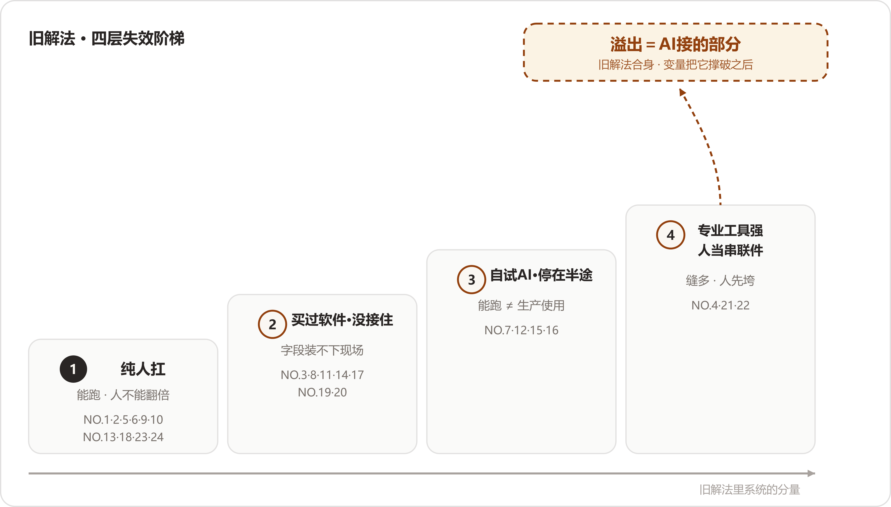

*四层失效阶梯：从纯人扛到专业工具强、人当串联件，越往上系统的分量越重；顶部标出的，是从合身解法里溢出、由AI接手的那部分。*

这一篇按一份辩护词的顺序走：先替旧解法立传，再请四层证人上阶梯，然后查压垮它们的变量，最后单说两个旧解法没有失效的特例。

### 立传｜二十二份答案，先替旧解法说话

立传之前，先把传主的群像记下来。二十四家的“过去”各是什么样子，一行一家：

- **制造业师徒带教（NO.1）**：老师傅带新人，一套培训加实习做下来，两三个月甚至更长；
- **车管所审材料（NO.2）**：工作人员打开图片肉眼审核，再人工办后面的业务；
- **律所案件工作台（NO.3）**：律师人工读材料，转成法律专业语言，查库，凭经验成判断，最后出报告；
- **城市规划研判（NO.4）**：规划师查资料，进专业工具叠图层、跑计算，各部门的判断再汇总成报告；
- **TikTok达人建联（NO.5）**：一个运营维护几十个达人，进度记在脑子里，配着飞书和Excel；
- **跨境物流装载（NO.6）**：老师傅凭经验判断什么货放下面、哪些货能组合、哪些空间能利用；
- **基金公司研发转型（NO.7）**：产品经理照原样写PRD，开发照文档开发，各角色按原分工推进；
- **工业物料采购（NO.8）**：业务员知道编码就按编码找，知道名称就按名称找，实在找不到就重新录入一遍；
- **央国企财务流程（NO.9）**：财务凭专业经验判断每笔钱记哪个科目，再开网站建单据，一行一行填；
- **线下零售对账（NO.10）**：拉多系统数据，看总额、看分项，对着差异找原因；
- **外贸资料整理（NO.11）**：要网站找做网站的，要ERP买ERP，一个问题对应一个工具或一个人；
- **鞋服电商素材（NO.12）**：设计师理解商品也理解品牌审美，企业要什么图，他们就做什么图；
- **消防维保数字化（NO.13）**：企业负责人凭多年行业经验判断业务，员工凭熟悉流程完成工作；
- **国企电商子公司（NO.14）**：成熟的软件加流程，简单的做配置，复杂的开发模块，再复杂的先做咨询；
- **本地生活短视频（NO.15）**：文案、拍摄、剪辑各有人负责，负责人协调审核，经验长在运营脑子里；
- **电信数据分析（NO.16）**：分析师自己写SQL、跑模型、出报告，凭业务经验判断结果；
- **非标制造报价（NO.17）**：老师傅打开图纸，凭经验理解客户要求，再查物料、供应商和历史价格；
- **生物科技上市公司（NO.18）**：销售自己维护客户关系，提成绩效用Excel统计，新人靠老带新；
- **消费品包装审核（NO.19）**：一摞成熟的SaaS各管一段，研发、生产、渠道各有系统；
- **汽配供应链经营（NO.20）**：标准化ERP里看订单、库存和发货，标准化的企业管理够用；
- **建筑消防施工图（NO.21）**：设计人员用CAD配着消防规范手册画图，凭专业知识应对不同项目；
- **跨境电商库存补货（NO.22）**：Excel、聚合SaaS、飞书都在转，补货有自己的一套公式；
- **工程租赁获客报价（NO.23）**：企业负责人亲自谈客户、亲自定价；
- **澳洲乳企动销（NO.24）**：经销商整理销售数据，销售做Excel，业务员翻译整理再反馈总部。

把清单读一遍的感受：这些办法一点都不含糊。它们多数已经运行了很多年，运行得有章法，好话也一句句写在了答案里——

:::文书 —— NO.9 原话

“过去这套方式其实完全可以运行。”

:::

:::文书 —— NO.4 原话

“所以传统方式其实有它存在的合理性：专业人员掌握规则，专业工具保证计算精度，人的经验负责最终判断。”

:::

:::文书 —— NO.23 原话

“其实过去这种方式完全可以运行，而且在业务增长期甚至是比较合理的。”

:::

:::文书 —— NO.10 原话

“所以，过去的方法本身并没有错，问题在于业务复杂度超过了人工方式的承载能力。”

:::

:::文书 —— NO.1 原话

“制造业里的很多经验，本来就是在长期实践中形成的，老师傅不仅知道标准答案，还知道什么时候不能机械地照标准答案执行，所以过去依靠师徒制，其实是一种非常自然的知识传递方式。”

:::

为什么姿态这么齐？我们的读法有两层。浅的一层是分寸：旧解法里坐着具体的人——老师傅、财务、企业负责人本人，他们明天还要接着干活，进门先数落他们的办法，后面的合作就难了。深的一层是准确：这些办法确实运行了很长时间，多数到FDE进场那天还在运行。替旧解法说话，先把话说对了，然后才谈得上礼貌。

把两个最“原始”的摆在一起看最有意思。制造业师徒带教（NO.1）和工程租赁获客报价（NO.23），一个是行业里最老的传授办法，一个是企业里最原始的定价办法，两案的FDE分别给了它们“非常自然的知识传递方式”和“最有效率的方式”两个评语。旧解法干的往往正是难的那部分活：师徒制传的是“什么时候不能机械地照标准答案执行”，企业负责人报价背的是价格不透明、金额大、因素复杂的判断。这些活当初只有人做得来，旧解法等于先把难题接了下来。

立传还有一层实用价值：传立完了，哪些东西动不得也就清楚了。城市规划研判（NO.4）把这层意思直接说了出来——

:::文书 —— NO.4 原话

“因此我们做AI改造的时候，没打算把传统流程推翻。我的思路反而是，原来正确的东西尽量留下，把机器更擅长的部分接过去。”

:::

### 失效阶梯｜四层旧解法，四种撑破的方式

传立完了，该查失效。二十四家按“企业为这件事走到过哪一步”归位：没动过系统的进第一层，买过软件的进第二层，自己上过AI的进第三层，专业工具齐全的进第四层。有几家跨层——生物科技上市公司（NO.18）有老旧的ERP和OA，消防维保数字化（NO.13）引入过监控平台，澳洲乳企动销（NO.24）上过BI，跨境物流装载（NO.6）的行业试过装载类数字化工具——都按主病根归位，另一层的旧账在下文带一笔。

#### 第一层｜纯人扛：能跑，但人不能跟着业务翻倍

十家：NO.1、2、5、6、9、10、13、18、23、24。

这一层的失效方式高度一致：每一单都占一个人，业务翻倍，人就得翻倍。央国企财务流程（NO.9）把整层的失效方式一句话说完——

:::文书 —— NO.9 原话

“业务量增加一倍，就增加一倍的财务人员，这条路很难走得通。”

:::

财务的活分两段，前面要有人判断，后面要有人执行：一张发票过来，要结合出差申请、部门、项目判断这笔钱怎么记；判断完还要打开集团网站，创建单据，一行一行填了再提交。判断时间加执行时间，两段都长在人身上。

- **TikTok达人建联（NO.5）**：

:::文书 —— NO.5 原话

“一个运营每天维护几十个达人，自己记得住谁聊到哪一步、谁收了样品、谁还没有拍视频，再配合飞书和Excel，业务就能够正常运转。”

:::

撑破它的是复杂度：选品池从几百个商品变成上万个，运营不可能再靠经验一个个匹配；达人多了，不可能每天人工翻Excel找谁要催；数据散在不同系统里，管理者看不到整个业务漏斗。这家的收束语把整层的分界画得最清楚：旧解法管的是业务能不能跑起来，规模上来以后还能不能高效地跑，要另想办法。

- **跨境物流装载（NO.6）**：老师傅凭经验装车，一辆车装下来要五六个小时。原文给失效归了两条，第一条只有六个字：“首先，经验无法复制。”一个优秀装车工人的经验要多年积累，新人很难快速掌握；第二条，人工解不了复杂组合——几十件货物人还能判断，车型、种类、数量上来之后，人找不到最优方案。

- **制造业师徒带教（NO.1）**：带一个新人两三个月起步。撑破它的变量长在人的两端：一端是老师傅自己的生产任务重，没有足够时间持续带人；另一端是经验丰富的员工开始接近退休。

- **线下零售对账（NO.10）**：一个店，一两个小时甚至一天的核对还能接受；门店多起来，每个周期都要重复做。人工除了慢，还会产生连续的返工：发现差异、重新确认、修改，再核对；员工觉得某个差异不值得追，就直接放弃了。

- **生物科技上市公司（NO.18）**：销售这条线靠人硬撑——Excel算提成，线下培训会加老带新教新人，HR和老销售一起筛简历。带一笔旧账：企业有ERP有OA，但系统老旧、数据不通，大量关键数据退回Excel和个人手里。撑破它的是管理视角：业务流程稳定时，Excel算提成分得清；管理层要实时看不同区域趋势、分析涨跌原因时，原来的方式就撑不住了。

- **消防维保数字化（NO.13）**：基本没有完整的软件基础设施，企业负责人靠经验判断，员工靠熟悉流程干活。也带一笔：去年和外部团队合作引入过一个监控平台，除此之外没有形成数据体系和流程系统。行业利润空间持续下降、企业想拓展新业务的时候，经验驱动的短板露了出来。

- **澳洲乳企动销（NO.24）**：总部发货，经销商收货、整理销售数据，销售做Excel，业务员翻译整理再反馈总部。经销商规模有限、市场变化不复杂时，人工沟通撑得住业务。这家也交过BI的学费，那笔账记在第二层。

- **车管所审材料（NO.2）**、**工程租赁获客报价（NO.23）**：两家也在这一层，但它们的旧解法到FDE进场那天都没失效，留在最后单独说。

读这一层最容易犯的错，是把“纯人扛”读成“落后”。读下来的感受正相反：这十家扛得有章法——运营记得住几十个达人的进度，财务知道每笔钱进哪个科目，老师傅清楚哪种工艺大概多少成本。人扛的办法本身没有毛病，毛病在业务的量翻上来之后，人这种容器有上限。

#### 第二层｜买过软件没接住：学费交了，断在结构化的门口

七家：NO.3、8、11、14、17、19、20。另有四笔外账：NO.6的行业试过装载类工具，NO.13试过监控平台，NO.18守着老旧的ERP和OA，NO.24上过BI。

- **非标制造报价（NO.17）**：早期上过ERP和报价模板，想用固定字段把报价流程管起来。结果：

:::文书 —— NO.17 原话

“这类系统擅长的是‘你把字段填进去，我按规则往下跑’，最难的第一步，也就是把客户五花八门的输入理解成标准数据，始终没人解决。所以系统最后只能覆盖标准件和固定SKU，非标部分照样回到人，模板反而多填一遍表。”

:::

一句“模板反而多填一遍表”，把买软件买成负担的滋味写到了极处：系统接走了标准件，接不住非标；非标还得人来，人反而多了一道填表的活。

- **澳洲乳企动销（NO.24）的BI账**：过去也尝试过引入BI工具和报表系统，希望把经销商数据统一管起来。

:::文书 —— NO.24 原话

“但问题在于，这些工具只能处理已经结构化的数据，而海外经销商的原始数据恰恰是非结构化的。工具上线后，数据清洗和整理仍然靠人工，系统只是换了一个地方看Excel。”

:::

这家还有一句更尖锐的：

:::文书 —— NO.24 原话

“BI解决的是把数画成图，解决不了两个市场口径不一样——把两份不可比的数据画成漂亮的图，只是让不可比这件事更隐蔽了。企业花了钱，但没有解决核心问题。”

:::

- **外贸资料整理（NO.11）**：企业负责人为数字化和AI相关服务花过大约5万元，对方能基于国际站拿到一些数据，也搭过外贸网站。产品本身有价值，更接近一个标准化产品：

:::文书 —— NO.11 原话

“企业遇到个性化问题以后，后续没有人继续陪他往下走，也没有人告诉他这个工具怎么和自己公司的工作方式结合。”

:::

这家的碎需求多到写不成需求文档：

:::文书 —— NO.11 原话

“更关键的是，很多问题甚至没有清晰到可以直接写成需求文档。老板知道‘这里不太顺’，但他自己都不知道应该开发什么。”

:::

有个例子很形象：客户给来一个类似三角尺的产品，上面一排不规则的刻度；找过美工，做过3D打样，一直没搞清那排刻度是什么，准备人工照着抄，又抄不准。这一单后来怎么解开的，效果那一问再算账。

- **律所案件工作台（NO.3）**：行业早有工具——法律数据库、文档管理系统、早期的法律问答工具。问题出在工具的形状和律师工作的形状对不上：

:::文书 —— NO.3 原话

“但这些工具解决的只是‘查’和‘生成’两个单点动作。真实案件是持续变化的，律师需要反复回到同一个案件，补充分析、更新判断。”

:::

每个工具只解决一个单点问题，律师在五六个系统之间切换，案件上下文被割裂；工具的使用门槛又和律师自然的工作方式有断层，要学特定的检索语法。最终，大部分工具沦为查法条的辅助手段。

- **工业物料采购（NO.8）**：数字化的第一步，这家早已迈出——ERP承载着长期的库存管理流程，录入、采购、合同、仓储各有职责。难在工业物料的数据太杂：同一个东西有不同的名称、描述方式、单位、录入习惯，检索又主要靠传统字段和关键词。业务员以前靠经验兜底，知道编码按编码找、知道名称按名称找、找不到就重新录入；数据越积越多，经验兜底越来越吃力。这家把责任划得很清：

:::文书 —— NO.8 原话

“所以这笔账，不能算在一线员工头上，先顶不住的是那套搜索系统。”

:::

原文接下去一句：“于是数字化的工具本身成了新的瓶颈。”

- **消费品包装审核（NO.19）**：SaaS不少，研发、生产、渠道各有各的。限制也说得直白：

:::文书 —— NO.19 原话

“但它有一个天然的限制：系统记录的是结果，人负责输入信息。”

:::

:::文书 —— NO.19 原话

“只要信息需要人主动输入，就一定会发生损耗。”

:::

消费品业务偏偏有大量非结构化的信息，表单装不下；SKU增加之后，待审核的包装堆起来排队。这家给旧SaaS的结论只有一句：“过去的SaaS解决的是上一阶段的问题。”

- **汽配供应链经营（NO.20）**：管家婆ERP里看客户订单、生产任务单、采购单、库存、发货，标准化的企业管理能够工作，这家的FDE也把话说在前头：“所以我不会说原来的方式‘不好’。”问题出在ERP解决标准化的信息管理，企业负责人要的是贴近经营的判断视角。扳手的例子：供应商发来5000个扳手，实际只发了4980个；按ERP的标准逻辑，数量没到5000，这单没法正常入库。现实里没人会把4980个扳手退回去，仓库里实实在在多了4980个，系统却表达不了这种“实际发生了，但标准流程没有完整结束”的情况。这类问题如果靠人工处理，就意味着员工需要额外记录、解释和沟通；企业负责人要想知道真实情况，只好回过头再问一遍人。

:::文书 —— NO.20 原话

“于是就出现了一个很典型的情况：数据都有，但老板还是看不清。”

:::

- **国企电商子公司（NO.14）**：这家的旧账记在交付模式本身。传统软件交付的做法：简单的做配置，复杂的开发模块，再复杂的先做咨询，把业务流程梳理清楚再交付系统。这套方式的前提，原文说得明白：

:::文书 —— NO.14 原话

“这套方式过去完全能跑通，但它的前提是软件行业几十年的最佳实践，能被信息化覆盖的业务部分，是能被讲清楚、流程相对固定。”

:::

而企业知识大量没有被讲清楚——法务审过很多合同，留下的只有一份修改后的合同，为什么这么改、哪些条款关键，都在法务脑子里；客服在脑子里形成了一套知识体系，没有落进AI能用的数据系统。

:::文书 —— NO.14 原话

“很多企业知识根本没有被沉淀，被结构化。”

:::

这一层最值得研究，因为七家用行动证明了自己不保守：钱花过，决定做过，买的动作在当时都是理性的。接不住的位置倒出奇地一致——工具要的是能填进字段的东西，现场长的偏偏是装不进字段的：五花八门的图纸（NO.17）、名称各异的物料（NO.8）、口径不一的海外报表（NO.24）、写不成需求文档的碎需求（NO.11）、没人讲得清的企业知识（NO.14）。买软件的钱，断在了结构化的门口。

NO.17的模板和NO.24的BI是同一件事的两种样子：钱都花在了下游——按规则跑、把数画成图；卡都卡在了上游——输入五花八门、口径不可比。NO.11的5万元断在同一个门口，只是断法多了一层人情：标准化产品交完就走，“没有人继续陪他往下走”。

所以见到“买过系统没用起来”的企业，先不要急着下“不重视数字化”的结论，先问断在哪里。断在结构化门口的企业，恰恰是AI最对口的客户——大模型接的正是这一段。

#### 第三层｜自试AI停在半途：工具到手，手艺没到

四家：NO.7、12、15、16。

这是四层里最少人注意的一层，也是读起来最感慨的一层——这四家不等谁来推，自己先动了手。他们的半成品，等于替所有企业先试了一遍错。

- **电信数据分析（NO.16）**：客户试过仪表盘自动生成报告，试过Agent框架，在FDE介入之前自己搭过一个Agent。提示词原文照录：

:::文书 —— NO.16 原话

“客户自己做的Agent，可能就是给模型一个提示词：‘你现在是一个数据分析师，我给你这些数据，请帮我分析。’”

:::

看起来合理，跑起来结果不满意，底层模型很好也一样。这一层的题眼也出自这家：

:::文书 —— NO.16 原话

“‘能跑起来’和‘可以生产使用’，是完全两回事。”

:::

客户里有人把问题归结成大模型本来就不确定、答案不一样很正常。这家的FDE不认：

:::文书 —— NO.16 原话

“如果我是一个企业老板，我问一个Agent两遍‘我们公司哪个班的成绩最好’，我希望它在数据没有变化的情况下告诉我同一个人。模型本身具有随机性，不代表我们做出来的业务系统就必须是不稳定的。”

:::

- **鞋服电商素材（NO.12）**：客户很积极，让员工自己用各种AI产品提效。结果从“人做图”变成了“人盯着AI做图”：

:::文书 —— NO.12 原话

“以前是‘人做图’，后来变成了‘人盯着AI做图’，人还得自己反复调整。更麻烦的是，这种方式会把人的差异继续放大。同样一套工具，不同的人用出来，结果完全不同。所以从企业角度看，这依然谈不上稳定的生产能力。”

:::

- **本地生活短视频（NO.15）**：试过直接让AI写，本地部署了DeepSeek，效果没有达到预期。这家后来把原因想明白了：

:::文书 —— NO.15 原话

“我后来在项目里发现，AI味其实很大程度上来自一种‘固定范式’：给AI一套固定模板，让它不断模仿。这样做在单个案例里可能有效，但当面对不同商户、不同题材、不同场景时，就容易机械地重复。”

:::

- **基金公司研发转型（NO.7）**：AI Coding工具出来后，研发各自尝试，“个人提效”阶段相安无事——个人只需要对自己的效率负责。走到团队提效，问题全冒出来：工作内容转向Markdown、TXT，十几份文档怎么拆、产品经理写什么、前后端写什么、测试运维写什么、同时修改怎么避免冲突，原来的角色边界全部要重新谈。这家对旧方法的评语前面立传时引过：适应原来研发模式的一套成熟方法。它补上的是另一半：

:::文书 —— NO.7 原话

“这也是我后来越来越明显的一个感受：AI真正进入企业之后，很多时候改变的不只是工具，还有工具背后的工作方式。”

:::

四家的半途形态摆成一排，恰好是一组“个人用AI”的失效标本：个人在用、组织没用上（NO.7）；人在盯AI、差异被放大（NO.12）；模板在跑、味道不对（NO.15）；Demo能演示、生产不敢用（NO.16）。四种形态指向同一处——AI工具买得到、装得上、跑得起来，把“跑得起来”变成“敢在生产上用”的那门手艺，市面上买不到。

把NO.16和NO.12对照着看最有意思：一个败在系统的不稳定，问两遍给两个答案；一个败在产出的不稳定，一套工具不同人用出不同结果。两家要的都是稳定，半途的AI给不出来的也都是稳定。NO.16把要做的这件事说成了自己的任务：

:::文书 —— NO.16 原话

“所以我们真正需要解决的，是怎么设计一个系统，让模型能够在业务流程里被可靠地使用。”

:::

这一层的存在，还顺带校正了一个流行说法——“企业不用AI是因为抵触”。至少这四家不抵触，自己就试过。真正的断层在试完之后：试完停在半途，往前那一步需要的手艺，正是FDE这个角色的职责范围。

#### 第四层｜专业工具强、人当串联件：工具路线的尽头

三家：NO.4、21、22。

先摆一个会颠覆直觉的事实：被人当串联件卡得最死的三家，恰恰是全卷数字化程度最高的三家。城市规划研判（NO.4）的原话可以直接作证：

:::文书 —— NO.4 原话

“其实规划设计院原来的数字化程度并不低。他们不缺软件，使用的专业软件反而非常复杂。规划师本身也是典型的高数字素养人群。”

:::

- **城市规划研判（NO.4）**：单项分析过去一小时左右，一份跨部门的完整报告要3—5天，有时接近一周。原文特意补了一句：这个时间说明不了效率低，是城市规划对精度的要求高——一条道路画在哪里、一个地块碰没碰到历史文化保护线、污水承载能力够不够，都不能随便回答。系统先筛出20块候选地块，从20块里挑出真正适合的10块，还要不同部门开几轮会。压垮它的是分量：要考虑的数据、规则和部门不断增多，专业人员的时间耗在查资料、找规则、切换工具、重复计算、整理报告上。收束语前面引过半句，整句在这里：

:::文书 —— NO.4 原话

“这也说明，规划院的数字化工具其实一直在，只是它们解决的是单个环节的计算精度，没有一个角色把业务、数据、空间和工具真正连接起来，于是跨部门、跨工具的流程依旧靠人来串联。”

:::

- **建筑消防施工图（NO.21）**：CAD配消防规范手册，项目规模小时运转正常。两个瓶颈：效率天花板——熟练设计人员一天能完成的施工图面积有上限，项目集中到来只能加人，而培养一个合格的消防设计人员需要较长时间；经验难以标准化——不同设计人员对规范的理解和设计习惯有差异，同类型空间的消防布置因人而异，图纸质量不一致，审核要额外投入。行业里的数字化尝试也有过，插件、参数化工具都试过：

:::文书 —— NO.21 原话

“但这些工具通常只解决单点问题（如自动计算间距），无法覆盖从图纸理解到成果输出的完整流程。设计人员仍然需要在多个工具之间切换，实际效率提升有限。”

:::

- **跨境电商库存补货（NO.22）**：工具不算少——Excel、聚合SaaS、飞书都在转；补货有自己的公式，看SKU过去三个月的销售，结合预测逻辑，算出该补什么颜色、什么尺码、补多少。这套逻辑成立。问题在它被埋进一条要人工反复搬数据的流程：

:::文书 —— NO.22 原话

“工作人员先把数据从一个系统里扒下来，填进Excel；Excel算完，又誊到另一个模板；物流照片到了，再一张张人工看；广告又在另外的平台上跑。”

:::

:::文书 —— NO.22 原话

“每件事单独看都不重，可一旦连成一串，就是一条非常长的人工链路。”

:::

SKU涨到几千个，人一天的时间大量耗在“看、抄、填、核对”上。这一问开篇那句被反复引用的话，就是这家的：

:::文书 —— NO.22 原话

“最累的，是那个在各个工具之间来回搬数据的人。”

:::

三家摆在一起，“数字化程度低才需要AI”这句流行话就站不住了。每一段工具都强，工具之间的缝全归人；缝多了，人先垮。AI在这层的角色因此也清楚：它来顶的是“串联件”这个位置，专业工具一个都不用换——城市规划研判（NO.4）后来的做法正是让AI去调度专业工具，计算仍留给工具。

把第一层和第四层对照着看，还能看出一件事：从什么系统都没有，到什么专业工具都有，卡人的位置换了模样，卡法没有变过——第一层卡在“人不能翻倍”，第四层卡在“缝不能翻倍”；两层中间隔着的所有投资，都没有碰过“串联”这个动作本身。判断一家工具齐全的企业要不要AI，别看它缺什么工具，看它的缝：谁在工具之间来回跑，跑的量在涨还是在跌。涨，溢出就已经发生了。

### 压垮它的变量：规模、非结构化、经验不可复制

四层证人都上完了，该查真正的凶手。把二十四段收束语摆在一起，压垮旧解法的东西自己浮出来，翻来覆去就三样：量涨了，材料变形了，懂行的人不在了。给它们正式的名字：**规模**、**非结构化**、**经验不可复制**。三样各管一头——数量、形状、载体。

#### 规模：量涨了，人不能跟着涨

这一根的证据几乎不用挑，每一段收束语里都有它：央国企财务流程（NO.9）的业务量增加一倍就要增加一倍财务人员；TikTok达人建联（NO.5）的选品池从几百个变成上万个；跨境电商库存补货（NO.22）的SKU从几十几百涨到几千；非标制造报价（NO.17）的订单越来越多、非标需求越来越多，人的处理能力不会同比增长，售前链路排队；鞋服电商素材（NO.12）的SKU、图片、视频越来越多，内容产能和人力数量绑在一起；线下零售对账（NO.10）的门店数量增加，每个周期重复核对；本地生活短视频（NO.15）的客户数量多起来；消费品包装审核（NO.19）的SKU增加，待审核包装堆积；建筑消防施工图（NO.21）的项目集中到来；跨境物流装载（NO.6）的跨境贸易规模增加；澳洲乳企动销（NO.24）的业务规模扩大；生物科技上市公司（NO.18）的管理层从算清提成要看实时趋势。

规模的残忍在于它不破坏任何一环，只把每一环都乘以一个倍数；人恰恰是链条里唯一乘不动的那一环。非标制造报价（NO.17）把它写成了那家要解的新问题：

:::文书 —— NO.17 原话

“所以我们真正想解决的，是一个新问题：当业务规模继续扩大时，能不能不再靠增加更多人、更多老师傅来撑住报价能力。”

:::

判断这一根到了没到，就看一句：业务再翻一倍，人怎么办？答“再招一批人”的，还没到；答不上来的，到了。

#### 非结构化：材料长的样子，字段装不下

第二层七家断在结构化门口的账，全记在这一根名下：非标制造报价（NO.17）最难的第一步，是把客户五花八门的输入理解成标准数据；工业物料采购（NO.8）的同一物料有不同名称、描述、单位、录入习惯；消费品包装审核（NO.19）有大量表单装不下的信息；外贸资料整理（NO.11）的碎需求写不成需求文档；消防维保数字化（NO.13）的顾虑也在这一根上——“很多外部方案功能列表看起来很完善，但没有真正理解企业现场的监管流程和实际执行方式”；律所案件工作台（NO.3）的案件上下文在五六个系统之间被割裂，也是材料的形状和工具的形状对不上。澳洲乳企动销（NO.24）给这一根留了最具体的一笔：

:::文书 —— NO.24 原话

“字段名称不统一、销售单位不一致、促销活动规则不同、买赠、返利等业务信息难以结构化。”

:::

有些数据来自Excel，有些来自PDF，有些甚至是图片或手写凭证。

非结构化这根稻草专压第二层——买软件的钱花在下游，卡在上游。它还有一个隐蔽之处：企业自己往往说不清它。企业负责人只知道“这里不太顺”（NO.11），要把它说成需求，得先把材料翻一遍。第二层的学费单看起来都像“软件不行”，原因就在这里：软件行的部分都行了，不行的只是门口那一段。看到一家企业说“我们上过系统，没用”，先看它系统的入口收什么。收字段、收表单的，非结构化材料堵在门口；堵住的那段，正是大模型的活。

#### 经验不可复制：知识长在个别人身上

这一根的原始判词出自跨境物流装载（NO.6）：“首先，经验无法复制。”一个优秀装车工人的经验需要多年积累，新人很难快速掌握。往后数：制造业师徒带教（NO.1）的老师傅一端生产任务重没时间带人，一端接近退休；非标制造报价（NO.17）的经验长期握在少数人手里，企业很难把这种能力复制出去；建筑消防施工图（NO.21）培养一个合格的消防设计人员需要较长时间，同类型空间的布置还因人而异；生物科技上市公司（NO.18）的新人靠老带新手把手教，客户关系由销售自己维护；本地生活短视频（NO.15）的经验存在运营脑子里，没写进标准化文档；TikTok达人建联（NO.5）的商务沟通里那些微妙的东西，过去靠经验丰富的BD去判断；国企电商子公司（NO.14）的企业知识没被结构化，留在法务和客服的脑子里。

这根稻草和前两根的分别，在于它带一根时间引信：规模今天不涨它也在走——老师傅在变老，BD在流动，客户关系跟着人走。前两根变量企业看得见，订单多了、报表杂了；这一根要等“那个人”请假、离职、退休才看得见，所以最容易被拖着。问一家企业“这件事谁最懂”，如果答案是一个人名，这一根就已经在位；再看这个人多大、忙不忙、走不走，紧迫程度就出来了。

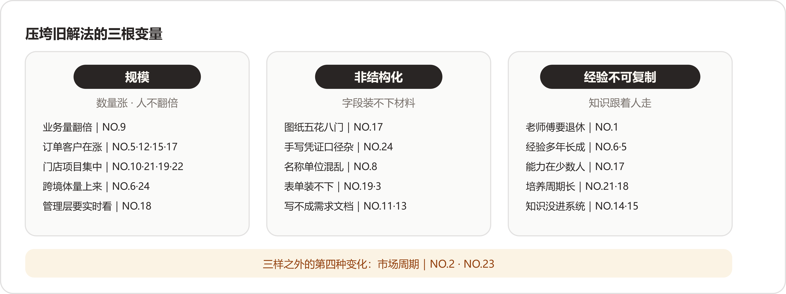

*三根变量各管一头：数量、形状、载体；三样之外另有第四种变化——市场周期，只有两位案主，单独立案。*

三根稻草很少单独落下。非标制造报价（NO.17）一案三样全占：订单在涨（规模）、图纸五花八门（非结构化）、经验在老师傅脑子里（不可复制）。多数案子的失效都是几根叠上来，这也是旧解法撑破的过程显得缓慢的原因——每根落下时都还能忍，叠够了就到了换法的时候。摆完三样还剩两家对不上号，它们的变量来自市场周期，在阶梯之外，下面单说。

### 特例两案｜旧解法没有失效的时候

二十四家里有两家，旧解法到FDE进场那天还谈不上被撑破。一家的问题一直存在、痛感从来没到；另一家的旧解法至今还是最优解。它们站在阶梯的两端当界碑。

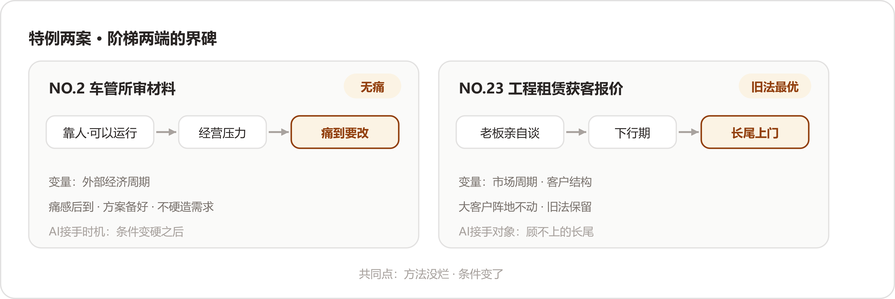

*两案的共同点写在图外：方法没有烂，条件变了。*

#### 车管所审材料（NO.2）：无痛

:::文书 —— NO.2 原话

“其实没有特别的解决方案，就是靠人。”

:::

群众把材料上传，工作人员打开图片肉眼审核，再人工处理后面的业务。“这个流程已经运行了很长时间，对车管所来说，它甚至不被认为是一个特别需要解决的问题。”FDE还特意补了一句：这点很重要。今天回头看，会觉得这么明显的重复劳动为什么不自动化；站在当时业务部门的角度——

:::文书 —— NO.2 原话

“我们今天回头看，会觉得‘这么明显的重复劳动，为什么不自动化？’但站在当时业务部门的角度，它是可以运行的。”

:::

FDE第一次提出用视觉技术替代一部分人工审核时，对方没有马上接受，第一反应是：“现在这样不也能干吗，为什么还要再花钱上一套新东西。”变化来自业务条件：经济环境变化，驻点服务企业面临经营压力，要减少人员投入，同时把业务量做上去。“原来‘不够痛’的效率问题，一下子变得现实起来。”这时候，前期准备的方案才真正有了落地机会。

这一案的理论贡献，是这一问里被引用最多的一句：

:::文书 —— NO.2 原话

“很多AI需求一直都在，只是还没有痛到需要改变。”

:::

后半句同样值得抄：

:::文书 —— NO.2 原话

“FDE要做的，是提前看见这个问题，在业务真正需要改变的时候，已经有一个可以验证的方案放在那里，不去强行制造需求。”

:::

这一案回答了读第一层时留下的疑问：企业为什么会一直忍受旧解法？答案在账上——换解法要花钱、要学习、要担风险，旧解法的痛是慢性的、能忍的；两边的账一天不平，企业就一天不动。把企业推过线的是经营条件把账算反的那一天，问题本身没有这个力气。和第一层别家相比：别家是业务自己长大了，从里面把自己撑破；这一家是外面的经济环境把成本线抬上来，从外面挤破了平衡。方向相反，落点相同——人都扛不住了。见到“明显该自动化却在靠人”的企业，先替它算那笔账：痛感每月值多少钱，换法一次性花多少钱、担多少险。账没反之前，方案备着就好；这一案的FDE把这套动作做完了全程。

#### 工程租赁获客报价（NO.23）：旧法仍最优

:::文书 —— NO.23 原话

“其实过去这种方式完全可以运行，而且在业务增长期甚至是比较合理的。”

:::

:::文书 —— NO.23 原话

“因为大客户的价值足够高，老板亲自谈、亲自报价，是最有效率的方式。价格不透明、订单金额大、影响因素复杂，这些事情交给老板判断，反而比做一个复杂系统更靠谱。”

:::

全卷二十四案，把旧解法推到“最有效率”这个最高级的，只有这一家。而且这个评语经得起推敲：大客户报价要的是信任、分寸和对复杂因素的拿捏，做个系统去替代企业负责人，反而更不可靠。旧解法在这块阵地上没有任何毛病。

毛病出在阵地外面。小客户进来，企业负责人同样要把需求、车型、运输成本、人员、油费过一遍再定价；企业负责人在谈大客户，小单就顾不上——“如果企业负责人正在谈一个大客户，这个小订单就只能放掉。”增长期这算不上问题，放弃就是了。下行期来了，企业开始重新重视那些过去没有被充分服务的小客户：

:::文书 —— NO.23 原话

“所以过去的问题，是随着市场环境变化，原来合理的人工分工开始出现了瓶颈。”

:::

:::文书 —— NO.23 原话

“这个时候，原来的模式就出现了矛盾：老板最应该做高价值客户，却被大量低价值、但不能完全放弃的订单占用了精力。”

:::

这家还留了全卷最清醒的一段自我提醒——站在技术视角，很容易得出“做个智能报价系统”的结论，进了业务现场才发现不是：

:::文书 —— NO.23 原话

“但真正进入业务现场以后，你会发现，问题其实是老板的时间应该花在哪里，以及企业有没有能力把老板不应该亲自处理的事情接下来。”

:::

AI在这案的进场方式，全卷独一份：它没有去动旧解法评了“最优”的那块阵地，大客户照旧企业负责人亲自谈；它接的是旧法顾不上的长尾。改造做完，最有效率的那部分一行没改。把NO.23和其他家比，其他家多数在接走人扛不动的部分，这一家接的是企业负责人顾不上的部分——被服务的对象换了，最优的旧解法原地保留。判断一个旧解法该不该动，先看它服务的对象变没变：这家企业负责人的方法没变没坏，变的是客户结构，长尾上门了。方法跟着对象走，对象变了，方法才需要跟着挪。

两案合起来，把这一问的边界画完整了：旧解法的失效未必从企业内部发生，也可以从市场周期那边来。查失效的时候，光在企业内部找规模和非结构化，会漏掉这两种。

### 收口｜方法论：动手之前，先给旧解法立传

线下零售对账（NO.10）在答案里留了三问，是这一问方法论的种子：

:::文书 —— NO.10 原话

“真正应该问的是：原来的方式为什么能够运行？它在哪个节点开始失去效率？AI究竟应该接管哪一部分？”

:::

二十四案读下来，我们把这三问扩成动手前的四问，一问一层，正对着失效阶梯的四层和压垮它的变量：

| 问 | 在问什么 | 锚点（谁家教过） |
| --- | --- | --- |
| 一、现在靠谁扛 | 旧解法的承重墙在哪：哪个人、哪张Excel、哪个岗位 | NO.22 那个搬数据的人；NO.1 老师傅；NO.18 算提成的Excel |
| 二、买过什么、没接住 | 学费交在哪年、断在哪个门口 | NO.17 模板多填一遍表；NO.24 BI换了个地方看Excel；NO.11 五万元标准化服务 |
| 三、自己试到哪儿 | 半途的AI停在哪个形态 | NO.16 自搭Agent；NO.12 人盯着AI做图；NO.15 本地部署DeepSeek；NO.7 个人提效 |
| 四、什么变量变了 | 规模、非结构化、经验不可复制，还是市场周期 | NO.9 业务量翻倍；NO.24 手写凭证；NO.6 经验无法复制；NO.2、NO.23 周期 |

四问答完，溢出的位置自己浮出来：问一指出溢出的出口（扛活的人在哪儿），问二画出工具的边界（接不住的门口在哪儿），问三标出别人停下的地方（半途的形态是什么），问四给出撑破的方向（变量在哪头使劲）。四问合起来，就是NO.10那三问的展开——为什么能运行、在哪个节点失去效率、AI该接哪一部分。

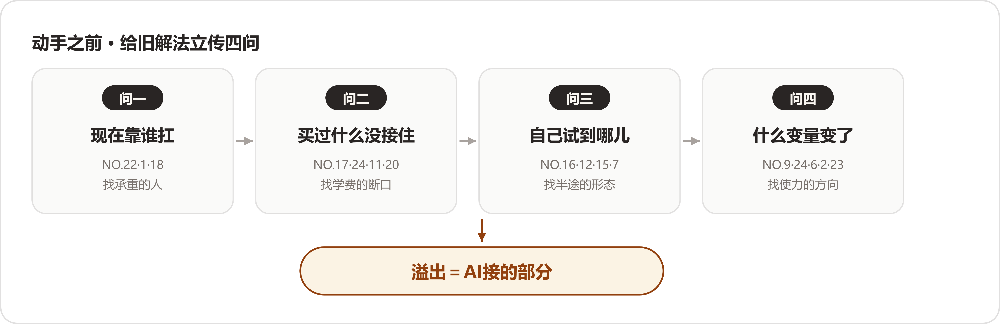

*四问对着四层：问一问第一层，问二问第二层，问三问第三层，问四问变量与周期；四问走完，AI该站的位置自己出现。*

照实记一个读时的保留：这些替旧解法说出来的好话，我们没有办法逐条核实。“完全可以运行”运行了多少年、运行中出过多少错、忍过多少返工，多数答案没有给数；只有NO.11报出了一个约5万元的数字，其余各家买系统、上SaaS的学费多半没有细账。传记的这一部分，受访者讲的是自己客户的过去，读的时候值得留一分。这也提醒用这份材料的人：四问里的第二问，往往要自己进场翻账才问得出来——答案里现成的很少。

最后把TikTok达人建联（NO.5）的收束语抄来收尾。这一篇从立传写到验尸，它一句话兜了底：

:::文书 —— NO.5 原话，抄来收尾

“我的理解是，过去这套方式解决的是‘业务能不能跑’的问题，而AI要解决的是‘业务规模起来以后还能不能高效地跑’的问题。”

:::

## 第三问｜方案是长出来的——二十四家的六步骨架 {#appG-q3}

### 先说结论

这是六问里篇幅最长的一问。二十四份答案连着读完，先把结论放在最前面：

:::文书

**没有一份方案是先设计好再执行的。**

:::

二十四家，从车管所到律所，从装车的到画消防图的，做事的骨架是同一副——

1. **进现场**：先到业务现场去，看活是怎么干的；

1. **拆流程**：把流程拆开，一直追到这件事值多少钱；

1. **定分工**：机器干重复的，人签最后一笔；

1. **嵌回流程**：把AI放回原有的流程里，不开新门；

1. **小步迭代**：小口子先跑起来，跟着反馈改；

1. **陪跑沉淀**：陪跑一段，把东西留在企业手里。

方案都是顺着这副骨架、被现场一处处逼出来的，没有一份是先画好图纸再照着做的。为什么二十四个不同行业的人会走出同一副骨架？读下来我们的解释是：AI落地的难点长在业务侧，而业务侧的难——人、流程、数据——家家是同构的；技术上千差万别，难处倒都出在同一批地方。

有一个旁证：技术选型在多数答案里排在很靠后的位置，一两句带过；篇幅写得多的那些答案，从头到尾都是业务。

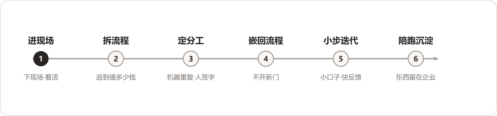

*六步骨架总览：没有一份方案是先设计好再执行的，二十四家都踩在这条路上。*

下面按这六步走一遍：每一步先说多数派怎么做，再说分歧在哪里；少数独门的做法，单独记一笔。

### 第一步｜进现场：不信访谈，信眼睛

这一步给我们最大的触动是：二十四家没有一家抱怨"客户说不清需求"。说不清在他们那里不构成障碍，它就是起点——FDE这个角色的本职，就是把说不清的东西变清楚。

为什么会这样？想明白之后觉得平常：会议室和工位是两个世界。人在会议室里会不自觉地把工作"整理"过再说，说出来的已经是表演版；工位上的活才是原版。NO.9那句话是证据——"做了十几年，很多判断已经成为了下意识动作"，连本人都不知道自己在做判断，访谈又怎么问得出来。所以"不信访谈信眼睛"背后有一个更硬的理由：说出来的工作和真实的工作，是两份材料。

**多数派**的做法出奇地一致，而且理由相通：

- **制造业师徒带教（NO.1）**：起初靠访谈，高层、中层、一线都聊遍了，聊不出东西——一线员工不愿花时间，很多细节他们自己也说不全。后来换了方法：

:::文书 —— NO.1 原话

"直接跟着员工走一遍他每天的工作流程，看他一天具体在做什么、在哪里停下来、哪里需要问别人、哪些问题不断重复出现。"

:::

- **央国企财务流程（NO.9）**：把原因说到了根子上——业务人员"做了十几年，很多判断已经成为了下意识动作"，指望他完整讲给你听不现实，只能跟着做一笔业务，把流程一点一点拆开。

- **律所案件工作台（NO.3）**：观察从早上九点律师打开电脑开始，看律师怎么接客户邮件、翻纸质案卷、在多个系统之间切换。

- **澳洲乳企动销（NO.24）**：近距离看总部的销售运营团队怎么接收经销商数据、怎么核对、怎么开会。

- **消防维保数字化（NO.13）**：还提醒了一层——不光一线说不清，企业负责人也说不清。"老板看到的是经营结果，员工面对的是每天具体的流程"，只访管理层，拿到的多半是"看起来正确"但偏离核心的需求。

**分派**的地方在跟什么：多数案例跟的是人，**城市规划研判（NO.4）**跟的是行业。第一步"先把自己逼成'半个规划师'"，到不同部门去聊，把指标、空间计算、业务流程一点点搞清楚——

:::文书 —— NO.4 原话

"这一步看起来不像'做AI'，但我觉得恰恰是FDE最核心的工作。"

:::

**独门两招**：

- **汽配供应链经营（NO.20）**换问法：不问企业负责人"你想要什么AI功能"——那样问出来的是一堆功能需求——问"你每天最担心企业发生什么""哪些事情你必须亲自盯"。
- **消费品包装审核（NO.19）**换人：外部顾问一直待在业务群里会让业务同学有压力，索性把一个Agent放进群，待两三周，持续收集上下文，不急着解决问题。

这一步的题眼是NO.9那四个字：**下意识动作**。做了十几年的判断长在手上，不长在嘴上，访谈问不出来，眼睛看得见。工程师的本能是先要一份需求文档，这二十四家全反了过来——他们并非不想问，只是问了也没有用。

跟岗还有一笔账可算：它看起来是最贵的进场方式，按人天守在现场，不如发问卷来得高效；但要是按"照着错误需求开发一轮"的代价来算，它反而最便宜——NO.1从访谈换成跟岗，省下来的就是后面的返工。NO.4补的是另一头：光看动作不够。它家业务的专业壁垒最高，术语听不懂就跟不上话，所以逼着自己当"半个规划师"。NO.19那招更妙：顾问本人待在群里，业务人员会拘谨；换一个不说话的Agent进去，看到的才是日常。观察者自己也是个变量，这家算是用土办法把它解了。

### 第二步｜拆流程：拆出两种东西

"两种东西"是我们读完二十四份答案之后自己归纳的分法，原文没有这个说法。有意思的主要是第二种：好几家的"AI方案"，前半段干的根本与AI无关，全在补课——读之前没想到，拆流程会拆出一张采购清单（NO.18的CRM）和一张网络改造单（NO.11的路由器）。

为什么一拆就露出家底？流程没画出来的时候，每家都默认自家的流程是通的；一画，断点自己浮上来。是在被拆的时候，才第一次看清自家的活是怎么干的——这话听着有些刺耳，材料里就是这个样子。

#### 第一种：流程本身的结构

- **TikTok达人建联（NO.5）**：把从达人进入到数据复盘的整条链路拆开，每一步谁在做、输入是什么、输出是什么、需要什么判断。
- **车管所审材料（NO.2）**：把人工审材料拆成一串动作，让机器接走重复的"看、读、填、搬"。
- **律所案件工作台（NO.3）**：拆出七个标准模块。
- **基金公司研发转型（NO.7）**：把角色拆开——企业负责人要转型、研发要效率、产品经理要流程、HR要的是培训里每天的所得，一次五天半的培训是按四个角色各自的账设计的。
- **国企电商子公司（NO.14）**：为此设了个正式角色，叫"知识萃取师"——让业务人员把原来的工作过程讲出来，怎么做、为什么这么做、哪些例外、什么情况必须人工。他们后来把口径收紧成一句话：

:::文书 —— NO.14 原话

"先梳理流程，再做Agent。"

:::

#### 拆得最深的一家：工业物料采购（NO.8）

**工业物料采购（NO.8）**没有停在"搜索不好，做个更好的搜索"，而是往下追：搜索不好，为什么会产生损失？追出来一条链——

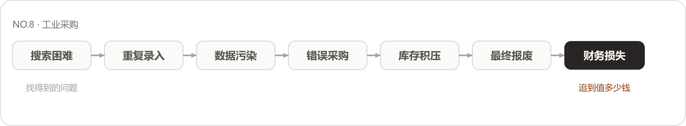

*拆流程的尺子：从"找得到的问题"一路追到"值多少钱"，七环里缺了哪一环，这笔账就立不住。*

:::文书 —— NO.8 原话

"只有这条链路成立，我们才知道这个AI应用到底值多少钱。"

:::

#### 第二种：家底——拆流程时顺带发现的地基缺口

- **生物科技上市公司（NO.18）**：诊断下来，销售提成一类问题"本质上是信息化和数据问题"，先帮企业选购CRM，把散在销售个人手里的数据统一进系统——

:::文书 —— NO.18 原话

"这一步看起来不像AI，但它决定了后面的AI能不能真正进入业务。"

:::

- **外贸资料整理（NO.11）**：进场第一天"几乎是在当网络工程师"，先把四台路由器、两台光猫理顺，把AI的事情暂缓一步。
- **消防维保数字化（NO.13）**：直接分两阶段，第一阶段只做流程数字化，把纸质表单和Excel搬到线上，第二阶段再找AI能插进去的环节。
- **汽配供应链经营（NO.20）**：保留原有ERP，在它的数据上做二次加工，不另起炉灶。

拆到哪里算够？拆到钱为止——说"效率低"就停下的，后面的价值全是估的；追到财务口径的，方案才有轻重。NO.14那句"先梳理流程，再做Agent"反着读也成立——流程没梳理清楚就上Agent，Agent继承的是一笔糊涂账。

NO.8的损失链还有一层用处：它把"痛点"从形容词变成了账本。"效率低"是形容词，"搜索困难一路连到报废、最后是真实财务损失"是账本——形容词立不了项，账本立得了。这一问读下来我们甚至觉得，损失链比方案本身更值得借用：方案各家没法照搬，追账的思路家家能用。NO.7的四本账是同一个道理的另一面：同一家公司里，企业负责人、研发、产品经理、HR对"做成"的定义各不相同，拆到角色那一层，才知道方案要同时平四本账——只算了企业负责人一本账的项目，多半死在其他三本上。

### 第三步｜定分工：机器干重复的，人签最后一笔

这一步读出来一个反直觉的发现：留人的理由，没有一家说是"AI能力不够"，全是责任问题。分工的边界画在责任上，不画在能力上——这是我们在这一问里最想把读者拉过来看的地方。

这个现象顺带解释了AI进企业为什么慢：模型可以做到九成九正确，但剩下那一次错了谁签字？没人签字的东西，组织不敢让它进流程。把二十四家的分工表摆在一起看，它们其实是一张张责任地图——每个"留给人"的格子里，都站着组织里一个要认账的人。FDE画分工的时候，手上做的已经是组织设计的活了。

**总原则**二十四家几乎一致，留人的理由各家说得很实：

- **线下零售对账（NO.10）**：AI做"大量重复性的第一轮核对"，把能确认的先筛出来，人处理真正要判断的部分。
- **鞋服电商素材（NO.12）**：把一致性写进验收——人物、服饰、场景三层全对才算过，"AI先做第一道检查，再交给人工确认"。
- **本地生活短视频（NO.15）**：装了回退机制，哪个节点AI做不好，就把那个节点还给人。
- **跨境电商库存补货（NO.22）**：Agent按原有补货规则筛出该补的货，"人工的角色从'计算员'变成了'审核员'"。
- **消防维保数字化（NO.13）**："最终的消防专业判断必须由人来做。"
- **建筑消防施工图（NO.21）**：把AI的产出定位成"专业可用的初稿"，危险等级、K值、喷头间距这些参数始终留给设计师。
- **国企电商子公司（NO.14）**：在员工面前从不强调"AI替代人"，进工作流的Agent大部分最终要人确认——法务、财务的责任，AI担不了。

**往细里分，各家有自己的设计**：

- **跨境物流装载（NO.6）**：原则就一句话："大模型负责调度，专业算法负责计算"。三维装箱是复杂空间计算，大模型难以胜任，就交给Python——高度图3D空间追踪、贪心放置、多策略排序、遗传算法；大模型管听需求、派任务、讲结果。
- **城市规划研判（NO.4）**：同路，而且把理由说透了——"既然有专业GIS工具能够精准计算，就没有必要让大模型自己算"，让AI调度专业工具，把计算留给工具。
- **建筑消防施工图（NO.21）**：把消防规范条文做成规则引擎，让AI"自动遵循行业标准，而非自由发挥"。
- **电信数据分析（NO.16）**：盯的是另一头，就是稳定性——不做成"会聊天的分析师"，做成"可以被反复使用的Agent系统"，同一个问题重复执行，结果必须是同一个。
- **澳洲乳企动销（NO.24）**：给数字立了硬规矩：模型不直接给出答案，定位到那一行原始数据，"每个数字都点得开、看得见来源"，溯不回去就不让答。
- **工程租赁获客报价（NO.23）**：按订单的价值分层，"大客户不能交给AI"——价格不透明、单子价值高的，企业负责人自己判断才合理；标准化小单，系统收了需求直接办。

这批设计里我们最想单独说一句的是NO.15的回退机制：给系统留了退路，人才敢往前走——没有退路的系统，能力再强也没人真敢把活交给它。NO.16和NO.24是从另一头逼近同一件事：一个把Agent当工程系统做，求重复执行的稳定；一个给每个数字立溯源，求说得出处。两条路都通向"出了事查得到"——而"查得到"，正是机器的活和人签字的活能接在一起的接口。

**学费最贵的一课**来自**非标制造报价（NO.17）**，也是"分工怎么定"这一课最好的教材。第一版想得直接：模型看懂图纸、抽取字段、按规则一算就出价。现场运行起来才发现，"端到端直接出价，出来的数字经常对不上真实成本"。改成分两段——模型只做图纸信息结构化，报价回到企业自己的物料和规则库里匹配，每一单人工校准后才能对外。改完顺势搭了一个飞轮：AI生成、人工校准、数据回填，下一次的结果更准，人工要校的部分越来越少。NO.17的学费还回扣了开篇那句话：分工也是长出来的，没有一家是先想明白再动手——端到端好看，两段式能用，这个道理全是账对不上之后才懂的。

会说话的管说话，会算数的管算数——这句通俗的说法放在今天的AI热里听，几乎有点扫兴。二十四家的方案里，大模型多数时候的角色是听懂人话的调度员和翻译官，离"替代决策"很远。我们倒觉得这恰恰是这份材料可信的地方：真在一线做落地的人，给模型安排的都是它确实干得好的位置。

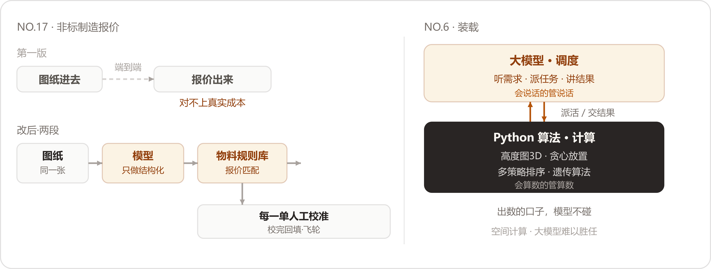

*左：NO.17 端到端之死与两段式改造；右：NO.6 调度与计算分车道。*

### 第四步｜嵌回流程：AI长在员工原来的活里

这一步是六步里局外人最看不见的一步——Demo做完就算交付的人，想不到二十四家在这里花的心思最多。一个明显的观感：离"用"最近的环节，往往技术含量最低，却最关键。

为什么嵌回比新建难？新建是技术活，嵌回是记忆活加政治活——原有流程里沉淀着习惯和利益，动哪里都要先问过。NO.13的教训最直白：再造一套系统，员工就得在两套系统之间重复操作，等于给所有人加活；给所有人加活的项目，没有出路。**电信数据分析（NO.16）**说得最直白，"想办法让AI进入客户已经存在的工作流"——客户原来怎么用就继续怎么用，网页、Teams、Slack都行，那个案子的客户，到最后就是继续以聊天的方式在用。注意这不是聊天框对不对的问题：电信分析师干的活本来就是提问和取数，聊天就是他的工作台。

其余各家的落地方式：

- **制造业师徒带教（NO.1）**：知识能力接进原有培训平台，新人照旧打卡，"没有额外增加一个'聊天机器人'"。
- **线下零售对账（NO.10）**：原则是"尽量不给一线员工增加额外负担"，员工拿到的是处理过第一轮的结果，不用自己再维护一套系统——"不要让用户先看到自己的投入，再等待未来的收益"。
- **消防维保数字化（NO.13）**：企业已有政府监管要求的软件流程、无法开放接口，就在已有流程上做最轻量的改造——再造一套完整系统，意味着员工在两套系统之间重复操作。
- **汽配供应链经营（NO.20）**：给关键节点设判断标准，异常才用飞书卡片提醒人，正常时系统自己往下走。
- **TikTok达人建联（NO.5）**：把每天人工催人变成系统主动提醒，人收到的只剩一句"今天你真正需要处理的事情是什么"。
- **工程租赁获客报价（NO.23）**：客户在工地上，为询价专门下载一个App不现实，"入口反而应该足够轻"，用小程序承接。
- **城市规划研判（NO.4）**：系统中间是地图，辅助的功能放在旁边——"地图才是规划师真正的工作台"。

NO.5和NO.20的主动提醒还翻了个方向：从"人找事"，变成"事找人"。翻之前的运营，每天要打开几张表挨个核对截止时间；翻之后，人只在被提醒时出现。这一翻省下的可能只是一小时，卸掉的是"心里始终惦记着"的那份占用——流程级AI最被低估的好处，大概就在这里。NO.10那句"不要让用户先看到自己的投入，再等待未来的收益"也值得抄在本子上：人对先付出、后回报的东西天然抵触，落地设计要把收益放到最前面。

这一步里有两个转弯。

**律所案件工作台（NO.3，产品叫法索AI）**最初给律师的入口是智能对话框，登录就能提问，看着顺理成章；现场观察一段时间后发现，律师每次提问前都得先向AI重新描述案件背景，而"一个案件的信息量巨大，律师不可能在每次对话中都完整复述"——对话式交互帮了倒忙。入口改成案件工作台：材料先传上去，系统自动构建案件知识图谱，AI在完整上下文里等人开口，律师用专业语言提需求就行，不用再解释背景。

**跨境物流装载（NO.6）**的入口干脆是一张纸：现场调研发现工人装车"并不适合频繁操作手机或者电脑"，最后把算法结果转成一张装车指导图——货物编号、摆放方向、截面示意、装载顺序。

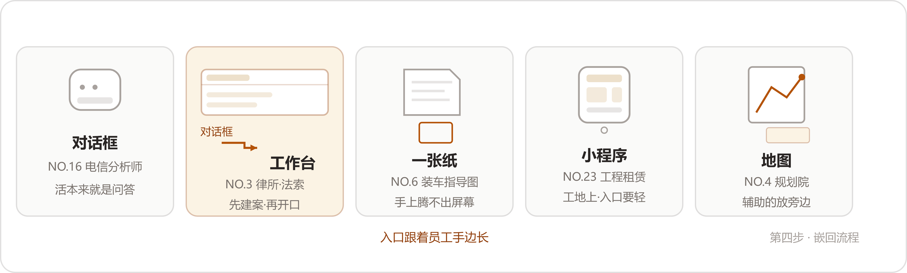

*五种入口各有其主：对话框配的是本来就问答的活，法索AI从对话框改道工作台（卡二），装车工人手里是一张纸（卡三）。把入口摆成一排就看得出：入口长什么样，跟设计者的口味关系不大，跟干活的人手边有什么关系很大。*

这一排入口是整个案例集给我们启发最大的一幅画。法索的转弯还带出一个比入口更深的问题：**聊天框的毛病不在聊天框，在上下文**——一个每次提问都要重新交代背景的活，就不适合聊天框；上下文能预先建好的活，工作台才立得住。这个判断可以从入口推广开去：AI产品长成什么形状，不取决于技术，取决于使用者的手边。一张纸那案读完最触动我们：算法是案例集里最先进的之一，落地的样子却是最朴素的一张打印纸。

五种入口摆完，我们在本子上记了一句：设计入口之前先要问的，是使用者干活时处于什么状态——手上腾不开的（装车工人），给他一张纸；脑中装着全案的（律师），给他一个工作台；习惯一问一答的（分析师），让他继续聊。入口形态选错，后面的功能再对也没有用——它挡在人和AI中间，人过不来。

### 第五步｜小步迭代：先把口子切小，从第一天起想好怎么扩大

二十四家都在切小，但没有一家把小当成终点——小是第一口的吃法，不是这顿饭的规模。NO.10只有几个门店的时候，就把几百个门店的扩法想好了，这个细节我们读了两遍。

为什么第一刀一定要甜？想通这一点，觉得"摘桃子"的比方比它看起来深：第一刀换回来的主要东西并非效率，是信任——业务的人真用了一次、真省了力，后面的配合才谈得上。多数项目挑最炫的场景开局，等于把建立信任的第一仗，打成了表演。

- **央国企财务流程（NO.9）**：这个比方打得准——

:::文书 —— NO.9 原话

"我会先找离业务最近、最痛、最容易产生ROI的那个场景。就像摘桃子一样：先摘离自己最近、最甜的那个桃子。"

:::

- **线下零售对账（NO.10）**：切第一刀用的尺子是正反馈的速度——客服、竞品分析都能做，但对账"少花多少人工，可以很快看到；少漏多少钱，也可以直接计算"；而且只落在上海几个门店的时候，就已经把规模化想好了，拆成轻重两个阶段。
- **城市规划研判（NO.4）**：从整个市缩到一个区、再缩到米市巷，只挑两条业务流验证——

:::文书 —— NO.4 原话

"场景足够小，数据才有可能搞干净；数据搞干净，结果才可能足够精准；结果足够精准，业务人员才愿意相信。"

:::

- **澳洲乳企动销（NO.24）**：第一版只做中国、只做一条产品线、只回答一个问题：这条线的钱花得值不值。
- **基金公司研发转型（NO.7）**：做法是"不断拆解、逐步抛出、跟客户确认"，Spec文档从0到1长出来，三期做下来，他们的体会是"第一次不必追求100分"。
- **车管所审材料（NO.2）**：自己承担售前成本，先做出场景给客户看真实效果——

:::文书 —— NO.2 原话

"与其让客户相信我们的PPT，不如让他先看到真实效果。"

:::

- **国企电商子公司（NO.14）**：先当了这一步的反面教材，又完成了正面转身——第一回按传统思路搭技术底座，"系统有了，客户的员工没有用起来"；转成先判断场景值不值得做、把业务知识挖出来、让员工学会用，一层一层来。

NO.14那个跟头值得单独琢磨：它错在把"做AI"当成了搭建——底座搭好，等人来用；其他家把它当成生长——先在活里发一个芽。第一刀切哪里，答案一致得意外：离钱最近、见效最快的那一块。多数企业的直觉恰恰相反，先挑最炫的做。

NO.7那句"第一次不必追求100分"，背后的账也值得算：工程师文化里，交70分的东西有心理障碍；但探索性的项目里，70分快跑比100分慢走换到的信息多——第二期改什么，要等第一期跑起来才知道，三期的节奏等于给学习留了位置。NO.10的两阶段则是另一头的分寸：验证阶段尽可以轻，规模化从第一天就在图纸上——轻量和不规划，是两件事。

### 第六步｜陪跑沉淀：东西留在企业手里

最后一步各家做的长短差得很大，但底线一致：东西留下，人撤得出去。FDE这个角色的成功定义有点反常识——干得越好，越早不被需要。

为什么"撤得出去"是最硬的验收？人走了系统还在用，才证明活是流程在推；人一走系统就停，说明这一年一直在推着走的，其实是FDE本人。验收会上的评价做不得准，撤场三个月后的使用率做得了准。

- **制造业师徒带教（NO.1）**：上线后陪跑近两个月，调前端、调页面、调问答效果。
- **生物科技上市公司（NO.18）**：第一阶段之后建议董事长扩编，企业拿出二十个编制，FDE参与招聘和团队搭建——项目"从帮企业做几个AI应用，进一步变成帮企业逐渐建立继续往前走的能力"。
- **外贸资料整理（NO.11）**：走得更远，把数据留在企业，把开发能力送进去——框架、规范、Demo部署进客户自己的Codex，让本地的Codex在自己电脑上继续开发，一跑四十来个小时。
- **鞋服电商素材（NO.12）**：把验收标准立在资产上——

:::文书 —— NO.12 原话

"如果AI只是帮员工今天多做了十张图，明天还要重新开始，那它只是工具。"

:::

- **消费品包装审核（NO.19）**：给AI立规矩借的是人事的老办法——招人有岗位说明书，AI来担这份工作，"AI同样应该拥有一份'岗位说明书'"，让真正做审核的人自己拆解平时审什么、输入输出是什么、什么情况交给人。
- **国企电商子公司（NO.14）**：在这里补了关键一课——员工来配合项目的时候，发现"连提示词是什么都不知道"，于是给相关部门做AI通识培训；项目一半是IT牵头的技术项目，一半是人事部门牵头的组织转型。
- **基金公司研发转型（NO.7）**：五天半的培训，用他们自己的话说，"既是在讲，也是在观察；既是在培训，也是在咨询"。
- **电信数据分析（NO.16）**：把系统放云端统一管控，让不同用户共同产生的数据和经验反过来提升系统。
- **TikTok达人建联（NO.5）**：把达人、履约、商品、GMV的数据串进统一的业务视角——一个达人值不值得长期合作，靠的就是这笔攒下来的账。

NO.12那句"十张图"是我们全程划线的话之一：它把"用上了AI"和"留下了资产"分成两件事，多数企业停在前面一件。还有一条材料里没有直说、但摆在一起很明显的事：陪跑最久的那几家——NO.1的两个月、NO.7的三期、NO.18干脆扩编——恰好都是把东西留得最多的。是不是规律，留给读者自己判断。

NO.19的岗位说明书，越想越觉得不止是个技巧：给AI写岗位职责、划边界、定交接，等于把AI当员工在管理，而非当工具在采购。企业里的AI越用越多，"管理AI"这门手艺就会越来越像"管理人"——那张说明书算得上这个方向的一个雏形。把二十四家的"留下来"归拢一下，其实就三种形态：**留资产**（NO.12的素材库）、**留能力**（NO.18的团队、NO.11送进去的开发）、**留规矩**（NO.19的说明书）。效率会过期，这三样不过期。

### 收口｜方法论：六步，六道判断题

把六步骨架从二十四家的做法里提炼出来，每一步留一道判断题，就是这一问的方法论。这六道题的版权属于二十四家——每一道都是他们用学费换出来的公约数，我们只是把它编成了问句。如果你正要做企业AI，可以直接拿它当自查表，每一步的答案，这二十四家已经用真实项目替你试过了：

| 步 | 判断题 | 二十四家的答案 | 锚点 |
| --- | --- | --- | --- |
| 1 进现场 | 信访谈还是信眼睛？ | 眼睛 | NO.1/3/9/13/24 跟岗；NO.4 当半个专家 |
| 2 拆流程 | 拆到哪儿算够？ | 追到值多少钱 | NO.8 损失链 |
| 3 定分工 | 哪些活必须留人？ | 签字担责的、错了退不回去的 | NO.13/14/21/23 |
| 4 嵌回流程 | 员工手边有什么？ | 入口跟着手边长 | NO.3 工作台；NO.6 一张纸；NO.16 继续聊天 |
| 5 小步迭代 | 第一刀切哪儿？ | 最快见分晓的那一块，同时从第一天起想好怎么扩大 | NO.9 桃子；NO.10 两阶段 |
| 6 陪跑沉淀 | 陪到什么算完？ | 企业自己接得住，第二件事不用你催 | NO.18 二十个编制；NO.11 能力送进去 |

这六步的原图，在二十四家的脚下——公共路径是他们一步一步走出来的，我们做的只是把它描下来；各家的本事，全在每一步岔路口的选择上。岔路都画在下面这张图里。

照实记一个读时的保留：这些思路都讲得太顺了——第一版错在哪里、中间回了几次炉，多半一句带过。翻车和救火的细节收在第五问里，那一问负责事故；两问对照着读，才是全程。

读到最后，六步骨架在我们眼里串成了另一条线，一条信任的积累线——进现场，挣的是开口说话的资格；拆流程，挣的是定义问题的资格；小口子跑通，挣的是扩大规模的资格；陪跑沉淀，挣的是全身而退的资格。每一步都在为下一步挣资格，跳过哪一步，后面的资格都不成立。二十四家没有人这么总结过，这是我们读出来的。

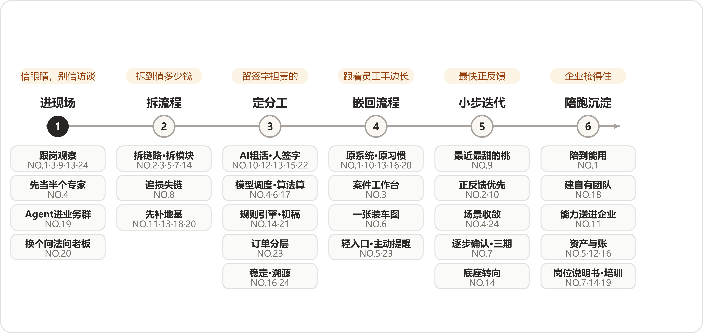

*六步主线，每步上方是那道判断题，下方是岔路与走过这条岔路的案号。*

:::文书 —— NO.1 原话，抄来收尾

"企业AI落地很少是'系统上线=项目结束'。真正的落地，往往发生在上线之后。"

:::

## 第四问｜数字是最浅的一层——二十四家的价值阶梯 {#appG-q4}

### 先说结论

这一问收到的二十四份答卷，读下来印象最深的没有任何一串数字，而是报数字的手法：这一行把"怎么报效果"本身做成了专业。**数字只算最浅的一层，越往上走越值钱；二十四家里过半在做同一个动作——先把数字端出来，再亲手把它按下去。**

这个动作在答卷里反复出现，几乎成了这一问的固定句式：

:::文书 —— NO.2 原话

"但我觉得，比数字更重要的是人的工作发生了变化。"

:::

:::文书 —— NO.3 原话

"但效率数据只是表层结果，更重要的变化发生在流程层面。"

:::

:::文书 —— NO.4 原话

"但我后来慢慢意识到，这个项目真正的价值远不止'3—5天变成20分钟'。"

:::

同一个转身，**TikTok达人建联（NO.5）**写的是"这个数字并不是这个项目最大的价值"；**跨境物流装载（NO.6）**说"这个项目最大的价值并不只是装载数字本身"；**央国企财务流程（NO.9）**的判词是"这个项目真正有价值的地方，在于它改变了人的工作方式"。**线下零售对账（NO.10）**的句子更直接——"如果只把它总结成'省人工'，我觉得还是低估了这个项目"；**非标制造报价（NO.17）**同款——"如果只把'节省50%工作量'当成全部价值，还是低估了这个项目"。报得出可核数字的十三家（NO.2/3/4/5/6/9/10/14/17/18/21/22/24），加上把自己短期统计也按住的NO.7，没有一家让自己的数字当结论收场；剩下十家，有的只肯定性，有的直接明说还没有ROI。

把二十四份答卷摊开来看，效果在他们笔下分成四层，一层比一层难拿，一层比一层值钱：

1. **时间压缩**：同一件事，原来多久、现在多久——硬数字全部长在这一层；

1. **人的时间重分配**：省下来的时间去了哪儿，人的角色怎么变；

1. **个人经验组织化**：老师的本事离开老师还能不能用；

1. **企业长出AI能力**：客户自己动了手，第二个项目自己找上门。

这张阶梯是材料自己走出来的：二十四份答卷几乎都从第一层起笔，逐层往上写，写到自家的最高层收笔。本文沿这条主线走；阶梯旁边另有一条平行线——同样是报效果，二十四家的报法分三档，诚实的姿势各有各的——单独拿出来看；再往后是三个不合拍的变奏。合起来，这一问的二十四案全部在档。

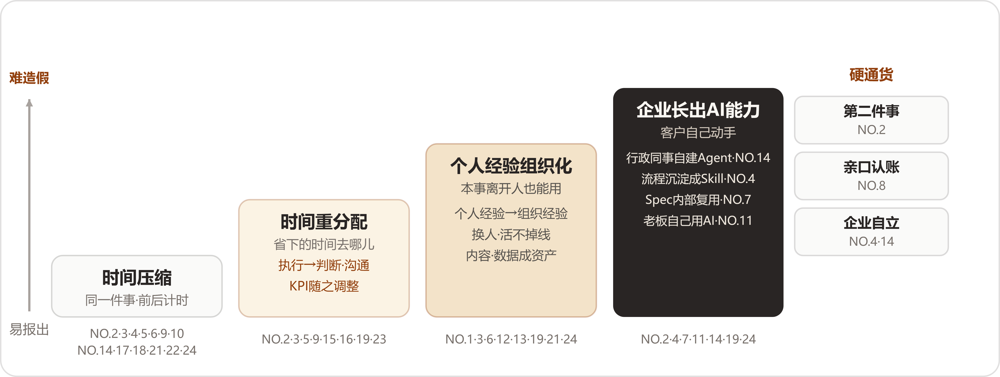

*价值四层阶梯：答卷几乎都从时间数字起笔，逐层向上写；右侧三样硬通货，都要对方用行动投票。*

### 第一层｜时间压缩：二十四家最先交出的数字

时间是这一问的通用货币。凡有效果可报的，答卷第一句几乎都在计时，而且家家都报得具体：

- **车管所审材料（NO.2）**：一单业务全流程审核大概需要15分钟，现在基本缩短到三五分钟；日均办件量从约七八百件提高到1100件左右。
- **律所案件工作台（NO.3）**：14个被告的案件，单被告请求权基础分析需要2到3小时、全部整理完成需要2到3天，AI辅助下一个晚上完成；距开庭3天、材料超过100万字的案子，一天内完成整体梳理，材料整理效率相比纯人工方式提升了约70%。
- **城市规划研判（NO.4）**：跨多个部门的完整规划报告通常需要3—5天、有时接近一周，试点流程里大约10—20分钟就能形成可继续推敲和交付的报告；单个部门一小时左右的分析和表格，现在大约5—10分钟；一期涉及大约10个部门，20—30名专员在使用。
- **TikTok达人建联（NO.5）**：达人平均履约时间从大约一个月，到了约18天（口径：项目试运行之后）。
- **跨境物流装载（NO.6）**：内净约108方的车厢，原型验证实测稳定达到约99方；人工装车通常约5小时，引入AI规划与指导后预计压缩到约2小时，装车效率提升约100%。
- **央国企财务流程（NO.9）**：完整流程过去可能需要半个月甚至一个月，现在大概一天、两天跑完；项目里落地了10个AI相关应用场景。
- **线下零售对账（NO.10）**：对账周期从一两个人天，压缩到几个小时（口径：目前落地的还是上海部分门店）。
- **国企电商子公司（NO.14）**：AI法务助手把一个法务招聘编制省了下来，"如果一定要用人数去折算，那就是一人年的综合成本"。
- **非标制造报价（NO.17）**：至少能减少50%以上的相关工作量；原来3到5个人参与的活，实际投入人力明显减少。
- **生物科技上市公司（NO.18）**：销售新人培训周期从接近两个月缩短到大约3周；老销售每月投入招聘的3-4个人天基本省下，至少可以多去拜访1-2个客户。
- **建筑消防施工图（NO.21）**：大型项目消防施工图完整绘制原本需要数天，项目方反馈，大约30分钟即可生成初步结果。
- **跨境电商库存补货（NO.22）**：每天看图片、写数据需要4～5个小时，压缩到1小时以内；补货从至少2～3个小时，变成看一眼、验证一下。
- **澳洲乳企动销（NO.24）**：市场费用问题发现比例从不到10%，提高到约30%左右。

**电信数据分析（NO.16）**没有给到分钟，但给的是同一根刻度：以前一个新的数据分析问题，一个人甚至两三个人按天计算，现在很多分析在分钟到小时级别内跑完。

这一层有两处值得停下来多看一会儿。

第一处，数字都穿着口径的外衣。NO.6开头就声明项目"已经完成原型验证"、2小时是"预计"；NO.21写明30分钟出自"项目方反馈"、且落在"初步结果"上；NO.24直接把声明写在了数字前面：

:::文书 —— NO.24 原话

"先说明一句，下面的数字做过脱敏，量级是对的，绝对值做了处理。"

:::

敢把数字写死的人，把口径也一并写死了。精确与诚实在这一层是同时出现的，七种口径在平行线那节列成表。

第二处，数字几乎全长在时间轴上，金额基本绝迹。全文只有两处碰到钱：NO.14折算到一人年的综合成本，NO.6给出"超1方+100美元"的计费结构。为什么？想明白之后觉得平常：时间是FDE自己计得准的口径——同一件事、前后计时，不需要请示任何人；钱要过财务的账，科目、分摊、归属，每一样都要进财务的解释权，FDE既拿不到也说不清。NO.6能碰到钱，因为它把经济账建在了物理量上——方数、车次、美元，全是现场数得出来的东西：

:::文书 —— NO.6 原话

"把5小时压成2小时，多出来的车次、多出来的方，工人、物流公司、货主三方一起分，三方共赢，做增量部分。"

:::

账的左边——旧流程那些"半个月""3—5天""一个月"——细看还有一层意外：旧值大得反常，反常在说明这些流程在被AI量之前，从来没有人认真计过时。**工业物料采购（NO.8）**把这层说破了：

:::文书 —— NO.8 原话

"没有人真正把历史数据库里的记录找出来，仔细分析这些错误到底每年造成多少损失。"

:::

照这个说法，不少第一层数字的功劳，有一半属于第一次认真测量本身——AI上线，顺手替企业补记了一本从来没记过的账。

这一层可抄走的是一条读法：看一份效果汇报，先找"从多少到多少"——只有"到多少"、没有"从多少"的，基线多半被吞掉了；连旧值都没人计过时的项目，上线后的每个百分比都没有分母。

### 第二层｜人的时间重分配：省下来的时间去哪里了

第一层报完，答卷几乎立刻上二楼。这一层各家用的词不一样——转移、转向、释放——事情是同一件：把省下来的时间安顿到别处去。NO.2把这一层的地位说到了极处：

:::文书 —— NO.2 原话

"所以这件事的本质，是重新分配人的时间，让一个人审核得更快只是表面收益。"

:::

各家的安顿法：

- **车管所审材料（NO.2）**：工作人员从打开图片、检查材料、填写信息这些重复劳动里出来，把时间用到群众咨询、新增业务以及更需要人工判断和沟通的事情上。
- **律所案件工作台（NO.3）**：律师从阅读材料、整理信息、检索法条的执行工作里出来，投入与客户深入沟通、判断案件方向、制定策略、做最终专业决策——"律师的角色从执行者向决策者转移。"
- **城市规划研判（NO.4）**：规划师从查资料、找规则、操作工具、整理结果里脱离出来，把精力放在真正需要专业判断的事情上；AI还会给出原来工作流之外的潜在分析因子，比如判断区域经济活跃度时，提示观察停车场闸机频率、房屋空置率、人口画像。
- **TikTok达人建联（NO.5）**：运营人员从找人、找商品、找任务，变成和达人沟通、建立关系、处理复杂商务问题，高价值达人身上最明显。
- **央国企财务流程（NO.9）**：科研人员只需要在钉钉里把发票给机器人，信息关联、规则判断、系统录入都被隐藏到后台，人的操作被压缩到非常短的一步。
- **电信数据分析（NO.16）**：分析师从零开始的重复处理里出来，"站在AI已经完成的结果上继续判断"；交互也变了，仪表盘从"我提前把问题定义好，然后给你看答案"，变成可以围绕数据继续追问。
- **非标制造报价（NO.17）**：业务人员从看资料、整理需求、反复核对里出来，去联系更多客户、谈更多项目、接更多订单；企业随后调整这些岗位的KPI和职责，让考核更偏向真正的业务价值。
- **建筑消防施工图（NO.21）**：设计人员原来70%绘制和规范检查等执行类工作、30%专业判断和方案调整的构成被倒转——"设计人员的角色从'执行者'向'审核者与决策者'转变。"
- **消费品包装审核（NO.19）**：法律法规人员从低级错误和重复检查里出来，产品经理把时间放到"这个包装到底应该怎么表达产品"这样的判断上。
- **本地生活短视频（NO.15）**：新客户进来先把门店、主打菜品、活动等参数规划好，系统持续生成内容，把原本堆积在某一天的人力需求提前消化——"我会把它理解成'削峰填谷'"。
- **工程租赁获客报价（NO.23）**：小订单先由系统完成信息收集、报价区间判断和初步沟通，只有真正值得企业负责人介入的客户，才把人的精力拉回来。

为什么FDE急着上二楼？我们的读法是：时间数字一报出来，下一个问题几乎是必然的——那是不是要裁人？第二层挡的就是这个问题。二十四家在这一层用的词高度一致，释放、转向、投入更高价值的事，他们在共同防止自己的效果被读成裁员通知单。NO.17还专门声明"企业并没有简单地把剩下的人裁掉"，说这家企业处在上升阶段，企业负责人想的是把人的生产力释放出来。NO.18则把这一层立成了标尺，问得比谁都尖锐：

:::文书 —— NO.18 原话

"所以我评价AI项目，习惯先问一句，被AI释放出来的时间，有没有重新变成企业的生产力。在这个案例里，答案是有的。"

:::

把NO.2和NO.17摆在一起看有个巧合：一家在政务大厅，一家在工厂车间，讲的是同一件事——省时间相对容易，把省下的时间安顿好难。真正区分项目高下的，是第二层有没有安排；第一层的数字，只决定项目有没有资格进入这场讨论。

这一层可抄走的是一个问法：评估自己的项目，别问"省了几个人"，改问"那几个人现在每天在干什么"。答不上来的项目，省下的人力和流失的士气多半正在互相抵消。

### 第三层｜个人经验组织化：本事离开人还能不能用

爬到第三层，答卷换了一个主语：组织。第一、二层的受益者是干活的人，这一层的受益者变成了企业——个人手里的本事，开始搬到组织名下。**制造业师徒带教（NO.1）**的总结是这一层的定音鼓：

:::文书 —— NO.1 原话

"对我来说，这个项目真正的价值，在于企业原本高度依赖个人的经验传承过程，开始变成一套能够沉淀、检索、学习和追踪的组织流程。"

:::

具体的变化有三笔：过去分散在老师傅个人经验里的知识开始被系统化整理，企业第一次能比较完整地知道哪些经验不能随退休流失；老师傅从重复回答所有问题，转向关注新人学习进度和处理更复杂的问题；培训本身变得可追踪，新人学到了哪里、掌握了多少，不再依赖带教师傅的肉眼。

其他各家的这一层：

- **律所案件工作台（NO.3）**："长期来看，更深层的价值在于让专业能力变得可复制。"优秀律师的专业方法被工程化，不同律师经验差异导致的交付质量不稳定开始被抹平。
- **跨境物流装载（NO.6）**："过去企业里的很多经验存在于人的脑子里，现在AI可以把它转化成数据和算法，再到最后的可执行方案。"原来只有老师傅才能完成的装车，变成标准化流程可以复制。
- **鞋服电商素材（NO.12）**：内容从个人产出变成企业资产，生成、管理和后续使用进入统一流程——"更重要的是，企业有没有开始形成一套稳定、可控、可以沉淀、可以继续扩大的内容生产方式。这才是我们真正想验证的价值主张。"
- **消防维保数字化（NO.13）**：传统企业最大的短板是经验掌握在个人手里，人员变动就可能导致能力流失；通过数据沉淀和流程标准化，依赖个人经验的能力逐步转化为组织能力，企业同时开始拥有自己的数据资产。
- **消费品包装审核（NO.19）**："这意味着，AI带来的价值，是让个人经验有机会变成组织经验，让一个人的经验开始服务于整个组织。"每一次决策、每一次渠道反馈、每一次审核经验都被沉淀下来。他们的自评分三层：第一层降本增效，第二层提高决策质量，第三层把个人Know-how变成组织能力。
- **建筑消防施工图（NO.21）**：消防设计经验和规范知识被系统化，团队整体设计能力更加稳定可控。
- **TikTok达人建联（NO.5）**："以前团队是在管理一堆表格，现在是在管理一条业务链路。"企业负责人第一次能围绕"达人—履约—GMV"看清业务全链。
- **澳洲乳企动销（NO.24）**：从经验管理变成数据管理。过去海外业务高度依赖个人经验，负责人熟悉市场就能判断数据是否合理，换一个人判断能力就可能下降；现在经验进了系统。最直观的变化发生在周会——

:::文书 —— NO.24 原话

"以前的周会，前一个小时是在对数，这个数对不对、你那份和我这份为什么不一样。现在数已经在那儿了，会议直接从要不要动预算开始。"

:::

提问方式也变了：以前说"给我一份报告"，现在直接问"这个SKU为什么掉了，是价格、铺货，还是渠道出了问题"。NO.24的评语是："能问出这么具体的问题，说明他们开始信这套东西了。"

这一层为什么难报？它没有"从多少到多少"。效率有计时器，经验没有计量器，组织化的证据要等压力测试——老人走、新人来——才显形。所以这一层的答卷全部改用描述性语言，而且家家都把话说在"开始"上：开始沉淀、开始变成、开始服务于，没有一家敢用完成时。跨案对照之下，NO.24把这层的验收写得最具体——不看文档存了多厚，看周会上的人还问不问"这个数对不对"。这一层可抄走的是一条硬标准：检验经验有没有组织化，只看老人离职那天活掉不掉线；掉线的，说明经验还在人身上，系统里存的只是文字。

### 第四层｜企业长出AI能力：客户自己动了手

阶梯爬到第四层，答卷换了叙述者——效果的主人从FDE换成了客户。前三层讲"我们帮客户做到了什么"，第四层讲"客户自己做了什么"。

**国企电商子公司（NO.14）**把这一层的最高战果，记在一个小得不能再小的工具上。企业里有办公用品自助柜，员工刷工牌领电池、笔、本子；柜子方便了员工，麻烦留给了行政——电池没了，员工发消息问，行政什么时候看到、什么时候补货，全凭运气。这个需求按惯例要走IT部门提需求、排期、开发、内部结算工时的老路；这次没有。负责行政物品的同事在全员培训之后自己发现了这个需求，基于数据中台的MCP能力，用提示词做了一个简单的Agent：员工在IM上直接问机器人"我今天要领两节电池，还有没有"，系统去查库存；库存不足就提醒行政补货，补完发信息给需要的员工。NO.14对它的评语，原样抄在这里：

:::文书 —— 均为 NO.14 原话

"这个工具本身的业务价值并不大，但它让我们觉得特别重要，有一种特别的含义。"  "这时候，FDE交付的就多了一层意义：它在企业内部培养出了新的AI使用者，新的FDE。"

:::

他还补了一句："这可能比我们这些外部团队替他做一个Agent更重要。"

其他各家爬到这一层的样子：

- **城市规划研判（NO.4）**：一期陪着不同部门梳理工作流，后来有些部门自己把"识别、计算、处理、输出候选地块"这样的流程沉淀成了Skill——"也就是说，他们已经在学习怎么自己搭AI工作流。"这份答卷的收束句，是整层楼的地基："好的FDE项目，是交付结束以后客户自己开始长出AI能力。"
- **基金公司研发转型（NO.7）**：Spec文档和相关方法留在企业内部继续复用，"它不再依赖某一个人现场演示"；这家答卷里最重要的结果，是完成了一个变化——"从'大家各自使用AI'，走向'企业开始形成一套共同使用AI的方法'。"
- **外贸资料整理（NO.11）**：企业负责人的判断从"买一个工具"，变成"重新思考公司怎么工作"。角标尺问题现场大约10分钟解决之后，他很快又提出了十几到二十个新需求——"因为它意味着企业已经从'我要不要试一下AI？'，变成了'我公司还有哪些问题可以这样解决？'"
- **消费品包装审核（NO.19）**：业务人员自己成为Builder，学习和参与重新搭建自己和AI协作的工作流。他们带客户高管参加Datawhale举办的黑客松拿了冠军，回来又在客户公司内部办了一场。
- **澳洲乳企动销（NO.24）**：更长远的价值押在未来——进更多国家、面对更多经销商、管理更多销售渠道时，企业手里有一套可复制的数据治理方式。

为什么一个业务价值不大的补货Agent，被当成了最高战果？我们的读法是：它的每个环节都对——需求是业务自己发现的，工具是业务自己做的，FDE全程不在场。它是"能力留在企业里"最直接的物证，比培训场次和满意度打分都硬。跨案对照还有一层意思：NO.11的企业负责人和NO.14的行政，站在同一个转折点的两端——一端是决策者换脑子，从买工具到重新想工作方式；一端是执行者换手，从提需求到自己动手。NO.19两件都占了。这一层可抄走的是一个数法：想量企业AI化到了什么程度，去数那些FDE不在场时发生的使用——自发提问、自建工具、自己办的黑客松。这个数字比登录量诚实。

### 阶梯旁边｜三样硬通货

四层摆完，回头再看塔尖那半句"越往上越值钱"——值钱在哪里？在这一行公认的三样硬通货上：第二件事、亲口认账、企业自立。它们全都长在客户的手上，而不在FDE的汇报里，造不了假，因为每一样都要对方真金白银地配合。

- **第二件事（NO.2）**：车管所项目验收通过之后，后续又持续有新的业务交过来；再往后，双方共同成立了AI创新实验室，继续派人员驻点、共同研发新的应用。NO.2自己的注脚是："在我看来，这可能比某一个技术指标更能说明项目到底有没有真正创造价值。"
- **亲口认账（NO.8）**：业务价值算出来之后，还要过最后一道——客户自己的业务人员确认：

:::文书 —— NO.8 原话

"只有客户说出那句'对，这笔钱确实是因为这个应用被节省下来了'，我们才认为价值真正成立。"

:::

- **企业自立（NO.4/NO.14）**：部门自己把流程沉淀成Skill；行政同事自己做出补货Agent。客户不需要你盯着的时候，事情还在往前走。

"第二个项目愿不愿意"为什么比ROI硬？ROI是算出来的，第二个项目是真金白银投出去的，后者做不了假。这一条也是评审案例的筛子：先找这三样，三样全无、百分比却写得很漂亮的案例，值得多问一句基线在哪里。

### 平行线｜报效果的三种报法

主线之外，把二十四份答卷按"怎么报"重新归一次档，正好三档，二十四案全部在册。

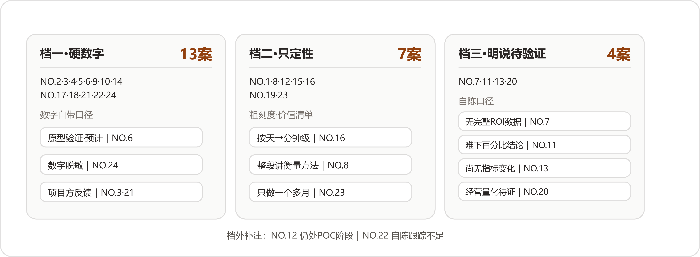

*同样是报效果，三档报法把二十四案分干净：档位跟项目年龄高度相关，跟效果大小未必相关。*

#### 档一｜硬数字：十三家

NO.2、NO.3、NO.4、NO.5、NO.6、NO.9、NO.10、NO.14、NO.17、NO.18、NO.21、NO.22、NO.24，第一层列过的那批硬数字全部来自这十三家。细看会发现，凡给了数字的答卷——含主档在档三的NO.7那笔短期统计——几乎没有不带口径的，七种口径原文全部随数自带，一个都不是别人替他们补的：

| 口径 | 原话 | 案 |
| --- | --- | --- |
| 原型验证 | "目前项目已经完成原型验证" | NO.6 |
| 试点 | "在已经跑通的试点流程里" | NO.4 |
| 试运行 | "项目试运行之后" | NO.5 |
| 短期统计 | "客户在短期几天内做的内部统计" | NO.7 |
| 脱敏 | "数字做过脱敏，量级是对的，绝对值做了处理" | NO.24 |
| 范围 | "目前我们落地的还是上海部分门店" | NO.10 |
| 转述 | "项目方反馈" | NO.21 |

这十三家占了过半，却没有一家把数字当成答卷的结尾。

#### 档二｜只定性：七家

NO.1、NO.8、NO.12、NO.15、NO.16、NO.19、NO.23。这七家不报百分比，把答卷直接写成了价值清单。NO.1的三个变化全在组织层面；NO.8整段答卷在讲衡量方法；NO.12报三个变化——员工真用起来、内容变成企业资产、生产有了质量边界。NO.19自评三层；NO.23从效率、增收、人的方式三个层面看价值；NO.16只给粗刻度，按天到分钟到小时级。这一档的定性发言人是NO.16："我觉得这里不能简单理解成'AI替代了几个分析师'。"

#### 档三｜明说无ROI或待验证：四家

:::文书 —— NO.7 原话

"这家基金公司没有向我开放可以对外披露的完整ROI数据。"

:::

:::文书 —— NO.11 原话

"如果只从一个软件项目的角度看，现在其实还很难给这个案例下一个'效率提升了多少百分比'的结论，因为项目本身还处在第一阶段，交付也还没有全部完成。"

:::

:::文书 —— NO.13 原话

"目前项目仍处于持续推进阶段，尚未形成大规模的业务指标变化，但已经可以看到几个层面的实际价值。"

:::

:::文书 —— NO.20 原话

"现在还不能证明企业的利润、成本或者其他经营指标已经发生了明确的量化提升。"

:::

档外还有两笔交叉账要记：NO.12自陈项目"仍处于POC测试、内部试用和持续迭代阶段"，NO.22承认"这个案例的效果跟踪还有不足"——这两家的主档在别处，诚实的尾巴一样露在外面。

值得单独点名的是三种诚实话术。第一种是NO.2的"堵自己的便宜话"：办件量涨到1100件左右，他先声明——

:::文书 —— NO.2 原话

"这里需要说明的是，AI并没有凭空创造这些需求。很多群众原本就有办理需求，只是过去受制于审核产能，业务处理不过来。AI把原来卡在人工审核环节里的产能释放出来以后，这部分需求才真正被承接。"

:::

需求原本就在，AI释放的是产能：这句等于亲手把"需求增长归功于AI"的便宜话堵死了。第二种是NO.7的"给数字贴期限"：客户侧明明统计出了好数字——三个小组用Spec Coding方法和模板后，"写代码的时间节省了约1/3，写文档的时间节省了一半多，测试时间则基本持平"——他还是按了下去：

:::文书 —— NO.7 原话

"这个数据是客户在短期几天内做的内部统计，因此我认为它可以作为真实反馈，但不应该被理解成长期、完整的ROI结论。真正有价值的效果评估，还是需要持续两周、一个月甚至更长时间。"

:::

第三种是NO.20的"整段职业守则"。这家把不能证明的先说清楚，能感知的照报——ERP里"有数据但看不清"的情况重新呈现出来：还是那个4980个扳手的例子，原来因为没达到5000个的标准数量，ERP没法很好反映真实库存，现在可以告诉企业负责人实际库存里已经增加了4980个；财务应付款也能追溯到对应哪些客户订单、哪些上游采购。然后才是那段话：

:::文书 —— NO.20 原话

"做FDE不能为了证明AI有效，就把刚上线的项目包装成已经产生巨大经营收益。业务价值需要时间验证，能明确解决什么、还不能证明什么，都应该讲清楚。"

:::

这一节的观察收在三个判断上。其一，过半FDE主动降格，我们的解释是：他们的数字早晚要站到客户面前对质。答卷是公开的，写出去的每个百分比都会被客户的相关部门拿着账本核；吹出去又对不上的数字，杀死的是下一个项目。降格做熟了，就成了这一行的职业习惯。其二，三档的分布跟项目年龄高度相关——NO.23实际开始做这类业务只有一个多月，NO.11处在第一阶段交付未完，NO.20上线时间还比较短——报法档位更像时间轴上的自然切片，跟项目成败高低反而看不出关系。其三，"值钱的难量化"这个困局，NO.23摆到了明面上：这家想按增收分成收费，谈不下来，"因为增收分成在实际谈判里比较难量化"。最容易量化的时间压在第一层，最值钱的自立长在第四层，两头几乎不重叠；二十四家的应对出奇一致——能量化的报准、带上口径，不能量化的用行为和原话报，中间的缺口自己承认。

照实记一条保留：二十四份效果汇报，严格说都是二十四份自述，全部出自FDE一侧，客户那边的账单一页都没有。NO.8替客户立的认账规矩，反过来正好量这份材料自己——这些数字和这些"真正价值"，客户方有几位会签字认账，档案里看不到。这个保留不动摇上面的读法，只提醒读的人把成色折一折。可抄走的筛子也在这里：挑AI服务商，先翻案例集里有没有"还不能证明什么"这一类句子；满册成功学的供应商，要么没做过难项目，要么没打算做第二个。

### 变奏｜三个不合拍的答案

三份答卷在主旋律之外各唱各的调：一份报出了数字之外的第二落点，一份把效果记成没花的钱，一份先报了一条坏消息。

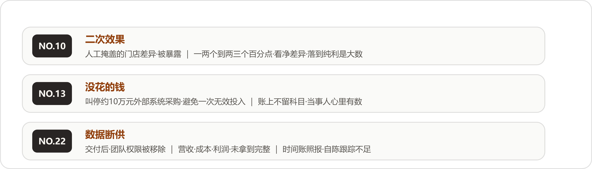

*三个变奏：二次效果、没花的钱、数据断供——都落在"效率提升百分之多少"的回答框架之外。*

#### NO.10｜二次效果：被掩盖的差异被暴露

**线下零售对账（NO.10）**的时间数字本可报得漂亮——一两个人天压到几个小时——它的答卷却把重音放在了别处：

:::文书 —— NO.10 原话

"真正让我觉得意外的是，AI把原来被人工流程掩盖的问题暴露了出来。在实际数据里，有的门店差异在一两个百分点，有的能达到两三个百分点。这里面既有少收，也有多收，最终需要看净差异。但对于一家线下零售企业来说，即使只有一两个百分点，如果落到纯利层面，也已经是一个非常大的数字。"

:::

对账变便宜之后，先现形的反倒是门店之间的差异。这份答卷把"效果"的边界往外推了一步：工具的直接效果是省人工，工具的连带效果是让被成本挡住的视力恢复——从前核对不起，那一两个百分点的差异既不知道、也没法管；现在知道了，管不管、怎么管，成了企业自己的新题目。NO.8从采购端讲的功课，和NO.10在零售端看见的东西，做的是同一件事：

:::文书 —— NO.8 原话

"所以我们工作的一部分，是把过去不可见的问题变成可以计算的问题。"

:::

#### NO.13｜效果是没花的钱

**消防维保数字化（NO.13）**的答卷末尾，记了一笔在任何效果报表上都查不到的账：

:::文书 —— NO.13 原话

"此外，我还帮助企业避免了一次无效投入。此前企业曾考虑花费约10万元采购一套外部业务系统，但经过现场调研发现，对方方案没有充分考虑行业监管流程和实际执行方式，真正上线后无法使用。经过重新梳理，这笔采购被及时叫停。"

:::

这笔账的奇特之处在于它没有科目：报表只记发生了的支出，被叫停的采购在账上不留痕迹，效果只存在于当事人的记忆里。要是按NO.8的严格口径，这笔避免的浪费甚至走不到"客户亲口认账"那一步。它提醒效果账里存在一类影子科目——没花的钱、没招的人、没犯的错，全都不会自己开口，要有人替它们记着。

#### NO.22｜先报一条坏消息

**跨境电商库存补货（NO.22）**的答卷，第一句就是：

:::文书 —— NO.22 原话

"这个案例有一个特别的地方，交付结束后，客户把我们的团队权限移除了，后续的营收、广告成本和利润数据，我们没有拿到完整的。"

:::

这句话放在任何一份售前材料里都活不过第一稿，它就这样躺在效果问答的开头。在这句之后，NO.22照报了自己的时间数字（每天4～5个小时压到1小时以内），照概括了三个变化——从"人工搬数据"变成"数据自动流动"，从"人工计算"变成"AI计算、人工确认"，从"库存、补货、广告各自决策"变成"库存开始影响广告决策"——并且承认："当然，这个案例的效果跟踪还有不足。"

交付之后断了联系，在AI项目里到底算什么？材料没有给出答案。往好处读，客户不需要你了——NO.4说的"客户自己开始长出AI能力"，也许长成了连数据都不必向你交代的样子；往坏处读，合作到期、各走各路。两种读法都通，档案停在"效果跟踪还有不足"六个字上。我们把它记在这里，也把这份没有答案留给读者——二十四案读下来，敢把坏消息写进答卷的，只此一家。

### 收口｜方法论：四层账，三个诚实口径

把二十四家的报法收拢成一张自查表。报效果之前先过四层账，每层一问；数字出口之前，再过三个诚实口径。

**四层账**——一层一层往上问，问到哪层答不上，项目就做到哪层为止：

| 层 | 这层的账 | 验收的一问 | 锚点 |
| --- | --- | --- | --- |
| 一 时间 | 同一件事原来多久、现在多久 | 计时口径前后一致吗 | NO.2/4/9/22 |
| 二 人 | 省下来的时间去了哪儿 | 那几个人现在每天在干什么 | NO.17/18/21/23 |
| 三 组织 | 本事离开人还能不能用 | 老人走的那天，活掉不掉线 | NO.1/12/19/24 |
| 四 企业 | 客户自己做了第二件事没有 | FDE不在场时，有没有使用在发生 | NO.4/11/14/19 |

**诚实三口径**——数字出口前的三道闸：

| 口径 | 做什么 | 锚点 |
| --- | --- | --- |
| 先掐基线 | "我们会从历史数据中建立基线，再通过小规模实验逐步扩大范围"，每个阶段验证几个问题 | NO.8 |
| 标注口径 | 原型还是正式、短期还是长期、脱敏与否，随数字一起交代 | NO.6/7/24 |
| 亲口认账 | 业务价值算完，让客户自己的业务人员确认，确认了才算成立 | NO.8 |

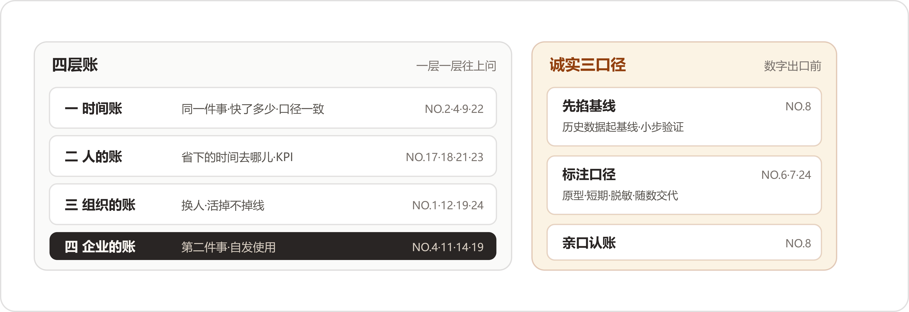

*四层账往上问，三个口径往外守；这张表的每一条，都是二十四家用真实项目换来的。*

这一问读到末尾，我们记住的反倒很少是数字本身。时间数字绑在当下的流程上，流程一改，数字就旧了；上面三层安顿的是人、经验和能力，这些跟着企业走。过半FDE主动降格，做到最后是一种自知：知道自己报的东西里，哪些明年就作废，哪些才算数。

:::文书 —— NO.2 原话，拿它收这一问

"一个AI项目真正成功的标志，是验收通过之后，客户还愿意继续和你做第二个、第三个项目。"

:::

## 第五问｜坎不在模型——二十四家的新问题与解法 {#appG-q5}

### 先说结论：一句话的二十四次回声

第三问收尾留过一个保留：那些思路讲得太顺，第一版错在哪里、中间回了几次炉，多半一句带过。这一问就是补齐另一半的地方——二十四份答案里装的全是事故，坎在哪里，怎么翻的车，怎么救的火。

而这一问最显眼的东西还轮不到事故，是开头。二十四份答案，有十六家的第一句话在说同一件事——难的东西不在模型那儿：

- **澳洲乳企动销（NO.24）**："AI落地最大的挑战不在模型。"
- **车管所审材料（NO.2）**："如果让我总结这个项目最难的地方，最难的是组织和规则，算法反而排在后面。"
- **城市规划研判（NO.4）**："当然有，而且真正难的问题很多都不在模型。"
- **鞋服电商素材（NO.12）**："我觉得最大的挑战，其实不在模型本身。"
- **生物科技上市公司（NO.18）**："这个项目真正难的地方，大多不在技术。"
- **跨境物流装载（NO.6）**："最大的挑战其实来自业务方面，技术层面的问题相对更为可控。"
- **跨境电商库存补货（NO.22）**："这个项目真正难的地方，其实不在Agent怎么写。"
- **工程租赁获客报价（NO.23）**："真正落地以后，我发现最大的挑战，很多时候在AI之外。"

同一个意思往下数还有八家：**工业物料采购（NO.8）**说"这个项目真正困难的地方，其实大部分都不在模型本身"，**国企电商子公司（NO.14）**说"我们踩过最大的坑，其实不在技术"。**央国企财务流程（NO.9）**和**非标制造报价（NO.17）**各有一句变体。**本地生活短视频（NO.15）**的原话是"这个项目最大的难点，其实不是开发"，**汽配供应链经营（NO.20）**的原话是"FDE真正难的地方，很多时候在AI技术之外"。**外贸资料整理（NO.11）**把这句话放在了收尾——"回头看，这三个挑战没有一个直接关于模型，但每一个都能决定项目能不能真正跑起来"；**电信数据分析（NO.16）**的版本最有画面："这个项目里最大的挑战，恰恰是很多AI演示不会暴露出来的东西：稳定性、准确性、成本，以及规模化。"

十六家，头一句各自措辞，意思完全一致。这种一致本身值得停下来看一眼：它不像是商量好的口径，更像是各自栽过跟头之后，摸到的是同一堵墙。有两家还把这句断言往后多算了一步，算出了数：

:::文书 —— NO.9 原话

"在AI时代，我甚至认为，一个项目如果单纯从技术上已经能够落地，其实已经成功了80%。真正容易让项目'死掉'的，是业务、人和组织。"

:::

:::文书 —— NO.14 原话

"如果让我给企业AI落地的难度排个序，我现在的排序是：人最难，其次是组织，再是数据，最后才是技术。"

:::

NO.14同一段还替大家认领了老印象：从前总讲万事俱备差个技术，现在技术反倒成了不难的那一环。NO.24连比例都给了——"我们自己的说法是：难点不在技术层，技术大概只占20%"。断言、排序、比例，三样对得上，这一问的塔尖可以一句话断定：**坎不在模型；难度从人到技术一路递减，人最难，技术只占两成。**

把二十四份答案里的坎摊开、合并、归位，剩下六类，每一类里都有名有姓：

1. **人的阻力与信任**——主坎七家：NO.9、12、13、14、17、20、23

1. **组织协同与利益账**——四家：NO.2、4、8、10

1. **需求说不清、找错问题**——五家：NO.1、7、15、19、22

1. **数据底子与数据拿不到**——四家：NO.5、11、18、24

1. **准确性与责任兜底**——两家：NO.16、21

1. **该不该用AI与现场适配**——两家：NO.3、6

一家往往不止一道坎，上表按主坎归位，次要的坎在正文里带出；六类合计二十四家，一家不缺。

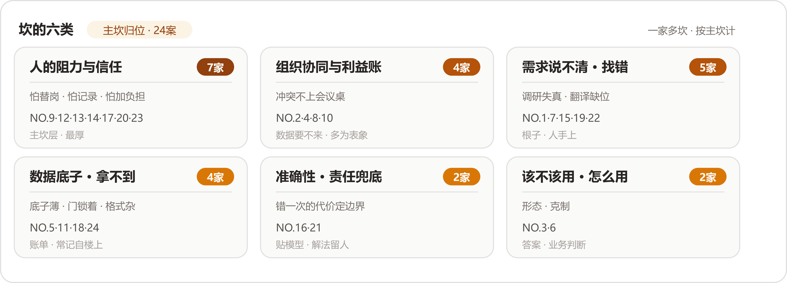

*六类坎与主坎归位。人的坎一类挂了七家，贴着模型的两类加起来只有四家——这座塔头重脚轻，收口会把它画出来。*

下面一类一类走：每类先看坎长什么样，再看他们怎么解；解法里只此一家的五招，最后单独说。

### 第一类坎｜人：抵触长在具体的怕上

先说一个读了材料才改正的印象："员工抵触AI"这句话太大，装不下现场的东西。二十四家写到的抵触，没有一处是抽象的反对，每一处都长在具体的怕上，而且怕的东西五花八门：

- **非标制造报价（NO.17）**的员工怕丢岗位，怕得非常具体：

:::文书 —— NO.17 原话

"比如一个岗位原来要3到5个人完成，现在老板说上AI以后可能只要1到2个人，员工第一反应常常是担心自己是不是要被优化、系统上线以后还有没有位置、是不是要被调去不想去的岗位，很少会先想到'这个系统真先进'。这种抵触非常真实。"

:::

这一家的总结也尖锐："技术是相对静态的，人的反应是动态的。"乙方在这里还有一层天然吃亏：员工看你，看的就是那个来动他岗位的人。

- **消防维保数字化（NO.13）**的员工怕的东西跟前一家不一样，他们怕被记录：

:::文书 —— NO.13 原话

"员工最初对数字化心存顾虑。他们担心这意味着更严格的管控，担心自己的工作过程被完全记录，也担心需要学习一套全新的系统。"

:::

- **央国企财务流程（NO.9）**的业务人员怕的是凭空多出来的活：

:::文书 —— NO.9 原话

"业务人员本来每天已经很忙了，你突然给他增加一个新系统、新流程，他第一反应很可能是'你为什么又给我增加了一个负担？'"

:::

- **鞋服电商素材（NO.12）**碰到的怕分成两个极端，一头防折腾，一头抬期待：

:::文书 —— NO.12 原话

"一种人觉得，'我们现在挺好的，为什么要折腾AI？它到底对我有什么价值？'另一种恰恰相反，觉得AI无所不能，甚至会期待'花10万元，就应该给我做出100万元的效果'。"

:::

它家还补了这一类里最刺痛的一句——员工的情绪没解决，连你拿到的输入都是坏的：

:::文书 —— NO.12 原话

"如果这种情绪没有解决，你拿到的需求可能都是假的，最后产品上线以后也没人愿意真正使用。"

:::

- **汽配供应链经营（NO.20）**的坎在企业负责人那一层，起因是两套看世界的方式："我原来是互联网大厂产品经理出身，和制造业老板看问题的方式并不一样。"这一步没走通，后面的方案很容易跑偏。
- **生物科技上市公司（NO.18）**记录了销售团队的第一反应："把一个AI工具直接扔给业务人员，他们第一反应往往是这东西是不是要替代我、公司是不是准备裁员。"
- **制造业师徒带教（NO.1）**的第三道坎也是它："第三个挑战，是技术跑通以后，员工不一定愿意用。"技术过关和有人肯用，中间隔着整整一道坎。
- **TikTok达人建联（NO.5）**在这上面动的是嘴上的功夫，把定位钉死："我在推进的时候，会把AI的定位明确成'帮助大家解决问题、提高效率'，让大家理解这套系统是要帮忙，不是要替掉谁。"

解法各家不同，方向一致——不辩解，先给：

- **鞋服电商素材（NO.12）**进门不谈大词："所以我们一进去，没有跟员工讲'AI转型'这种大词，先把他们眼前的小麻烦解决掉，把关系建立起来。"
- **央国企财务流程（NO.9）**用业务陪跑加小痛点换信任："所以我更愿意从一个很小、很痛的场景开始，先把一个点做好，让业务人员看到真实ROI。"换来的转变它记得很细："这时候，AI项目就从'你要让我用'变成了'我希望你帮我继续做'。"
- **国企电商子公司（NO.14）**动了制度："所以我们必须从'替代'切换到'助手'，同时让企业的人事制度、激励机制跟上。"
- **非标制造报价（NO.17）**把这一关交给了企业负责人："所以这个问题靠FDE自己解决不了，企业AI转型必须是一把手工程，老板必须真正认可，并且愿意自上而下推动。"它家在立项前就跟企业负责人谈好生产力释放之后人往哪儿去，裁员这条路从头就不在方案里，最后企业真的调整了相关人员的工作安排和KPI。
- **消防维保数字化（NO.13）**两边都接住："所以在设计流程时，我们同时兼顾两方诉求。对老板，解决数据透明和风险管理；对员工，解决工作效率和流程负担。"
- **生物科技上市公司（NO.18）**把人的去向讲在前面："高层先明确为什么做AI，再跟中层讲清楚AI上线以后给部门带来什么收益、岗位怎么调整、职责怎么变。"讲完之后，员工那边的东西变了——"这时候员工对AI的理解就完全不同了，它从'可能抢我工作的东西'，变成了'帮我减少低价值工作的工具'。"
- **工程租赁获客报价（NO.23）**直接把企业负责人用不用当成判断标准："如果老板自己都不用，这个项目基本推不下去。所以我们会把'一号位是否愿意采用'当成很重要的判断标准。"
- **建筑消防施工图（NO.21）**不靠说服靠体验："我们的做法是让设计人员在实际使用中体验价值，而非强行说服。"

把这些怕摆在一起，能看出一层东西。NO.17的员工在算岗位，NO.13的员工在防记录，业务人员在护自己本来就排满的日程（NO.9）。NO.12那两种极端，一头在防白折腾，一头在抬不现实的期待。怕的对象各不相同，算的其实是同一本账：这件事动了之后，我亏什么，出了错谁担着。解法也就全部长在这本账上——先把小麻烦解决了（NO.12），让人亲眼看见省下的时间（NO.9），把岗位去向和KPI重新谈过（NO.17、NO.18），或者让制度来接住人（NO.14）。能抄走的判断有一条：员工的抵触是一本没算清的账，帮他把账算清，比把模型调准有用。

### 第二类坎｜组织：冲突不会在会议上说出来

组织这一层的坎有一个统一的长相：它几乎从不打着"组织问题"的旗号出现。它表现为数据要不来、需求回得慢、项目推不动——顺着表象往下挖，挖到的都是部门和利益。

- **车管所审材料（NO.2）**把这一层的机制说得最全：

:::文书 —— NO.2 原话

"一个项目刚进去的时候，你可能只跟一个部门、一个负责人打交道。但真正开始落地以后，会涉及不同部门、不同角色甚至外部合作伙伴。信息化、数字化、智能化一旦真正改变流程，就一定可能影响某些人的原有工作和利益。"

:::

它接着开出的能力清单里，技术只占一项："所以FDE除了做技术，还必须会沟通、协调、项目管理，甚至要会'算利益账'。你要让不同角色看到，这个变化对他意味着什么，谁会获得收益，谁的工作会改变，出现冲突以后谁有最终决策权。"（它家最独特的那道坎——AI把审核尺度里的"放宽"照了出来——留给独门解法单说。）

- **城市规划研判（NO.4）**的十部门协作，把"要不来"写成了现场实录：

:::文书 —— NO.4 原话

"10个部门里，有人天然支持AI，也有人心存顾虑，担心这套东西上线以后会影响自己的岗位和价值。所以我们去问业务规则、要数据的时候，有的人回复会很慢，甚至直接说：'这些网上都有，你们自己查。'"

:::

而实际上，很多规则只有真正做业务的人才知道。它的第一个解法是换人推动：

:::文书 —— NO.4 原话

"项目发起人可能是副院长，但真正能协调10个部门、知道谁最难推动、谁掌握什么数据的人，往往是下面那个负责总调度的人。我们必须先跟这个人聊透。"

:::

第二个解法是给方案留容错，不要让任何一个部门握着整个项目的生死：

:::文书 —— NO.4 原话

"如果某个部门暂时不给数据，我不会让整个项目因此停下来。少一个部门，就先少做一个场景；少一类数据，就先让这一部分不参与计算。但是最后整体链路必须能够跑通。"

:::

它给自己定的交付底线是"一文、一图、一表"——缺一个节点，核心交付形态仍然成立。

- **工业物料采购（NO.8）**的案子涉及十几个团队，它家看穿了这类坎的藏身之处：

:::文书 —— NO.8 原话

"有些AI应用甚至会改变部门之间原来的工作流程，因此天然可能产生冲突，而且很多冲突不会在会议上直接说出来。所以我们会做多轮讨论，不仅开大会，还会提前和不同利益相关方单独沟通，把这些没说出口的顾虑提前化解。"

:::

它还把组织坎的时间轴拉到了上线之后——项目要移交给业务部门，由他们决定是否真正采纳，而"FDE不能是'东西做完、钱到账、人撤走'。如果业务部门最终不用，或者三个月之后效果消失了，那这个应用就不能算真正落地。"

- **线下零售对账（NO.10）**吃过的亏是层级没讲清："AI项目很容易被理解成'老板想要、FDE来做、一线员工来用'。但实际上老板、中层、一线员工关注的东西完全不一样。如果前期没有把每个层级的目标、预期、能力边界和责任讲清楚，最后很容易出现'做得不好就是FDE的问题'。"它现在的做法："不仅要和老板对齐，还要和涉及项目的不同层级分别对齐。"

四家的解法摆在一起，有一个共同动作：把暗处的利益摆到明处谈。NO.8把会上不说的顾虑放到会前单独说，NO.10把每个层级的目标和责任在开工前讲清，NO.2算利益账算给所有人看。NO.4那两招最值得抄走：与其跟十个部门挨个较劲，先把那个真正能协调所有部门的总调度找出来聊透；方案里始终留一道容错，缺一家也还能交活。能抄走的判断：组织坎的入口通常是某个流程节点卡住了，不要在节点上使劲，去找那个能拍板也肯拍板的人。

### 第三类坎｜需求：拿到的和要做的，中间隔着失真

说需求是坎，听上去跟第三问记下的那笔打架——那边说二十四家没有一家抱怨客户说不清，说不清就是起点。两边其实不矛盾：起点归起点，成本归成本。说不清照样要花真金白银去解，而且这一类坎最隐蔽的地方在于，它伪装成"已经说清楚了"——调研记下来的、客户答应的、演示点头的东西，进现场才发现是失真的。

- **基金公司研发转型（NO.7）**的失真来自预调研：

:::文书 —— NO.7 原话

"有一次，我们提前了解到客户团队使用AI Coding的能力比较深，所以准备了很多高阶内容。结果真正到了现场，发现大家连一些基础问题都没有解决。"

:::

"那怎么办？只能现场降级，从基础开始。"反过来也一样，本以为能力一般，到了发现用得非常熟练，就把最深一层的内容拿出来。它对不确定性的态度也在这类坎上："我的解决办法，是把不确定性暴露出来，然后通过小步验证降低风险，不假装自己已经知道答案。"

- **工业物料采购（NO.8）**把找真问题的时间花在了数上面："我们花数月去理解一个看起来和AI没有太大关系的ERP业务流程。"因为"很多时候客户自己都不知道真正值得AI解决的问题在哪里"，而"不做这些'脏活累活'，后面的AI很可能只是在错误的问题上做得更漂亮"。
- **制造业师徒带教（NO.1）**的第一道坎就是它："第一个挑战，是用户说不清需求，也说不清经验。"一线员工不愿花时间，隐性习惯本人也讲不全——跟岗怎么跟，第三问里已经记过，这里不重复。
- **消费品包装审核（NO.19）**把"什么问题值得做"写成了三道硬条件：

:::文书 —— NO.19 原话

"一个适合FDE落地的问题，至少要同时满足几个条件：它必须是业务同学真实存在的问题，必须有业务价值，而且解决之后最好能够找到可以衡量的指标。这几个条件同时成立，其实非常难。"

:::

它还看穿了需求方的一般状态："因为业务方不可能把一个需求完整、准确地定义出来，更不可能期待AI稳定地100%满足一个没有边界的需求。"

- **跨境电商库存补货（NO.22）**的翻译工作从让客户演示开始："所以我们反复让客户演示工作流程，甚至让他录屏。只有把'他每天到底怎么工作'看清楚以后，我们才发现后面还有照片处理、补货、供应商下单、广告投放等一系列问题。"它给这个角色的定位："客户说的是业务语言，技术人员听到的是技术语言，中间需要有人把两者转换起来。"
- **本地生活短视频（NO.15）**碰到的失真更细——反馈本身说不清："客户有时候会觉得'这个不对'，但又很难准确告诉你到底哪里不对。"解法是把模糊翻译成可调的东西："我需要结合自己的业务经验，去理解客户说的'感觉不对'到底意味着什么，再把这种比较模糊的反馈转成可以调整的提示词、流程或者判断标准。"
- **工程租赁获客报价（NO.23）**的版本是"说起来简单"："比如客户说'我要一个内部数据库，再做一个基于数据的搜索'，听起来好像很简单。但真正进去之后，你会发现数据库到底怎么搭、数据怎么清、数据量多大、检索怎么做，这些成本都很难提前估算。"它从这道坎里学到的规矩："不能因为客户说得简单，就默认交付也简单。"
- **消防维保数字化（NO.13）**补充了失真的成因——会议室本身就有压力："特别是外勤维保人员，平时很少回公司，如果坐在会议室里面对老板和管理人员，容易产生压力，只会被动回答被问到的问题。"
- **线下零售对账（NO.10）**把这道坎的账单亮了出来。学校批改作业那个案子，需求听着顺，拆开全是要回答的问题：准确率要多少、批改时效是什么、题库结构化到什么程度、人工在哪个环节介入。它的结论是：

:::文书 —— NO.10 原话

"以前软件工程时代，这叫产品经理需求没定义清楚，研发不断返工；到了AI时代，本质没有变，只不过后面的'返工成本'还可能直接表现成大量Token消耗和交付成本。"

:::

这一类里最该抄走的是NO.10那句账单：AI时代的需求返工没有打折，还涨价——返工直接烧成Token和交付成本。机理跟第一问对得上：客户给的说法是他对自己的认识，现场的动作才是实况，两者中间的缝隙就是这类坎的藏身处。三件顺手就能带走的工具：筛问题时用NO.19的三条件（真实存在、有业务价值、可衡量），追问不出就换NO.22的演示加录屏，反馈模糊就学NO.15把"感觉不对"翻译回业务语言。

### 第四类坎｜数据：底子薄，门还锁着

难度序里数据排第三，落在组织后面。把这一类读完就明白为什么：数据坎十有八九是别的坎结出来的账单——底子薄是历史欠账，拿不到是组织不让拿、企业负责人不放心、系统锁着门。真到了数据本身那儿，反而不算最难。这一类坎长着三种长相。

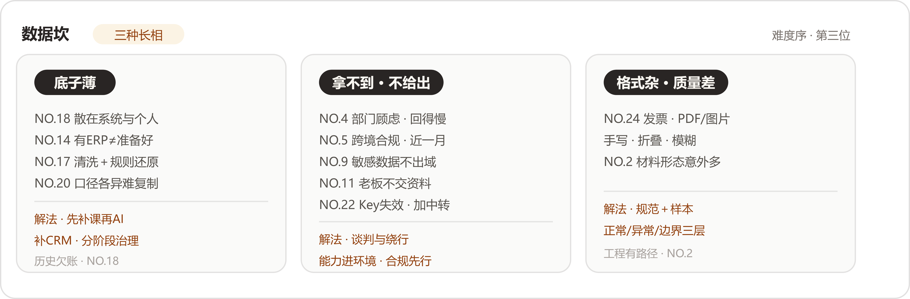

*三种长相，三种解法，没有一种在模型侧。*

#### 长相一：底子薄

- **生物科技上市公司（NO.18）**的现场观感给了"上市公司"三个字一记重击：

:::文书 —— NO.18 原话

"真正走进去才发现，业务领先和数字化领先完全是两回事，销售数据散落在不同系统和个人手里，IT团队也没有足够的人力承接AI转型。"

:::

它的选择是接受现实，先补课再上AI："所以我们的做法是接受现实，不跳过信息化和数据化，该补CRM就补CRM，该把销售数据先汇总就先汇总，该建数仓就建数仓。"补课的节奏也讲方法："我们的办法是分阶段推进，先把最关键的数据跑通，再逐步把其他数据接进来，边接入边治理。"

- **国企电商子公司（NO.14）**补的是判断："这家企业是数字化基础很不错的代表，但仍然有大量业务没有结构化沉淀。很多新业务、内控业务和人工操作环节，数据可能根本不存在；即使存在，也未必按照AI需要的方式总结归纳。"所以"不能因为客户有ERP、有数据中台，就默认它已经做好了AI的准备"。
- **非标制造报价（NO.17）**花的是笨功夫："很多中小制造企业的数据基础比较薄弱，进去以后你会发现，各种资料、历史报价、物料信息、供应商信息，很少能天然直接给AI使用，所以我们花了大量时间做数据清洗和结构化。"更花功夫的是从数据里还原业务逻辑——"这个物料为什么这样映射，这种情况为什么这样报价，老师傅做这个判断到底依据什么。这些东西不解决，模型再强也没用。"
- **汽配供应链经营（NO.20）**被数据挡住了标准化的路："即便是同一个行业、规模差不多的企业，底层的数据基础、数据口径、业务流程都可能差很多。"它最后没有急着把方案包装成标准产品，"方法论可以复用，但底层的数据和业务逻辑，未必能直接复制"。

#### 长相二：拿不到、不给出

- **TikTok达人建联（NO.5）**的跨境数据权限，一磨就是一个月：

:::文书 —— NO.5 原话

"我们光数据这一块就花了接近一个月，数据申请会被打回来再重新申请，权限账号要重新确认，服务器怎么部署也需要确认，甚至数据能不能离开所在国家、应该留在哪里，都需要提前搞清楚。"

:::

它的建议是把这些搬到最前面："所以如果要做境外业务，我会特别建议FDE提前把数据合规和数据流向研究清楚。不要等系统都做完了才发现数据拿不到。"

- **外贸资料整理（NO.11）**的门锁在企业负责人手里："AI要真正发挥作用，就必须接触企业最有价值的资料。但恰恰是这些资料，老板最不愿意交出去。"解法是把工作送进门："所以我们换了一种方式，把开发能力和任务规范送到他的环境里，让客户自己的AI在本地完成工作，数据始终不离开企业。"
- **跨境电商库存补货（NO.22）**的门锁在系统里："真正做起来以后才发现，SaaS方提供的API虽然能用，但Key有失效机制，一个Key也不能被多个团队同时使用。"最后在中间加了一层数据中转，把数据先引出来再同步回飞书。它从这件事里看出来的东西，值得整段抄录：

:::文书 —— NO.22 原话

"现实世界里的AI落地，很多时候卡在模型之外，企业原有系统的开放程度、数据结构和接口限制，往往才是真正的门槛。AI本身可能已经能做了，但数据根本拿不出来，还是落不了地。"

:::

- **央国企财务流程（NO.9）**的门是安全要求——敏感财务数据不能丢给公共模型，只能从底层环境开始解决，为此帮企业采购过两百多万元量级的一体机。但开口的顺序它反过来走："但这里又出现了一个很现实的问题：如果你一开始就告诉甲方'我们先花两三百万元买一台机器'，对方很可能会问'为什么？我还没看到AI能给我带来什么价值'。所以这又回到了前面的逻辑：先用小场景证明价值，再推动基础设施建设，不能反过来。"
- **城市规划研判（NO.4）**那道"这些网上都有，你们自己查"的坎，前面组织类里已经记过——根子在部门的顾虑，账记在了数据的头上。

#### 长相三：格式杂、质量差

- **澳洲乳企动销（NO.24）**的发票什么样都有："比如一张发票可能是PDF，也可能是图片；可能清晰，也可能手写、折叠、模糊。如果不针对这些边界情况做充分测试，模型上线后一定会出问题。"它的解法是双层的：一方面先建立数据规范再处理非结构化数据，另一方面建了一套评估样本，"收集正常案例、异常案例和边界案例，持续测试模型在真实场景下的表现"。
- **车管所审材料（NO.2）**的材料也不干净："车管所的材料不像实验室数据集那么干净，身份证、合同、发票这些常见材料在实际上传时会出现各种意想不到的形态。"识别率不够就收集样本，负样本不足就补负样本。它对这一层的评价很公道："这些问题虽然麻烦，但基本都有工程上的解决路径，真正难的在后面。"

三种长相看完，回头再看数据为什么排在组织后面，答案就在类目里：长相一（底子薄）要花钱花时间补课，长短取决于家底；长相二（拿不到）基本是组织坎的账单，NO.4的门、NO.11的企业负责人、NO.22的系统、NO.9的红线，没有一道是靠模型解决的，全靠谈、靠送、靠绕；只有长相三（格式杂）离技术最近，而NO.2说得明白，这类问题麻烦归麻烦，工程上有路径。能抄走的判断：进场先给数据做个体检，问三句——有没有、给不给、干不干净；该补的课就先补，不要指望模型替你把欠账背过去。

### 第五类坎｜准确性：兜底兜的是责任

六类坎里，这一类听起来最像技术坎——识别率、稳定性、生成质量，字面全是模型的指标。把答案读完会发现，他们兜的其实是责任：错一次的代价有多大，决定留多少给人、把边界画在哪里。

- **建筑消防施工图（NO.21）**把这道题做得最完整。用户一开始要的是"一键生成完整施工图"，专业设计人员要的却是保留调整空间，两边的分歧根子在责任：

:::文书 —— NO.21 原话

"原因是消防设计涉及责任问题。设计人员需要对最终图纸的合规性和安全性负责，他们不能接受一个'大概对'，或者'完全黑箱'的生成结果。"

:::

它的解法是分层："我们的应对方式是提供分层设计：对于常规空间，提供默认参数的一键生成能力，降低使用门槛；对于专业用户，开放危险等级、K值、喷头间距、布置方式等参数的调整入口。让系统既能够快速产出，也能够精细控制。"边界则写进了系统："因此，我们在系统设计中明确了边界：AI负责基于规范规则的自动化生成，但不做超出规则范围的'创造性判断'。最终方案必须经过设计人员审核确认，系统在关键节点设置人工确认环节。"

- **电信数据分析（NO.16）**的坎是稳定性，它先拆了一个流行的借口——把模型随机性当成"结果不稳定很正常"，然后用一个比喻把解法说尽了：

:::文书 —— NO.16 原话

"但我们的做法，是通过系统设计，把这种随机性放进一个相对可控的业务流程里。就像汽油本身不稳定，但汽车工程的意义，就是让汽油可以安全、稳定地驱动车辆。"

:::

成本那一半也说得直白："如果架构设计得不好，就像一辆漏油的车，你根本不用谈省油，因为油一直在往下掉。"

- **非标制造报价（NO.17）**的图纸识别是这一类里最具体的坎："客户图纸远比想象中杂，有PDF、CAD，还有各种扫描件，清晰度参差不齐。模型在干净样例上效果不错，一旦碰到手写标注、特殊符号、非标准图框，抽取字段就经常出错。报价是要对外的，一个尺寸抽错会直接影响成本。"它那套"只审模型把握不大的字段"的解法，独门解法里单说。
- **鞋服电商素材（NO.12）**的准确性长在生意上："生成内容最怕的是'看起来很好，但商品不对'。"它的规矩很硬："AI可以提高效率，但最终的业务责任，不能交给模型。"
- **本地生活短视频（NO.15）**的坎是跨商户的稳定："原本设计好的提示词，在一个案例里表现不错，换一个商户或者SKU，可能就会出现偏差。"它还在交付时给迭代留了位置："同时，在项目交付时就提前预留持续迭代的空间，让客户按照SOP自己继续优化。这样项目结束之后，所有事情就不会重新回到我这里。"
- **澳洲乳企动销（NO.24）**的准确性问题连着信任问题：总部团队习惯了自己看Excel、凭经验判断，系统自动标记异常之后，"有些人会怀疑：'AI说的就一定对吗？'"解法是给每个结论挂上依据：

:::文书 —— NO.24 原话

"对总部团队，先让AI做辅助标记，保留人的最终决策权。每一处风险标记都附带依据（历史对比、区域参考、行业规则），让审核人员能看到判断逻辑，每个结论都有迹可循。"

:::

- **制造业师徒带教（NO.1）**补了验收那一环："比如文档解析率、召回准确率做到多少算合格，没有一个可以直接套用的行业标准。"它跟客户小范围测试、共同定验收标准的做法，最后落成一句："所以验收标准本身，也是业务沟通的一部分。"

这一类摆完能看出一个结构：NO.21的分层（一键给常规、参数给专业）、NO.16的系统设计（给随机性造容器）、NO.24的依据链（每个结论有迹可循）、NO.1的验收共定，四家干的是同一件事——把"错了怎么办"提前设计进系统。NO.16那个汽油的比喻值得整个抄录，而且它管的不只是模型：数据进门之前先过规范（NO.24），结论出门之前先挂依据、留人审（NO.24、NO.21）。能抄走的判断：准确率指标谈不拢的时候，先谈错的代价——代价定了，兜底的设计自然就定了。

### 第六类坎｜该不该用：先问值不值得动用AI

最后一类坎问的事情最朴素：这件事到底该不该用AI来做。它分两半，一半是形态（用什么样的AI），一半是克制（要不要AI）——这个分法是我们读完归纳的，原文没有这个说法。

先看克制的那一半，答案几乎全是否定句：

- **城市规划研判（NO.4）**顶回去的第一个东西是"一句话出报告"："一开始客户希望做到'一句话出报告'。听起来很自然，但真正深入之后我们发现，如果把它简单理解成意图澄清后，再把问题转成SQL去数据库查询，其实很难满足规划业务的复杂性。所以我们建议把'万能问数'先放一放，让AI理解任务以后调用真正的专业工具完成处理。"第二个是"多智能体博弈"——法律专家、经济专家、民生专家坐在一起讨论规划议题，听着先进，分析完业务发现有些选址问题终究靠规则和指标计算：

:::文书 —— NO.4 原话

"这种情况下，强行做多智能体，不但架构更复杂，上下文在多个智能体之间传递还可能带来歧义、丢失和污染，结果反而不够收敛。"

:::

它最后把自己的职责改写了："这个过程让我越发笃定，FDE的职责是帮客户判断，什么地方真的应该用AI，什么地方不应该。"

- **跨境电商库存补货（NO.22）**的判断标准是脚本："一些非常确定、规则非常死的任务，其实写一个脚本、跑一个定时任务就够了。只有当任务开始涉及语义理解、跨系统判断，传统脚本比较难覆盖的时候，才需要引入Agent。"所以"做方案选择时，我会先问，这个问题到底需不需要AI"。
- **基金公司研发转型（NO.7）**挡的是反面——不该重的时候不要重："比如一上来就买模型一体机、做模型微调，或者强行推翻原有全部工作流。我反而觉得这些方式比较危险。"它给的顺序是："投入应该由轻到重，先把业务价值验证出来，再逐步加深。"
- **线下零售对账（NO.10）**的学费交在高估AI能力上。之前做过一个国内电商横向比价的案子，判断AI能解决其中百分之七八十的问题，真做起来才发现平台的风控和反风控一直在博弈，方案很快被平台策略堵掉，交付周期拉长，能覆盖的场景不断缩小。这道坎教它的规矩值得贴在墙上：

:::文书 —— NO.10 原话

"如果一个行业里已经有公司专门靠某个问题生存，那就应该先认真研究：它到底解决了什么难点？它掌握了哪些信息差？为什么这个事情值得一家公司的长期投入？"

:::

它给自己下的诊断只有七个字："本质上还是行业认知不够。"

再看形态的那一半：

- **律所案件工作台（NO.3）**的形态之问问得最清楚："很多AI产品的形态是一个聊天窗口，但这个形态对法律案件场景并不适用。一个案件更像一个长期项目，需要持续承载大量材料、过程记录和变化中的信息，一次对话根本装不下。"改版之后用户的习惯还在："最开始很多律师进入产品，会习惯性地找输入框，想问'我要在哪里输入问题'。"直到看见AI在完整案件背景下生成的概要和人物关系图，他们才转过弯来。
- **跨境物流装载（NO.6）**的形态坎长在车厢里："最开始，算法会优先追求空间利用率最大化。但现场人员告诉我，有些方案虽然理论上更优，但是实际操作很困难。比如需要工人进入车厢内部搬运，或者需要频繁调整货物位置。"它把目标改了——"所以我们重新调整目标，从追求数学上的绝对最优，转向在效率、安全和操作便利之间找到平衡"——并设计了截面法，按车厢截面从里向外规划装载顺序，"这样工人只需要站在车门位置操作，不需要踩踏货物进入车厢"。数据那一头的克制也顺带记一笔：专业扫描设备太贵，改用iPad Pro LiDAR加激光测距，把硬件成本控制在约8500元。
- **央国企财务流程（NO.9）**在模型选型上守着同一条线："我把这种方式理解成'因材施教'：先确定业务需要什么，再去组合背后的能力。"财务场景要严谨，内容生成场景要开放，不执着于某一家模型。

这一类读下来，印象最深的是"放一放"出现的密度：万能问数放一放，多智能体不硬做，脚本够用就不上Agent，投入由轻到重，最优解让位给可操作。替客户挡掉不合适的AI设想，本身就是交付的一部分，NO.4把这句话直接说成了职责。NO.10的教训补上另一头：克制不只针对自己的冲动，也针对难度本身——已有公司靠这个问题生存的领域，先研究明白再进场。能抄走的判断是一道三连问：规则算法能不能干？脚本定时任务够不够？轻量验证能不能先跑？三问都过了，再谈Agent。

### 独门的解法：五条只此一家的救火道

六类坎里的解法大多是公约数——小切口、留人审、先补课、给依据。另有五家的解法，二十四案里只此一家，值得单独记一笔。这五招未必搬得走，但每一招都长在一道只属于那家企业的坎上。

1. **车管所审材料（NO.2）：把"放宽"摆上桌**。这道坎本身在二十四案里是孤例——自动审核一跑，把人工审核多年积累的尺度弹性照了出来：

:::文书 —— NO.2 原话

"自动审核跑起来以后，我们发现有些业务过去人工审核时存在一定程度的'放宽'。这时候问题从'模型能不能识别出来'，变成了'识别出来以后到底应该怎么办'。"

:::

严格执行，可能影响业务量和合作关系；保持宽松，自动审核就失去了意义，而且"这种事情技术团队自己不能拍板"。他们的做法是算账给甲方看："我们的做法是把问题和数据客观呈现给甲方，哪些材料存在问题，按照不同审核尺度每天能处理多少业务，业务量会发生什么变化，然后让甲方结合实际经营和管理要求做最终决策。"跑了一段时间、有了真实数据，效率、合规和业务量之间才找到平衡。这条解法的边界感是全文最清楚的一句："我们的职责是把技术能力做出来，把问题暴露出来，把不同选择可能产生的结果说明白；但涉及业务利益和管理规则的最终决策，必须交给业务负责人。"

1. **外贸资料整理（NO.11）：给两个AI修一条远程通道**。坎很琐碎——定制产品必须有人真用才知道哪儿不合需求，可企业负责人要处理业务，"产品做好以后需要他测试，他又可能几天都不在公司"，员工白天要用电脑，调试排不上队。有一段时间他们只能一直催："有一段时间，我们甚至一直在催老板：'你有时间用一下，至少给我们留一点记录。'"后来的解法是自己写了条通道：

:::文书 —— NO.11 原话

"后来我们自己开发了一个远程通道，让我们的AI可以在后台连接客户电脑上的AI，在不影响员工正常工作的情况下完成一些任务。很多长任务放到晚上跑，双方都节省了大量沟通和等待时间。"

:::

自己这边的AI隔着一条自建通道，去调用客户电脑上那个数据不出企业的AI，长任务夜里跑——"等老板有时间"这件事，被他们当成工程问题解掉了。

1. **国企电商子公司（NO.14）：让人事部门牵头**。第一年IT部门牵头，技术底座做出来了，瓶颈跟着来——AI深入业务之后，问题的重心从"系统怎么做"转到了"员工怎么用""流程怎么改""组织怎么配合"。所以今年换了牵头的人：

:::文书 —— NO.14 原话

"所以今年我们让人事部门牵头，从培训开始重新推进。这个转变看起来有点反直觉，但恰恰是我们服务两年以后踩坑踩出来的经验。"

:::

AI项目归口人事，道理在它家的第一道坎里：员工为什么愿意参与，AI接走重复工作之后人去做什么，有没有晋升路径和新的激励——这些全是人事的问题。

1. **非标制造报价（NO.17）：只校准模型没把握的字段**。兜底最怕的是省下来的人力又整个吃回审核里。它家的设计把人工的部分变成了递减的：

:::文书 —— NO.17 原话

"我们的办法是给识别加一道人工校准兜底，业务人员只审那些模型把握不大的字段，审完再把修正结果回填到模型和数据里，识别准确率随着真实数据越滚越高，人工要审的部分越来越少。"

:::

把握大的字段直接过，把握小的才请人，审完的修正回填回去——同一个兜底，既兜住了报价对外的责任，又不会把省下的人力原样退还。

1. **汽配供应链经营（NO.20）：把ROI当第四个坎**。别人数到数据就停了，它家在企业负责人认知、行业Know-how、数据之后，数了第四道——这个项目对FDE自己是不是一门好生意：

:::文书 —— NO.20 原话

"因为FDE的核心成本就是人的时间。如果一个项目需要投入大量人力做数据治理、长期维护和定制开发，那么即使客户觉得项目很好，对FDE团队来说也不一定是一门好生意。"

:::

这道坎要对付的东西，长在自己的账本上。它后来开始主动寻找更标准化的场景，方向就是从这道坎里长出来的。

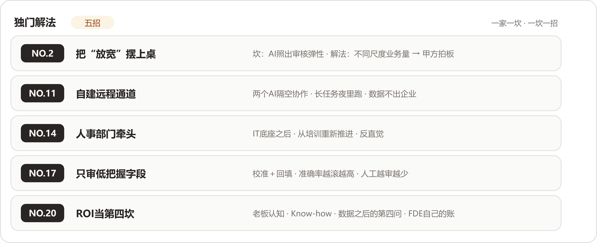

*五招对五坎，一家一招。公约数负责大方向，这五招负责那道具体的坎。*

五招放在一起有一个共同点：每一招都贴着那道坎的形状长，换一家就失效。放宽的账只有审材料的算得出来，远程通道只在外贸小企业那种企业负责人即全部决策人的地方值得修，人事牵头只在知识型组织的转型里成立，递减的校准只救得了报价这种错一个字段就赔钱的活，ROI那一坎更是NO.20自己的生存题。能抄走的与其说是招式，不如说是做法：先看清坎长什么样，再决定解法长什么样。

### 收口｜方法论：一座头重脚轻的塔

把六类坎挂回NO.14的难度序上，这座塔的样子就出来了。人这一层挂着两类：阻力与信任七家，说不清与失真五家，合计十二家，二十四家里的一半。组织四家，数据四家，技术层挂着准确性与该不该用两类，四家。

需求那一类挂到人层，需要交代一句理由，理由在材料里：说不清的根源是活长在人手上。NO.1的隐性习惯连本人都不自知，NO.7的调研拿回来的是客户对自己的想象；外勤维保人员在会议室里只会被动应答（NO.13），"感觉不对"这四个字连本人都翻译不出来（NO.15）。坎的名字叫需求，坎的位置在人的脑子里和手上。所以人这层的坎其实长着两副面孔：一副是不肯给——怕丢岗位、怕被记录、怕多干活；另一副是给不出——说不清、说失真、说不准确。两副面孔加起来，占了二十四家的一半，这才是"人最难"三个字在材料里的实际分量。

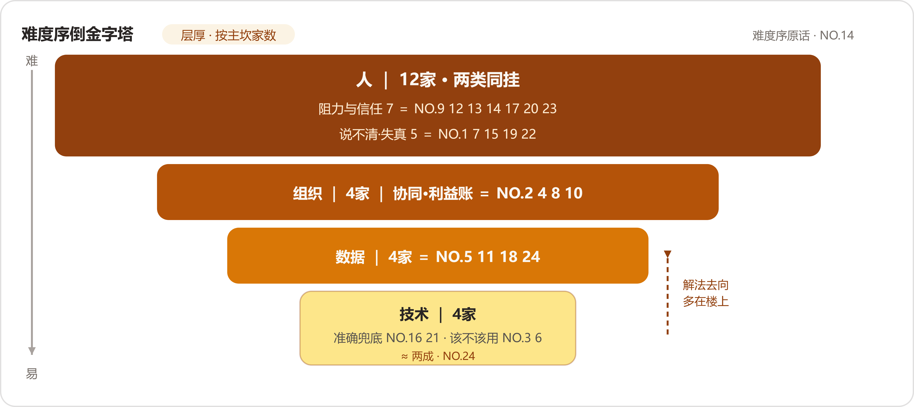

*四层倒金字塔，层厚按主坎家数。人层两类同挂十二家；技术层最薄，且解法多半不在本层。*

塔上还有一处细节值得看：挂在技术层的两类，解法多半不在技术层。准确性坎的解法是人签字、是验收跟客户共定（NO.21、NO.1）；该不该用的答案是业务判断（NO.4）；数据层的解法也常常要到楼上去找——补课要花钱花时间（NO.18），拿不到要跟部门谈、跟企业负责人谈（NO.4、NO.11）。NO.4在收尾把这件事说破了："模型能力只是整个系统的一部分，真正决定能不能上线的，还有数据、工具、评估和兜底。"所以这座塔从下往上读更顺：底下两层的坎，药大多存放在顶上。头重脚轻已经够吃力了，脚下两层还存不住自己的解药。

照实记一个读时的保留：这二十四份答案出自FDE之手，二十四个项目到最后都做成了——模型真的不行、项目半途放弃的案子，进不了这本文集。所以两成这个数，是活下来的人报的。立项那一刻的技术风险并没有凭空消失，只是被挪到别处消化了：先用小口子试出来，再用三层评估样本把出丑的地方圈住。换句话说，技术只占两成有一个前提——另外八成的功夫先花到位，技术才有资格只占两成。

把这一问的经验收成一张表，就是坎的分类清单加难度序判断：

| 层 | 坎类（主坎家数） | 怎么认出它 | 解法锚点 |
| --- | --- | --- | --- |
| 人 | 阻力与信任（7）＋说不清与失真（5） | 员工开始算岗位、防记录、护日程；调研拿回来的和现场对不上 | 先递小恩再谈转型 NO.12；小痛点换真ROI NO.9；一把手加调KPI NO.17；人的去向讲在前 NO.18；一号位采用 NO.23 |
| 组织 | 协同与利益账（4） | 数据要不来、需求回得慢、冲突不上会议桌 | 执行一号位＋方案留容错 NO.4；顾虑会前单独化解 NO.8；层级责任先讲清 NO.10；利益账算给各方看 NO.2 |
| 数据 | 底子薄／拿不到／格式杂（4） | 有没有、给不给、干不干净，三问定长相 | 先补课再上AI NO.18；能力送进门 NO.11；合规搬到最前面 NO.5；规范＋三层评估样本 NO.24 |
| 技术 | 准确性兜底（2）＋该不该用（2） | 错一次的代价大；形态跟现场对不上 | 分层设计留参数 NO.21；系统设计框住随机 NO.16；脚本够用就不上Agent NO.22；投入由轻到重 NO.7 |

至于总解法，二十四家给出的答案一致得出奇：不辩解，不硬推，小切口让人亲眼看见。NO.3说得最白："这个过程中，我们发现让用户亲眼看到价值，比任何解释都有效。"NO.21的做法是"让设计人员在实际使用中体验价值，而非强行说服"。NO.23的路线图是"这条路是边做、边证明、边挖下一步需求，先让客户看到结果，再去谈更大的蓝图"。NO.9那边的转折，也发生在业务人员亲眼见到省下的时间之后。六类坎、四层塔、几十种招式，收口处是同一个动作——把话收起来，把效果端出来。

读到这里，再回看开篇那句被二十四家轮流说过的回声，它多了一层意思。坎不在模型，第一次读像在替模型说好话；读完这些翻车和救火再读，它更像一张工作分配单——技术那两成，工程师自己能扛；剩下八成，要有人进到现场去，跟怕丢岗位的员工、不给数据的部门、没补完的信息化，一道坎一道坎地把账算清。

:::文书 —— NO.18 原话，抄来收尾

"AI转型的第一步，往往发生在AI之前。"

:::

## 第六问｜同一套答案——二十四家的公约数 {#appG-q6}

### 先说结论

二十四份答卷连着读，读到中途会起一种错觉：同一份答案被打印了二十四遍，只是换了抬头。审车管所材料的、给诉讼律师做工作台的、在黑河口岸装车的、替工程租赁企业接长尾订单的、给澳洲乳企盯动销的——行业隔着千山万水，翻过页来，条目对得上。先把总判断说定：

:::文书

**二十四份答卷，重叠成了一套。重叠本身就是结论：AI落地的难点，早已不在AI那一侧。**

:::

三个观察撑这句话。

第一个观察是版式。问题问"怎么做"，答卷几乎全部自带编号，第一、第二、第三，一路数到第五的都有。没有人商量过格式，是各家自己把经验压成了清单交上来的——原料就是清单体，这一问的综述也只能跟着长成清单体。

第二个观察是词汇的位置。模型、Agent、RAG这些词在答卷里也出场，出场的方式几乎全在被排位：**工业物料采购（NO.8）**说，找到真正值得解决的问题之后，快速做一个AI应用"反而排在后面"；**制造业师徒带教（NO.1）**说，技术指标"漂不漂亮退居其次"；**非标制造报价（NO.17）**说，挑场景时"模型能力排在后面"。被反复交代的，全是业务侧的事：真问题怎么找、现场怎么进、第一刀怎么切、流程怎么嵌、判断留在谁手上、企业最后怎么才会自己走。

第三个观察是收尾的漂移。答卷答到后半段，经验之谈普遍滑向职业自述，"FDE该是什么人"占了大量篇幅。问的是部署，答的是人——这个集体动作本身，就是难点所在位置的一次自证。

为什么隔行如隔山的二十四个人，会交出同一套答案？我们的读法是：题目问的是AI怎么部署，他们答的其实是组织怎么接受一件新东西。业务、现场、信任、流程、责任人、判断——把"AI"两个字遮掉，这份清单拿去问二十年前上ERP的人，大体也用得上。行业千差万别，组织消化一件新工具的路径就那几步，二十四家答的全是那几步。反过来，替"各自独立作答"作证的证据也有：讲到同一件事时，各家用的比喻完全不同——桃子、锤子找钉子、自行车、破冰、楼层、护城河，没有共享过一个比方。结构撞在一起，词汇各走各的路；这批人没有互相抄，是难处本身长一个样。

跟第三问的关系也顺便说清：那一问我们从他们做过的事里拆出一副六步骨架，是动作的复盘；这一问不用拆——他们自己把经验编好了号交上来，是忠告的原件。骨架六步，忠告九条，形状不同，走向一致。

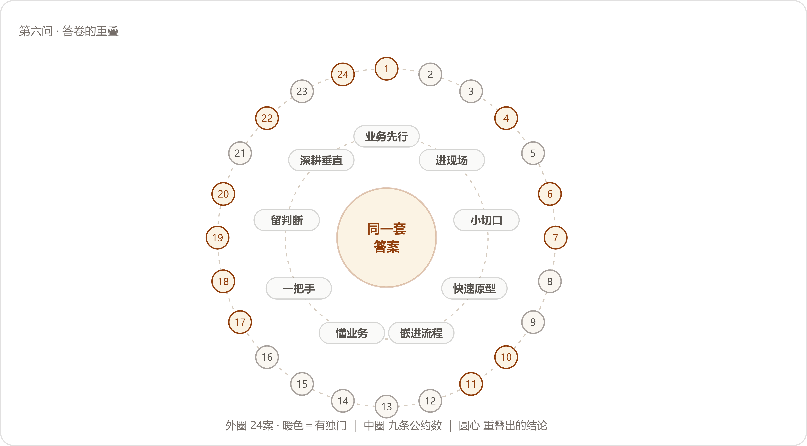

*重叠的地形：二十四份答卷收拢成九条公约数，圆心只剩一句话；个体差异没有消失，被挤到了边缘。*

### 主体｜九条公约数

把二十四份答卷里的建议逐条登记、归并，得到九条。口径交代在先：同一案可以在几条里同时出现；每条下面点名几家，按"明确把它立成一条经验"数，顺带提过的没有计入；家数咬得紧的条目，先后次序里有编辑的裁量，名单开在下面，读者可以自己数。

还有一件事值得先记：九条里过半自带"别"字——别拿AI找场景、别一上来做大、别停在Demo、别把落地理解成替代人、别急着做标准化产品。问的是怎么做才好，答出来的多是别怎么做。我们的读法是：这批忠告多半是学费换来的，学费都记在错误那一侧，所以开口就是"别"字当头。

#### 第一条｜业务先行：先找到真问题，再谈AI

多数答卷把它放在自己的第一条讲，位置本身就是态度。讲的人分三种讲法，说的同一件事。

换问题的一派：**消防维保数字化（NO.13）**转述企业常问的"我们哪里可以用AI？"，说该问的是业务流程里哪里存在真实的成本和效率问题；**车管所审材料（NO.2）**进企业先只问一件事——

:::文书 —— NO.2 原话

"我现在更习惯先问企业一个问题，你能不能先列出企业经营过程中最重要的十个问题。"

:::

换座位的一派：**工程租赁获客报价（NO.23）**说"我们不会刻意要求自己每个项目都必须“AI味很重”"，能用传统数字化解决的就用传统数字化；**律所案件工作台（NO.3）**给出了对仗的两句："不了解业务，就无法判断什么问题值得解决。不了解技术，就无法找到合适的方法。"

点名错误的一派：**汽配供应链经营（NO.20）**的句子最直——

:::文书 —— NO.20 原话

"我现在越来越觉得，企业做AI，最容易犯的错误就是为了AI而做AI。"

:::

**工业物料采购（NO.8）**给这个错误起了名字："这很容易变成拿着锤子找钉子。我们更希望反过来。"**生物科技上市公司（NO.18）**把同一层意思走成了否定式："FDE真正重要的能力，是知道哪里不应该使用AI。"**国企电商子公司（NO.14）**补上验收线："技术做不到的不要硬做，做出来没有价值的也不要做。"此外，**TikTok达人建联（NO.5）**、**基金公司研发转型（NO.7）**、**建筑消防施工图（NO.21）**、**澳洲乳企动销（NO.24）**、**制造业师徒带教（NO.1）**都在答卷开头交代了同一个意思：先理解业务在解决什么，再谈AI放哪儿。

为什么各家几乎都把它放在第一条讲？因为二十四家进场时见到的第一面长得一样——

:::文书 —— NO.2 原话

"老板知道AI很重要，信息部门也知道AI很重要，但你问“你具体想解决什么问题”，很多人反而说不清楚。"

:::

AI先摆在那里、再找活给它干，项目从第一天起就立反了。能抄走的判断跟着就出来：听项目的开场白，开口先讲模型讲架构的，先缓一缓；开口先讲一笔损失、一个数字的，可以往下谈。

#### 第二条｜进现场：会议室里问不出需求

这一条与第三问的"进现场"同源，姿态变了：那一问里它是进场动作，这一问里它成了被反复叮嘱的经验——当年怎么进的场，如今就主张别人怎么进场。讲这条的有**央国企财务流程（NO.9）**、**鞋服电商素材（NO.12）**、**车管所审材料（NO.2）**、**律所案件工作台（NO.3）**、**城市规划研判（NO.4）**、**跨境物流装载（NO.6）**、**工业物料采购（NO.8）**、**消防维保数字化（NO.13）**、**建筑消防施工图（NO.21）**。**NO.9**把方法和原因一起给了：

:::文书 —— NO.9 原话

"别坐在会议室里等业务人员告诉你需求，真正需要做的是跟着他工作，看他到底怎么做。很多业务规则，业务人员甚至自己都很难一次性讲清楚，但你跟着他做一遍，就能发现大量隐藏在流程里的判断和经验。"

:::

**NO.12**的一句话可以当这一条的门牌："很多需求在会议室里是问不出来的。"**NO.13**补了另一头的难处："老板不知道具体需求细节，员工在正式场合未必敢表达真实想法。"两头都堵着，剩下的路只有现场。**NO.3**把这一步抬到了资格的高度："当自己不了解一个行业时，没有资格替行业定义问题。"

摆在一起看，九家走出了三档深度：看一遍（**NO.21**守着CAD看设计师逐条核规范、为一个参数反复改图）；跟着干（**NO.9**的业务陪跑）；派驻（**NO.2**把驻场做成了制度——"所以我们现在也会把人员派驻到客户现场，因为只有靠近现场，你才能知道工作人员每天到底在做什么，什么事情最耗时间，哪些流程大家已经习以为常，却可能正是最值得AI改造的地方"）。NO.2那个材料审核问题，就是驻场时一点点看出来的，客户起初没觉得它算个问题。能抄走的判断：评估一个AI项目，先问它的需求从哪儿来；从会议室来的，降一级再用。

#### 第三条｜小切口：第一单选对

这一条一半是方法论，一半是生意经。讲这条的有**央国企财务流程（NO.9）**、**线下零售对账（NO.10）**、**工程租赁获客报价（NO.23）**、**外贸资料整理（NO.11）**、**车管所审材料（NO.2）**、**城市规划研判（NO.4）**、**工业物料采购（NO.8）**、**非标制造报价（NO.17）**、**澳洲乳企动销（NO.24）**。

买方的心思，**NO.11**写得最清楚：

:::文书 —— NO.11 原话

"很多老板一开始只愿意拿一个点试，做出结果以后，才会把后面的十几个、几十个问题交出来。"

:::

卖方的处境，**NO.23**算得最露骨：尤其对没有品牌、没有咨询溢价的小团队，一上来谈企业AI转型基本没戏，只能先拿出一个小而具体、客户马上看得到效果的问题，先做出结果，再谈路线图。第一单又小又甜，是两头共同的避险动作。挑第一单用的尺子，**NO.10**交了一整把：

:::文书 —— NO.10 原话

"一个企业可能同时给你十个需求，但第一个项目不能只看哪个最有意思，需要综合判断：业务价值是不是足够显性、正反馈是不是来得足够快、涉及的人是不是足够少、业务流程是不是足够清晰、用户需要投入多少、技术成本是不是可控、最终价值能不能算出来。"

:::

他自家给这把尺子的结论是"没有所谓的“六边形完美任务”，最终一定是权衡"。**NO.9**的三条标准更顺口：业务真的痛、实现相对可控、ROI能够快速被看见，先把第一个项目做成“破冰项目”。**NO.8**的版本讲组织信心：一开始尤其应该选择能够快速产生结果的场景，早期的结果不只是技术验证，也在给组织建信心。**NO.17**给的是推广次序：先找关键人和业务骨干用真实订单试，再让一个小组试，结果稳定以后才扩大到部门。

能抄走的判断：第一单做成什么样算成，往第二单上想——**NO.5**的经验正好放在这里当注脚，一期做完以后二期需求自己长出来，因为第一个问题解决之后，企业会看见下一层问题。

#### 第四条｜快速原型，持续迭代

讲这条的人少些，讲出来的全是节奏感：**基金公司研发转型（NO.7）**、**本地生活短视频（NO.15）**、**非标制造报价（NO.17）**、**鞋服电商素材（NO.12）**、**线下零售对账（NO.10）**、**TikTok达人建联（NO.5）**、**外贸资料整理（NO.11）**。**NO.17**把理由放在前头：

:::文书 —— NO.17 原话

"B端客户很多时候并不知道自己到底需要什么，所以我习惯边干边改，快速做出一个阶段性成果让客户看到，再通过真实反馈不断修正。"

:::

**NO.15**把投入的重心挪了个位置：

:::文书 —— NO.15 原话

"第一版Demo往往并不难，真正决定项目能不能落地的，是前期需求理解、后期打磨，以及客户能不能持续参与迭代。"

:::

**NO.12**的说法最短："调研之后，尽快做出一个能用的东西，让客户用起来，反馈之后再改。"**NO.10**盯的是循环："当第一个正循环跑起来之后，信任就建立了。"**NO.5**把两种项目周期摆成了两条链：传统项目是"需求来了 → 做系统 → 验收 → 交付"，FDE更像"进入业务 → 理解问题 → 做第一版 → 让业务使用 → 根据反馈继续改 → 找到新的业务问题 → 再迭代"。

同一条忠告，三种时间尺度：当场（**NO.11**把企业负责人眼前的问题解给他看，"概念听过以后很容易忘，但一个真实问题被当场解决，老板会立刻知道AI跟自己有什么关系"）、几天（NO.12调研完尽快做出能用的）、一期（NO.5做完一期等二期自己长出来）。尺度不同，道理是同一个：方案里缺的信息长在用户的用法里，坐着讨论够不着，跑起来才够得着。**NO.7**在这条上还往前多推了一步，把原型当调研用——这一笔只此一家，单记在独门里。

#### 第五条｜嵌进流程：别停在Demo

"Demo"这个词在答卷里出现时，前后几乎总跟着"停"字。讲这条的有**制造业师徒带教（NO.1）**、**车管所审材料（NO.2）**、**鞋服电商素材（NO.12）**、**本地生活短视频（NO.15）**、**消防维保数字化（NO.13）**、**电信数据分析（NO.16）**、**跨境物流装载（NO.6）**、**建筑消防施工图（NO.21）**、**澳洲乳企动销（NO.24）**。什么算进了流程，**NO.2**的判据最清楚：

:::文书 —— NO.2 原话

"AI真正落地，是它成为业务流程的一部分，旁边不用再单独多一个AI工具。"

:::

各家给"停在Demo"画的像，拼起来是五幅。**NO.12**画的是账号："如果原来的工作方式完全没变，只是每个人多了一个AI账号，那谈不上真正的AI改造。"**NO.15**画的是个人使用："真正能够形成企业级价值的，是让AI在流程里承担一个稳定的节点，甚至重新设计整个流程。"**NO.16**画的是半成品："现在做一个Agent并不难，难的是把它做成生产就绪。"**NO.13**画的是中间那段路：一个Demo很容易做出来，从Demo到真正融入日常使用，中间有大量需要验证和调整的环节。**NO.21**画的那格最小也最硬：

:::文书 —— NO.21 原话

"在这个案例中，如果AI生成的图纸格式不符合设计院的标准，即使内容正确也无法进入实际流程。"

:::

内容全对，格式不对，图照样进不了设计院的门。验收嵌没嵌进去，看的正是这种小格。能抄走的判据：AI上线之后，原来的流程少了一步没有？多了一步没有？一步没变，就还停在Demo。**NO.1**给这一条起的名字可以直接刻在验收单上："AI一定要进入流程，不能停在Demo里。"**NO.6**则把它说成了信念："未来真正有价值的AI，一定长在企业的真实流程里，而不是停在Demo上。"

#### 第六条｜懂业务大于懂模型

前五条讲项目，这一条讲人，也是答卷后半段最集中的话题。点名这条的名单最长：**制造业师徒带教（NO.1）**（"FDE最重要的能力其实不在“知道多少模型”上"）、**城市规划研判（NO.4）**（做完项目最大的理解变化，是"不再觉得FDE首先是一个“懂模型的人”"）、**跨境电商库存补货（NO.22）**（"FDE真正的壁垒并不在“会不会搭一个Agent”"）、**工程租赁获客报价（NO.23）**、**外贸资料整理（NO.11）**、**电信数据分析（NO.16）**、**线下零售对账（NO.10）**、**央国企财务流程（NO.9）**、**车管所审材料（NO.2）**、**律所案件工作台（NO.3）**、**TikTok达人建联（NO.5）**、**跨境物流装载（NO.6）**、**基金公司研发转型（NO.7）**、**消防维保数字化（NO.13）**、**汽配供应链经营（NO.20）**、**建筑消防施工图（NO.21）**、**澳洲乳企动销（NO.24）**。

口气最硬的一句来自**NO.10**：

:::文书 —— NO.10 原话

"会做就是会做，不会做就是不会做；懂这个行业就是懂，不懂就是不懂。"

:::

懂行这件事装不出来，问三个业务问题就会现形。**NO.16**给这个判断配了一个我们全程最喜欢的比方：

:::文书 —— NO.16 原话

"如果你只知道自行车，那么你看到一个很远的地方，就只能想办法骑自行车过去。但如果你同时了解汽车、飞机以及其他交通工具，你才能真正判断什么场景应该用什么工具。"

:::

只认得一种工具的人，看什么问题都长着那个工具的形状。这一条的另一半说法叫翻译：**NO.5**说要"把技术语言翻译成业务语言，把业务问题再翻译成可以落地的技术方案"，**NO.7**的版本是"把AI的能力翻译成企业真正能用、能跑、能沉淀的工作方式，比单纯把一个AI工具带进企业更重要"。

为什么这条点名最长？我们的读法：模型那一头，大家买到的东西一样；业务那一头，每家都得从头来。能拉开差距的部分，恰好都在买不到的那头。这条也是九条里唯一讲人的，其余八条讲事；讲着讲着经验滑向人，前文提过这个漂移——落地的事做完，剩下的难关多在人身上，第五问把那一层铺开过。

#### 第七条｜一把手工程

讲这条的人最少，用词最重。**国企电商子公司（NO.14）**的原话是：

:::文书 —— NO.14 原话

"中大型企业的AI落地一定是一号位工程。"

:::

他把反面也写全了："如果老板只是说一句“我们要AI化”，然后把事情扔给IT部门，最后很容易变成一个技术项目，最后大概率面临失败。"**非标制造报价（NO.17）**的版本语气相同，理由也给足了：

:::文书 —— NO.17 原话

"企业AI落地不是交付一个软件就结束了，当AI真正开始改变业务流程，它一定会继续影响岗位职责、KPI、部门协作甚至组织架构，这些事情不是一个乙方FDE能独立推动的，老板必须站出来。"

:::

**生物科技上市公司（NO.18）**说大企业的AI转型"本质上一定包含组织建设"；**汽配供应链经营（NO.20）**从业务侧撑腰："真正每天承受业务问题的人，才最清楚什么地方值得改。"**央国企财务流程（NO.9）**把"一把手"翻译成了可操作的版本——让业务团队共同承担结果，"甚至在条件允许的时候，把AI改造和业务部门的KPI、OKR结合起来，让业务部门自己也有动力把项目推下去"。

说这五句话的五家，项目全在中大型组织里动过组织本身：编制、KPI、部门协作。项目小的时候这句话用不上；一旦AI动到岗位职责和考核，它就从建议变成前提。频率低的原因也在这里——组织代价没付过的人，说不出这句话。

#### 第八条｜人机分工：判断留给人

方案层的分工怎么划，第三问铺开过；这一问问经验，忠告集中在两个字上——留人。讲这条的有**TikTok达人建联（NO.5）**、**建筑消防施工图（NO.21）**、**跨境电商库存补货（NO.22）**、**生物科技上市公司（NO.18）**、**本地生活短视频（NO.15）**。**NO.22**的一句话可以印在所有AI项目的开工纸上：

:::文书 —— NO.22 原话

"我认为这是比较现实的AI落地方式，AI负责处理大量重复工作，人负责最终判断。"

:::

**NO.5**把分界线画得具体："它适合接手高频、重复、有明确规则的事情，但高度依赖信任、关系和判断的工作仍要留给人。"**NO.21**用的是责任语言："规范化的绘制和规则检查适合AI承担，但最终的专业判断和责任必须保留给设计人员。"**NO.18**把这张分工表往组织里推了一格：

:::文书 —— NO.18 原话

"AI上线以后，人的职责是什么、绩效怎么变、原来的流程哪里该取消、哪里需要新增人工判断、什么事情让AI做、什么事情必须由人负责，这些问题如果没回答清楚，企业买再多工具，也很难真正变成生产力。"

:::

这一条里最值得记的是默认值的方向。五家里四家把默认值设在人这一头，只有**NO.15**把默认值设在AI那一头：

:::文书 —— NO.15 原话

"我现在做项目时，会默认电脑、手机上能够规模化完成的事情，都值得先尝试AI。然后再通过实际测试，把做得不够好、不够稳定的节点逐渐交还给人。"

:::

方向相反，划线的方法相同：都靠实测，都留退路。这也替这一条留了个省事的用法——分工表不要在会议室里定稿，先按一头的默认值跑起来，让测试结果改它。

#### 第九条｜深耕垂直，把方法攒成家底

最后一条讲项目结束之后的事。讲这条的有**TikTok达人建联（NO.5）**、**工业物料采购（NO.8）**、**鞋服电商素材（NO.12）**、**跨境电商库存补货（NO.22）**、**工程租赁获客报价（NO.23）**、**消费品包装审核（NO.19）**、**汽配供应链经营（NO.20）**、**央国企财务流程（NO.9）**、**律所案件工作台（NO.3）**、**澳洲乳企动销（NO.24）**。**NO.5**把这条的账算成了数字：

:::文书 —— NO.5 原话

"当你足够懂一个行业之后，第一次做这个场景可能需要100%的成本，第二次可能变成80%，第三次可能变成60%，你不断把经验、工作流、技能和业务理解沉淀下来，才能真正形成自己的壁垒。"

:::

**NO.24**看的是竞争的那头："未来企业之间竞争的重点，将逐渐从模型能力转向对业务的理解深度。"**NO.8**在攒什么上立场分明："先标准化的应该是方法，产品可以先放一放"，攒的清单他也开出来了：

:::文书 —— NO.8 原话

"怎么做问题发现，怎么做根因分析，怎么判断用例，怎么定义ROI，怎么做小规模实验，怎么和业务部门一起验证，怎么持续衡量。"

:::

**NO.12**给这件事立了验收线：

:::文书 —— NO.12 原话

"如果每做完一个AI项目，只有客户拿到了一个系统，而FDE自己什么都没有沉淀下来，那这个项目其实还没有真正结束。"

:::

这条里有一处小分歧，值得单独看。**NO.8**和**NO.20**劝人先别急着做产品（NO.20的原话是"先进入真实场景，把一个问题真正解决掉，再从多个项目里找到共通的方法，最后再判断哪些部分值得标准化"）；**NO.19**和**NO.23**说底层可以通用、业务必须一家一家定制（NO.23的版本是"底层能力标准化，业务解决方案保持一定程度的定制化"，NO.19补了边界："底层的模型、架构、知识库、Skill这些能力可以复用；但每一家企业的人、流程、组织、经验和决策方式，都需要重新理解"）。两派合起来的意思并不冲突：攒得动的攒成家底，攒不动的不要硬压成产品。往企业那头的留法这一问里也有人讲（**NO.11**想让客户遇到新问题时，第一反应从“找人”变成“自己先试”；**NO.18**协助企业建了自己的团队），本篇不重开那本账。

### 边缘｜只此一家的十二件

重叠到什么程度，有个笨办法可以量：把只有一家讲、其他家没碰过的单独捡出来。捡出十二件，全是手法，没有一件是方向——方向早被公约数占满，独门只长在操作上。连例外都长在边缘，这算是重叠的又一个旁证。

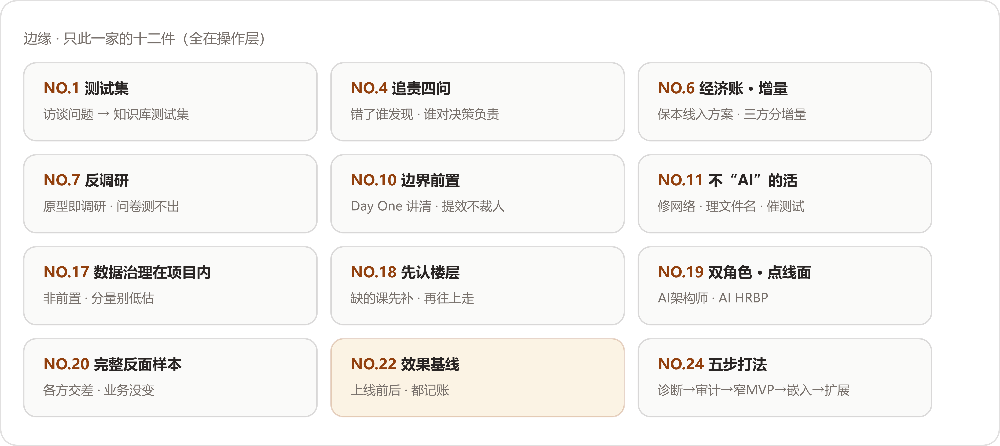

*十二件独门全是操作手法；方向性的独门一件也没有。*

先记三件我们觉得最有价值的。

第一件，**制造业师徒带教（NO.1）**：问题清单直接变测试集。

:::文书 —— NO.1 原话

"这个案例里，新人高频问题在访谈结束后没有停留在报告里，直接变成了知识库测试集。"

:::

多数项目的调研记录交完就归档，这家把调研的副产品直接焊进了验收——AI最终验证的是"能不能解决真实业务问题"，测试集从第一天起就是真的。

第二件，**跨境电商库存补货（NO.22）**：效果基线。二十四案里唯一一处答卷人给自己记过的段落：

:::文书 —— NO.22 原话

"这个案例最大的遗憾，就是我们当时交付完以后，没有把后续效果完整追踪下来。"

:::

补救的办法他想好了："所以如果让我重新做一遍这个项目，我可能会在一开始就设计好一套“效果基线”。"上线前记下人工要花多少时间，上线后接着记，价值才有对照的依据。

第三件，**汽配供应链经营（NO.20）**：唯一完整的反面案例。他以前所在的金融机构上过一套本地部署的AI作图系统，图片生成出来实际不能用，结局是这样的：

:::文书 —— NO.20 原话

"最后IT部门完成了“AI转型”，合规部门完成了数据安全要求，领导也可以说企业完成了AI转型，但业务部门还是回去找设计师做图。"

:::

:::文书 —— NO.20 原话

"从企业经营的角度看，什么都没有改变。"

:::

这份材料为什么反而最值得读？因为它是对照组。九条公约数在这个案子里被反着犯了一遍：从AI出发、业务部门没有动力、系统停在各方交差上。二十四家几乎全是幸存者，只有这一案把公约数缺位的失败方式完整演了一遍；清单的可信度，有一半是它垫的。

其余九件列在下面：

- **城市规划研判（NO.4）**：追责四问。其他家讲分工讲边界，这家把兜底列成了四个问题："数据错了谁发现？模型给错建议怎么办？计算结果能不能追溯？最后谁对决策负责？"他自己给了及格线："这些问题解决不了，再酷的Demo也进不了真实业务。"
- **跨境物流装载（NO.6）**：算经济账，做增量。"运费按方算、98方保本、每方增收100美元，这些商业机制直接决定了装载优化的价值落点"；方案要让工人、物流公司、货主三方都从多出来的车次里受益，"把蛋糕做大，比在旧蛋糕里抢份额更有价值，也更能走远"。
- **基金公司研发转型（NO.7）**：反调研。"因为AI的使用水平很难通过问卷准确判断，所以我现在更倾向于快速做原型、快速跑一遍真实流程。哪怕第一次只有七八十分，也比坐在那里把方案讨论到100分再开始更有价值。"问卷测不出的东西，原型一跑就现形——原型本身就是调研。
- **线下零售对账（NO.10）**：Day One讲清交付边界。"尤其面对中大型企业，不能做到一半才告诉客户：“这个还需要你买服务器”“这个还需要增加人”“这个还要改一套流程”。"他还守着一条社会面的底线——效率上来之后，裁人的念头要按住，"但我认为，这很容易把AI项目变成企业和员工之间的对抗"。
- **外贸资料整理（NO.11）**：接受大量工作并不"AI"。"你可能要修网络，要处理Windows环境，要梳理文件命名，要解决权限，要等老板开会回来，要催员工测试。"这份清单值得贴在墙上：哪一样都写不进AI方案书，哪一样都可能卡死AI。
- **非标制造报价（NO.17）**：数据治理在项目内。"数据清洗、结构化、业务规则还原、经验沉淀，本身就是FDE必须参与的工作，把它当成前置准备工作会低估它的分量。"
- **生物科技上市公司（NO.18）**：先认数智化楼层。进场先看客户的信息化课补到哪里了："有些企业连信息化时代的课都没补完，这种时候不能因为自己是做AI的，就假装那些问题不存在，应该补CRM就补CRM，应该做数据治理就先做数据治理。"
- **消费品包装审核（NO.19）**：双角色，点线面。"我把FDE的工作理解成“AI HRBP + AI架构师”"——架构师管系统怎么搭，HRBP管组织有什么问题；配套的方法是点线面：面看战略价值，线看价值链，点看岗位的输入输出，"当这三层梳理清楚以后，AI应该放在哪里，反而会变得比较清楚"。
- **澳洲乳企动销（NO.24）**：五步打法。"我们内部把交付固化成五步：诊断、数据审计、窄MVP、嵌入、扩展。顺序不能乱，理解业务永远在技术选型前面，赢得信任之后才扩面。"五步其实是公约数的浓缩版。

### 收口｜方法论：AI落地九查

九条公约数是他们的经验；把每条翻译成项目上能对账的一问，就是这一问的方法论。从前往后过，一道卡住，先停下补课，不要急着开下一道——次序这个讲究是**NO.24**给的："顺序不能乱，理解业务永远在技术选型前面，赢得信任之后才扩面。"

| 查 | 问什么 | 怎么算过 | 谁教的 |
| --- | --- | --- | --- |
| 一查方向 | 先有业务问题，还是先有AI | 问题讲得成一笔损失：一年几次、占几个人、值多少钱 | NO.2/8/20 |
| 二查现场 | 需求从哪儿来 | 来自工位：能复述员工一天怎么过 | NO.9/12/13 |
| 三查第一刀 | 第一个口子切在哪儿 | 又小又甜：反馈快、人少、账算得清 | NO.9/10/11 |
| 四查原型 | 第一版拿去做什么 | 先给人用，跟着反馈改 | NO.7/12/17 |
| 五查嵌入 | AI进流程了吗 | 原流程少了一步或多了一步，旁边没有多出来的AI工具 | NO.1/2/12 |
| 六查自己 | 干活的人懂不懂这门生意 | 用行业的账和行话，把客户的事讲得清 | NO.10/16/24 |
| 七查当家人 | 一把手在不在场 | 编制、KPI、预算，至少动了一样 | NO.14/17/18 |
| 八查签字 | 最后谁签字 | 签字担责的格子里写着人名，分工表跟着绩效改 | NO.5/18/21/22 |
| 九查家底 | 项目结束留下什么 | 客户留下能力，或自己攒下方法，至少占一头 | NO.5/8/12 |

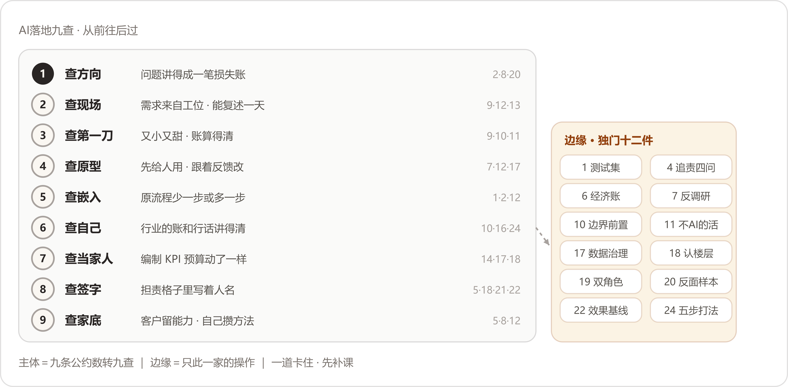

*主体是九条公约数转成的九查，右侧的坡上是长在边缘的十二件独门；从前往后过，一道卡住先补课。*

照实记两条读时的保留。其一，二十四家都是做成了的，NO.20那个反面也是别人家的失败被他讲成了自己的经验——九查教怎么把项目做对，教不了这个项目该不该接，后一门功课在选场景的手里。其二，九条的先后有编辑的成分：各家交卷时，业务先行多放在第一条，懂业务多用来收尾，中间各条的次序五花八门；材料给了内容，没有给排序，排法是我们的裁量，使用时按自己的项目改即可。

收尾想把**NO.24**的两句话留给读者，九条公约数，十几个字就装下了——

:::文书 —— NO.24 原话，抄来收尾

"模型是入场券。领域加交付，才是护城河。"

:::

## 附｜二十四案目录 {#appG-index}

<!--表宽:10%,--->
| 案号 | 案例标题（Datawhale《FDE案例100》） |
| --- | --- |
| NO.1 | 从师徒带教到AI辅助培训：FDE用AI破解制造业经验传承难题 |
| NO.2 | 从人工审材料到自动化办件：FDE用AI提升车管所网办效率 |
| NO.3 | 从案头工作到智能协作：FDE用AI优化诉讼律师的案件处理能力 |
| NO.4 | 从人工研判到智能调度：FDE用AI重构城市规划研判流程 |
| NO.5 | 从大海捞针到全链路提效：FDE用AI重构TikTok达人建联与履约 |
| NO.6 | 从经验装车到智能规划：FDE用AI优化跨境物流装载效率 |
| NO.7 | 从个人提效到组织能力：FDE用AI推动企业研发转型 |
| NO.8 | 从物料难找到精准定位：FDE用AI减少工业企业采购浪费 |
| NO.9 | 从"表哥表姐"到智能执行：FDE用AI重构央国企财务流程效率 |
| NO.10 | 从人工核对到智能对账：FDE用AI让线下零售对账又快又准 |
| NO.11 | 从文件散乱到随取随用：FDE用AI帮外贸企业把资料变成可用资产 |
| NO.12 | 从人工盯图到公司级生产：FDE用AI重塑鞋服电商素材工作流 |
| NO.13 | 从纸质流程到数据驱动：FDE用AI推动传统消防维保企业数字化转型 |
| NO.14 | 从技术交付到业务自驱：FDE用AI推动国企工作流程真正落地 |
| NO.15 | 从经验写稿到稳定量产：FDE用AI重构本地生活短视频内容生产 |
| NO.16 | 从人工分析到分钟级洞察：FDE用AI重构电信网络数据分析 |
| NO.17 | 从老师傅报价到AI深度协同：FDE用AI重构非标制造售前链路 |
| NO.18 | 从纸质台账到AI经营：一家生物科技上市公司的0帧起手数智化 |
| NO.19 | 从人工排队到审核前置：FDE用AI重构消费品研发协同与包装审核 |
| NO.20 | 从看不清订单到看清经营：FDE用AI让制造企业的经营流程更透明 |
| NO.21 | 从人工绘图到智能协作：FDE用AI重塑建筑图纸交付流程 |
| NO.22 | 从库存割裂到业务联动：FDE用AI打通跨境电商的库存、补货与广告决策 |
| NO.23 | 从企业负责人报价到长尾承接：FDE用AI打通工程租赁获客与报价 |
| NO.24 | 从发货到动销：FDE用AI打通跨境快消的海外数据断层 |

以上二十四家的解法速查（按方案分类），见附录K。
