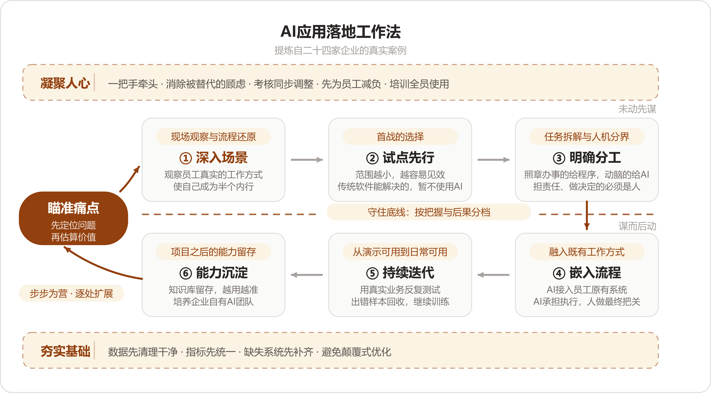

# 附录H AI应用落地工作法——二十四家案例的方法论提炼

## 总起　一个十来分钟的场面

先从一个十几分钟的小场面讲起。

一家做外贸礼品的公司，企业负责人手里拿着一张照片：一个像三角尺的东西，上面一排不规则的刻度。客户要订这个产品。美工看过，3D打样打过，没人说得清那排刻度是什么；准备人工照着抄，又抄不准。企业负责人估计，这件事需要研究一两天。

后来有人把照片交给AI。十来分钟，查清了：那是一把角度尺，刻度代表角度。

这位企业负责人随后提出了十几二十个新需求。AI是否管用，他已经亲眼见过。

这个场面出自一本案例集。案例集收了二十四家企业的AI落地经历，作者是替企业做落地的工程师（FDE，前沿交付工程师的缩写，下文统称FDE）。律所、车管所、电信运营商、十几人的外贸公司、年流水十亿的鞋服电商，都包含在内。

将二十四家的标题排在一起，会发现同一种句式：从师徒带教到AI辅助培训，从人工审材料到自动化办件，从纸质台账到AI经营。二十四行"从……到……"，说的都是同一件事：原先完全依靠人力的工作，现在由AI分担。

做法也相近。四个小组分头把二十四家的原文逐字读全，做法拆开、归拢，再派四组人回头对原文查遗漏，补全之后画成一张图。

这张图叫**AI应用落地工作法**。中间六个格子是主轴六步：深入场景、试点先行、明确分工、嵌入流程、持续迭代、能力沉淀。围着主轴还有五个部件——入口的**瞄准痛点**，上面的**凝聚人心**和下面的**夯实基础**两条保障线，中间一条**守住底线**虚线，左下角回环上的**步步为营**。十一个词连起来，就是口诀：

> **瞄准痛点、深入场景、试点先行、明确分工、嵌入流程、持续迭代、能力沉淀；凝聚人心、夯实基础、守住底线、步步为营。**

读图从左边的瞄准痛点进入：上排三格对应动手前的问题梳理，下排三格对应实施落地；两条保障线从头贯到尾；守住底线那条虚线界定机器与人的分寸；左下角的回环，一处做成再扩展下一处。

本附录的读法：分三篇讲完十一个部件——上篇四节（瞄准痛点加上排三步），中篇三节（下排三步），下篇四节（两条保障线、红线、回环）。每节里出现的案号（NO.X）指向案例集里的案例，案名对照表见附录G末尾。各家的独有招法分两层安排：正文讲到哪家的招法就地记录，篇末另收一张总表。公共的进骨架，独有的进变招。

* * *

## 分·上篇　未动先谋

动手之前有四件事：找准问题，看清问题，选准小切口，明确分工。二十四家案例中明写走过弯路的有十几家，弯路多半出在这几步上：问题判断有误，场景了解过浅，切口过大，分工不当。技术本身反而排不上主因。

### 一、瞄准痛点：问题定位与价值估算

NO.20是一家汽车零部件企业。企业负责人的ERP（企业管理软件）数据齐全，但他始终心中无数：客户订单进行到哪一环节，采购是否超量，应付供应商的款项能否对上——事项过多，只能逐件向下属询问。

FDE进场后的第一件事不是演示AI能做什么，而是提出三个问题：

- "你每天最担心企业发生什么？"
- "哪些事情你必须亲自盯？"
- "哪些异常一旦发生，你希望第一时间知道？"

企业负责人顺着这三个问题，将订单、生产、采购、库存、发货、回款中真正放心不下的事项逐一列出。AI后续所做即对照这份清单：应付款与客户订单核对，库存数字异常监测，异常发生时主动推送。

换一种问法，结果完全不同。问"你想要什么AI功能"，得到一张功能清单；问"每天最担心什么"，得到企业的真实痛点。两张清单外形相近，实际用途截然不同。

痛点还须能折算为金额。NO.8是一家管理大量物料的海外工业企业，所有部门抱怨的是同一句话：ERP不好用。这句话无法作为开工依据。FDE将"一个物料找不到"沿链条下追：找不到，便重新录入一条；录入后便形成重复数据；数据库质量日益恶化；随后便是采购错购与重复采购。工业采购错购通常不退，物品在仓库搁置数年，最终按规则报废。

:::文书 —— NO. 8原话
企业真正损失的钱，就藏在这里。
:::

沿此链条追踪到底，"ERP不好用"转化为"每年浪费多少采购预算"。后者才可作为项目的起点。NO.8开工前先立账本：一年能减少多少损失，数字如何计算，数据来自何处，最终由谁确认。价值算出后，还须由客户方的业务人员确认"对，这笔钱确实是因为这个应用被节省下来了"，这笔账才能成立。

也有项目并非从明确的痛点开场。NO.2的FDE进车管所，接手的是一项无人愿接的遗留系统运维。驻场期间，他将网办业务完整摸清；真正促成立项的是业务条件变化——经济环境收紧，驻所内负责打包寄递的快递企业经营压力上升，原先不够痛的效率问题随之变得现实。痛点可以问出来，也可以在驻场中积累出来，落点相同：足够痛，且金额可算。

#### 变招

- **多维度打分筛场景**——一家上市公司为候选场景逐项打分（价值、可行性等维度），销售部门首个入选：离收入最近，痛点最集中（NO.18）。
- **业务投票定优先级**——将十几个候选功能点列成清单，各部门负责人逐项确认、投票，先后次序由业务部门自行确定（NO.8）。
- **账本开工前立好**——投入产出（ROI）的口径、数据来源、确认人全部写在开工之前，避免完工后再对账（NO.8）。

#### 两种问法，两种结果

<!--表宽:14%,43%,43%-->
| | 问"想要什么AI功能" | 问"每天最担心什么" |
|---|---|---|
| 得到什么 | 一张功能清单 | 一张担心清单 |
| 清单来源 | 对AI的想象 | 每天真实发生的业务 |
| 照单实施 | 容易做出无人使用的功能 | 每一条都关联资金与责任 |

#### 本节自查

- 该企业最担心的事，你能否直接答出？
- 该痛点一年折合多少金额，口径能否算出？
- 算出的账，客户是否认可？

### 二、深入场景：现场观察与流程还原

痛点找对了，下一步是看清这个问题在真实工作中的具体形态。二十四家在这一步上的做法高度一致：先到现场观察，会议室里问来的信息不作数。

主案看NO.1，一家德国斯图加特的零部件厂，七八十人，想把老师傅的经验留下来。FDE最初的做法很标准：访谈，高层、中层、一线逐一交谈。

实际做下来发现行不通。一线员工不愿意花时间受访，很多细节自己也说不出来。

他改了办法：跟着员工走一整天的流程。看他一天做什么，在哪里停下来，哪里需要问别人，哪些问题翻来覆去地出现。这些反复出现的停顿和提问，正是新人培训真正缺少的内容，后来知识库的骨架即照此搭建。

:::文书 —— NO. 1原话
不要从"企业想做什么AI"开始，要从"企业每天到底怎么工作"开始。
:::

NO.13把这层意思说得最直白。消防维保企业的一线人员常年在户外作业，被叫进会议室面对企业负责人，只能被动回答被问到的问题；FDE走出会议室，看他们怎么填检查表、怎么交接资料、哪个步骤反复出错，用现场流程反推真实痛点。这家企业负责人的痛点本来只有一个字：看不见——哪些项目的维保执行到位了、哪些客户的风险还没处置，"汇报和现场之间，永远隔着一层信息差"。

再看一个更彻底的变体。NO.22是一家东南亚服装跨境电商，客户主动找上门时说的是"能不能把这个SaaS（订阅制的在线软件）和飞书打通"，这话照办就只是一个接口项目。FDE让客户把每天的工作录屏演示，连看几轮才发现接口背后压着一整条链：物流靠拍照识图、人工填数据追单号，补货靠人从SaaS里提取数据填Excel按公式算，广告每天在消耗而库存见底也无人过问。客户口述的需求，距离真实的困境还很远——录屏里那条链才作数。

#### 变招

- **Agent进群潜伏**——把一个Agent（接到任务能自己拆步骤、自己调工具的AI程序）放进业务群，两三周不解决任何问题，只收集上下文，然后让它自己总结最近的业务里有哪些问题、哪里值得切入。包装审核这个切入点，就是Agent自己找出来的（NO.19）。
- **坐到业务人员旁边**——直接看他怎么操作，很多问题在会议室里问不出来（NO.8）。
- **录屏代替驻场**——进不去现场时，让员工把每天的工作录屏演示，链路看得一样清楚（NO.22）。

#### 这一步的做法

案例讲完了。做法归拢为下面这张清单——从这里起讲普遍做法，不再指向具体案例。

**去之前：摆正身份**

- 你是去看工作的，不是去收集需求的，更不要带着上一家的结论进场——企业自己描述的水平，经常与现场真实水平不一致。
- 能约到跟岗就不要只约会议；实在进不了现场，用录屏替代。

**在现场：至少跟一整天，从开工跟到收工**

跟岗时记四样东西：

1. 他在哪里停下来；
2. 停下来问谁；
3. 哪些问题一天里问到了第二遍；
4. 哪些工作他完成得很快、但说不清为什么这么做。

第4样最有价值：说得出来源的道理在文档里，说不出口的，正是老师傅的经验显露之处。

此外在现场还可以做两件事：

- 旁听一次他们自己的讨论会，看内部怎么拆问题、谁说了算、争论停留在哪个点上；
- 术语看不懂当场问。指标怎么算、为什么这么算，问不清楚，就看不懂他们每天受什么困扰。

**看完之后：两件事**

1. **画流程图**。找主管一起，把流程从头到尾画成图；再拿图对照跟岗记下的实际动作，记下两处差异——图上有、现场没做的；现场一直在做、图上没有的。痛点多半隐藏在第二处。
2. **记高频问题清单**。把反复出现的停顿和提问逐条记下来。这张清单先收存好，到第六节（持续迭代）它将变成验收标准的原料。

#### 常见错误

1. **用访谈代替跟岗**——会议室里一线员工有压力，真话问不出来。
2. **只和管理层聊**——企业负责人讲目标，一线讲每天卡在哪里，两边的信息拼起来，事情才能落实。
3. **带着做好的方案进场**——先观察，再解决；方案是看完现场才动笔的。

#### 本节自查

- 上一次完整看完一个员工从早干到晚，是什么时候？
- 他说不清为什么那么做的地方，你记下来了吗？
- 你手里的流程图，和现场实际的动作对得上吗？

### 三、试点先行：首战的选择

问题看清了，不要急着摊开做。二十四家几乎都从一个小口子起步。

NO.11就是本附录开头那家外贸礼品公司——十来分钟解开角度尺之后，企业负责人提出了十几二十个新需求。第一仗的价值在这里：事情本身不必大，做完要让客户觉得值——信任由此建立。

"小"的选法各不相同。NO.24是澳洲乳企的中国生意，第一版只做中国、只做一条产品线，只回答一个问题：这条线上投入的钱值不值。就这一条线做到底——数据能进来，数字可以点开，结论能进周会。跑通了，才把越南业务接进来。NO.4（一家城市规划院）从全市缩到一个区，再缩到米市巷，只挑两条业务流验证。NO.10在客户提的三个方向里选了对账，理由很实际：对账省了多少人工、少漏了多少钱，几个星期就看得见；自动客服和竞品分析，见效都要等太久。

还有一种切法要说明：小，指的是范围窄，不等于浅。NO.5做达人建联，一期建联、匹配、履约、数据四件事一起上，但只围着自己最熟的一条业务线；NO.21做消防图纸，从头就贯穿识图、规范、生成整条流程，没有停留在做一个辅助小工具。窄线做深和单点做小，都是切法。

#### 变招

- **破冰项目**——管第一个项目叫破冰项目，挑离自己最近、最容易见效的那个目标（NO.9）。
- **两阶段起步**——先用轻量配置跑起来（一款叫Cherry Studio的AI工作台软件，加一台本地电脑），验证有价值之后再上重配置；第一天就把两阶段的路线规划好（NO.10）。
- **POC先行**——小规模试做一个可见的结果给客户，试错成本低，跑通了再谈路线图（NO.23）。

#### 首战的选择

<!--表宽:18%,42%,40%-->
| 选法 | 具体做法 | 适用情形 |
|---|---|---|
| 先解眼前一题 | 当场解决客户正头疼的一件小事，换取信任 | 客户尚未下决心，先让其见到成效 |
| 一条线端到端 | 范围收窄到一条产品线或一个门店，从数据到结论做完整 | 客户想做，但担心铺得过大 |
| 选取最近的目标 | 在几个候选里挑离业务最近、最快见效的那个 | 手里有多个候选，不知道先做哪个 |

#### 本节自查

第一个项目要做到八个月后才见效，多半是选错了。第一仗要快出结果，后面的合作才有基础。

### 四、明确分工：任务拆解与人机分界

前三节都站在企业一侧，这一节是技术进场的第一个判断：这批任务怎么分配。

最有代表性的拆法看NO.2。车管所的人工审核，统称"审材料"。FDE将这项工作拆开，看工作人员到底在干什么：看图片，识别材料类型，读取关键信息，判断材料合不合格，填写数据，在系统之间搬运信息——六类活。然后按工作性质配置工具：要"看"的交给机器视觉和OCR（文字识别），从合同这类复杂文本里提取信息的后来交给大模型，重复填写和搬运的交给RPA（按规则自动操作电脑的软件机器人）。一摊"审材料"拆成六类，各配各的工具，自动化才能落地。

拆的对象还有人的经验。NO.15是一家抖音本地生活代运营，高峰期一天要产两三百条文案。会写的人有，但能力复制不了。FDE把优秀运营头脑中的东西拆成一张输入字段表：门店什么类型，主推什么菜品，有什么活动，想突出什么卖点，内容什么方向。把依靠人的环节转化为一张张字段，AI才接得住。NO.9（一家央企科研机构的财务报销）拆得更细——员工报销一张发票，真正费时的环节在判断：

:::文书 —— NO. 9原话
真正耗时间的，是填表之前那段判断过程。
:::

费用算差旅还是招待、记在哪个项目下，这些判断拆解清楚，AI才接得下这一环。

拆完之后分三摞，图上那三句说明：照章办事的给程序，动脑的给AI，担责任、做决定的必须是人。NO.19（一家消费品公司）把包装上的热量表和NRV（营养素参考值，食品标签上那个百分比）的计算逻辑固化成确定性代码——蛋白质2.9克、每份40克，NRV该不该是5%，从此可以复现地验证，模型只做解释和补录建议。NO.21把消防规范条文做成规则引擎：空间类型定危险等级，危险等级定喷头参数。能写成规则的，不必交给模型去"理解"。

#### 变招

- **知识萃取师**——设一个专职角色，专门挖掘业务骨干头脑中的做法：怎么做、为什么这么做、哪些例外、什么情况必须人判断（NO.14）。
- **岗位说明书**——替AI写一份岗位说明书，让业务人员自己拆解这项工作审什么、输入输出是什么（NO.19）。
- **订单分层**——大客户价格不透明、订单价值高，留给企业负责人自己谈；标准化的小订单才交给系统（NO.23）。
- **保留原公式**——客户原来的补货公式不动，让AI照着原公式算，人从计算员变成审核员（NO.22）。

#### 三摞活的划分

<!--表宽:18%,36%,46%-->
| 摞 | 判断标准 | 示例 |
|---|---|---|
| 照章办事的 | 规则写得清楚，结果可验证 | 热量表核算、规范条文匹配、发票识别 |
| 要动脑的 | 规则说不清，要理解上下文 | 从合同提关键信息、给商品配达人、判断费用科目 |
| 担责任的 | 出错要赔钱、担责、造成安全问题 | 报价签字、方案确认、高风险处置 |

#### 本节自查

任选一个你熟悉的岗位，把它的各项工作列出来，分进这三摞。分不进去的那部分，就是AI来了之后最需要盯住的部分。

* * *

## 分·中篇　谋而后动

上篇四节把问题想清楚，这一篇三节把事情做出来：做进原有的流程（嵌入流程），做到能天天使用（持续迭代），做完留下能力（能力沉淀）。

### 五、嵌入流程：融入既有工作方式

东西做出来，装在哪里？二十四家的答案高度一致：装在员工已经在用的地方，不让员工为了AI多学一样东西。

这一步最值得讲的，是三个"第一版被现场推翻"的案例。

第一个是聊天框。NO.3（诉讼律师团队）最早的入口是一个智能对话框：律师登录进来，直接向AI提问。听起来是当时最自然的形态。现场观察了一段时间，推翻了——律师每次提问之前，都要先向AI重新描述一遍案件背景。

:::文书 —— NO. 3原话
对话式交互实际上增加了律师的负担。
:::

一个案件上千页材料、几个月周期、十几个当事人，一次对话根本装不下。改法是把入口改成案件工作台：先建案、上传材料，系统自动理出案件脉络，AI在这个完整上下文里干活。律师进门还是习惯性找输入框，不强迫改变——第一次使用就引导先传材料，让他亲眼看到自动生成的案件概要和人物关系图。

第二个是三维图。NO.6（跨境物流装车）的算法能算三维装载方案，FDE最初想做一套三维可视化系统给工人看。到装车现场一看就否决了：工人在车厢和货堆之间爬上爬下，那个环境根本不适合频繁操作手机。最后的输出是一张打印出来的装车指导图——货物编号、摆放方向、截面示意、装载顺序，工人带着纸干活。这一家还有一个细节：算法起初只求空间利用率最大，工人反馈有些"更优"方案需要人钻进车厢里挪货，后来改了装车顺序的设计，人站在车门位置就能装完。

第三个是平台。NO.13（消防维保）原定建一个完整业务平台，现场发现政府监管软件不能开放接口，再建一套等于让员工两边重复录入——方案改成在已有流程上做最轻量改造，一并叫停了企业准备花约十万元采购的一套用不起来的系统。NO.24（澳洲乳企）最初想搭一个专门的海外数据平台，走访一轮现场后放弃推倒重建，改在总部原有系统上叠加能力。

同一层的另一面是"接老系统"。NO.20保留客户的管家婆（一款中小企业ERP），AI在它的数据上做二次加工；NO.9的员工入口就是钉钉里的一句"我要报销"；NO.16（美国一家电信运营商）的云端Agent，数十上百个分析师照旧用聊天方式调用，网页、Teams、Slack都行。

#### 变招

- **微信/语音入口**——一线员工是中年人、不愿安装小程序的，就配置微信或语音入口（NO.23）。
- **数据关系处理器**——AI不作万能系统，只做核对数据这一件事：这笔应付款对不对得上那批订单和签收（NO.20）。
- **能力送进企业**——把开发框架打包部署进客户自己的AI编程助手环境，数据不出企业（NO.11）。

#### 本节自查

你的AI上线后，如果员工要多安装一个App、多记一个网址、多学一套操作，这一步就还没做完。

### 六、持续迭代：从演示可用到日常可用

系统嵌进流程，只算装上了。从"演示的时候能用"到"天天都能用"，隔着这一节的全部工作。

主案看NO.17，一家两三百人、年营收一二十亿元的非标制造企业，替客户报价。最初的设想很顺利：模型看懂图纸、抽出字段，按规则一算就出价。实际运行后才发现，端到端直接出的价，数字经常对不上真实成本。方案改成两步走：模型只负责把图纸信息结构化，报价回到企业自己的物料库、供应商历史价格和报价规则里匹配，每一单再经人工校准，才对外输出。

校准不是白做的。业务人员修改过的地方，随即沉淀进数据和模型：

:::文书 —— NO. 17原话
这样就形成一个数据飞轮，AI生成、人工校准、数据回填、下一次结果更好。
:::

识别准确率随真实订单持续提高，人工要审的部分越来越少。这一家的推广也有节奏：先让最懂业务的关键人拿真实订单试，再让一个业务小组试运行一到两个月，围绕几笔真实订单边用边改，最后才开启动会、全员培训、扩展到部门。

"天天能用"的标准是一遍遍打磨出来的。NO.2的识别率从七成多打磨到九成八，靠的是把真实业务里的异常样本一条条收回来：身份证只拍到一个国徽面的、各家金融机构格式各不相同的合同、字体压得极小的复印件——每一条都补成训练用的错误示范样本。NO.1把调研时统计的新人高频问题直接变成测试集：文档解析约95%，该找回来的资料能找回八成以上，达标才算路径跑通。NO.16给正式上线的系统立的规矩更严格——同一个问题问两遍，数据没变就得给同一个答案：

:::文书 —— NO. 16原话
"能跑起来"和"可以生产使用"，是完全两回事。
:::

还有一条口径纪律：上线时间短的，不要急着报效果。NO.20明说不做"为了证明AI有效，把刚上线的项目包装成已产生巨大收益"的事；NO.7（一家基金公司的AI培训项目）那份"写代码时间省了约三分之一"的统计，自己注明只是客户短期几天内的内部统计，不应当成完整的ROI结论。

#### 变招

- **回退机制**——某个节点AI做不好，就把这个节点先交还给人，练好了再接回来（NO.15）。
- **评估样本三档**——正常案例、异常案例、边界案例各留一批，持续测真实表现（NO.24）。
- **夜间通道**——自己这边的AI远程连上客户那边的AI，长任务放晚上跑，白天不占客户工时（NO.11）。

#### 验收单的填写要素

<!--表宽:18%,40%,42%-->
| 栏目 | 填写内容 | 来源 |
|---|---|---|
| 验收标准 | 这一步做成什么样算完成 | 现场调研积累的高频问题清单 |
| 测试材料 | 用什么测试 | 真实业务样本，含出过错的那一批 |
| 达标线 | 准确率、稳定性、成本各定一条线 | 与客户一起定，不关门自定 |
| 效果口径 | 怎么算、算给谁看、谁来认 | 开工前立的账本 |

#### 本节自查

你的验收单，第一条标准来自演示现场，还是业务现场？

### 七、能力沉淀：项目之后的能力留存

主轴最后一节，问一个不太愉快的问题：服务商撤场后，企业手里剩下什么？

主案看NO.18，一家生物科技上市公司。起步的基础薄得出奇：客户关系分散在销售人员个人手里，提成靠Excel人工统计，数据延迟一个月以上是常态，HR的人事资料还在纸质文件柜里。项目做完一阶段，FDE给董事长的建议是扩充企业自己的AI团队——企业拿出二十个编制，FDE参与招聘和团队搭建。同期留下的还有CRM（客户管理系统）和数仓里的数据、销售大盘、按新人通过率持续优化的AI陪练和考试；新人培训周期从接近两个月缩到大约三周。

留下来的东西，后面还会持续起作用。NO.4的试点部门后来自己把流程做成了可复用的技能模块，有人开始自己搭建AI应用：

:::文书 —— NO. 4原话
好的FDE项目，是交付结束以后客户自己开始长出AI能力。
:::

NO.14有个更小的样本：全员培训之后，负责行政物品的同事自己用提示词做了个查库存、提醒补货的小机器人。同事问一句"我今天要领两节电池，还有没有"，它就能答上来，缺了货还会提醒补货。这个工具本身价值不大，但它出自业务人员自己之手。NO.11把交付目标明说成"让客户越来越独立"——企业遇到新问题，第一反应从"找人"变成"自己先试"。NO.15交付时留好持续迭代的接口，让客户按自己的操作手册继续改；NO.2验收之后，和客户共同成立了一个AI创新实验室。

#### 变招

- **黑客松内化**——黑客松就是限时组队做产品的比赛：带客户高管去参加外部赛，回来在公司内部再办一场，从战略拆到每个人的输入输出（NO.19）。
- **行业家底**——每做完一个项目问一句：换个同行企业是不是也成立？把定制沉淀成可复用的一层（NO.12）。
- **校准数据攒资产**——人工校准的每一次修正都回填，用得越久数据越值钱（NO.17）。

#### 撤场清点清单

- 知识库：老师傅的经验、高频问题的答案，留在系统里了吗？
- 操作手册：没有服务商在场，客户自己能接着改吗？
- 数据：跑出来的数据资产，权属和存放交代清楚了吗？
- 人：企业里有几个自己会动手的人？

#### 本节自查

撤场那天，照上面这张单子核对一遍，四样留住了几样？

* * *

## 分·下篇　贯穿全程

上篇中篇七节，是按顺序推进的。这一篇四节讲从头贯到尾的几条线：人心在上，基础在下，底线在中间，回环在末尾。这四条线不占步骤号，但从第一步到扩面一直在起作用；这几条线上成型的招法不多，都收在篇末手册里，行文不再单列变招。

### 八、凝聚人心：一把手工程与人员安置

先摆出NO.14（一家国企电商子公司）的一句原话，它为企业AI落地的难度排了序：

:::文书 —— NO. 14原话
如果让我给企业AI落地的难度排个序，我现在的排序是：人最难，其次是组织，再是数据，最后才是技术。
:::

这一节讲排第一的那件事。三个现场场景，比道理更直白。

**场景一：怕。** NO.17（非标制造报价）的那个岗位，原来由三到五个人承担，上AI之后一到两个人就够。员工的第一反应是担心被优化——而乙方根本没有权力安排甲方的人。这家企业在立项之前把话摊开：生产力释放出来之后，人去做什么。最后企业没裁人，调了岗位和考核，把人转向更有价值的业务。

**场景二：烦。** NO.9（央企财务）的业务人员，面对自己找上门来的AI项目组，第一句话是——

:::文书 —— NO. 9记下的业务人员反应
你为什么又给我增加了一个负担？
:::

解法分两层：第一个项目不要大动流程，从很小很痛的地方做出真实效果；业务尝到红利之后，把AI改造和业务部门的考核挂上钩，让业务部门自己有动力推进。

**场景三：甜。** NO.12（鞋服电商）进场头一件事，解决员工眼前的小麻烦——生图要写很长的提示词、生成完还有水印要处理。员工马上感觉到，这次来的人真能帮他减少重复工作。NO.11那十来分钟解开的角度尺（本附录开头），做的是同一件事。

三条场景之上，还有一条组织线。

**一把手。** NO.14的总结是中大型企业的AI落地一定是一号位工程；NO.4的经验是找到真正的"执行一号位"——能协调十个部门的总调度，而不是职位更高的副院长；NO.23把"一号位是否愿意采用"直接列为是否承接项目的判断标准。

**分层沟通。** NO.5对上层、中层、基层同时谈，企业负责人讲业务目标，一线讲每天卡在哪里，两边信息拼起来事情才能落实。

**教人会用。** NO.14给连提示词都不知道的员工先补认知；NO.18建议在每个业务部门树立AI提效标兵；NO.7的培训现场随时升降级——调研失真就降回基础，发现水平超预期就把储备的深层内容拿出来。

#### 本节自查（判断题）

系统上线那天，怕它的人有没有比立项那天少一个？

### 九、夯实基础：数据、口径与系统的补齐

图最底下那条带，讲的是最不起眼、也省不掉的活。

主案还是NO.18，因为它把这层意思说到了根子上。一家上市公司、生物科技行业，按想象数字化程度应该不低。FDE走进去才发现，业务领先和数字化领先完全是两回事：有ERP有OA，但系统老旧、数据不通，大量关键数据不在系统里，很多环节退回Excel和个人手里。这家没有跳课：

:::文书 —— NO. 18原话
AI转型的第一步，往往发生在AI之前。
:::

该补CRM就补CRM，该建数仓就建数仓，先把销售的客户、订单、绩效数据统一进系统，再让AI在上面跑分析。

地基的活五花八门。NO.11进场头一天几乎在替客户修网络——四台路由器、两台光猫、一台交换机、一个软路由串得混乱，网络不稳，什么都谈不上。NO.8在语义检索之前先做数据清洗，把重复和不一致处理掉，检索才有基础。NO.22以为有API（系统之间的接口）就能接，实际接口的密钥有失效机制、不能几个团队共用，中间加了一层云端数据库做中转，数据先引出来再同步进飞书。NO.24碰得最深的是口径——总部问"销售情况怎么样"，有人理解为卖给经销商多少，有人理解为消费者买了多少，数据从源头就得对齐；他们过去上BI（报表工具）失败的教训也在这一层：BI只负责把数据画成图，两份口径不通的数据，画得越漂亮，不可比的问题藏得越深。

这条带上还有一条反向的规矩：避免颠覆式优化。NO.13监管流程动不了，就放弃完整平台做最轻改造；NO.24放弃了专门搭数据平台的念头，在原有系统上叠加；NO.20守住管家婆ERP不重做。老系统旧一点没有关系，它天天在运转，新能力建立在它上面，比推倒重来快得多也稳得多。

#### 开工三问

- 数据从哪来？
- 口径谁说了算？
- 还缺哪块系统？

这三个问题没答完就开工，后续会一路补课。

### 十、守住底线：把握与后果的分档

图中间那条虚线，界定的是整个模型的分寸。这条线画的位置各家不一样，划界的逻辑相同：按把握和后果分。

主案看NO.21，建筑消防施工图。这个场景的底线一目了然：一个喷头位置偏差，可能影响消防验收；图纸最后要设计人员签字，合规和安全的责任落在他身上——所以他接受不了"大概对"，也接受不了黑箱。这一家的分法没有悬念：AI承担识图、规范匹配、初步方案生成；常规空间用默认参数一键出图，专业参数的调整入口留给设计师；最终方案必须经设计人员审核确认。设计人员的工作构成随之改变：原来七成时间花在绘制和规范检查上、三成花在专业判断上，执行的部分交给系统之后，精力转向方案优化和整体质量控制。

NO.24把底线做成了硬约束。业务人员用直白的问题问"这个SKU（单款商品）为什么掉了"，模型只被允许定位到那一行原始数据，每个数字都能点开、能看见来源：

:::文书 —— NO. 24原话
有些问题模型本来可以答得更漂亮，但溯不回去，我们就不让它答。
:::

NO.9给出分级版本：已经确定的业务，AI直接往后走；几个模型判断之后还有不确定性的，进风险监控，由人重点看。NO.5的取舍落在钱上——跟几百万粉丝的达人沟通，AI一句话说错，损失可能远远超过自动化省下的人力，所以高价值达人的沟通坚决留人，没做全自动建联。NO.2碰到的底线最微妙：自动审核跑起来，暴露出人工时代的"放宽"——技术上从严可能影响业务量，从宽又失去自动审核的意义。这家把问题和数据摆给甲方，让业务负责人决策，再用真实运行数据找平衡。底线上的事，技术团队不能自行决定。

#### 把握与后果的分档

<!--表宽:16%,42%,42%-->
| | 出错代价低 | 出错代价高 |
|---|---|---|
| 把握大 | 可以自动化 | 自动化，人抽查 |
| 把握小 | 半自动，人复核 | 必须由人执行，AI只做准备 |

#### 本节自查

你的流程里，哪些位置出错会造成安全事故、重大损失、触碰法规红线——这几个位置，人还在吗？

### 十一、步步为营：扩展顺序与信任积累

最后一节，讲左下角那条回流的箭头：一处做成之后，下一步怎么走。

NO.9的路径最完整：第一个"破冰项目"是财务报销——离业务最近、最痛、最容易见效的场景；业务尝到红利后转为主动，从被推着用变成主动要求接着做，最终落地十个场景，把财务各环节逐步覆盖进去。NO.24更克制：中国一条产品线跑通、周会真的从"要不要动预算"开始谈起之后，才把越南业务接进来。NO.23（工程租赁公司）从POC跑通再谈路线图；NO.22等库存数据真正同步进飞书，才做库存联动广告。

:::文书 —— NO. 23原话
进入业务现场，找到企业原来做不到、做不好或者没精力做的那一小块，然后用AI和工程化能力，把这块真正跑通。跑通以后，再一点点往外扩。
:::

扩展的顺序有讲究：下一处做什么，看第一处积累的信任到了哪一步，技术清单反而是次要的。第一处没做实就同时铺开三处，三处多半都成不了。NO.24交付时把方法固化成五步——诊断、数据审计、窄试点、嵌入、扩展，一步不能跳过。

#### 本节自查

第二处的立项理由，是信任到了，还是清单没做完？

* * *

## 变招手册　二十四家的独有招法

前面十一节收的是公共骨架，这一章收独有招法——前面各节讲过的招这里只列条目备查，另收前面没展开的。按用处分组，供对照取用。

<!--表宽:10%,72%,18%-->
| 组 | 招法 | 案 |
|---|---|---|
| 进场 | 承接无人愿接的遗留系统运维作为切口，驻场积累出真需求 | NO.2 |
| 进场 | Agent进业务群潜伏两三周，自己定位问题 | NO.19 |
| 进场 | 让客户录屏演示，看清真实工作链 | NO.22 |
| 选点 | 多维度打分筛试点场景 | NO.18 |
| 选点 | 业务部门逐项确认、投票排优先级 | NO.8 |
| 选点 | 对账设容忍线，线内差异放弃追查；机器把线内漏收的钱找回来即收入 | NO.10 |
| 拆解 | 设专职"知识萃取师"挖业务知识 | NO.14 |
| 拆解 | 给AI写"岗位说明书"，业务人员自己拆解 | NO.19 |
| 拆解 | 规范条文转规则引擎 | NO.21 |
| 拆解 | 订单分层：大客户留给企业负责人，小单走系统 | NO.23 |
| 拆解 | 保留客户原公式，AI照着算 | NO.22 |
| 嵌入 | 聊天框改案件工作台：先建案，再交互 | NO.3 |
| 嵌入 | 三维可视化改一张打印装车图；按车厢截面从里往外装，人不进车厢 | NO.6 |
| 嵌入 | 激光雷达量车厢内净尺寸，硬件约八千五 | NO.6 |
| 嵌入 | 开发框架打包进客户环境，数据不出企业 | NO.11 |
| 嵌入 | 微信／语音入口适配中年员工 | NO.23 |
| 运行 | 多AI角色相互校验：执行、监督、风险各一个 | NO.9 |
| 运行 | 追溯不回去就不让它答：只定位原始数据行 | NO.24 |
| 运行 | 人工校准兜底，修正回填，审核量递减 | NO.17 |
| 磨合 | 调研出的高频问题直接变验收测试集 | NO.1 |
| 磨合 | 评估样本三档（正常／异常／边界）持续测 | NO.24 |
| 磨合 | 做不好的节点暂时退回给人（回退机制） | NO.15 |
| 资产 | 校准回填形成数据飞轮 | NO.17 |
| 资产 | 部门自己把流程沉淀成可复用技能 | NO.4 |
| 资产 | 二十个编制自建AI团队 | NO.18 |
| 资产 | 黑客松内化：带高管参加外部赛，回公司自己办 | NO.19 |
| 组织 | 多装的车次与方数（立方米数）算增量，工人、物流、货主三方各分一块 | NO.6 |
| 组织 | AI改造挂钩业务部门考核 | NO.9／NO.17 |
| 组织 | 替客户叫停无法使用的采购（约十万元） | NO.13 |
| 组织 | 企业负责人、中层、一线分别沟通，话术分开 | NO.7 |
| 账目 | ROI口径开工前定，价值由客户业务人员确认 | NO.8 |
| 账目 | 上线前先记人工处理基线，上线后同一口径再算（该案自述的遗憾） | NO.22 |

这张表的用法与骨架相反：骨架要尽量照着走，变招只在对应得上的时候借用——每家的条件不一样，独有招法是长在具体条件上的。

## FDE的账　这门生意的另一面

前面全部站在企业一侧看。案例集是FDE写的，二十四家的叙述里还藏着一条供给侧的线索，至少八家反复出现——这门生意本身怎么算账。企业读者不妨一读，它同时是一面镜子：怎么判断你请来的服务商是否可靠。

第一笔账，值不值得做。NO.20说得直白：大厂习惯把东西做到八九十分，真实企业要先问是否划算——FDE的核心成本是人的时间，"能不能做"和"值不值得做"是两道题。第二笔账，越做越省。NO.5在达人建联这个行业里持续深耕，同样的工作边际成本递减；NO.12每做完一个项目就问一句"换个同行是不是也成立"，把定制沉淀成家底。第三笔账，先攒方法，缓做产品。NO.8在案例里明说先沉淀方法、不急于做成标准产品；NO.20想把方案复制给其他制造企业，发现数据基础、口径、流程相差很远，主动放弃了急于标准化。

商业模式这条，案例集自己也没有交出满分答卷：NO.23试过按增收分成收费，实际谈判里难量化、难泛化，仍在探索；NO.22最大的遗憾是交付完成后没有把效果完整追踪下去——客户移除了团队权限，营收和利润数据再也没有拿到。这些记录案例集里都照原样留着，读者可以少走同样的弯路。

最后一条是NO.24的总结，选择服务商时可以作为标尺：

:::文书 —— NO. 24原话
模型是入场券。领域加交付，才是护城河。评判一个FDE项目，不看demo多炫，看客户有没有真的改变决策方式。
:::

## 总收　入口与用法

图和十一节都摆完了，收尾讲几点用法。

多数企业从最左边进入：先答"瞄准痛点"的三问，再用"试点先行"选择第一仗。已经上过系统、吃过亏的企业，不妨从底带进入——把"夯实基础"的三问答齐，再谈AI。不管从哪进，走完一步回头看一眼两条带：人心安了没有，地基够不够。各节末尾的自查题、判断题和开工三问，串起来就是一张检查单，建议原样抄走，逐项打勾。

两句提醒。第一句：这套做法是从二十四家归纳出来的公共路径。二十四家自己也没有两家是照着同一张图走的，使用时按自己的现场裁剪，图帮你避免遗漏。第二句：效果需要时间检验。二十四家里上线最久的也只运行了一两年，好几家明说还不能证明经营指标的提升，先把第一处做实，效果等运行时间足够长之后再下结论。

二十四家的名字和案例集原目录的对照，见附录G末尾；他们各自的完整故事，也在那份附录里。这份附录讲怎么走，想深究任何一家的完整做法，到那边查阅。
